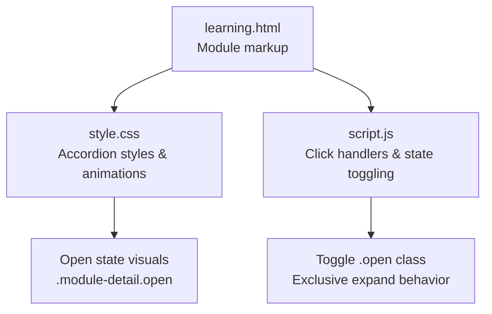
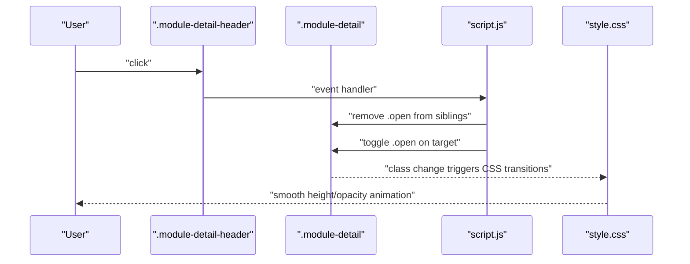
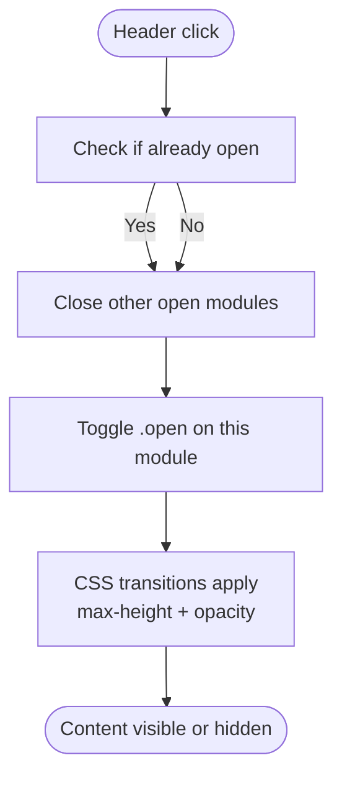
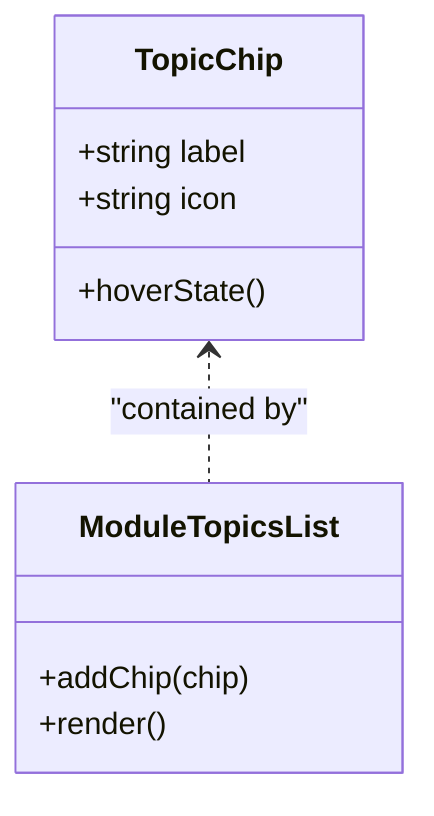
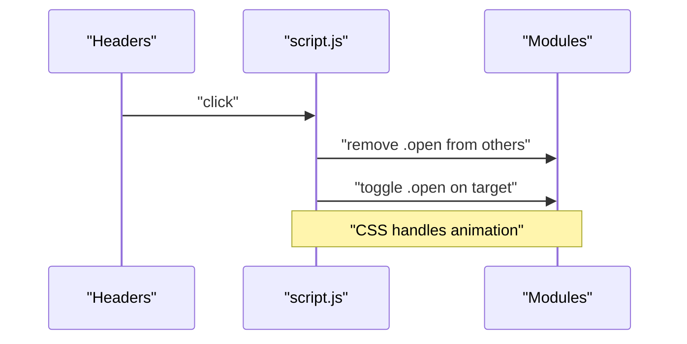
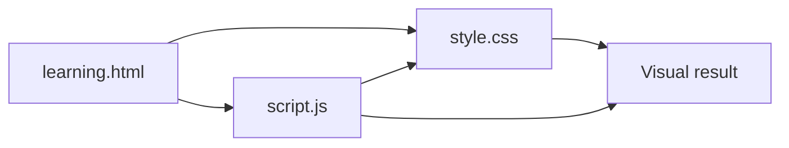

# Accordion Modules

<cite>
**Referenced Files in This Document**
- [learning.html](file://learning.html)
- [style.css](file://CSS/style.css)
- [script.js](file://js/script.js)
</cite>

## Table of Contents
1. Introduction
2. Project Structure
3. Core Components
4. Architecture Overview
5. Detailed Component Analysis
6. Dependency Analysis
7. Performance Considerations
8. Troubleshooting Guide
9. Conclusion
10. Appendices

## Introduction
This document explains the interactive accordion module system used in the learning platform to present training modules. It covers the structure and styling of the module detail container, the JavaScript behavior for expanding/collapsing with smooth animations, the topic chip system with emoji icons and hover states, open state management, accessibility considerations, and performance guidance for large numbers of modules.

## Project Structure
The accordion modules are implemented on the Learning page using a consistent HTML pattern, styled via CSS variables and transitions, and driven by lightweight JavaScript event handling.

**Diagram sources**
- [learning.html:34-96](file://learning.html#L34-L96)
- [style.css:210-224](file://CSS/style.css#L210-L224)
- [script.js:68-75](file://js/script.js#L68-L75)

**Section sources**
- [learning.html:34-96](file://learning.html#L34-L96)
- [style.css:210-224](file://CSS/style.css#L210-L224)
- [script.js:68-75](file://js/script.js#L68-L75)

## Core Components
- Module detail container (.module-detail): Wraps each module’s header, description, and topics list.
- Header (.module-detail-header): Clickable area that triggers expand/collapse.
- Description (.module-description): Hidden by default; animates into view when opened.
- Topics list (.module-topics-list): Contains topic chips; hidden by default; animates into view when opened.
- Topic chip (.topic-chip): Visual tag with an emoji icon and label; supports hover styling.

Key behaviors:
- Exclusive accordion: clicking one module closes any other open module.
- Smooth transitions: height (via max-height) and opacity animate on open/close.
- Open state: managed by adding/removing the .open class on the container.

**Section sources**
- [learning.html:34-96](file://learning.html#L34-L96)
- [style.css:210-224](file://CSS/style.css#L210-L224)
- [script.js:68-75](file://js/script.js#L68-L75)

## Architecture Overview
The system follows a simple, unidirectional flow: user interaction updates DOM state, which drives CSS transitions for visual feedback.

**Diagram sources**
- [script.js:68-75](file://js/script.js#L68-L75)
- [style.css:210-224](file://CSS/style.css#L210-L224)

## Detailed Component Analysis

### Module Detail Container (.module-detail)
- Purpose: Encapsulates each module’s content and manages open state.
- Structure:
  - Header: clickable region with number badge, title, and subtitle.
  - Description: text block describing the module.
  - Topics list: grid/flex row of topic chips.
- Styling highlights:
  - Default closed state hides description and topics via max-height and opacity.
  - Open state reveals content with border highlight and shadow.
- Transitions:
  - Description and topics use max-height and opacity transitions for smooth reveal/hide.

**Diagram sources**
- [script.js:68-75](file://js/script.js#L68-L75)
- [style.css:210-224](file://CSS/style.css#L210-L224)

**Section sources**
- [learning.html:34-96](file://learning.html#L34-L96)
- [style.css:210-224](file://CSS/style.css#L210-L224)
- [script.js:68-75](file://js/script.js#L68-L75)

### Topic Chip System (.topic-chip)
- Purpose: Display individual topics within a module with an emoji icon and label.
- Visuals:
  - Background tint and color derived from theme variables.
  - Rounded corners and spacing for a compact tag appearance.
- Interactions:
  - Hover states can be enhanced via CSS (e.g., subtle lift or color shift).
- Extensibility:
  - Add new chips by duplicating the chip element and updating the icon and label.

[No diagram sources needed since this diagram is conceptual]

**Section sources**
- [learning.html:34-96](file://learning.html#L34-L96)
- [style.css:210-224](file://CSS/style.css#L210-L224)

### JavaScript Behavior (Expand/Collapse)
- Event binding: attaches click listeners to all module headers.
- State management:
  - Removes .open from any previously open module (exclusive accordion).
  - Toggles .open on the clicked module.
- No heavy libraries: pure DOM manipulation ensures fast interactions.

**Diagram sources**
- [script.js:68-75](file://js/script.js#L68-L75)

**Section sources**
- [script.js:68-75](file://js/script.js#L68-L75)

## Dependency Analysis
- HTML provides semantic structure and content.
- CSS defines layout, theme variables, and transition timing.
- JavaScript wires interactivity and state changes.

**Diagram sources**
- [learning.html:34-96](file://learning.html#L34-L96)
- [style.css:210-224](file://CSS/style.css#L210-L224)
- [script.js:68-75](file://js/script.js#L68-L75)

**Section sources**
- [learning.html:34-96](file://learning.html#L34-L96)
- [style.css:210-224](file://CSS/style.css#L210-L224)
- [script.js:68-75](file://js/script.js#L68-L75)

## Performance Considerations
- Use CSS transitions for animations instead of JS-driven frame loops to reduce reflows and maintain smoothness.
- Limit concurrent open modules to one to minimize layout calculations.
- For large numbers of modules:
  - Keep descriptions concise to reduce initial render cost.
  - Consider lazy-loading heavy media inside modules only when expanded.
  - Avoid excessive inline styles; rely on CSS classes for state.
- Debounce scroll-based features if added later to avoid frequent recalculations.

[No sources needed since this section provides general guidance]

## Troubleshooting Guide
- Module does not open:
  - Ensure the header has the correct class and is inside a .module-detail container.
  - Verify that the script runs after DOM is ready and selectors match.
- Animation not smooth:
  - Confirm that transitions are defined for max-height and opacity.
  - Avoid forcing layout properties during animation.
- Multiple modules open at once:
  - The current logic closes other modules before opening the clicked one; ensure no custom code overrides this behavior.
- Topic chips not visible:
  - Check that the parent topics list is revealed by the open state and that there are no conflicting overflow rules.

**Section sources**
- [style.css:210-224](file://CSS/style.css#L210-L224)
- [script.js:68-75](file://js/script.js#L68-L75)

## Conclusion
The accordion module system uses a clean separation of concerns: semantic HTML for structure, CSS for styling and transitions, and minimal JavaScript for state management. This approach delivers accessible, performant, and extensible interactive modules suitable for a learning platform.

[No sources needed since this section summarizes without analyzing specific files]

## Appendices

### A. Adding a New Module
- Steps:
  - Duplicate an existing .module-detail block in the Learning page.
  - Update the number, title, subtitle, description, and topic chips.
  - Ensure the structure matches existing modules so styles and scripts apply correctly.
- Reference locations:
  - Markup examples: [learning.html:34-96](file://learning.html#L34-L96)
  - Styles: [style.css:210-224](file://CSS/style.css#L210-L224)
  - Script behavior: [script.js:68-75](file://js/script.js#L68-L75)

**Section sources**
- [learning.html:34-96](file://learning.html#L34-L96)
- [style.css:210-224](file://CSS/style.css#L210-L224)
- [script.js:68-75](file://js/script.js#L68-L75)

### B. Customizing Topic Chips
- Change colors or spacing by adjusting the .topic-chip styles.
- Replace emoji icons with images or SVGs by swapping the icon element while keeping the same structure.
- Add hover effects (e.g., transform or background change) for better affordance.

**Section sources**
- [style.css:210-224](file://CSS/style.css#L210-L224)
- [learning.html:34-96](file://learning.html#L34-L96)

### C. Integrating with a Content Management System (CMS)
- Template mapping:
  - Map CMS fields to the module structure: title, subtitle, description, and array of topics (label + icon).
- Rendering:
  - Generate .module-detail blocks dynamically per module entry.
  - Render .topic-chip elements for each topic item.
- Best practices:
  - Sanitize content to prevent XSS.
  - Keep descriptions short to improve performance.
  - Provide fallback icons if custom emojis are unavailable.

[No sources needed since this section provides general guidance]

### D. Accessibility Notes
- Keyboard navigation:
  - Make headers focusable and operable via Enter/Space if they are not native buttons.
  - Ensure focus moves logically between modules.
- ARIA attributes:
  - Consider aria-expanded on headers to reflect open/closed state.
  - Associate labels with descriptive text where appropriate.
- Screen readers:
  - Announce state changes when modules open/close.
  - Use semantic headings and paragraphs for structure.

[No sources needed since this section provides general guidance]