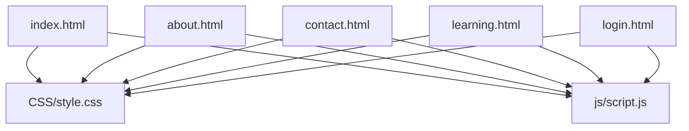
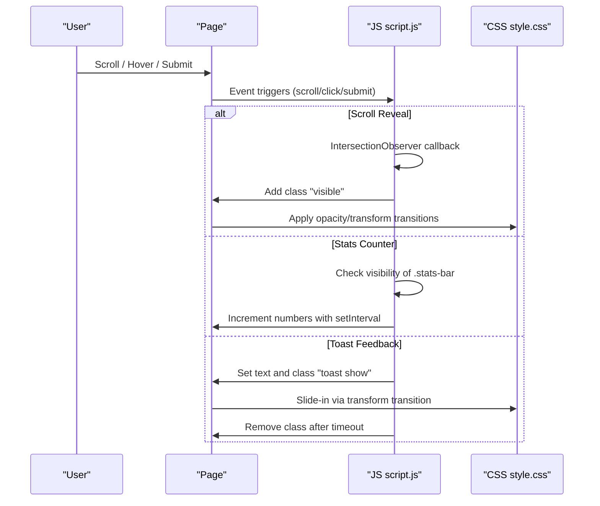
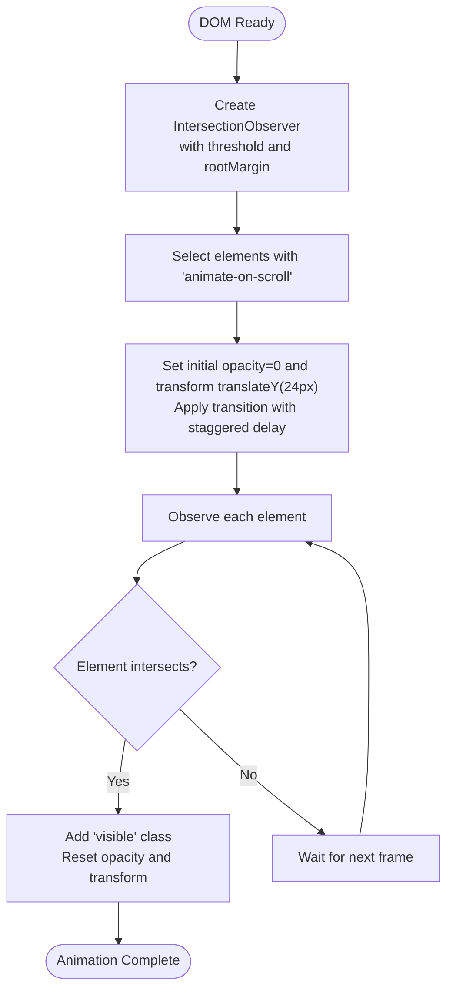
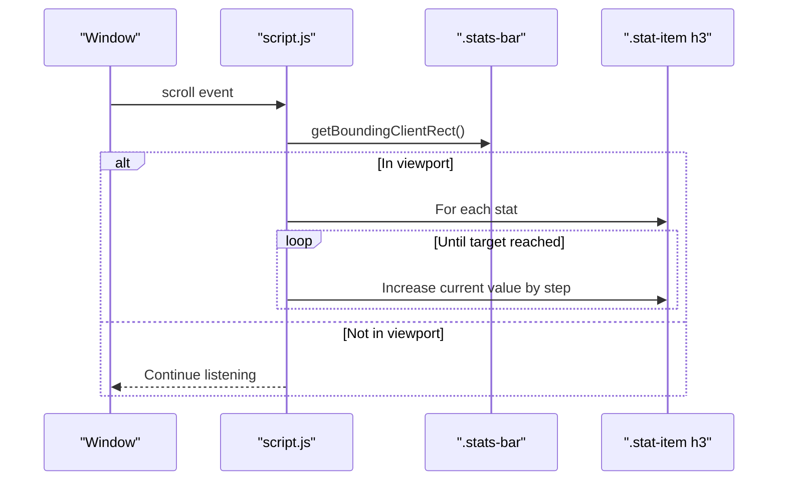
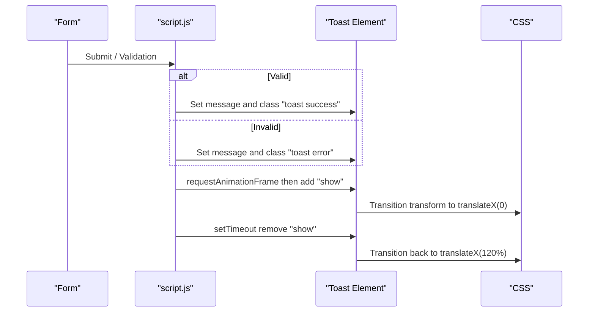
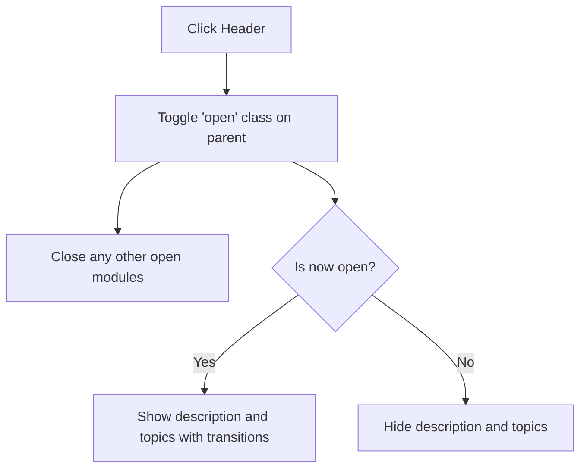
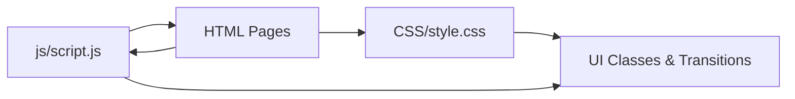

# Animation Utilities

<cite>
**Referenced Files in This Document**
- [style.css](file://CSS/style.css)
- [script.js](file://js/script.js)
- [index.html](file://index.html)
- [about.html](file://about.html)
- [contact.html](file://contact.html)
- [learning.html](file://learning.html)
- [login.html](file://login.html)
</cite>

## Table of Contents
1. [Introduction](#introduction)
2. [Project Structure](#project-structure)
3. [Core Components](#core-components)
4. [Architecture Overview](#architecture-overview)
5. [Detailed Component Analysis](#detailed-component-analysis)
6. [Dependency Analysis](#dependency-analysis)
7. [Performance Considerations](#performance-considerations)
8. [Troubleshooting Guide](#troubleshooting-guide)
9. [Conclusion](#conclusion)
10. [Appendices](#appendices)

## Introduction
This document explains the animation utilities and transition effects used across the Digital Bridges Zambia website. It covers CSS custom properties for transitions, hover animations, scroll-triggered reveal effects using Intersection Observer, a statistics counter animation, toast notifications with slide-in/out transitions, and best practices for performance and accessibility.

## Project Structure
The site uses a simple structure:
- CSS styles are centralized in one stylesheet defining design tokens, transitions, hover states, and component animations.
- JavaScript handles interactive behaviors (navbar scroll state, mobile menu toggling, form validation feedback via toasts, module accordion behavior, scroll-based reveals, and stats counting).
- HTML pages include reusable components and mark elements that participate in animations.

**Diagram sources**
- [index.html:1-106](file://index.html#L1-L106)
- [about.html:1-123](file://about.html#L1-L123)
- [contact.html:1-102](file://contact.html#L1-L102)
- [learning.html:1-137](file://learning.html#L1-L137)
- [login.html:1-60](file://login.html#L1-L60)
- [style.css:1-247](file://CSS/style.css#L1-L247)
- [script.js:1-105](file://js/script.js#L1-L105)

**Section sources**
- [style.css:1-247](file://CSS/style.css#L1-L247)
- [script.js:1-105](file://js/script.js#L1-L105)
- [index.html:1-106](file://index.html#L1-L106)
- [about.html:1-123](file://about.html#L1-L123)
- [contact.html:1-102](file://contact.html#L1-L102)
- [learning.html:1-137](file://learning.html#L1-L137)
- [login.html:1-60](file://login.html#L1-L60)

## Core Components
- CSS custom properties define consistent timing and easing for all transitions.
- Hover animations apply transform translations, shadow changes, and color transitions across buttons, cards, and navigation links.
- Scroll-triggered reveal animations use Intersection Observer to fade and slide elements into view.
- Statistics counter animates numeric values when the stats section enters the viewport.
- Toast notifications provide animated success/error feedback for form interactions.

**Section sources**
- [style.css:3-13](file://CSS/style.css#L3-L13)
- [style.css:20-34](file://CSS/style.css#L20-L34)
- [style.css:57-63](file://CSS/style.css#L57-L63)
- [style.css:80-85](file://CSS/style.css#L80-L85)
- [style.css:182-186](file://CSS/style.css#L182-L186)
- [script.js:77-86](file://js/script.js#L77-L86)
- [script.js:88-104](file://js/script.js#L88-L104)
- [script.js:21-28](file://js/script.js#L21-L28)

## Architecture Overview
The animation system is split between declarative CSS transitions and lightweight JavaScript orchestrators:
- CSS defines reusable transition tokens and visual states.
- JS observes DOM events (scroll, click, submit) and toggles classes or runs timers to produce motion.
- Pages compose these utilities by adding specific classes (e.g., animate-on-scroll) and including shared scripts/styles.

**Diagram sources**
- [script.js:77-86](file://js/script.js#L77-L86)
- [script.js:88-104](file://js/script.js#L88-L104)
- [script.js:21-28](file://js/script.js#L21-L28)
- [style.css:182-186](file://CSS/style.css#L182-L186)

## Detailed Component Analysis

### CSS Custom Properties for Transitions
- Centralized timing and easing are defined via a custom property used consistently across components.
- Smooth scrolling is enabled at the root level for anchor navigation.

Key points:
- Single source of truth for transition duration and easing.
- Applied to navbar, links, buttons, cards, inputs, and footer links for consistent feel.

**Section sources**
- [style.css:3-13](file://CSS/style.css#L3-L13)
- [style.css:14-15](file://CSS/style.css#L14-L15)
- [style.css:20-34](file://CSS/style.css#L20-L34)
- [style.css:57-63](file://CSS/style.css#L57-L63)
- [style.css:80-85](file://CSS/style.css#L80-L85)
- [style.css:143-148](file://CSS/style.css#L143-L148)
- [style.css:188-195](file://CSS/style.css#L188-L195)

### Hover Animations
- Buttons lift slightly on hover with enhanced shadows and color shifts.
- Cards elevate with deeper shadows and top accent bar scaling.
- Navigation links underline from left to right; active state mirrors hover.
- Form inputs focus with border color change and subtle glow.

Patterns:
- Transform translateY for perceived depth.
- Box-shadow transitions for emphasis.
- Color transitions for brand consistency.

**Section sources**
- [style.css:28-34](file://CSS/style.css#L28-L34)
- [style.css:57-63](file://CSS/style.css#L57-L63)
- [style.css:80-85](file://CSS/style.css#L80-L85)
- [style.css:143-148](file://CSS/style.css#L143-L148)

### Scroll-Triggered Reveal Effects (Intersection Observer)
- Elements with a specific class start hidden (opacity 0, slight downward translation).
- An IntersectionObserver watches for intersection with a small threshold and negative margin to trigger earlier.
- When intersecting, a visible class is added to restore opacity and reset transform.
- Staggered delays are applied based on element index for a cascading effect.

**Diagram sources**
- [script.js:77-86](file://js/script.js#L77-L86)

Usage examples:
- Learning modules grid items.
- Beneficiary cards.
- Approach items.
- Phase timeline cards.
- Partner items.

**Section sources**
- [script.js:77-86](file://js/script.js#L77-L86)
- [index.html:65-72](file://index.html#L65-L72)
- [index.html:84-91](file://index.html#L84-L91)
- [about.html:28-39](file://about.html#L28-L39)
- [about.html:50-56](file://about.html#L50-L56)
- [about.html:67-76](file://about.html#L67-L76)
- [about.html:87-92](file://about.html#L87-L92)
- [contact.html:29-36](file://contact.html#L29-L36)
- [contact.html:54-63](file://contact.html#L54-L63)
- [learning.html:107-114](file://learning.html#L107-L114)

### Statistics Counter Animation
- The counter activates when the stats section enters the viewport.
- Each stat number increments from zero to its target value using a timed interval.
- The increment step is derived from the target value to ensure smooth completion.
- Once counted, it does not repeat.

**Diagram sources**
- [script.js:88-104](file://js/script.js#L88-L104)

**Section sources**
- [script.js:88-104](file://js/script.js#L88-L104)
- [index.html:49-56](file://index.html#L49-L56)

### Toast Notification Animations
- Toasts slide in from the right using a transform transition and a show class.
- They display success or error messages based on form validation outcomes.
- Auto-dismiss after a fixed duration by removing the show class.

**Diagram sources**
- [script.js:21-28](file://js/script.js#L21-L28)
- [script.js:31-41](file://js/script.js#L31-L41)
- [script.js:52-66](file://js/script.js#L52-L66)
- [style.css:182-186](file://CSS/style.css#L182-L186)

**Section sources**
- [script.js:21-28](file://js/script.js#L21-L28)
- [script.js:31-41](file://js/script.js#L31-L41)
- [script.js:52-66](file://js/script.js#L52-L66)
- [style.css:182-186](file://CSS/style.css#L182-L186)
- [contact.html:39-45](file://contact.html#L39-L45)
- [login.html:19-40](file://login.html#L19-L40)

### Module Accordion Animations
- Clicking a module header toggles an open state.
- Open state expands description and topics lists via max-height and opacity transitions.
- Only one module can be open at a time.

**Diagram sources**
- [script.js:68-75](file://js/script.js#L68-L75)
- [style.css:210-224](file://CSS/style.css#L210-L224)

**Section sources**
- [script.js:68-75](file://js/script.js#L68-L75)
- [style.css:210-224](file://CSS/style.css#L210-L224)
- [learning.html:34-96](file://learning.html#L34-L96)

## Dependency Analysis
- CSS provides the foundation: design tokens, transitions, and visual states.
- JS depends on CSS classes to drive animations (e.g., visible, open, show).
- HTML wires components together and includes the shared assets.

**Diagram sources**
- [style.css:1-247](file://CSS/style.css#L1-L247)
- [script.js:1-105](file://js/script.js#L1-L105)
- [index.html:1-106](file://index.html#L1-L106)

**Section sources**
- [style.css:1-247](file://CSS/style.css#L1-L247)
- [script.js:1-105](file://js/script.js#L1-L105)
- [index.html:1-106](file://index.html#L1-L106)

## Performance Considerations
- Prefer GPU-accelerated properties like transform and opacity for smooth animations.
- Keep transition durations moderate to avoid jank on low-end devices.
- Use Intersection Observer instead of heavy scroll listeners where possible.
- Avoid layout thrashing by batching DOM reads/writes.
- Consider will-change sparingly for elements about to animate if needed; however, this project relies primarily on transform and opacity which are already compositor-friendly.

[No sources needed since this section provides general guidance]

## Troubleshooting Guide
- Navbar not gaining shadow on scroll: Ensure the navbar has the expected id and the scroll listener is attached.
- Reveal animations not triggering: Verify elements have the correct class and are within the viewport; check observer thresholds and margins.
- Stats not counting: Confirm the stats container exists and contains stat items with numeric content; ensure the page scrolls to bring them into view.
- Toast not appearing: Ensure the toast element exists in the DOM and the script adds the show class; verify CSS transitions are not overridden.

**Section sources**
- [script.js:1-4](file://js/script.js#L1-L4)
- [script.js:77-86](file://js/script.js#L77-L86)
- [script.js:88-104](file://js/script.js#L88-L104)
- [script.js:21-28](file://js/script.js#L21-L28)
- [style.css:182-186](file://CSS/style.css#L182-L186)

## Conclusion
The site’s animation system combines consistent CSS transitions with lightweight JavaScript to deliver smooth, accessible user experiences. By centralizing timing and easing, leveraging transform-based animations, and using Intersection Observer for scroll reveals, the project achieves responsive and performant interactions across pages. Toasts and accordions enhance usability without compromising performance.

[No sources needed since this section summarizes without analyzing specific files]

## Appendices

### Accessibility Best Practices for Animations
- Respect reduced motion preferences by providing alternatives or disabling non-essential animations when requested by the user agent.
- Ensure keyboard users can interact with animated components (e.g., accordions toggle on Enter/Space).
- Provide sufficient contrast for text during transitions and avoid flashing or rapid changes.
- Announce dynamic content changes to assistive technologies when appropriate (e.g., toast messages).

[No sources needed since this section provides general guidance]

### Browser Compatibility and Fallbacks
- Intersection Observer is widely supported; for older browsers, consider a fallback that observes scroll events and applies visible classes.
- CSS custom properties are broadly supported; for legacy environments, provide static fallback values.
- Transform and opacity animations degrade gracefully; ensure content remains readable even if animations do not run.

[No sources needed since this section provides general guidance]