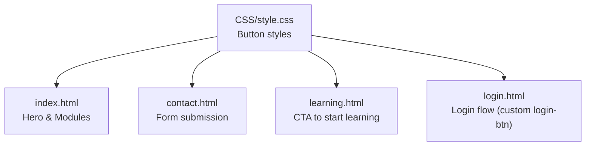
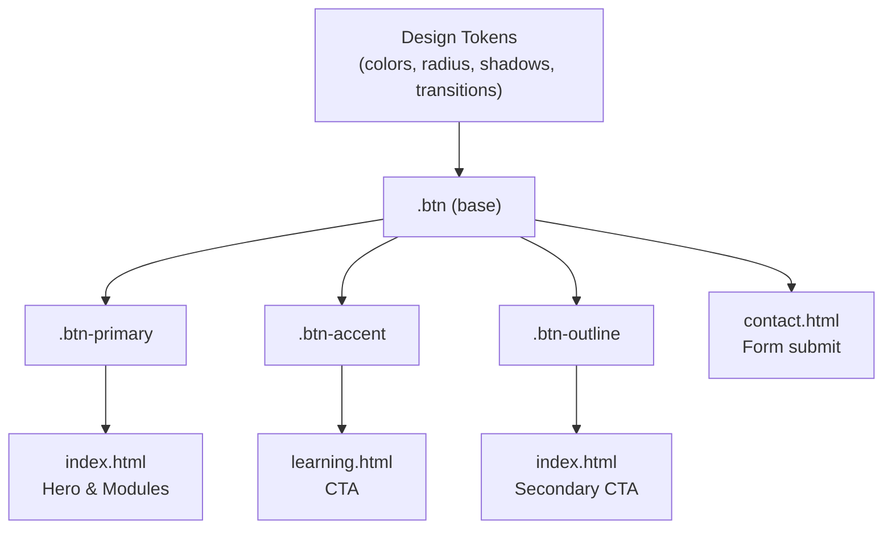
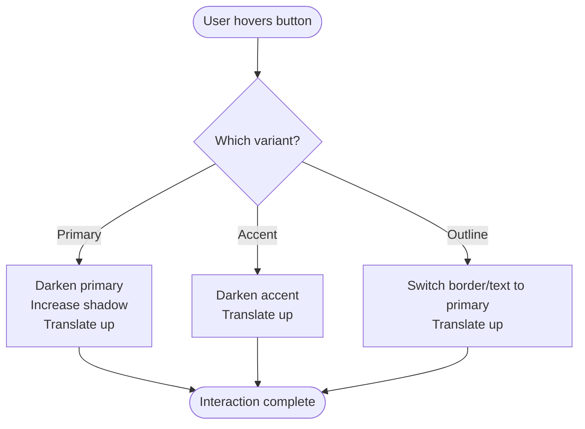

# Button Variants

<cite>
**Referenced Files in This Document**
- [style.css](file://CSS/style.css)
- [index.html](file://index.html)
- [contact.html](file://contact.html)
- [learning.html](file://learning.html)
- [login.html](file://login.html)
</cite>

## Table of Contents
1. [Introduction](#introduction)
2. [Project Structure](#project-structure)
3. [Core Components](#core-components)
4. [Architecture Overview](#architecture-overview)
5. [Detailed Component Analysis](#detailed-component-analysis)
6. [Dependency Analysis](#dependency-analysis)
7. [Performance Considerations](#performance-considerations)
8. [Troubleshooting Guide](#troubleshooting-guide)
9. [Conclusion](#conclusion)
10. [Appendices](#appendices)

## Introduction
This document provides a comprehensive guide to the button system in the Digital Bridges Zambia design system. It covers the base button class and all available variants, their visual properties, states, usage contexts, and guidelines for creating new variants while maintaining consistency with the design tokens and interaction model.

## Project Structure
The button styles are defined centrally in the stylesheet and applied across multiple pages via consistent HTML classes. Buttons appear in hero sections, module cards, navigation CTAs, forms, and login flows.

**Diagram sources**
- [style.css:57-63](file://CSS/style.css#L57-L63)
- [index.html:33-35](file://index.html#L33-L35)
- [contact.html:44-44](file://contact.html#L44-L44)
- [learning.html:122-122](file://learning.html#L122-L122)
- [login.html:39-39](file://login.html#L39-L39)

**Section sources**
- [style.css:57-63](file://CSS/style.css#L57-L63)
- [index.html:33-35](file://index.html#L33-L35)
- [contact.html:44-44](file://contact.html#L44-L44)
- [learning.html:122-122](file://learning.html#L122-L122)
- [login.html:39-39](file://login.html#L39-L39)

## Core Components
- Base button class (.btn): Shared layout, spacing, typography, transitions, and cursor behavior.
- Primary variant (.btn-primary): Solid brand color with shadow and hover elevation.
- Accent variant (.btn-accent): High-visibility call-to-action using accent color.
- Outline variant (.btn-outline): Secondary action with transparent background and border.

Key properties and behaviors:
- .btn sets display, alignment, gap, padding, border-radius, font size, weight, cursor, border removal, and transition timing.
- .btn-primary applies primary color, white text, and a subtle shadow; hover darkens the background, lifts the button, and increases shadow depth.
- .btn-accent applies accent color and white text; hover darkens the background and lifts the button.
- .btn-outline uses transparent background, text color from theme, and a light border; hover switches to primary border and text with lift effect.

Usage examples across pages:
- Hero section CTAs: primary and outline buttons for exploration and information.
- Module card actions: primary buttons to view or start modules.
- Form submissions: primary button to send messages.
- Login page: custom login button styled separately for authentication context.

**Section sources**
- [style.css:57-63](file://CSS/style.css#L57-L63)
- [index.html:33-35](file://index.html#L33-L35)
- [index.html:73-73](file://index.html#L73-L73)
- [contact.html:44-44](file://contact.html#L44-L44)
- [learning.html:122-122](file://learning.html#L122-L122)
- [login.html:39-39](file://login.html#L39-L39)

## Architecture Overview
The button system is token-driven and componentized:
- Design tokens define colors, radius, shadows, and transitions used by buttons.
- The base class centralizes shared behavior; variants layer additional styling.
- Pages compose buttons within layouts (hero, cards, forms, nav).

**Diagram sources**
- [style.css:3-13](file://CSS/style.css#L3-L13)
- [style.css:57-63](file://CSS/style.css#L57-L63)
- [index.html:33-35](file://index.html#L33-L35)
- [index.html:73-73](file://index.html#L73-L73)
- [contact.html:44-44](file://contact.html#L44-L44)
- [learning.html:122-122](file://learning.html#L122-L122)

## Detailed Component Analysis

### Base Button (.btn)
- Display and layout: inline-flex with centered alignment and internal gap for icons or labels.
- Spacing: moderate vertical and horizontal padding for comfortable touch targets.
- Shape: rounded corners for a friendly, modern feel.
- Typography: readable font size and strong weight for clarity.
- Interaction: pointer cursor and smooth transitions for state changes.
- Border: removed by default to allow variants to control borders.

Typical usage:
- Paired with a variant class to apply color and behavior.
- Used as links or form controls depending on context.

**Section sources**
- [style.css:57-57](file://CSS/style.css#L57-L57)

### Primary Button (.btn-primary)
- Color: solid primary background with white text for high contrast.
- Shadow: subtle elevation to emphasize importance.
- Hover: darker primary shade, upward translation, and deeper shadow for tactile feedback.

Contexts:
- Hero “Explore Training Modules” CTA.
- “View All 8 Modules” link in module listings.
- “Get Started Now” CTA on the learning page.

**Section sources**
- [style.css:58-59](file://CSS/style.css#L58-L59)
- [index.html:34-34](file://index.html#L34-L34)
- [index.html:73-73](file://index.html#L73-L73)
- [learning.html:122-122](file://learning.html#L122-L122)

### Accent Button (.btn-accent)
- Color: solid accent background with white text for attention-grabbing calls to action.
- Hover: darker accent shade with upward translation for emphasis.

Use cases:
- Ideal for secondary but prominent actions where accent branding should stand out.
- Can be used alongside primary buttons to differentiate action types.

**Section sources**
- [style.css:60-61](file://CSS/style.css#L60-L61)

### Outline Button (.btn-outline)
- Appearance: transparent background, themed text color, and a light border.
- Hover: border and text switch to primary color with upward translation.

Use cases:
- Secondary actions such as “Learn More” in hero sections.
- Non-destructive actions that should not compete visually with primary CTAs.

**Section sources**
- [style.css:62-63](file://CSS/style.css#L62-L63)
- [index.html:35-35](file://index.html#L35-L35)

### States and Interactions
- Hover: all variants use consistent upward translation and enhanced shadows or color shifts to indicate interactivity.
- Active: not explicitly styled beyond hover; browser default press behavior applies.
- Disabled: not explicitly styled; developers can add disabled attributes and manage opacity/cursor via additional utilities if needed.

Note: The login page includes a custom login button with its own hover and loading states, separate from the .btn system.

**Section sources**
- [style.css:57-63](file://CSS/style.css#L57-L63)
- [login.html:166-168](file://login.html#L166-L168)

### Usage Examples Across Contexts
- Navigation CTAs: The navigation uses a dedicated CTA style for login; standard buttons are used elsewhere for content actions.
- Form submissions: Contact form uses a full-width primary button to submit messages.
- Module cards: Primary buttons encourage progression into detailed learning content.

**Section sources**
- [index.html:33-35](file://index.html#L33-L35)
- [contact.html:44-44](file://contact.html#L44-L44)
- [learning.html:122-122](file://learning.html#L122-L122)

## Dependency Analysis
Buttons depend on design tokens for consistent appearance:
- Colors: primary and accent palettes drive variant backgrounds and hover states.
- Radius: shared corner radius ensures cohesive shape language.
- Shadows: layered elevations provide depth and focus.
- Transitions: unified easing and duration create smooth interactions.

**Diagram sources**
- [style.css:57-63](file://CSS/style.css#L57-L63)
- [style.css:3-13](file://CSS/style.css#L3-L13)

**Section sources**
- [style.css:3-13](file://CSS/style.css#L3-L13)
- [style.css:57-63](file://CSS/style.css#L57-L63)

## Performance Considerations
- Use hardware-accelerated transforms (translate) for hover animations to ensure smooth performance.
- Keep shadow sizes modest to avoid heavy repaints on low-end devices.
- Prefer CSS variables for colors and transitions to minimize recalculation when themes change.
- Avoid excessive nested hover effects; keep transitions short and consistent.

[No sources needed since this section provides general guidance]

## Troubleshooting Guide
- Inconsistent sizing: Ensure only one button class is applied per element; combining classes may cause unexpected overrides.
- Missing hover effects: Verify that the correct variant class is present and that no conflicting styles override transitions.
- Accessibility: Ensure sufficient color contrast between text and background for all variants; test with accessibility tools.
- Custom login button: If you need a disabled or loading state similar to the login button, extend the existing login button styles rather than mixing with .btn.

**Section sources**
- [login.html:166-168](file://login.html#L166-L168)

## Conclusion
The Digital Bridges Zambia button system provides a clear hierarchy through a base class and three focused variants. Consistent tokens and transitions ensure a cohesive user experience across pages. Follow the usage patterns and customization guidelines below to maintain design integrity when adding new components or extending the system.

[No sources needed since this section summarizes without analyzing specific files]

## Appendices

### Customization Guidelines for New Variants
To create a new button variant while maintaining consistency:
- Derive from the base class to inherit layout, spacing, typography, transitions, and cursor behavior.
- Define a new class that sets background, text color, border (if any), and hover state using existing tokens.
- Reuse the same transition timing and transform pattern for hover to keep interactions predictable.
- Test contrast and readability against both light and dark backgrounds.
- Add semantic markup and accessible labels for screen readers.

Example steps:
- Create a new class (e.g., .btn-secondary) inheriting .btn.
- Set background and text color using tokens.
- Define hover with a darker shade and consistent lift/shadow.
- Apply the class to buttons across pages consistently.

[No sources needed since this section provides general guidance]