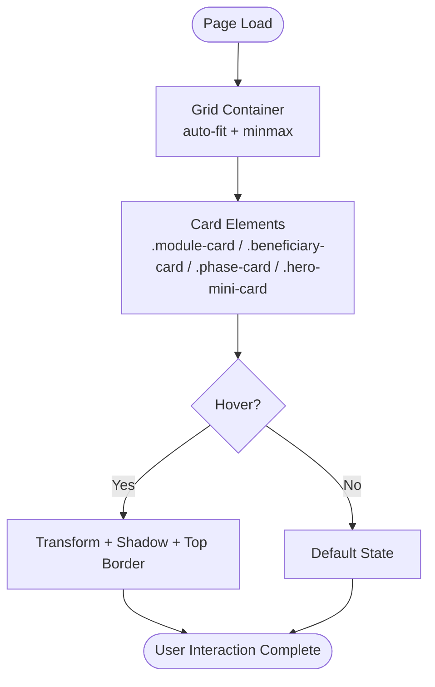
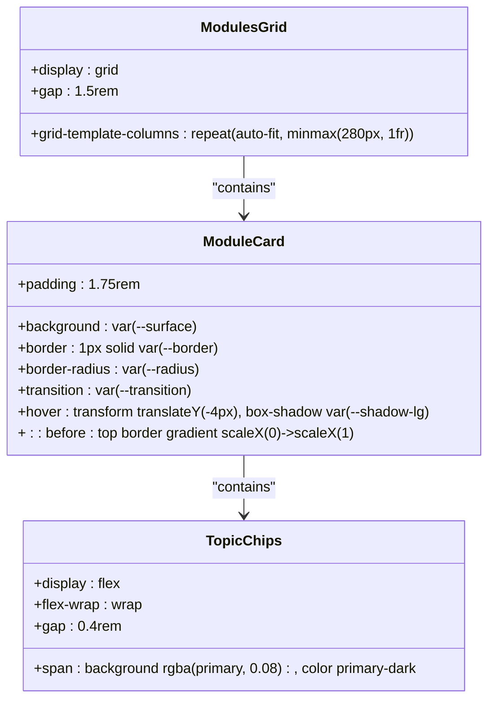
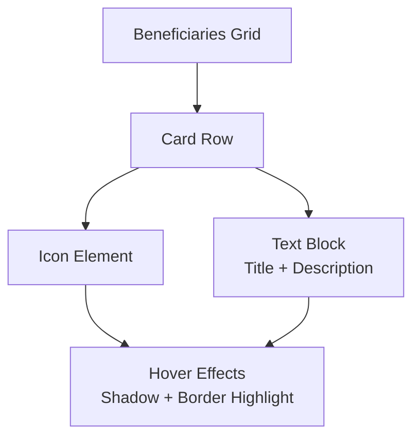
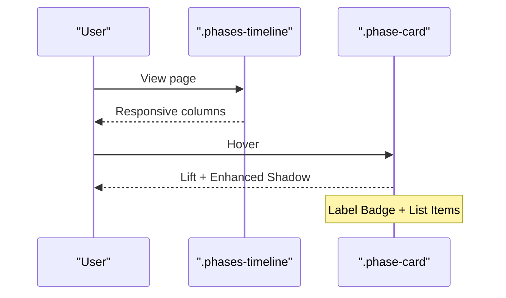
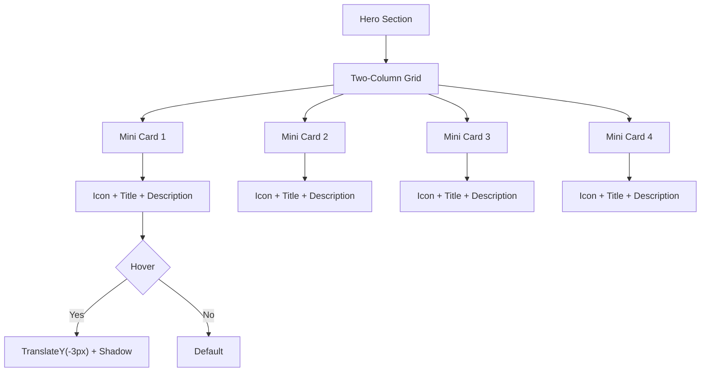
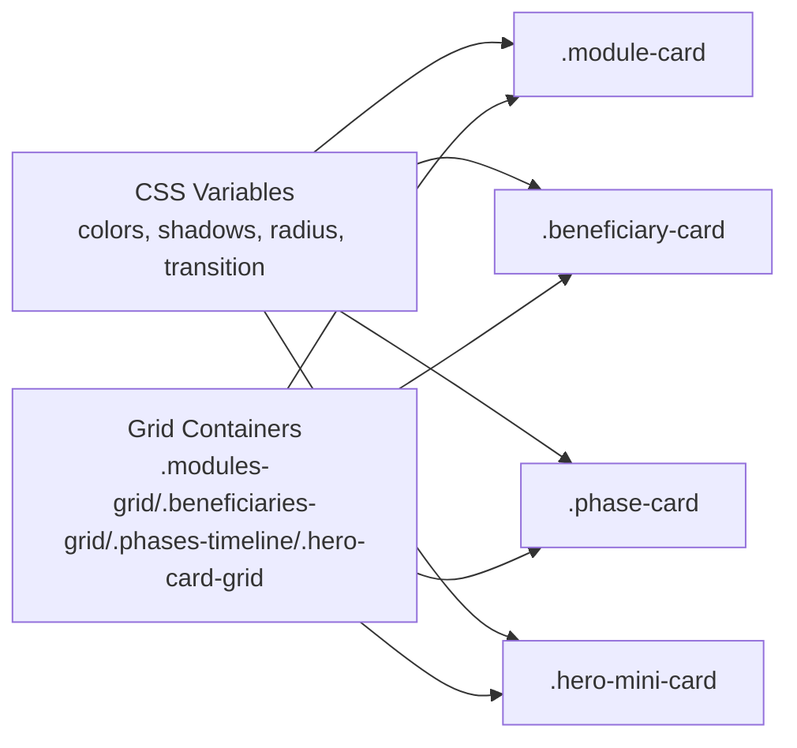

# Card Layouts

<cite>
**Referenced Files in This Document**
- [style.css](file://CSS/style.css)
- [index.html](file://index.html)
- [learning.html](file://learning.html)
- [about.html](file://about.html)
</cite>

## Table of Contents
1. [Introduction](#introduction)
2. [Project Structure](#project-structure)
3. [Core Components](#core-components)
4. [Architecture Overview](#architecture-overview)
5. [Detailed Component Analysis](#detailed-component-analysis)
6. [Dependency Analysis](#dependency-analysis)
7. [Performance Considerations](#performance-considerations)
8. [Troubleshooting Guide](#troubleshooting-guide)
9. [Conclusion](#conclusion)
10. [Appendices](#appendices)

## Introduction
This document explains the card layout components used across the Digital Bridges Zambia website. It focuses on:
- Module cards (.module-card) with hover animations, top border effects, and topic chips
- Beneficiary cards (.beneficiary-card) with icon integration and responsive grid behavior
- Phase cards (.phase-card) for timeline displays with labels and content organization
- Hero mini-cards (.hero-mini-card) for dashboard-style layouts

It covers CSS classes, grid configurations, responsive breakpoints, hover effects, shadow properties, transitions, and guidance for customizing content while maintaining consistent spacing and visual hierarchy.

## Project Structure
The site uses a single shared stylesheet (CSS/style.css) applied to multiple HTML pages. Card components are defined once in the stylesheet and reused across pages such as index.html, learning.html, and about.html.

**Diagram sources**
- [index.html:1-106](file://index.html#L1-L106)
- [learning.html:1-137](file://learning.html#L1-L137)
- [about.html:1-123](file://about.html#L1-L123)
- [contact.html:1-102](file://contact.html#L1-L102)
- [login.html:1-60](file://login.html#L1-L60)
- [style.css:1-247](file://CSS/style.css#L1-L247)

**Section sources**
- [style.css:1-247](file://CSS/style.css#L1-L247)
- [index.html:1-106](file://index.html#L1-L106)
- [learning.html:1-137](file://learning.html#L1-L137)
- [about.html:1-123](file://about.html#L1-L123)

## Core Components
This section summarizes the key card components and their behaviors:
- .module-card: Training module tiles with animated top border and topic chips
- .beneficiary-card: Horizontal cards pairing an icon with descriptive text
- .phase-card: Timeline phase tiles with labeled badges and lists
- .hero-mini-card: Compact dashboard-style cards in the hero area

These components share a common design system via CSS variables for colors, shadows, radii, and transitions, ensuring consistency across the site.

**Section sources**
- [style.css:80-124](file://CSS/style.css#L80-L124)
- [style.css:49-54](file://CSS/style.css#L49-L54)

## Architecture Overview
The card system is built on a responsive grid pattern using CSS Grid with auto-fit and minmax() to adapt to screen sizes. Cards use consistent padding, borders, and rounded corners. Hover states apply subtle transforms and enhanced shadows. Transitions are centralized through a CSS variable for smooth interactions.

[No sources needed since this diagram shows conceptual workflow, not actual code structure]

## Detailed Component Analysis

### Module Card (.module-card)
Purpose:
- Display training modules in a responsive grid
- Provide a numbered badge, title, description, and topic chips
- Offer hover animation with a top border reveal and lift effect

Key CSS features:
- Grid container: .modules-grid uses repeat(auto-fit, minmax(280px, 1fr)) for responsive columns
- Card base: background, border, radius, padding, overflow hidden
- Top border effect: pseudo-element ::before with gradient that scales from left on hover
- Hover: translateY(-4px) and larger shadow
- Topic chips: flex-wrap row with small pill-shaped spans

Responsive behavior:
- Columns automatically adjust based on minimum width of 280px
- Works well from mobile to desktop without media queries for the grid itself

Customization tips:
- Adjust minmax value to change minimum card width
- Modify the gradient colors or transition duration for different brand feels
- Add or remove topic chips to reflect module topics

Accessibility notes:
- Ensure sufficient color contrast for topic chips
- Keep descriptions concise and scannable

**Diagram sources**
- [style.css:80-90](file://CSS/style.css#L80-L90)

**Section sources**
- [style.css:80-90](file://CSS/style.css#L80-L90)
- [index.html:65-72](file://index.html#L65-L72)
- [learning.html:107-114](file://learning.html#L107-L114)

### Beneficiary Card (.beneficiary-card)
Purpose:
- Present target beneficiary groups with an icon and short description
- Arrange in a responsive grid that adapts to screen size

Key CSS features:
- Grid container: .beneficiaries-grid uses repeat(auto-fit, minmax(220px, 1fr))
- Card layout: horizontal flexbox aligning icon and text
- Hover: subtle shadow and border highlight
- Icon: large emoji/icon sized element aligned to the left

Responsive behavior:
- Minimum card width of 220px ensures readability on small screens
- Auto-fit creates flexible column counts

Customization tips:
- Replace icons with SVGs or images if needed
- Adjust gap and padding to fit more or less content per card

**Diagram sources**
- [style.css:108-114](file://CSS/style.css#L108-L114)

**Section sources**
- [style.css:108-114](file://CSS/style.css#L108-L114)
- [index.html:84-91](file://index.html#L84-L91)

### Phase Card (.phase-card)
Purpose:
- Show project phases in a timeline-like grid
- Include a labeled badge, heading, and list of items

Key CSS features:
- Grid container: .phases-timeline uses repeat(auto-fit, minmax(250px, 1fr))
- Card base: background, border, radius, padding, hover lift and shadow
- Label: .phase-label with gradient background, uppercase styling
- Content: heading and unordered list with muted text

Responsive behavior:
- Minimum width of 250px ensures readable phase cards on all devices

Customization tips:
- Change label colors or typography to match branding
- Use ordered lists if sequence matters visually

**Diagram sources**
- [style.css:116-123](file://CSS/style.css#L116-L123)

**Section sources**
- [style.css:116-123](file://CSS/style.css#L116-L123)
- [about.html:87-92](file://about.html#L87-L92)

### Hero Mini-Card (.hero-mini-card)
Purpose:
- Provide compact dashboard-style cards within the hero section
- Showcase key highlights with icon, title, and short description

Key CSS features:
- Grid container: .hero-card-grid uses a two-column layout
- Card base: background, border, radius, padding, centered text
- Hover: translateY(-3px) and shadow elevation
- Icon: large inline icon above title

Responsive behavior:
- The hero grid is constrained by max-width; on smaller screens it remains compact
- Centered alignment improves focus on key highlights

Customization tips:
- Swap icons to represent different highlights
- Adjust padding and font sizes to balance density

**Diagram sources**
- [style.css:49-54](file://CSS/style.css#L49-L54)

**Section sources**
- [style.css:49-54](file://CSS/style.css#L49-L54)
- [index.html:38-45](file://index.html#L38-L45)

## Dependency Analysis
- Shared design tokens: Colors, shadows, radii, and transitions are defined as CSS variables in the root scope, ensuring consistent appearance across all cards.
- Grid dependencies: Each card type relies on its specific grid container class for layout; changing minmax values affects responsiveness globally for that component family.
- Hover and transitions: All interactive states use the same transition variable for timing and easing, creating a cohesive feel.

**Diagram sources**
- [style.css:3-13](file://CSS/style.css#L3-L13)
- [style.css:80-124](file://CSS/style.css#L80-L124)
- [style.css:49-54](file://CSS/style.css#L49-L54)

**Section sources**
- [style.css:3-13](file://CSS/style.css#L3-L13)
- [style.css:80-124](file://CSS/style.css#L80-L124)
- [style.css:49-54](file://CSS/style.css#L49-L54)

## Performance Considerations
- Prefer hardware-accelerated transforms (translateY) for hover animations to maintain smooth performance.
- Avoid excessive shadows or gradients on many elements simultaneously to reduce repaint costs.
- Use CSS variables for theme changes to minimize reflows when updating styles.
- Keep grid minmax values reasonable to prevent overly dense layouts on small screens.

[No sources needed since this section provides general guidance]

## Troubleshooting Guide
Common issues and resolutions:
- Top border not appearing on module cards:
  - Ensure the card has overflow hidden so the pseudo-element stays clipped
  - Verify the ::before pseudo-element is present and styled correctly
- Hover effects not visible:
  - Check that the transition variable is defined and not overridden
  - Confirm the card has a background and border to make shadow changes noticeable
- Responsive grid too crowded:
  - Increase the minmax minimum width in the relevant grid class
  - Reduce number of items per row by adjusting container width or adding gaps
- Icons misaligned in beneficiary cards:
  - Ensure flexbox alignment is set and icon has appropriate sizing
  - Check for extra margins or paddings affecting layout

**Section sources**
- [style.css:80-90](file://CSS/style.css#L80-L90)
- [style.css:108-114](file://CSS/style.css#L108-L114)
- [style.css:49-54](file://CSS/style.css#L49-L54)

## Conclusion
The card layout system for Digital Bridges Zambia is built on a consistent design token set and responsive grids. Each card type serves a distinct purpose while sharing common interaction patterns and visual language. By following the customization tips and troubleshooting guidance, you can extend and adapt these components to meet evolving content needs while preserving accessibility and performance.

[No sources needed since this section summarizes without analyzing specific files]

## Appendices

### CSS Classes and Grid Configurations Summary
- .modules-grid: repeat(auto-fit, minmax(280px, 1fr)), gap 1.5rem
- .module-card: hover lift, top border gradient reveal, topic chips
- .beneficiaries-grid: repeat(auto-fit, minmax(220px, 1fr)), gap 1.25rem
- .beneficiary-card: horizontal icon + text, hover shadow/border
- .phases-timeline: repeat(auto-fit, minmax(250px, 1fr)), gap 1.5rem
- .phase-card: label badge, heading, list, hover lift/shadow
- .hero-card-grid: two-column grid, max-width constraint
- .hero-mini-card: compact card with icon, title, description, hover lift/shadow

**Section sources**
- [style.css:49-54](file://CSS/style.css#L49-L54)
- [style.css:80-90](file://CSS/style.css#L80-L90)
- [style.css:108-114](file://CSS/style.css#L108-L114)
- [style.css:116-123](file://CSS/style.css#L116-L123)

### Responsive Breakpoints
- 968px: Hero stacks vertically, stats grid becomes two columns, contact and content split stack
- 768px: Navigation collapses into hamburger menu, hero headings and banners scale down, hero card grid max-width reduces

**Section sources**
- [style.css:227-246](file://CSS/style.css#L227-L246)