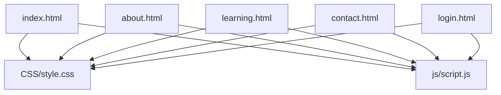
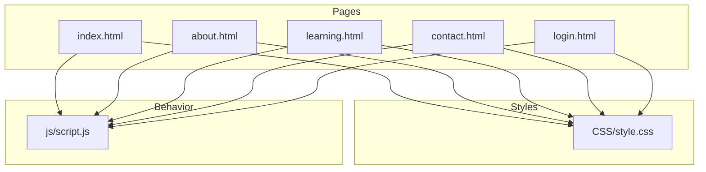
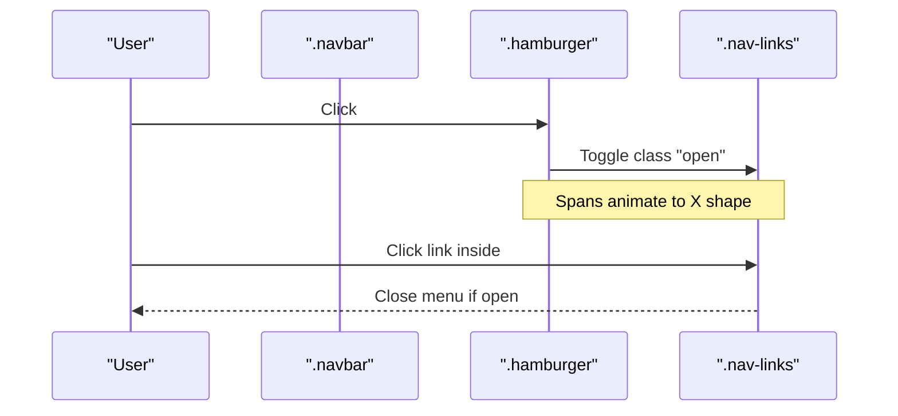
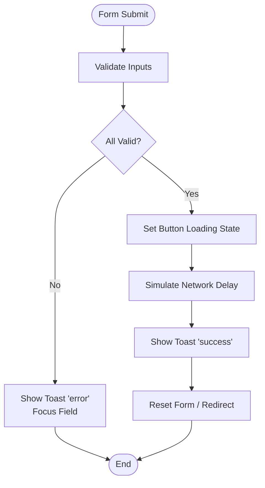
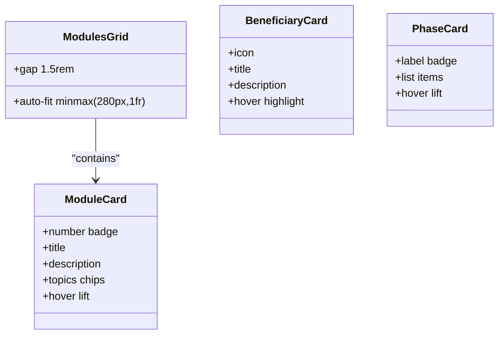
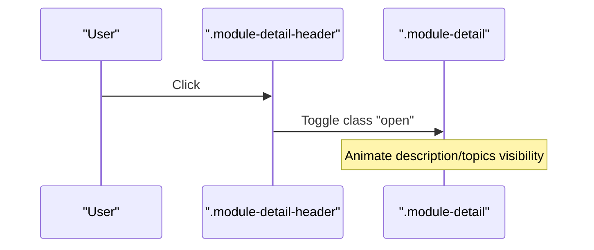
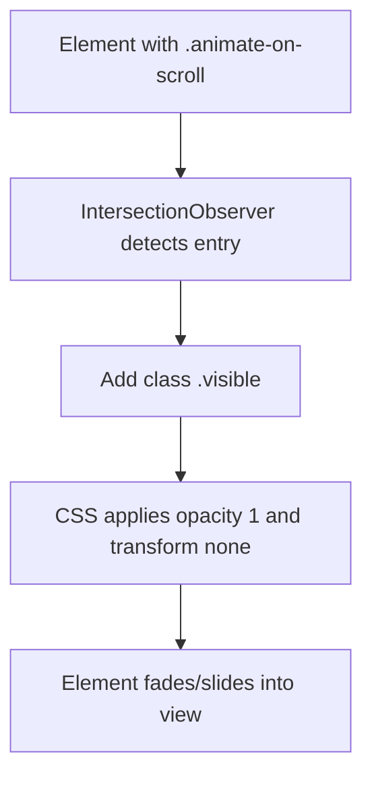
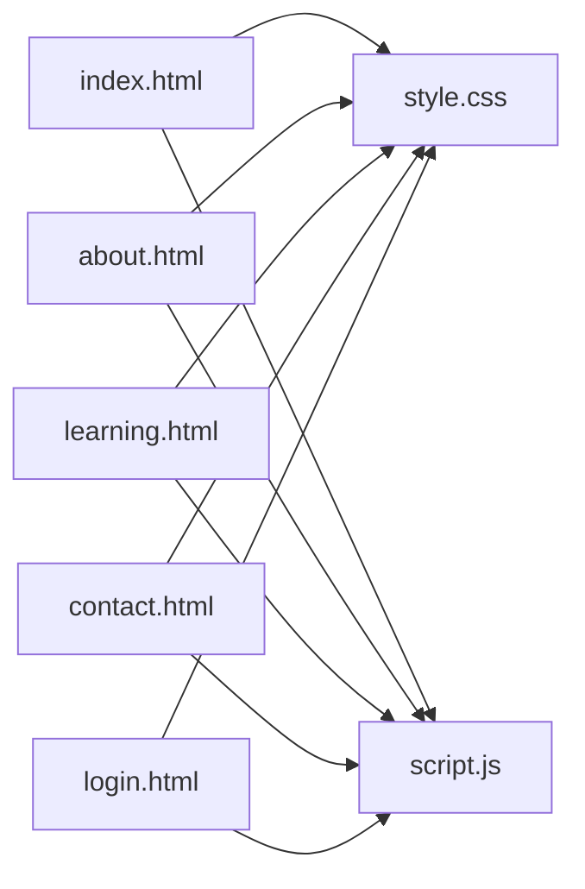

# Component Reference

<cite>
**Referenced Files in This Document**
- [index.html](file://index.html)
- [about.html](file://about.html)
- [learning.html](file://learning.html)
- [contact.html](file://contact.html)
- [login.html](file://login.html)
- [style.css](file://CSS/style.css)
- [script.js](file://js/script.js)
</cite>

## Table of Contents
1. Introduction
2. Project Structure
3. Core Components
4. Architecture Overview
5. Detailed Component Analysis
6. Dependency Analysis
7. Performance Considerations
8. Troubleshooting Guide
9. Conclusion
10. Appendices

## Introduction
This document provides a comprehensive component reference for the Digital Bridges Zambia website. It covers reusable UI components including navigation, forms, buttons, cards, animations, and layout systems. For each component, you will find usage examples, CSS classes, customization options, integration patterns, responsive behavior, and accessibility considerations.

## Project Structure
The site is organized into:
- Pages: index.html, about.html, learning.html, contact.html, login.html
- Styles: CSS/style.css
- Behavior: js/script.js

**Diagram sources**
- [index.html:1-106](file://index.html#L1-L106)
- [about.html:1-123](file://about.html#L1-L123)
- [learning.html:1-137](file://learning.html#L1-L137)
- [contact.html:1-102](file://contact.html#L1-L102)
- [login.html:1-60](file://login.html#L1-L60)
- [style.css:1-247](file://CSS/style.css#L1-L247)
- [script.js:1-105](file://js/script.js#L1-L105)

**Section sources**
- [index.html:1-106](file://index.html#L1-L106)
- [style.css:1-247](file://CSS/style.css#L1-L247)
- [script.js:1-105](file://js/script.js#L1-L105)

## Core Components
- Navigation system: navbar, mobile menu, active states
- Form components: validation and error handling with toast feedback
- Buttons: primary, accent, outline variants
- Cards: module cards, beneficiary cards, phase cards, partner items
- Animations: scroll-based reveal, counters, accordion transitions
- Layout: grids, spacing, sections, banners, footer

**Section sources**
- [style.css:19-247](file://CSS/style.css#L19-L247)
- [script.js:1-105](file://js/script.js#L1-L105)

## Architecture Overview
The UI is built from semantic HTML elements styled by a single stylesheet and enhanced by a small JavaScript layer that handles interactivity (navbar scroll, mobile menu, form validation, accordion toggles, scroll animations, and stats counter).

**Diagram sources**
- [index.html:1-106](file://index.html#L1-L106)
- [about.html:1-123](file://about.html#L1-L123)
- [learning.html:1-137](file://learning.html#L1-L137)
- [contact.html:1-102](file://contact.html#L1-L102)
- [login.html:1-60](file://login.html#L1-L60)
- [style.css:1-247](file://CSS/style.css#L1-L247)
- [script.js:1-105](file://js/script.js#L1-L105)

## Detailed Component Analysis

### Navigation System
- Purpose: Global navigation with logo, links, call-to-action, and mobile hamburger menu.
- Key classes:
  - .navbar, .nav-container, .nav-logo, .logo-icon, .logo-text, .logo-sub
  - .nav-links, .nav-links a, .active, .nav-cta
  - .hamburger, .hamburger span
- Active state: Add class active to the current page link; hover styles underline via pseudo-element.
- Mobile menu: On small screens, .nav-links becomes a slide-in panel when .open is added; .hamburger toggles open state and animates spans.
- Scroll effect: Navbar gains .scrolled class on scroll for shadow.
- Usage example:
  - Include .navbar with .nav-container, .nav-logo, .nav-links, and .hamburger across pages.
  - Mark the current page link with .active.
  - Ensure script.js is loaded to enable mobile toggle and scroll effects.
- Customization:
  - Colors via CSS variables (--primary, --text-muted, etc.).
  - Adjust heights, gaps, and transitions in .navbar and .nav-links.
- Responsive behavior:
  - At ≤768px, .nav-links overlays below the navbar and slides in/out; .hamburger appears.
- Accessibility:
  - Use semantic <nav>, <ul>, <li>, <a>.
  - Provide aria-label for hamburger if needed.
  - Ensure focusable states are visible.

**Diagram sources**
- [index.html:10-25](file://index.html#L10-L25)
- [style.css:19-37](file://CSS/style.css#L19-L37)
- [script.js:1-19](file://js/script.js#L1-L19)

**Section sources**
- [index.html:10-25](file://index.html#L10-L25)
- [about.html:10-18](file://about.html#L10-L18)
- [learning.html:10-18](file://learning.html#L10-L18)
- [contact.html:10-18](file://contact.html#L10-L18)
- [style.css:19-37](file://CSS/style.css#L19-L37)
- [script.js:1-19](file://js/script.js#L1-L19)

### Forms and Validation
- Purpose: Contact and Login forms with client-side validation and user feedback via toast notifications.
- Key classes:
  - .form-group, label, input, textarea, select
  - .input-wrapper, .input-icon
  - .contact-form-card, .login-card, .login-page
  - .password-toggle, .remember-me, .forgot-password
  - .social-login, .social-btn
- Validation rules:
  - Email must be present and contain “@”.
  - Password minimum length enforced.
  - Contact form requires name, valid email, subject selection, and message length ≥10 characters.
- Error handling:
  - Invalid inputs trigger showToast with type "error".
  - Focus moves to the offending field.
  - Submit button shows loading state during simulated submission.
- Success flow:
  - Valid submissions show success toast and reset or redirect after delay.
- Usage example:
  - Wrap inputs in .form-group with labels and required attributes.
  - For login, include #email, #password, #loginBtn, #togglePassword.
  - For contact, include #contactForm with #contactName, #contactEmail, #contactSubject, #contactMessage.
  - Include a #toast element for messages.
- Customization:
  - Style inputs via .form-group input/textarea/select focus states.
  - Adjust icon positioning in .input-wrapper.
- Responsive behavior:
  - Forms stack vertically; card padding adjusts on small screens.
- Accessibility:
  - Associate labels with inputs using for/id.
  - Use required attributes and provide clear error messages via toast.
  - Ensure keyboard navigability and visible focus states.

**Diagram sources**
- [contact.html:37-46](file://contact.html#L37-L46)
- [login.html:19-40](file://login.html#L19-L40)
- [style.css:143-179](file://CSS/style.css#L143-L179)
- [script.js:21-66](file://js/script.js#L21-L66)

**Section sources**
- [contact.html:37-46](file://contact.html#L37-L46)
- [login.html:19-40](file://login.html#L19-L40)
- [style.css:143-179](file://CSS/style.css#L143-L179)
- [script.js:21-66](file://js/script.js#L21-L66)

### Buttons
- Variants:
  - .btn-primary: solid primary color with hover elevation and shadow.
  - .btn-accent: solid accent color with hover elevation.
  - .btn-outline: transparent background with border; hover changes border and text color.
- Common properties:
  - Inline-flex alignment, gap, rounded corners, transition, cursor pointer.
- Usage example:
  - Apply .btn plus variant class to <button> or <a> elements.
  - Combine with icons via inline elements if needed.
- Customization:
  - Modify colors via CSS variables.
  - Adjust radius, padding, and shadows in button classes.
- Responsive behavior:
  - Buttons wrap naturally; full-width usage supported via width:100% inline style where needed.
- Accessibility:
  - Ensure sufficient color contrast.
  - Provide meaningful text or aria-labels for icon-only buttons.

**Section sources**
- [style.css:56-64](file://CSS/style.css#L56-L64)
- [index.html:33-36](file://index.html#L33-L36)
- [contact.html:44-44](file://contact.html#L44-L44)
- [login.html:39-39](file://login.html#L39-L39)

### Cards and Grids
- Module cards (.module-card):
  - Number badge, title, description, topic tags.
  - Hover lift and top gradient bar animation.
  - Used in modules grid and impact sections.
- Beneficiary cards (.beneficiary-card):
  - Icon + text layout; hover highlight.
- Phase cards (.phase-card):
  - Label badge, list content; hover lift.
- Partner items (.partner-item):
  - Icon + label; hover highlight.
- Grids:
  - .modules-grid, .beneficiaries-grid, .phases-timeline, .partners-grid use auto-fit minmax for responsive layouts.
- Usage example:
  - Wrap content in appropriate card class within a grid container.
  - Use .animate-on-scroll for fade-in on scroll.
- Customization:
  - Colors and spacing via CSS variables and utility classes.
  - Adjust grid columns by modifying minmax values in respective grid classes.
- Responsive behavior:
  - Grids reflow automatically based on available width.
- Accessibility:
  - Use semantic headings inside cards.
  - Ensure adequate contrast for icons and text.

**Diagram sources**
- [style.css:80-131](file://CSS/style.css#L80-L131)
- [index.html:65-91](file://index.html#L65-L91)
- [about.html:87-92](file://about.html#L87-L92)

**Section sources**
- [style.css:80-131](file://CSS/style.css#L80-L131)
- [index.html:65-91](file://index.html#L65-L91)
- [about.html:87-92](file://about.html#L87-L92)

### Accordion (Module Details)
- Purpose: Expandable module details with smooth height transitions.
- Key classes:
  - .module-detail, .module-detail-inner, .module-detail-header, .module-description, .module-topics-list, .topic-chip
- Interaction:
  - Clicking header toggles .open class; only one open at a time.
  - Description and topics lists animate via max-height and opacity transitions.
- Usage example:
  - Wrap each module in .module-detail with header and content.
  - Ensure script.js is loaded to handle click events.
- Customization:
  - Adjust transition durations and easing in CSS.
  - Customize topic chip styles.
- Accessibility:
  - Use semantic headings in headers.
  - Ensure keyboard activation works (click handlers already support Enter/Space via native button-like behavior if converted to buttons).

**Diagram sources**
- [learning.html:34-96](file://learning.html#L34-L96)
- [style.css:210-225](file://CSS/style.css#L210-L225)
- [script.js:68-75](file://js/script.js#L68-L75)

**Section sources**
- [learning.html:34-96](file://learning.html#L34-L96)
- [style.css:210-225](file://CSS/style.css#L210-L225)
- [script.js:68-75](file://js/script.js#L68-L75)

### Animations and Transitions
- Scroll reveal:
  - Elements with .animate-on-scroll start invisible and translate down; IntersectionObserver adds .visible to fade/slide them in with staggered delays.
- Stats counter:
  - Numbers animate upward when .stats-bar enters viewport.
- Toast notifications:
  - Slide-in/out with .toast.show; success/error themes.
- Button/card hover effects:
  - Transform translateY and box-shadow transitions.
- Usage example:
  - Add .animate-on-scroll to any element you want to animate on scroll.
  - Include #toast for notifications.
- Customization:
  - Adjust thresholds, margins, and timing in IntersectionObserver configuration.
  - Modify transition timings in CSS variables.
- Accessibility:
  - Respect prefers-reduced-motion by ensuring animations are subtle and non-blocking.

**Diagram sources**
- [style.css:77-86](file://CSS/style.css#L77-L86)
- [script.js:77-86](file://js/script.js#L77-L86)

**Section sources**
- [style.css:77-86](file://CSS/style.css#L77-L86)
- [script.js:77-86](file://js/script.js#L77-L86)

### Layout Components
- Sections and banners:
  - .section, .section-inner, .section-header, .page-banner provide consistent spacing and typography.
- Grids:
  - .modules-grid, .beneficiaries-grid, .phases-timeline, .partners-grid, .stats-grid, .contact-grid, .content-split.
- Footer:
  - .footer, .footer-inner, .footer-brand, .footer-links, .footer-bottom.
- Usage example:
  - Wrap content in .section and .section-inner for consistent padding and max-width.
  - Use appropriate grid classes to structure content.
- Customization:
  - Adjust max-widths, gaps, and colors via CSS variables and grid definitions.
- Responsive behavior:
  - Media queries adjust grid columns and font sizes for smaller screens.
- Accessibility:
  - Maintain logical heading hierarchy within sections.
  - Ensure links in footer have descriptive text.

**Section sources**
- [style.css:65-131](file://CSS/style.css#L65-L131)
- [style.css:188-209](file://CSS/style.css#L188-L209)
- [style.css:226-247](file://CSS/style.css#L226-L247)
- [index.html:49-102](file://index.html#L49-L102)
- [about.html:20-119](file://about.html#L20-L119)
- [contact.html:20-97](file://contact.html#L20-L97)

## Dependency Analysis
- Pages depend on:
  - CSS/style.css for all visual styling.
  - js/script.js for interactive behaviors.
- Shared components:
  - Navbar and footer markup repeated across pages.
  - Toast element included on pages with forms.
- Script dependencies:
  - Navbar scroll listener, mobile menu toggle, form validations, accordion toggles, scroll animations, stats counter.

**Diagram sources**
- [index.html:1-106](file://index.html#L1-L106)
- [about.html:1-123](file://about.html#L1-L123)
- [learning.html:1-137](file://learning.html#L1-L137)
- [contact.html:1-102](file://contact.html#L1-L102)
- [login.html:1-60](file://login.html#L1-L60)
- [style.css:1-247](file://CSS/style.css#L1-L247)
- [script.js:1-105](file://js/script.js#L1-L105)

**Section sources**
- [script.js:1-105](file://js/script.js#L1-L105)
- [style.css:1-247](file://CSS/style.css#L1-L247)

## Performance Considerations
- Minimal JS footprint: Only essential interactions are handled in script.js.
- Efficient animations: Uses IntersectionObserver for scroll reveals and CSS transitions for hover effects.
- Reduced reflows: Animations rely on transform and opacity where possible.
- Responsive grids: Auto-fit minmax reduces media query complexity and improves performance on varied screen sizes.
- Recommendations:
  - Keep images optimized and lazy-load if added later.
  - Avoid heavy libraries; current setup is lightweight.
  - Monitor toast frequency to prevent excessive DOM updates.

[No sources needed since this section provides general guidance]

## Troubleshooting Guide
- Mobile menu not opening:
  - Ensure .hamburger and .navLinks IDs exist and script.js is loaded.
  - Check that .nav-links has .open class toggled on click.
- Navbar shadow not appearing:
  - Verify .scrolled class is applied on scroll and CSS defines shadow for .navbar.scrolled.
- Form validation errors not showing:
  - Confirm #toast exists on the page and script.js listeners are attached.
  - Check that input IDs match those referenced in script.js.
- Accordion not expanding:
  - Ensure .module-detail-header elements exist and script.js click handlers are bound.
  - Verify CSS transitions for .module-description and .module-topics-list are present.
- Stats counter not animating:
  - Confirm .stats-bar and stat numbers exist; IntersectionObserver threshold should trigger when scrolled into view.

**Section sources**
- [script.js:1-19](file://js/script.js#L1-L19)
- [script.js:21-66](file://js/script.js#L21-L66)
- [script.js:68-75](file://js/script.js#L68-L75)
- [script.js:77-105](file://js/script.js#L77-L105)
- [style.css:19-37](file://CSS/style.css#L19-L37)
- [style.css:210-225](file://CSS/style.css#L210-L225)

## Conclusion
The Digital Bridges Zambia website uses a clean, modular component system powered by semantic HTML, a centralized stylesheet, and a concise JavaScript layer. Components are accessible, responsive, and easy to customize through CSS variables and class composition. The navigation, forms, buttons, cards, animations, and layout utilities provide a robust foundation for building additional pages while maintaining consistency and performance.

[No sources needed since this section summarizes without analyzing specific files]

## Appendices

### Quick Reference: Classes and Roles
- Navigation: .navbar, .nav-container, .nav-logo, .nav-links, .nav-cta, .hamburger
- Forms: .form-group, .input-wrapper, .contact-form-card, .login-card, .password-toggle
- Buttons: .btn, .btn-primary, .btn-accent, .btn-outline
- Cards: .module-card, .beneficiary-card, .phase-card, .partner-item
- Layout: .section, .section-inner, .page-banner, .modules-grid, .beneficiaries-grid, .phases-timeline, .partners-grid, .stats-grid, .contact-grid, .content-split
- Animations: .animate-on-scroll, .toast, .scrolled

**Section sources**
- [style.css:19-247](file://CSS/style.css#L19-L247)