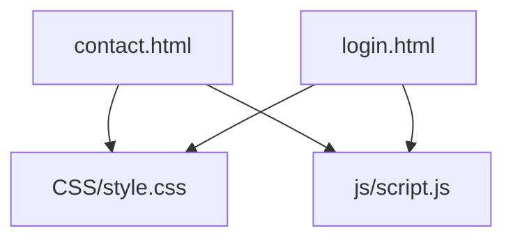
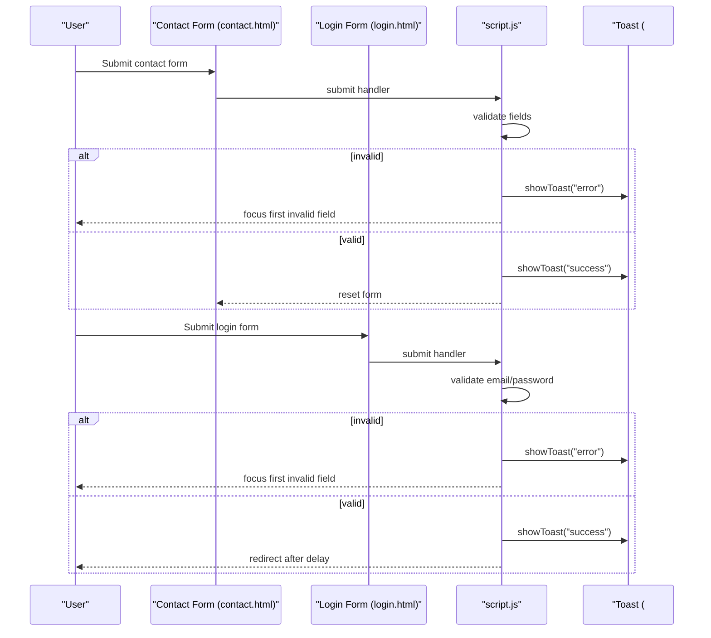
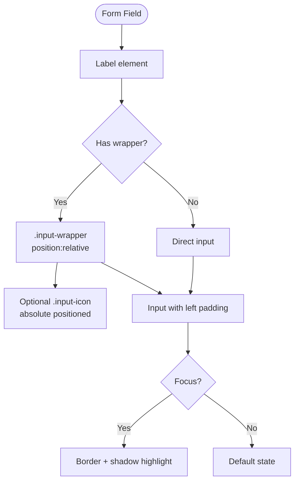
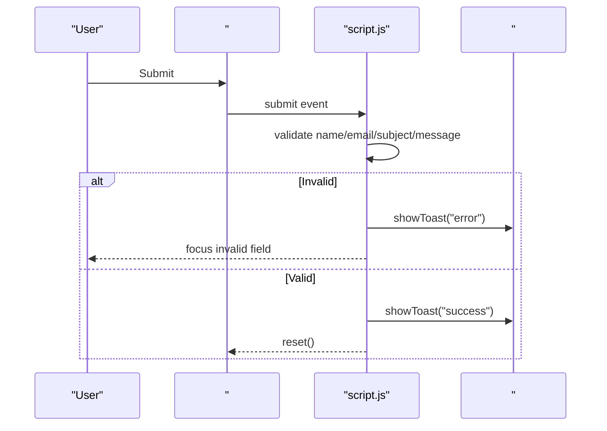
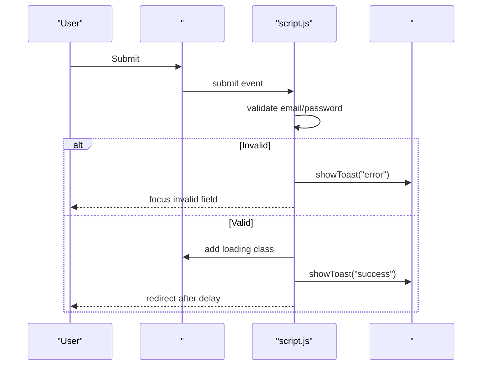
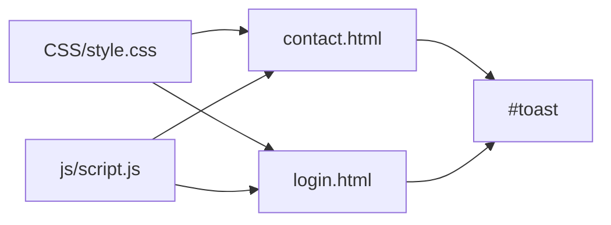

# Form Components

<cite>
**Referenced Files in This Document**
- [contact.html](file://contact.html)
- [login.html](file://login.html)
- [style.css](file://CSS/style.css)
- [script.js](file://js/script.js)
</cite>

## Table of Contents
1. [Introduction](#introduction)
2. [Project Structure](#project-structure)
3. [Core Components](#core-components)
4. [Architecture Overview](#architecture-overview)
5. [Detailed Component Analysis](#detailed-component-analysis)
6. [Dependency Analysis](#dependency-analysis)
7. [Performance Considerations](#performance-considerations)
8. [Troubleshooting Guide](#troubleshooting-guide)
9. [Conclusion](#conclusion)
10. [Appendices](#appendices)

## Introduction
This document provides comprehensive documentation for all form components used across the Digital Bridges Zambia website. It covers base form styling, input fields, textareas, select dropdowns, focus states, and accessibility considerations. It also details the contact form implementation with validation rules, error handling, and toast notifications, as well as the login form features including password visibility toggle, remember me checkbox, and social login placeholders. CSS classes (.form-group, .input-wrapper, .social-btn) and JavaScript validation functions are explained with examples for adding new fields, customizing validation rules, and implementing custom error messages.

## Project Structure
The forms are implemented on two pages:
- Contact page: a multi-field contact form with name, email, subject (select), and message (textarea).
- Login page: an authentication form with email, password, remember me, sign-in button, and social login buttons.

Both pages share common styles and behaviors defined in the stylesheet and script files.

**Diagram sources**
- [contact.html:39-45](file://contact.html#L39-L45)
- [login.html:19-51](file://login.html#L19-L51)
- [style.css:143-186](file://CSS/style.css#L143-L186)
- [script.js:21-66](file://js/script.js#L21-L66)

**Section sources**
- [contact.html:39-45](file://contact.html#L39-L45)
- [login.html:19-51](file://login.html#L19-L51)
- [style.css:143-186](file://CSS/style.css#L143-L186)
- [script.js:21-66](file://js/script.js#L21-L66)

## Core Components
- Base form styling:
  - .form-group: wraps label and input/textarea/select; controls spacing and typography.
  - Input fields, textarea, and select: consistent padding, border, background, focus state with primary color and subtle shadow.
  - .input-wrapper: positions icons inside inputs and adjusts padding to accommodate them.
  - Focus states: visible border color change and soft glow for keyboard navigation clarity.
- Contact form:
  - Fields: Full Name (text), Email Address (email), Subject (select), Message (textarea).
  - Validation: presence checks, email format, minimum message length.
  - Error handling: inline focus management and toast notifications for errors and success.
- Login form:
  - Fields: Email Address (email), Password (password), Remember Me (checkbox).
  - Features: password visibility toggle, loading state on submit, social login placeholders (Google, GitHub).
  - Validation: email presence/format, password length.
  - Feedback: toast notifications for errors and success.

**Section sources**
- [style.css:143-186](file://CSS/style.css#L143-L186)
- [contact.html:39-45](file://contact.html#L39-L45)
- [login.html:19-51](file://login.html#L19-L51)
- [script.js:21-66](file://js/script.js#L21-L66)

## Architecture Overview
Forms follow a simple client-side pattern:
- HTML defines semantic structure with labels and inputs.
- CSS provides consistent styling and accessible focus states.
- JavaScript handles submission events, validates inputs, shows toast feedback, and toggles UI states (e.g., password visibility, loading).

**Diagram sources**
- [contact.html:39-45](file://contact.html#L39-L45)
- [login.html:19-51](file://login.html#L19-L51)
- [script.js:21-66](file://js/script.js#L21-L66)

## Detailed Component Analysis

### Base Form Styling
- .form-group:
  - Provides vertical spacing between fields.
  - Labels are bold and sized for readability.
- Inputs, Textarea, Select:
  - Full-width layout with consistent padding and rounded borders.
  - Focus state highlights the active field with primary color and a soft shadow.
- .input-wrapper:
  - Enables icon placement inside inputs via absolute positioning.
  - Adjusts left padding so text does not overlap icons.
- Accessibility:
  - Each input has a corresponding <label> linked via id/for.
  - Focus states support keyboard navigation.
  - Password toggle includes aria-label for screen readers.

**Diagram sources**
- [style.css:143-151](file://CSS/style.css#L143-L151)
- [login.html:20-33](file://login.html#L20-L33)

**Section sources**
- [style.css:143-151](file://CSS/style.css#L143-L151)
- [login.html:20-33](file://login.html#L20-L33)

### Contact Form Implementation
- Fields:
  - Full Name: required text input.
  - Email Address: required email input.
  - Subject: required select dropdown with predefined options.
  - Message: required textarea with minimum length validation.
- Validation Rules:
  - Presence checks for name, email, subject, and message.
  - Email format check using substring inclusion.
  - Minimum message length enforced.
- Error Handling:
  - On validation failure, displays a toast notification and focuses the first invalid field.
- Success Handling:
  - Shows a success toast, resets the form, and restores button state.

**Diagram sources**
- [contact.html:39-45](file://contact.html#L39-L45)
- [script.js:52-66](file://js/script.js#L52-L66)

**Section sources**
- [contact.html:39-45](file://contact.html#L39-L45)
- [script.js:52-66](file://js/script.js#L52-L66)

### Login Form Features
- Fields:
  - Email Address: required email input.
  - Password: required password input with visibility toggle.
  - Remember Me: checkbox for persistence placeholder.
- Features:
  - Password visibility toggle: switches input type and updates button icon.
  - Loading state: disables interactions and changes button text during simulated submission.
  - Social login placeholders: Google and GitHub buttons show “coming soon” toasts.
- Validation Rules:
  - Email presence and basic format check.
  - Password length requirement.
- Error Handling:
  - Toast notifications for invalid inputs and focused field guidance.
- Success Handling:
  - Toast success message followed by redirection after a delay.

**Diagram sources**
- [login.html:19-51](file://login.html#L19-L51)
- [script.js:30-50](file://js/script.js#L30-L50)

**Section sources**
- [login.html:19-51](file://login.html#L19-L51)
- [script.js:30-50](file://js/script.js#L30-L50)

### Social Login Placeholders
- Buttons:
  - Google and GitHub social login buttons are present with icons and labels.
- Behavior:
  - Clicking either button triggers a toast indicating the feature is coming soon.
- Integration:
  - No backend integration currently; placeholders ready for future OAuth flows.

**Section sources**
- [login.html:41-51](file://login.html#L41-L51)
- [script.js:47-50](file://js/script.js#L47-L50)

### Toast Notifications
- Purpose:
  - Provide immediate user feedback for validation errors and successful actions.
- Implementation:
  - Centralized function sets message, applies type class (success/error), animates in/out.
- Usage:
  - Called from both contact and login form handlers.

**Section sources**
- [style.css:182-186](file://CSS/style.css#L182-L186)
- [script.js:21-28](file://js/script.js#L21-L28)
- [contact.html:98](file://contact.html#L98)
- [login.html:56](file://login.html#L56)

## Dependency Analysis
- Styles:
  - Both forms rely on shared CSS for layout, focus states, and visual consistency.
- Scripts:
  - Shared script handles form submissions, validation, toast display, and UI toggles.
- DOM Elements:
  - Forms reference specific IDs for elements (e.g., #contactForm, #loginForm, #toast).

**Diagram sources**
- [style.css:143-186](file://CSS/style.css#L143-L186)
- [script.js:21-66](file://js/script.js#L21-L66)
- [contact.html:39-45](file://contact.html#L39-L45)
- [login.html:19-51](file://login.html#L19-L51)

**Section sources**
- [style.css:143-186](file://CSS/style.css#L143-L186)
- [script.js:21-66](file://js/script.js#L21-L66)
- [contact.html:39-45](file://contact.html#L39-L45)
- [login.html:19-51](file://login.html#L19-L51)

## Performance Considerations
- Client-side validation avoids unnecessary server requests on invalid inputs.
- Toast animations use requestAnimationFrame for smooth transitions.
- Minimal DOM queries by caching references within event handlers.
- Avoid heavy operations in submit handlers; keep logic concise for responsiveness.

[No sources needed since this section provides general guidance]

## Troubleshooting Guide
- Common issues:
  - Missing or mismatched IDs: Ensure form and input IDs match those referenced in script.js.
  - Toast not showing: Verify #toast exists in the DOM and script runs after DOM load.
  - Focus not working: Confirm that the targeted input element exists before focusing.
- Debugging steps:
  - Check browser console for errors.
  - Validate HTML structure around forms and ensure labels are properly associated with inputs.
  - Temporarily log validation results to confirm rule execution.

**Section sources**
- [script.js:21-66](file://js/script.js#L21-L66)
- [contact.html:39-45](file://contact.html#L39-L45)
- [login.html:19-51](file://login.html#L19-L51)

## Conclusion
The Digital Bridges Zambia website implements a cohesive set of form components with consistent styling, robust client-side validation, and accessible feedback mechanisms. The contact and login forms demonstrate best practices for labeling, focus management, and user feedback through toast notifications. Social login placeholders provide a foundation for future integrations. Following the guidelines in this document will help maintain consistency, improve accessibility, and streamline enhancements.

[No sources needed since this section summarizes without analyzing specific files]

## Appendices

### Adding New Form Fields
- Steps:
  - Add a new 
 with a <label> and appropriate input type.
  - Assign unique id to the input and link it via label for accessibility.
  - If using an icon, wrap the input in 
 and add a span with class .input-icon.
  - Update JavaScript validation to include the new field’s presence and format checks.
  - Optionally update toast messages to reflect the new field’s requirements.

**Section sources**
- [style.css:143-151](file://CSS/style.css#L143-L151)
- [script.js:21-66](file://js/script.js#L21-L66)

### Customizing Validation Rules
- Examples:
  - Email validation: extend current checks to include full regex patterns if needed.
  - Password strength: add complexity checks (uppercase, numbers, special characters).
  - Minimum lengths: adjust thresholds based on content requirements.
- Implementation:
  - Modify the relevant submit handler in script.js to enforce new rules.
  - Provide clear error messages via showToast for each rule violation.

**Section sources**
- [script.js:30-66](file://js/script.js#L30-L66)

### Implementing Custom Error Messages
- Approach:
  - Use showToast with descriptive messages tailored to each validation failure.
  - Focus the first invalid field to guide users quickly.
- Best Practices:
  - Keep messages concise and actionable.
  - Ensure messages are announced by screen readers when possible.

**Section sources**
- [script.js:21-28](file://js/script.js#L21-L28)
- [script.js:30-66](file://js/script.js#L30-L66)

### Accessibility Requirements
- Proper labeling:
  - Every input must have a corresponding <label> with matching id/for attributes.
- ARIA attributes:
  - Use aria-label for interactive controls like password toggle buttons.
- Keyboard navigation:
  - Ensure focus states are visible and logical tab order is maintained.
- Screen reader compatibility:
  - Avoid relying solely on color for status; use text and ARIA where necessary.

**Section sources**
- [style.css:143-151](file://CSS/style.css#L143-L151)
- [login.html:20-33](file://login.html#L20-L33)
- [script.js:43-46](file://js/script.js#L43-L46)