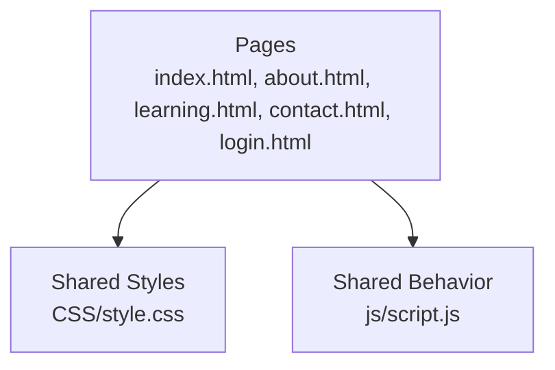
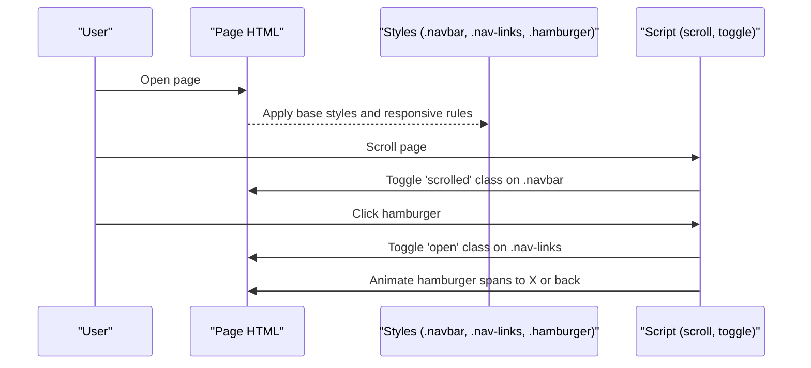
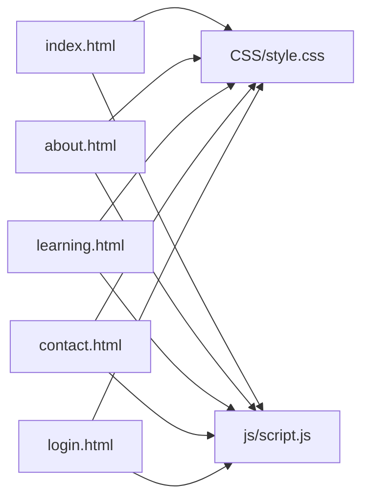

# Navigation Component

<cite>
**Referenced Files in This Document**
- [index.html](file://index.html)
- [about.html](file://about.html)
- [learning.html](file://learning.html)
- [contact.html](file://contact.html)
- [login.html](file://login.html)
- [style.css](file://CSS/style.css)
- [script.js](file://js/script.js)
</cite>

## Table of Contents
1. [Introduction](#introduction)
2. [Project Structure](#project-structure)
3. [Core Components](#core-components)
4. [Architecture Overview](#architecture-overview)
5. [Detailed Component Analysis](#detailed-component-analysis)
6. [Dependency Analysis](#dependency-analysis)
7. [Performance Considerations](#performance-considerations)
8. [Troubleshooting Guide](#troubleshooting-guide)
9. [Conclusion](#conclusion)
10. [Appendices](#appendices)

## Introduction
This document explains the navigation system used across Digital Bridges Zambia pages. It covers the fixed navbar with backdrop blur, scroll-based styling changes, mobile hamburger menu with smooth animations, active state management for current page indication, hover effects, and integration patterns across all pages. It also includes customization guidance for logo styles, link colors, and CTA button appearance, along with accessibility considerations such as keyboard navigation and screen reader support.

## Project Structure
The navigation component is implemented consistently across all pages using:
- A shared CSS file for layout, transitions, and responsive behavior
- A shared JavaScript file for scroll handling, mobile menu toggle, and interactions
- HTML markup repeated on each page with minor per-page adjustments (active class placement)

**Diagram sources**
- [index.html:10-25](file://index.html#L10-L25)
- [about.html:10-18](file://about.html#L10-L18)
- [learning.html:10-18](file://learning.html#L10-L18)
- [contact.html:10-18](file://contact.html#L10-L18)
- [login.html:10-57](file://login.html#L10-L57)
- [style.css:19-36](file://CSS/style.css#L19-L36)
- [script.js:1-19](file://js/script.js#L1-L19)

**Section sources**
- [index.html:10-25](file://index.html#L10-L25)
- [about.html:10-18](file://about.html#L10-L18)
- [learning.html:10-18](file://learning.html#L10-L18)
- [contact.html:10-18](file://contact.html#L10-L18)
- [login.html:10-57](file://login.html#L10-L57)
- [style.css:19-36](file://CSS/style.css#L19-L36)
- [script.js:1-19](file://js/script.js#L1-L19)

## Core Components
- Navbar container and structure:
  - Fixed top bar with a translucent background and backdrop blur
  - Logo area with icon and text
  - Navigation links list
  - Call-to-action button
  - Hamburger icon for mobile
- Scroll behavior:
  - Adds a shadow when scrolled beyond a threshold
- Mobile menu:
  - Hidden by default on desktop; slides down on small screens
  - Hamburger toggles open/close with animated bars
- Active state:
  - Current page link highlighted via an active class
- Hover effects:
  - Underline animation on links
  - Elevated CTA button on hover

Key classes:
- .navbar: fixed positioning, backdrop blur, transition, and scroll state
- .nav-container: flex container aligning logo, links, and hamburger
- .nav-links: horizontal links on desktop; vertical slide-in on mobile
- .hamburger: three-line icon that animates to an “X” when open

**Section sources**
- [style.css:19-36](file://CSS/style.css#L19-L36)
- [style.css:227-246](file://CSS/style.css#L227-L246)
- [script.js:1-19](file://js/script.js#L1-L19)
- [index.html:10-25](file://index.html#L10-L25)

## Architecture Overview
The navigation integrates HTML structure, CSS styling, and JavaScript behavior across all pages. The same markup pattern is reused, while CSS provides responsive rules and JS handles dynamic behaviors like scroll state and menu toggling.

**Diagram sources**
- [style.css:19-36](file://CSS/style.css#L19-L36)
- [style.css:227-246](file://CSS/style.css#L227-L246)
- [script.js:1-19](file://js/script.js#L1-L19)
- [index.html:10-25](file://index.html#L10-L25)

## Detailed Component Analysis

### Fixed Navbar with Backdrop Blur and Scroll Styling
- Fixed positioning keeps the navbar visible at the top during scrolling
- Translucent background with backdrop blur creates a frosted glass effect
- On scroll past a threshold, a shadow is applied to emphasize elevation
- Smooth transitions ensure visual changes feel polished

Customization tips:
- Adjust blur intensity by modifying the backdrop-filter value
- Change shadow strength via the shadow variable or direct style
- Modify transition timing for faster or slower effects

**Section sources**
- [style.css:19-21](file://CSS/style.css#L19-L21)
- [script.js:1-3](file://js/script.js#L1-L3)

### Mobile Hamburger Menu with Smooth Animations
- On small screens, the nav links are hidden off-screen and slide into view when opened
- The hamburger icon transforms into an “X” using span rotations and translations
- Clicking any link inside the mobile menu closes the menu automatically
- Smooth CSS transitions animate both the menu slide and icon morph

Accessibility note:
- Ensure focus management when opening/closing the menu so keyboard users can navigate within it
- Add aria-expanded to the hamburger and aria-label for screen readers

**Section sources**
- [style.css:227-246](file://CSS/style.css#L227-L246)
- [script.js:5-19](file://js/script.js#L5-L19)

### Active State Management for Current Page Indication
- Each page sets the active class on the corresponding link to indicate the current page
- The active link receives a distinct color and underline animation
- This approach is simple and does not require JavaScript to compute the active state

Customization tips:
- Change the active color by adjusting the primary color variable
- Modify underline width/height for emphasis

**Section sources**
- [index.html:16-22](file://index.html#L16-L22)
- [about.html:13-15](file://about.html#L13-L15)
- [learning.html:13-15](file://learning.html#L13-L15)
- [contact.html:13-15](file://contact.html#L13-L15)
- [style.css:27-31](file://CSS/style.css#L27-L31)

### Hover Effects and CTA Button Appearance
- Links have an animated underline that expands on hover and when active
- The CTA button has a solid background, rounded corners, and a hover lift with shadow
- These effects improve interactivity and guide user attention

Customization tips:
- Adjust CTA background and hover colors via variables
- Tweak border radius and shadow for different brand feels

**Section sources**
- [style.css:27-34](file://CSS/style.css#L27-L34)

### Integration Patterns Across All Pages
- Every page includes the same navbar markup structure with consistent IDs:
  - #navbar for the main nav element
  - #navLinks for the links list
  - #hamburger for the toggle control
- The shared JavaScript binds events to these IDs, ensuring consistent behavior
- Per-page differences are limited to which link carries the active class

Integration checklist:
- Include the stylesheet and script references
- Use the exact IDs for JS to work without modification
- Set the active class on the correct link for each page

**Section sources**
- [index.html:10-25](file://index.html#L10-L25)
- [about.html:10-18](file://about.html#L10-L18)
- [learning.html:10-18](file://learning.html#L10-L18)
- [contact.html:10-18](file://contact.html#L10-L18)
- [script.js:1-19](file://js/script.js#L1-L19)

### Accessibility Considerations
- Keyboard navigation:
  - Ensure tab order flows through links and the hamburger
  - When the mobile menu opens, focus should move into the menu for keyboard users
- Screen reader support:
  - Add aria-expanded to the hamburger to reflect open/close state
  - Provide aria-labels for the hamburger and any icons used in the logo
- Focus indicators:
  - Maintain visible focus outlines for links and buttons
- Semantic structure:
  - Use <nav> and <ul>/<li> for links to convey structure to assistive technologies

Implementation notes:
- Update the hamburger element to include aria-expanded and aria-label attributes
- Optionally add role="button" if needed for older browsers
- Ensure the mobile menu is programmatically linked to the hamburger via aria-controls

**Section sources**
- [style.css:227-246](file://CSS/style.css#L227-L246)
- [script.js:5-19](file://js/script.js#L5-L19)
- [index.html:10-25](file://index.html#L10-L25)

## Dependency Analysis
The navigation depends on shared resources and consistent markup:

**Diagram sources**
- [index.html:7-8](file://index.html#L7-L8)
- [index.html:103-104](file://index.html#L103-L104)
- [about.html:7-8](file://about.html#L7-L8)
- [about.html:120-121](file://about.html#L120-L121)
- [learning.html:7-8](file://learning.html#L7-L8)
- [learning.html:134-135](file://learning.html#L134-L135)
- [contact.html:7-8](file://contact.html#L7-L8)
- [contact.html:98-100](file://contact.html#L98-L100)
- [login.html:7-8](file://login.html#L7-L8)
- [login.html:56-58](file://login.html#L56-L58)

**Section sources**
- [index.html:7-8](file://index.html#L7-L8)
- [index.html:103-104](file://index.html#L103-L104)
- [about.html:7-8](file://about.html#L7-L8)
- [about.html:120-121](file://about.html#L120-L121)
- [learning.html:7-8](file://learning.html#L7-L8)
- [learning.html:134-135](file://learning.html#L134-L135)
- [contact.html:7-8](file://contact.html#L7-L8)
- [contact.html:98-100](file://contact.html#L98-L100)
- [login.html:7-8](file://login.html#L7-L8)
- [login.html:56-58](file://login.html#L56-L58)

## Performance Considerations
- Keep the number of DOM queries minimal; the current script targets specific IDs once
- Avoid heavy computations in scroll handlers; toggling a class is lightweight
- Use CSS transitions instead of JS animations where possible for smoother performance
- Limit reflows by batching style changes when expanding menus

[No sources needed since this section provides general guidance]

## Troubleshooting Guide
Common issues and resolutions:
- Hamburger does not toggle:
  - Verify that the elements with IDs #hamburger and #navLinks exist on the page
  - Ensure the script is loaded after the DOM is ready
- Menu does not close on link click:
  - Confirm that the event listener is attached to all links within #navLinks
- Active state not showing:
  - Check that the correct link has the active class on each page
- Backdrop blur not visible:
  - Some browsers may not support backdrop-filter; provide a fallback background opacity
- Focus management:
  - Add aria-expanded to the hamburger and manage focus when opening/closing the menu

**Section sources**
- [script.js:1-19](file://js/script.js#L1-L19)
- [style.css:19-36](file://CSS/style.css#L19-L36)
- [style.css:227-246](file://CSS/style.css#L227-L246)

## Conclusion
The navigation component provides a consistent, accessible, and responsive experience across all pages. Its fixed positioning with backdrop blur, scroll-based styling, animated mobile menu, and clear active states enhance usability. By following the integration patterns and customization guidance, teams can maintain a cohesive look and feel while adapting to brand needs.

[No sources needed since this section summarizes without analyzing specific files]

## Appendices

### Customization Examples
- Logo styles:
  - Adjust icon size, gradient colors, and spacing via the logo-related classes
  - Modify font sizes and weights for the logo text and subtitle
- Link colors:
  - Change default and hover colors by updating the primary color variable
  - Customize underline thickness and transition duration
- CTA button appearance:
  - Override background color and hover effects for different branding
  - Adjust padding, border radius, and shadow for emphasis

**Section sources**
- [style.css:3-13](file://CSS/style.css#L3-L13)
- [style.css:23-34](file://CSS/style.css#L23-L34)

### Accessibility Checklist
- Add aria-expanded to the hamburger and update it on toggle
- Provide aria-label for the hamburger and any decorative icons
- Ensure visible focus indicators for all interactive elements
- Use semantic HTML (<nav>, <ul>, <li>) for better structure
- Test with keyboard-only navigation and screen readers

**Section sources**
- [script.js:5-19](file://js/script.js#L5-L19)
- [style.css:227-246](file://CSS/style.css#L227-L246)