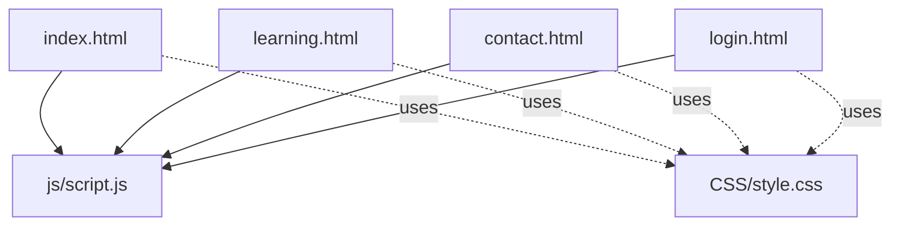
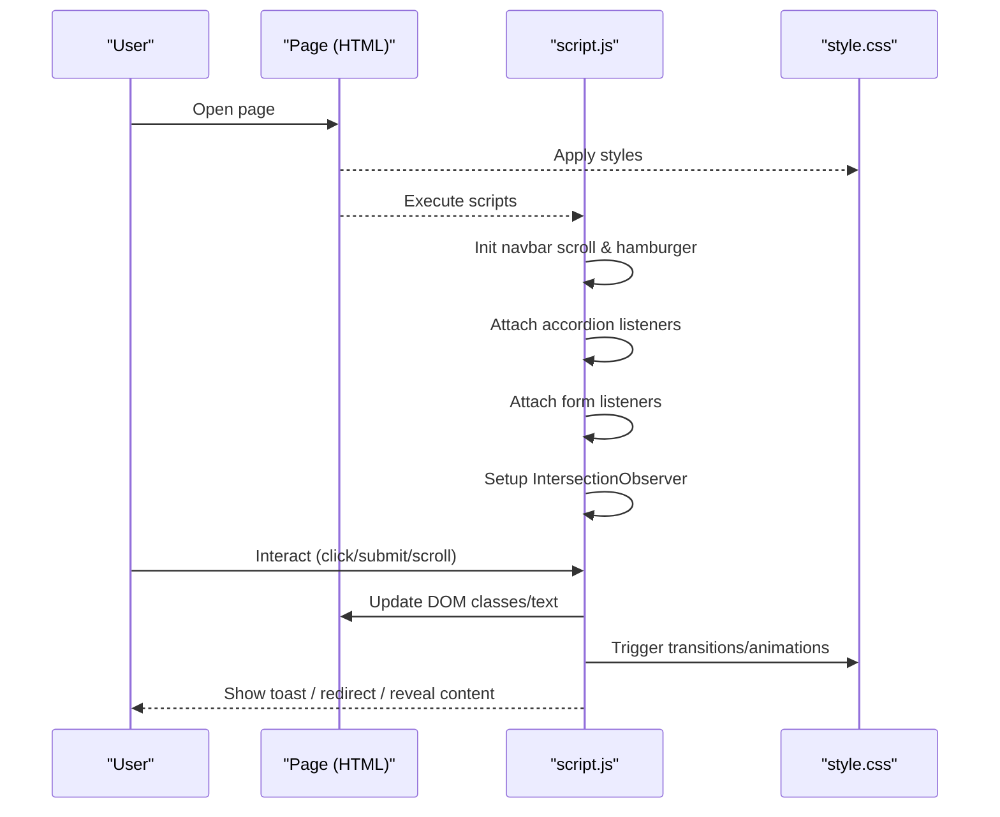
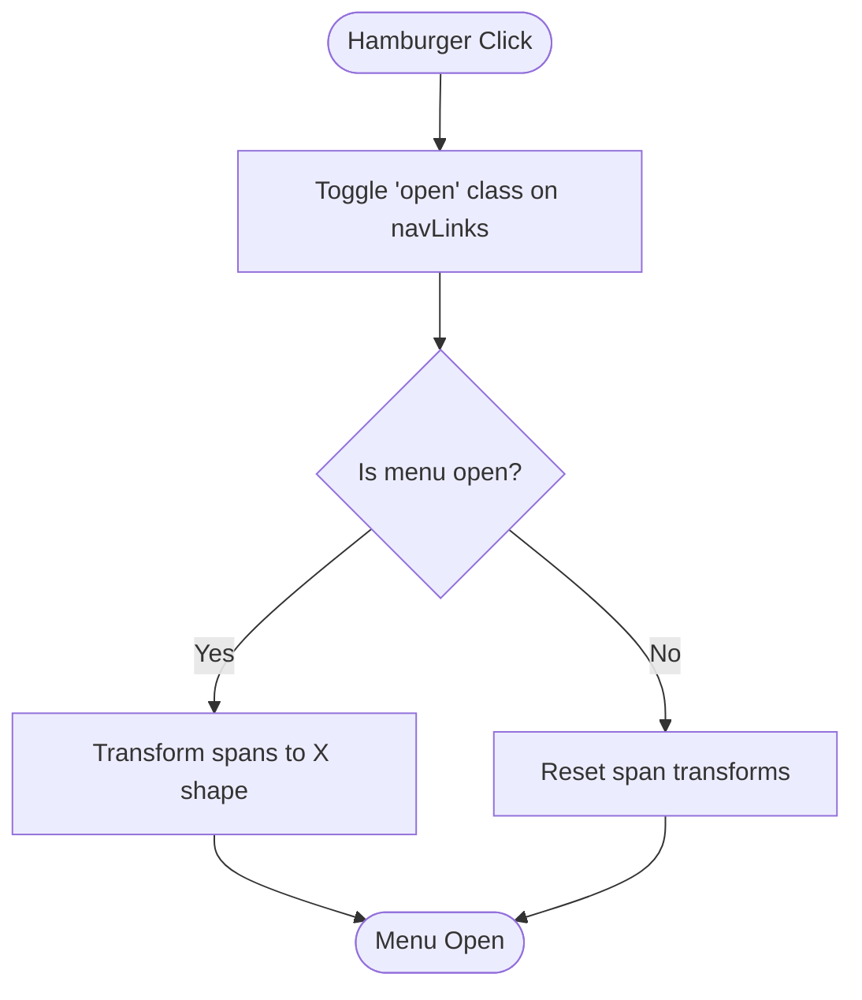
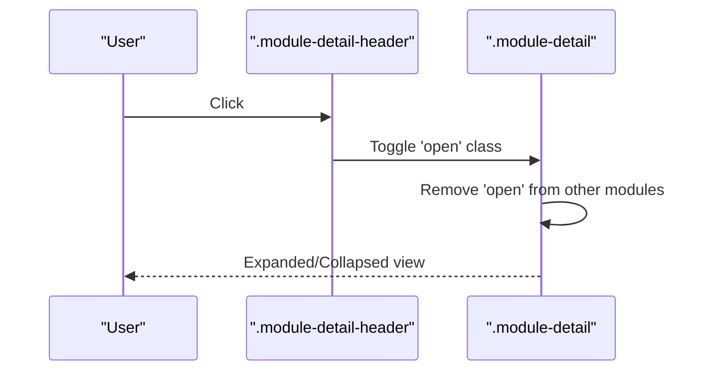
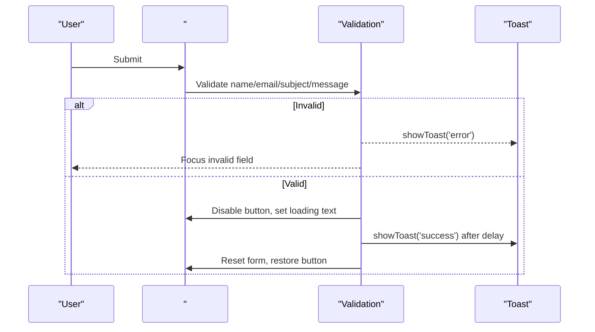
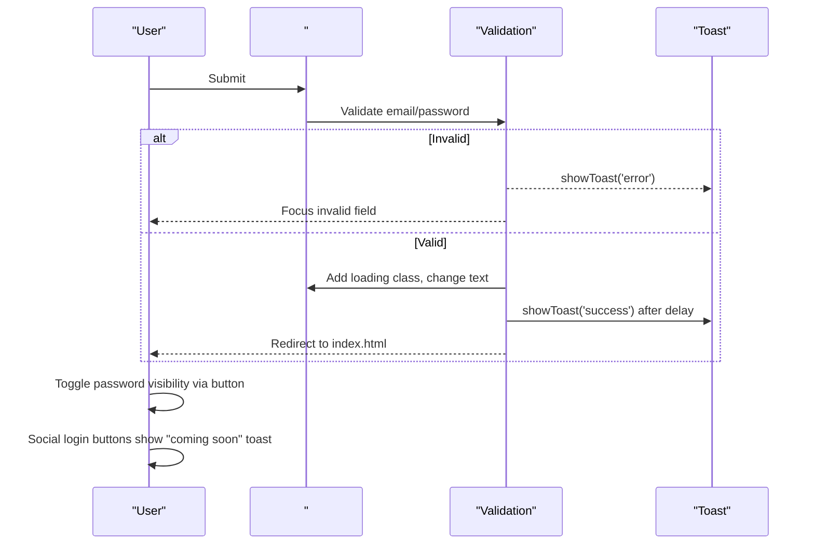
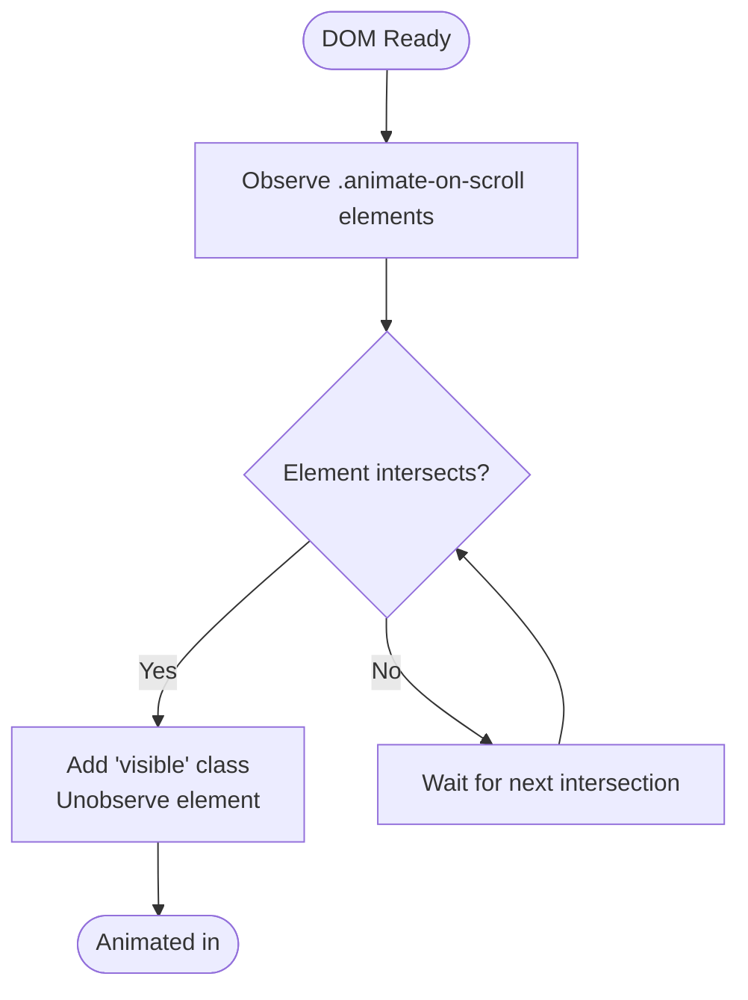
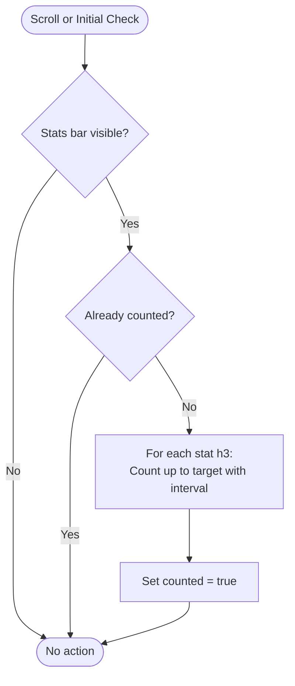
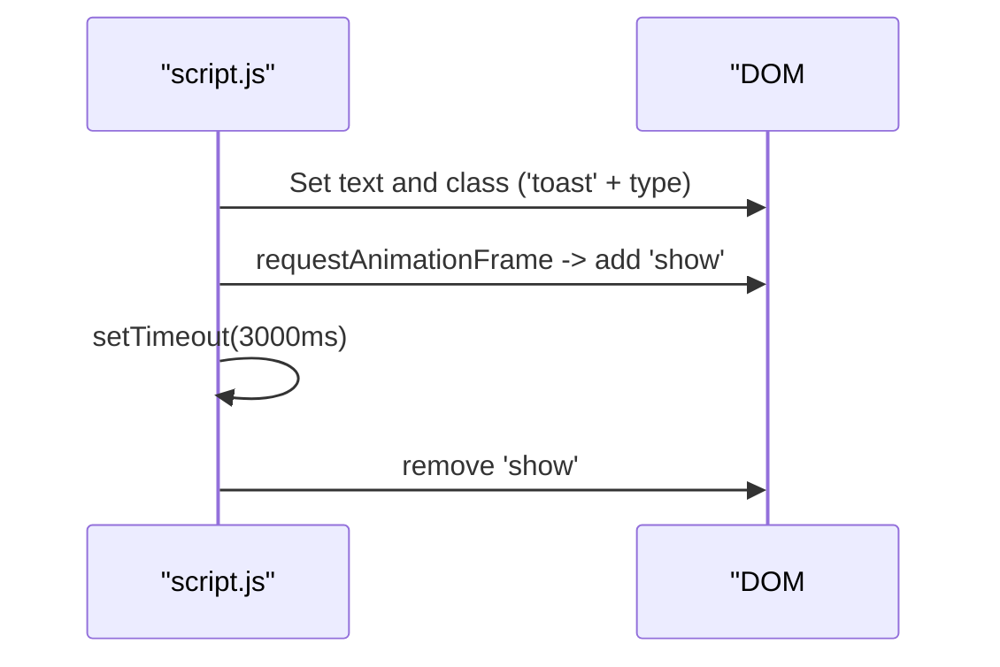
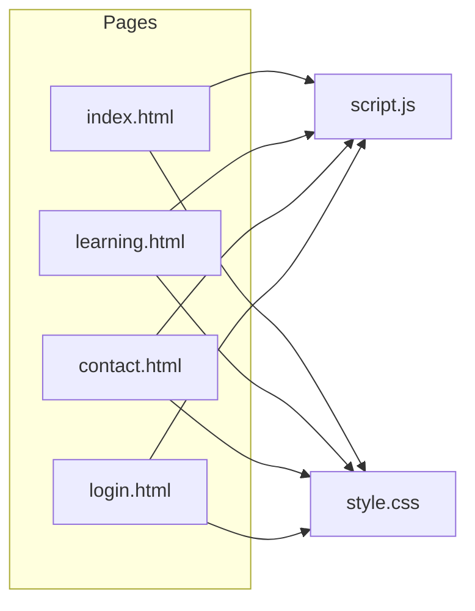

# Core Features

<cite>
**Referenced Files in This Document**
- [script.js](file://js/script.js)
- [style.css](file://CSS/style.css)
- [index.html](file://index.html)
- [learning.html](file://learning.html)
- [contact.html](file://contact.html)
- [login.html](file://login.html)
</cite>

## Table of Contents
1. [Introduction](#introduction)
2. [Project Structure](#project-structure)
3. [Core Components](#core-components)
4. [Architecture Overview](#architecture-overview)
5. [Detailed Component Analysis](#detailed-component-analysis)
6. [Dependency Analysis](#dependency-analysis)
7. [Performance Considerations](#performance-considerations)
8. [Troubleshooting Guide](#troubleshooting-guide)
9. [Conclusion](#conclusion)

## Introduction
This document explains the core interactive features of the Digital Bridges Zambia website, focusing on:
- Interactive learning modules with accordion behavior
- Responsive navigation with a mobile hamburger menu
- Form handling and validation for contact and login forms
- Scroll-triggered animations using Intersection Observer
- Statistics counter animations
- Toast notifications and smooth transitions for user feedback

The goal is to help developers and contributors understand how each feature works, how user inputs are handled, how state is managed, and how visual feedback is provided.

## Project Structure
The site is organized into HTML pages that share a common JavaScript file and stylesheet:
- Pages: index.html (home), learning.html (modules), contact.html (contact form), login.html (login form)
- Shared assets: js/script.js (interactive behaviors), CSS/style.css (visual styles and transitions)

**Diagram sources**
- [index.html:10-25](file://index.html#L10-L25)
- [learning.html:10-18](file://learning.html#L10-L18)
- [contact.html:10-18](file://contact.html#L10-L18)
- [login.html:10-18](file://login.html#L10-L18)
- [script.js:1-105](file://script.js#L1-L105)
- [style.css:1-200](file://CSS/style.css#L1-L200)

**Section sources**
- [index.html:10-25](file://index.html#L10-L25)
- [learning.html:10-18](file://learning.html#L10-L18)
- [contact.html:10-18](file://contact.html#L10-L18)
- [login.html:10-18](file://login.html#L10-L18)
- [script.js:1-105](file://script.js#L1-L105)
- [style.css:1-200](file://CSS/style.css#L1-L200)

## Core Components
- Navbar scroll effect and mobile hamburger menu
- Module accordion for learning content
- Contact form validation and submission simulation
- Login form validation, password toggle, and simulated sign-in flow
- Scroll-triggered animations via Intersection Observer
- Animated statistics counters triggered by visibility
- Toast notification system for success/error feedback

These components are implemented in script.js and styled in style.css, with structural elements defined across the HTML pages.

**Section sources**
- [script.js:1-105](file://script.js#L1-L105)
- [style.css:182-186](file://CSS/style.css#L182-L186)
- [index.html:49-56](file://index.html#L49-L56)
- [learning.html:34-96](file://learning.html#L34-L96)
- [contact.html:39-45](file://contact.html#L39-L45)
- [login.html:19-40](file://login.html#L19-L40)

## Architecture Overview
At runtime, the browser loads the page’s HTML and applies CSS styling. The shared script initializes:
- Navbar scroll listener and hamburger toggler
- Accordion handlers for module headers
- Form submit listeners with validation and toast messages
- Intersection Observer to animate elements when they enter the viewport
- Stats counter animation when the stats section becomes visible

**Diagram sources**
- [script.js:1-105](file://script.js#L1-L105)
- [style.css:182-186](file://CSS/style.css#L182-L186)
- [index.html:49-56](file://index.html#L49-L56)
- [learning.html:34-96](file://learning.html#L34-L96)
- [contact.html:39-45](file://contact.html#L39-L45)
- [login.html:19-40](file://login.html#L19-L40)

## Detailed Component Analysis

### Responsive Navigation with Hamburger Menu
- Behavior: On small screens, clicking the hamburger toggles the navigation menu open/closed and animates the three spans into an “X” shape. Clicking any link inside the menu closes it automatically.
- State management: Toggles a class on the nav links container; transforms applied directly to span elements.
- Visual feedback: Smooth transitions via CSS variables; active link highlighting underlines.

**Diagram sources**
- [script.js:5-19](file://script.js#L5-L19)
- [style.css:20-36](file://CSS/style.css#L20-L36)

**Section sources**
- [script.js:5-19](file://script.js#L5-L19)
- [style.css:20-36](file://CSS/style.css#L20-L36)
- [index.html:10-25](file://index.html#L10-L25)
- [learning.html:10-18](file://learning.html#L10-L18)
- [contact.html:10-18](file://contact.html#L10-L18)
- [login.html:10-18](file://login.html#L10-L18)

### Interactive Learning Modules Accordion
- Behavior: Each module header triggers expansion/collapse of its details. Only one module can be open at a time; opening another closes the previous.
- Implementation: Listens for clicks on module headers, toggles an “open” class on the parent detail container, and removes “open” from others.
- User interaction: Click-to-expand reveals descriptions and topic chips; click again to collapse.

**Diagram sources**
- [script.js:68-75](file://script.js#L68-L75)
- [learning.html:34-96](file://learning.html#L34-L96)

**Section sources**
- [script.js:68-75](file://script.js#L68-L75)
- [learning.html:34-96](file://learning.html#L34-L96)

### Contact Form Handling and Validation
- Behavior: Prevents default submission, validates fields (name, email format, subject selection, message length), shows error toasts, simulates sending, then resets the form and shows a success toast.
- State management: Temporarily disables the submit button and changes text during the simulated send process.
- User feedback: Inline focus on invalid fields; toast messages for errors and success.

**Diagram sources**
- [script.js:52-66](file://script.js#L52-L66)
- [contact.html:39-45](file://contact.html#L39-L45)
- [style.css:182-186](file://CSS/style.css#L182-L186)

**Section sources**
- [script.js:52-66](file://script.js#L52-L66)
- [contact.html:39-45](file://contact.html#L39-L45)
- [style.css:182-186](file://CSS/style.css#L182-L186)

### Login Form Handling, Password Toggle, and Social Buttons
- Behavior: Validates email presence and format, enforces minimum password length, simulates sign-in with a loading state, then redirects to home after success.
- Password toggle: Switches input type between password and text and updates the toggle icon.
- Social buttons: Display “coming soon” toast notifications.

**Diagram sources**
- [script.js:30-50](file://script.js#L30-L50)
- [login.html:19-40](file://login.html#L19-L40)
- [style.css:166-178](file://CSS/style.css#L166-L178)
- [style.css:182-186](file://CSS/style.css#L182-L186)

**Section sources**
- [script.js:30-50](file://script.js#L30-L50)
- [login.html:19-40](file://login.html#L19-L40)
- [style.css:166-178](file://CSS/style.css#L166-L178)
- [style.css:182-186](file://CSS/style.css#L182-L186)

### Scroll-Triggered Animations with Intersection Observer
- Behavior: Elements with the animate-on-scroll class start invisible and slightly offset. When they enter the viewport, they fade in and move to their original position with staggered delays based on their index.
- Implementation: Uses IntersectionObserver with a threshold and negative root margin to trigger earlier. Adds a visible class via injected style rules.

**Diagram sources**
- [script.js:77-86](file://script.js#L77-L86)

**Section sources**
- [script.js:77-86](file://script.js#L77-L86)
- [index.html:65-91](file://index.html#L65-L91)

### Statistics Counter Animation
- Behavior: When the stats bar enters the viewport, numbers count up from zero to their target values with a fixed interval. Counting happens only once per session.
- Implementation: Listens to window scroll and checks bounding rectangle visibility. Parses numeric targets and increments with a calculated step size.

**Diagram sources**
- [script.js:88-104](file://script.js#L88-L104)
- [index.html:49-56](file://index.html#L49-L56)

**Section sources**
- [script.js:88-104](file://script.js#L88-L104)
- [index.html:49-56](file://index.html#L49-L56)

### Toast Notification System
- Behavior: Displays a floating message at the top-right corner with a slide-in transition. Automatically hides after a timeout. Supports success and error types via class names.
- Usage: Called from form validations and social button interactions to provide immediate feedback.

**Diagram sources**
- [script.js:21-28](file://script.js#L21-L28)
- [style.css:182-186](file://CSS/style.css#L182-L186)

**Section sources**
- [script.js:21-28](file://script.js#L21-L28)
- [style.css:182-186](file://CSS/style.css#L182-L186)

## Dependency Analysis
- script.js depends on specific DOM IDs/classes present in the HTML pages:
  - Navbar: #navbar, #hamburger, #navLinks
  - Forms: #loginForm, #email, #password, #togglePassword, #loginBtn, #contactForm, #contactName, #contactEmail, #contactSubject, #contactMessage
  - Accordion: .module-detail-header, .module-detail
  - Animations: .animate-on-scroll
  - Stats: .stats-bar, .stat-item h3
  - Toast: #toast
- style.css provides all visual states and transitions used by these components.

**Diagram sources**
- [index.html:10-25](file://index.html#L10-L25)
- [learning.html:10-18](file://learning.html#L10-L18)
- [contact.html:10-18](file://contact.html#L10-L18)
- [login.html:10-18](file://login.html#L10-L18)
- [script.js:1-105](file://script.js#L1-L105)
- [style.css:1-200](file://CSS/style.css#L1-L200)

**Section sources**
- [script.js:1-105](file://script.js#L1-L105)
- [style.css:1-200](file://CSS/style.css#L1-L200)
- [index.html:10-25](file://index.html#L10-L25)
- [learning.html:10-18](file://learning.html#L10-L18)
- [contact.html:10-18](file://contact.html#L10-L18)
- [login.html:10-18](file://login.html#L10-L18)

## Performance Considerations
- Use of IntersectionObserver for scroll animations avoids expensive scroll event loops and ensures efficient triggering.
- Stats counting runs only once per session to prevent repeated work.
- Transitions are CSS-driven for smooth performance.
- Avoid overusing heavy DOM queries; selectors are scoped to existing elements.

[No sources needed since this section provides general guidance]

## Troubleshooting Guide
- Hamburger menu not working: Ensure #hamburger, #navLinks exist and that the script runs after DOM load. Verify CSS classes for transitions.
- Accordion not expanding: Confirm .module-detail-header and .module-detail classes are present and that the script attaches listeners correctly.
- Form validation issues: Check that form IDs match those referenced in script.js. Ensure required attributes and input types are correct.
- Toast not showing: Verify #toast exists in the page and that the toast class and show class are applied.
- Animations not triggering: Ensure elements have the animate-on-scroll class and that the observer is initialized.
- Stats not counting: Ensure .stats-bar and .stat-item h3 elements exist and that the stats section becomes visible during scroll.

**Section sources**
- [script.js:5-19](file://script.js#L5-L19)
- [script.js:68-75](file://script.js#L68-L75)
- [script.js:52-66](file://script.js#L52-L66)
- [script.js:30-50](file://script.js#L30-L50)
- [script.js:77-86](file://script.js#L77-L86)
- [script.js:88-104](file://script.js#L88-L104)
- [style.css:182-186](file://CSS/style.css#L182-L186)

## Conclusion
The Digital Bridges Zambia website implements a cohesive set of interactive features using lightweight, maintainable JavaScript and CSS. The responsive navigation, accordion modules, validated forms, scroll animations, and animated counters provide clear user feedback through smooth transitions and toast notifications. These patterns ensure accessibility, performance, and ease of extension for future enhancements.

[No sources needed since this section summarizes without analyzing specific files]