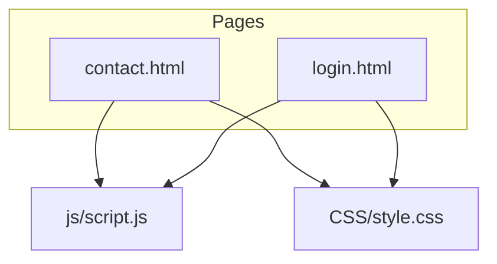
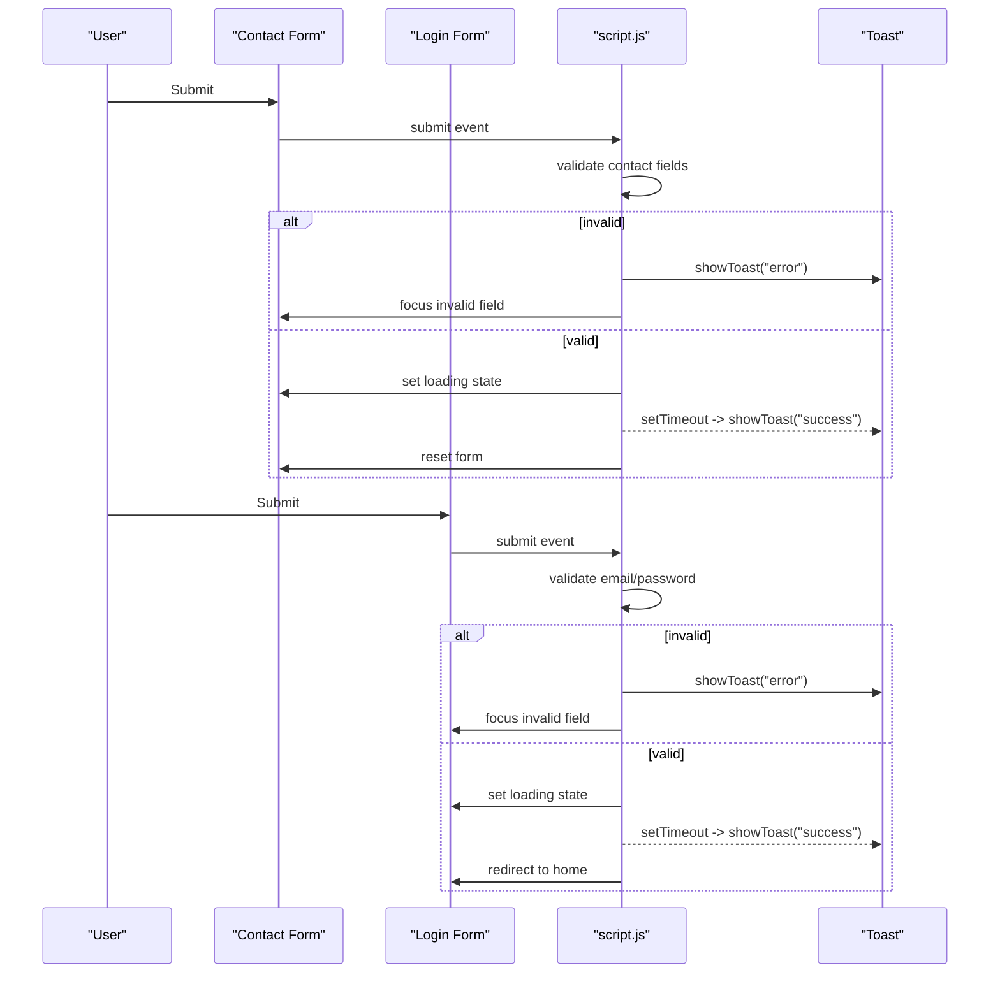
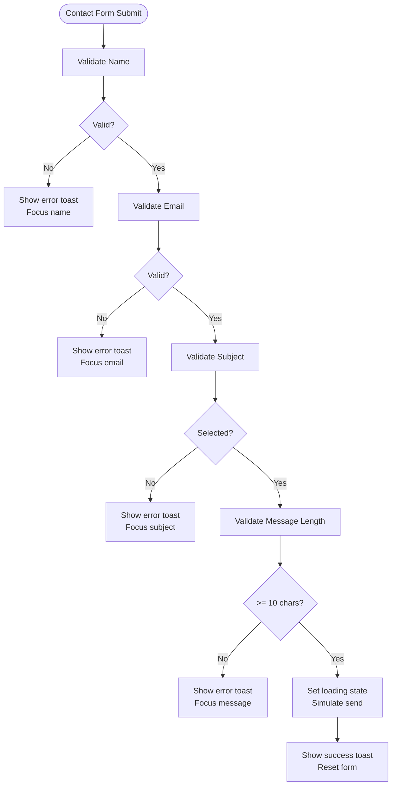
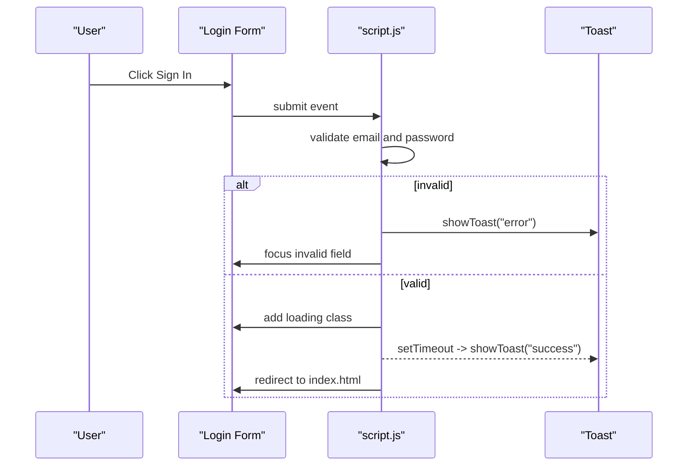
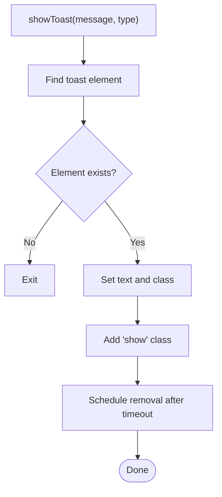
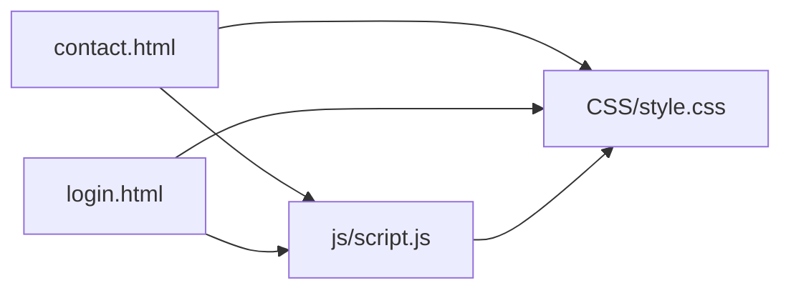

# Form Handling & Validation

<cite>
**Referenced Files in This Document**
- [contact.html](file://contact.html)
- [login.html](file://login.html)
- [script.js](file://js/script.js)
- [style.css](file://CSS/style.css)
</cite>

## Table of Contents
1. [Introduction](#introduction)
2. [Project Structure](#project-structure)
3. [Core Components](#core-components)
4. [Architecture Overview](#architecture-overview)
5. [Detailed Component Analysis](#detailed-component-analysis)
6. [Dependency Analysis](#dependency-analysis)
7. [Performance Considerations](#performance-considerations)
8. [Troubleshooting Guide](#troubleshooting-guide)
9. [Conclusion](#conclusion)

## Introduction
This document explains the form handling and validation system for the contact and login experiences. It covers:
- Contact form processing with subject categorization, input validation, and error messaging
- Login form functionality including email format validation, password requirements, and password visibility toggle
- A toast notification system that provides immediate feedback for submissions and validation errors
- Examples of JavaScript validation functions, error handling patterns, and simulated submission with loading states
- Accessibility features such as proper labeling, keyboard navigation support, and user feedback

## Project Structure
The forms are implemented across two pages and share a common script and stylesheet:
- Contact page defines the contact form structure and includes the shared script and styles
- Login page defines the login form structure and includes the shared script and styles
- The shared script handles all client-side validation, submission simulation, and toast notifications
- The shared stylesheet provides consistent styling for forms, inputs, buttons, and toasts

**Diagram sources**
- [contact.html:39-45](file://contact.html#L39-L45)
- [login.html:19-40](file://login.html#L19-L40)
- [script.js:21-66](file://js/script.js#L21-L66)
- [style.css:143-186](file://CSS/style.css#L143-L186)

**Section sources**
- [contact.html:39-45](file://contact.html#L39-L45)
- [login.html:19-40](file://login.html#L19-L40)
- [script.js:21-66](file://js/script.js#L21-L66)
- [style.css:143-186](file://CSS/style.css#L143-L186)

## Core Components
- Contact form: name, email, subject dropdown, message; validates presence and content; simulates sending with loading state; shows success toast and resets
- Login form: email and password fields; validates email format and password length; toggles password visibility; simulates sign-in with loading state; redirects on success
- Toast notification: reusable function to show success or error messages with auto-dismiss
- Shared UI behaviors: navbar scroll effect, mobile menu, scroll animations, module accordion

Key responsibilities:
- Validation logic is centralized in the shared script
- Visual feedback (loading states, toasts) is handled via DOM manipulation and CSS classes
- Accessibility relies on native HTML semantics and labels

**Section sources**
- [script.js:21-66](file://js/script.js#L21-L66)
- [style.css:143-186](file://CSS/style.css#L143-L186)

## Architecture Overview
The system follows a simple client-side pattern:
- Each form attaches a submit handler that prevents default submission
- Input values are validated using basic rules
- On invalid input, a toast error is shown and focus moves to the offending field
- On valid input, the submit button enters a loading state, then after a delay, a success toast is shown and the form is reset or redirected

**Diagram sources**
- [script.js:31-40](file://js/script.js#L31-L40)
- [script.js:52-66](file://js/script.js#L52-L66)
- [style.css:182-186](file://CSS/style.css#L182-L186)

## Detailed Component Analysis

### Contact Form Processing
- Fields: Full Name, Email Address, Subject (dropdown), Message
- Validation rules:
  - Name must be present and not blank
  - Email must contain an "@" symbol
  - Subject must be selected
  - Message must be at least 10 characters
- Submission behavior:
  - Prevents default submission
  - Shows loading state on submit button
  - After a delay, shows a success toast and resets the form
- Accessibility:
  - Labels are associated with inputs via for/id
  - Keyboard navigation works naturally with standard form controls
  - Errors are announced via toast messages

**Diagram sources**
- [script.js:52-66](file://js/script.js#L52-L66)
- [contact.html:39-45](file://contact.html#L39-L45)

**Section sources**
- [contact.html:39-45](file://contact.html#L39-L45)
- [script.js:52-66](file://js/script.js#L52-L66)

### Login Form Functionality
- Fields: Email Address, Password
- Validation rules:
  - Email must be present and include "@"
  - Password must be at least 6 characters
- Features:
  - Password visibility toggle button changes input type and icon
  - Social login buttons display informational toasts
- Submission behavior:
  - Prevents default submission
  - Shows loading state on submit button
  - After a delay, shows a success toast and redirects to the home page

**Diagram sources**
- [script.js:31-40](file://js/script.js#L31-L40)
- [script.js:43-45](file://js/script.js#L43-L45)
- [login.html:19-40](file://login.html#L19-L40)

**Section sources**
- [login.html:19-40](file://login.html#L19-L40)
- [script.js:31-40](file://js/script.js#L31-L40)
- [script.js:43-45](file://js/script.js#L43-L45)

### Toast Notification System
- Purpose: Provide immediate visual feedback for validation errors and successful actions
- Implementation:
  - A single toast element exists on each page
  - A shared function sets text and type, adds a show class, and auto-removes it after a timeout
- Styling:
  - Positioned fixed at top-right
  - Transitions slide in/out
  - Success and error variants use distinct colors

**Diagram sources**
- [script.js:21-28](file://js/script.js#L21-L28)
- [style.css:182-186](file://CSS/style.css#L182-L186)

**Section sources**
- [script.js:21-28](file://js/script.js#L21-L28)
- [style.css:182-186](file://CSS/style.css#L182-L186)

### Accessibility Features
- Proper labeling:
  - Each input has a corresponding label with matching for/id attributes
- Keyboard navigation:
  - Standard form controls are fully keyboard accessible
  - Focus management directs users to invalid fields on validation errors
- User announcements:
  - Toast messages provide clear, concise feedback for errors and successes
- Additional considerations:
  - Buttons have descriptive text
  - Toggle button uses aria-label to describe its action

**Section sources**
- [contact.html:39-45](file://contact.html#L39-L45)
- [login.html:19-40](file://login.html#L19-L40)
- [script.js:31-40](file://js/script.js#L31-L40)
- [script.js:52-66](file://js/script.js#L52-L66)

## Dependency Analysis
- Pages depend on the shared script for behavior and the shared stylesheet for appearance
- The script depends on specific DOM elements by id to attach listeners and manipulate state
- Styles define the look and transitions for forms, inputs, buttons, and toasts

**Diagram sources**
- [contact.html:98-99](file://contact.html#L98-L99)
- [login.html:56-57](file://login.html#L56-L57)
- [script.js:21-66](file://js/script.js#L21-L66)
- [style.css:143-186](file://CSS/style.css#L143-L186)

**Section sources**
- [contact.html:98-99](file://contact.html#L98-L99)
- [login.html:56-57](file://login.html#L56-L57)
- [script.js:21-66](file://js/script.js#L21-L66)
- [style.css:143-186](file://CSS/style.css#L143-L186)

## Performance Considerations
- Minimal DOM queries: Elements are cached once per page load within their respective handlers
- Lightweight validation: Simple checks avoid heavy computation
- Non-blocking UI: Loading states and toasts use CSS transitions and timeouts to keep interactions responsive
- No external dependencies: Reduces network overhead and improves load time

[No sources needed since this section provides general guidance]

## Troubleshooting Guide
- Forms do not validate:
  - Ensure the form IDs match those referenced in the script
  - Confirm the script file is loaded after the DOM elements exist
- Toast not appearing:
  - Verify the toast container exists on the page
  - Check that the show class is being added and removed correctly
- Password toggle not working:
  - Ensure the toggle button and password input IDs exist
  - Confirm the click listener is attached
- Redirect not happening after login:
  - Check that the success path is reached and no validation errors block it
  - Verify browser settings allow redirects

**Section sources**
- [script.js:21-28](file://js/script.js#L21-L28)
- [script.js:31-40](file://js/script.js#L31-L40)
- [script.js:43-45](file://js/script.js#L43-L45)
- [script.js:52-66](file://js/script.js#L52-L66)

## Conclusion
The form handling and validation system provides a consistent, accessible, and user-friendly experience across the contact and login flows. Validation is straightforward and effective, toasts deliver immediate feedback, and simulated submissions offer clear loading states. The design leverages native HTML semantics for accessibility and keeps performance lightweight by avoiding unnecessary complexity.

[No sources needed since this section summarizes without analyzing specific files]