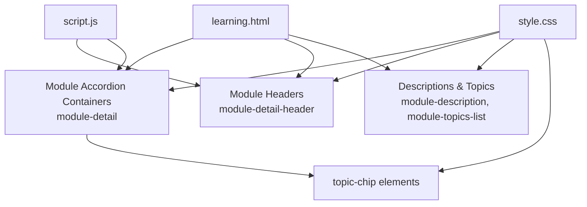
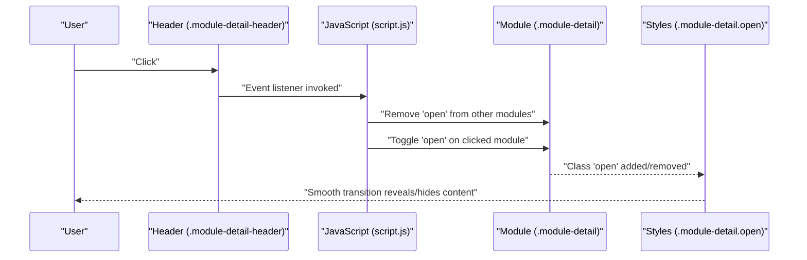
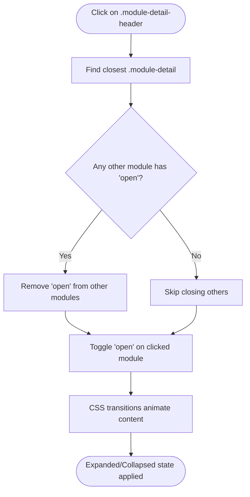
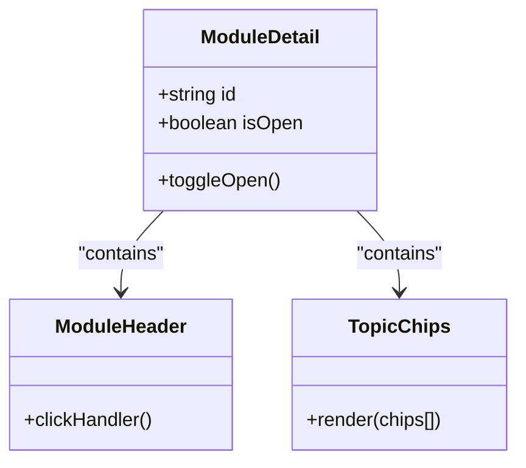
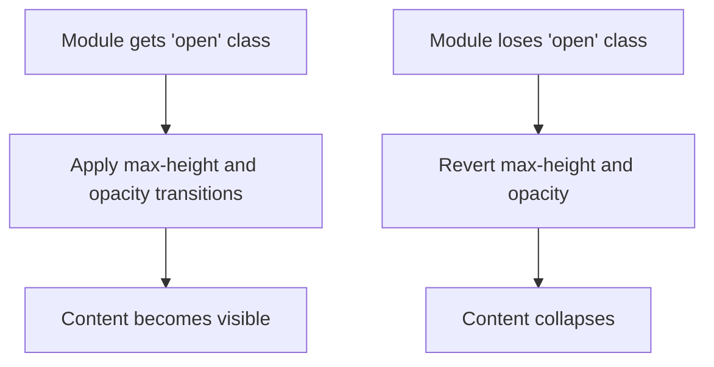
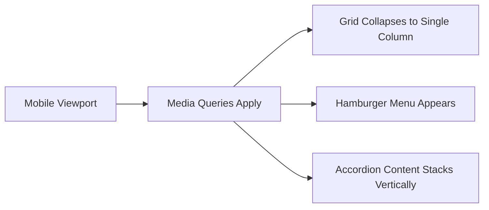
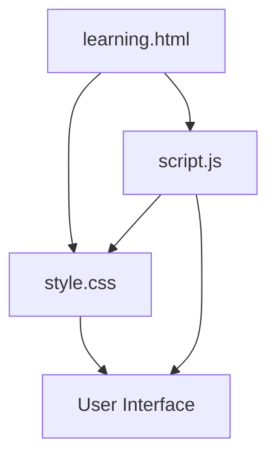

# Interactive Learning Modules

<cite>
**Referenced Files in This Document**
- [learning.html](file://learning.html)
- [script.js](file://js/script.js)
- [style.css](file://CSS/style.css)
</cite>

## Table of Contents
1. Introduction
2. Project Structure
3. Core Components
4. Architecture Overview
5. Detailed Component Analysis
6. Dependency Analysis
7. Performance Considerations
8. Troubleshooting Guide
9. Conclusion

## Introduction
This document explains the interactive learning modules feature on the Learning page. It focuses on the accordion-style module expansion system that allows users to expand and collapse training content sections, the topic chips that display key learning objectives within each module, and how JavaScript handles click events, active states, and smooth transitions. It also covers mobile responsiveness and accessibility considerations for keyboard navigation.

## Project Structure
The feature spans three primary files:
- HTML structure defines the accordion containers, headers, descriptions, and topic chips.
- JavaScript attaches event listeners to module headers to toggle expanded state and ensure only one module is open at a time.
- CSS styles define the visual layout, transitions, and responsive behavior for the accordion and topic chips.

**Diagram sources**
- [learning.html:34-96](file://learning.html#L34-L96)
- [script.js:68-75](file://js/script.js#L68-L75)
- [style.css:210-224](file://CSS/style.css#L210-L224)

**Section sources**
- [learning.html:34-96](file://learning.html#L34-L96)
- [script.js:68-75](file://js/script.js#L68-L75)
- [style.css:210-224](file://CSS/style.css#L210-L224)

## Core Components
- Module Accordion Container: Each module is wrapped in a container with class module-detail. The container holds the header, description, and topics list.
- Module Header: The clickable area (module-detail-header) triggers expansion/collapse.
- Description and Topics: Hidden by default and revealed when the module is open; they animate via CSS transitions.
- Topic Chips: Inline badges (topic-chip) inside each module that highlight key learning objectives.

Key behaviors:
- Clicking a module header toggles its open state.
- Opening one module closes any other currently open module.
- Smooth animations are applied to reveal/hide content using CSS transitions.

**Section sources**
- [learning.html:34-96](file://learning.html#L34-L96)
- [script.js:68-75](file://js/script.js#L68-L75)
- [style.css:210-224](file://CSS/style.css#L210-L224)

## Architecture Overview
The interaction follows a simple event-driven pattern:
- User clicks a module header.
- JavaScript finds the parent module container and toggles its open class.
- Before toggling, it removes the open class from any other open modules to maintain single-open behavior.
- CSS transitions animate the description and topics lists based on the open class.

**Diagram sources**
- [script.js:68-75](file://js/script.js#L68-L75)
- [style.css:210-224](file://CSS/style.css#L210-L224)

## Detailed Component Analysis

### Accordion Expansion System
- Event Handling: All module headers are selected and given a click listener. On click, the script identifies the closest module container and toggles its open state while ensuring only one module remains open at a time.
- Active State Management: The open class controls visibility and styling. When present, the module gains a highlighted border and shadow, and its inner content becomes visible.
- Transitions: The description and topics lists use max-height and opacity transitions to smoothly reveal or hide content.

**Diagram sources**
- [script.js:68-75](file://js/script.js#L68-L75)
- [style.css:210-224](file://CSS/style.css#L210-L224)

**Section sources**
- [script.js:68-75](file://js/script.js#L68-L75)
- [style.css:210-224](file://CSS/style.css#L210-L224)

### Topic Chips System
- Purpose: Each module includes a list of topic chips that summarize key learning objectives.
- Visuals: Chips are styled with subtle background color, rounded corners, and icons to improve scannability.
- Behavior: They appear alongside the module description when the module is expanded, animated via the same transition mechanism.

**Diagram sources**
- [learning.html:34-96](file://learning.html#L34-L96)
- [style.css:210-224](file://CSS/style.css#L210-L224)

**Section sources**
- [learning.html:34-96](file://learning.html#L34-L96)
- [style.css:210-224](file://CSS/style.css#L210-L224)

### CSS Transitions and Animations
- Transition Properties: The description and topics lists use max-height and opacity transitions to create smooth opening and closing effects.
- Open State Styling: When the module has the open class, borders and shadows update to indicate focus, and hidden content becomes visible.
- Consistency: A shared transition variable ensures consistent timing across the interface.

**Diagram sources**
- [style.css:210-224](file://CSS/style.css#L210-L224)

**Section sources**
- [style.css:210-224](file://CSS/style.css#L210-L224)

### Mobile Responsiveness
- Layout Adjustments: The page adapts to smaller screens through media queries that adjust grid layouts and typography.
- Navigation: A hamburger menu appears on smaller screens to manage navigation efficiently.
- Accordion Behavior: The accordion remains functional on mobile; content expands vertically without horizontal overflow.

[No sources needed since this diagram shows conceptual workflow, not actual code structure]

**Section sources**
- [style.css:227-246](file://CSS/style.css#L227-L246)
- [script.js:5-19](file://js/script.js#L5-L19)

### User Interaction Patterns
- Click-to-Expand: Users click a module header to expand details; clicking another header closes the previous one.
- Visual Feedback: Hover states and focus indicators help users understand interactive elements.
- Progressive Disclosure: Only essential information is shown initially; detailed content is revealed on demand.

**Section sources**
- [script.js:68-75](file://js/script.js#L68-L75)
- [style.css:210-224](file://CSS/style.css#L210-L224)

### Accessibility Considerations
- Keyboard Navigation: While headers are clickable divs, adding role="button" and tabindex="0" would enable keyboard activation via Enter or Space.
- Focus Management: Ensure focus moves logically into expanded content when a module opens.
- Screen Reader Support: Use aria-expanded on headers to communicate state changes to assistive technologies.
- Color Contrast: Ensure text and backgrounds meet contrast guidelines for readability.

[No sources needed since this section provides general guidance]

## Dependency Analysis
- HTML depends on CSS for styling and transitions.
- JavaScript depends on DOM structure classes defined in HTML to attach event listeners and toggle states.
- CSS relies on class names used by JavaScript to apply open-state styles.

**Diagram sources**
- [learning.html:34-96](file://learning.html#L34-L96)
- [script.js:68-75](file://js/script.js#L68-L75)
- [style.css:210-224](file://CSS/style.css#L210-L224)

**Section sources**
- [learning.html:34-96](file://learning.html#L34-L96)
- [script.js:68-75](file://js/script.js#L68-L75)
- [style.css:210-224](file://CSS/style.css#L210-L224)

## Performance Considerations
- Efficient Event Binding: Attaching listeners to all headers once on load avoids repeated setup overhead.
- Minimal DOM Manipulation: Toggling classes is lightweight compared to reflow-heavy operations.
- Transition Timing: Using CSS transitions keeps animations GPU-friendly and smooth.
- Intersection Observer: Scroll-based animations are throttled via observer thresholds to reduce unnecessary work.

[No sources needed since this section provides general guidance]

## Troubleshooting Guide
- Accordion Not Expanding:
  - Verify that module headers have the correct class and are within module-detail containers.
  - Ensure JavaScript runs after DOM loads and selectors match.
- Multiple Modules Open:
  - Confirm that the script removes the open class from other modules before toggling the clicked one.
- Transitions Not Visible:
  - Check that the open class is being applied and that CSS transitions target the correct properties (max-height, opacity).
- Mobile Issues:
  - Inspect media queries to ensure layout adjustments do not conflict with accordion behavior.

**Section sources**
- [script.js:68-75](file://js/script.js#L68-L75)
- [style.css:210-224](file://CSS/style.css#L210-L224)
- [style.css:227-246](file://CSS/style.css#L227-L246)

## Conclusion
The interactive learning modules provide an accessible, user-friendly way to explore training content. The accordion system uses straightforward JavaScript to manage state and CSS transitions for smooth animations. Topic chips enhance discoverability of key learning objectives. With careful attention to keyboard accessibility and mobile responsiveness, the feature delivers a robust learning experience across devices.