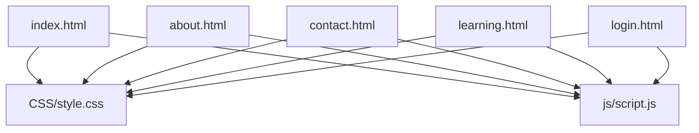
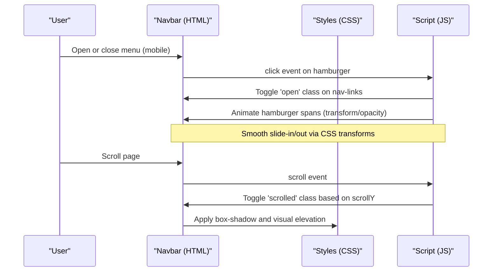
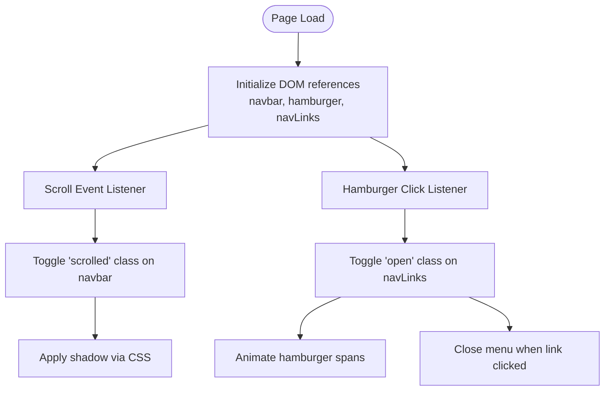

# Responsive Navigation System

<cite>
**Referenced Files in This Document**
- [index.html](file://index.html)
- [about.html](file://about.html)
- [contact.html](file://contact.html)
- [learning.html](file://learning.html)
- [login.html](file://login.html)
- [style.css](file://CSS/style.css)
- [script.js](file://js/script.js)
</cite>

## Table of Contents
1. [Introduction](#introduction)
2. [Project Structure](#project-structure)
3. [Core Components](#core-components)
4. [Architecture Overview](#architecture-overview)
5. [Detailed Component Analysis](#detailed-component-analysis)
6. [Dependency Analysis](#dependency-analysis)
7. [Performance Considerations](#performance-considerations)
8. [Troubleshooting Guide](#troubleshooting-guide)
9. [Conclusion](#conclusion)

## Introduction
This document explains the responsive navigation system used across all pages. It covers:
- Fixed navbar with scroll-based styling and backdrop blur
- Mobile hamburger menu with smooth open/close transitions
- Active link management per page
- JavaScript event handling for menu toggle and scroll detection
- Responsive breakpoint behavior
- CSS custom properties for consistent theming
- Accessibility considerations for screen readers and keyboard navigation

## Project Structure
The navigation is implemented consistently across multiple HTML pages, styled by a shared stylesheet, and enhanced by a single JavaScript file.

**Diagram sources**
- [index.html:10-25](file://index.html#L10-L25)
- [about.html:10-18](file://about.html#L10-L18)
- [contact.html:10-18](file://contact.html#L10-L18)
- [learning.html:10-18](file://learning.html#L10-L18)
- [login.html:1-60](file://login.html#L1-L60)
- [style.css:19-36](file://CSS/style.css#L19-L36)
- [script.js:1-19](file://js/script.js#L1-L19)

**Section sources**
- [index.html:10-25](file://index.html#L10-L25)
- [about.html:10-18](file://about.html#L10-L18)
- [contact.html:10-18](file://contact.html#L10-L18)
- [learning.html:10-18](file://learning.html#L10-L18)
- [login.html:10-18](file://login.html#L10-L18)
- [style.css:19-36](file://CSS/style.css#L19-L36)
- [script.js:1-19](file://js/script.js#L1-L19)

## Core Components
- Fixed navbar with backdrop blur and subtle border
- Scroll-aware state that adds a shadow when scrolled
- Hamburger icon with animated bars on mobile
- Slide-in mobile menu with smooth transform transition
- Per-page active link highlighting via static class assignment
- Shared CSS custom properties for colors, spacing, shadows, and transitions

Key behaviors:
- Navbar becomes “scrolled” after scrolling past a small threshold to add elevation
- On mobile, clicking the hamburger toggles an open class on the nav links container
- Clicking any link inside the mobile menu closes the menu automatically
- Each page sets the active link manually in markup to reflect current location

**Section sources**
- [style.css:20-36](file://CSS/style.css#L20-L36)
- [style.css:237-240](file://CSS/style.css#L237-L240)
- [script.js:1-19](file://js/script.js#L1-L19)
- [index.html:16-22](file://index.html#L16-L22)
- [about.html:13-15](file://about.html#L13-L15)
- [contact.html:13-15](file://contact.html#L13-L15)
- [learning.html:13-15](file://learning.html#L13-L15)

## Architecture Overview
The navigation system combines HTML structure, CSS styling, and minimal JavaScript to deliver a consistent experience across devices.

**Diagram sources**
- [script.js:1-19](file://js/script.js#L1-L19)
- [style.css:20-21](file://CSS/style.css#L20-L21)
- [style.css:237-240](file://CSS/style.css#L237-L240)

## Detailed Component Analysis

### Fixed Navbar with Backdrop Blur and Scroll Styling
- The navbar is fixed at the top with a translucent background and backdrop blur for a modern frosted-glass effect.
- A thin border separates it from content.
- When the user scrolls beyond a small threshold, a shadow is applied to elevate the navbar visually.

Implementation highlights:
- Fixed positioning and backdrop blur are defined in styles
- Scroll listener toggles a class to apply elevation
- Transition ensures smooth visual changes

**Section sources**
- [style.css:20-21](file://CSS/style.css#L20-L21)
- [script.js:1-3](file://js/script.js#L1-L3)

### Mobile Hamburger Menu with Smooth Transitions
- On screens below the mobile breakpoint, the navigation collapses into a hamburger button.
- Toggling the hamburger opens a full-width menu that slides down smoothly using transform transitions.
- The three bars animate into an “X” shape when open and revert when closed.

Behavior details:
- Hamburger click toggles an open class on the nav links container
- Hamburger spans are animated with transforms and opacity changes
- Closing the menu occurs automatically when a link is clicked inside the open menu

**Section sources**
- [style.css:237-240](file://CSS/style.css#L237-L240)
- [style.css:35-36](file://CSS/style.css#L35-L36)
- [script.js:5-19](file://js/script.js#L5-L19)

### Active Page Tracking via Static Class Management
- Each page marks its current link with an active class directly in the markup.
- Styles highlight the active link with color and underline animation.
- This approach is simple, reliable, and does not require runtime detection logic.

Where to find it:
- Home page sets the Home link as active
- About page sets the About link as active
- Learning page sets the Learning link as active
- Contact page sets the Contact link as active

**Section sources**
- [index.html:16-22](file://index.html#L16-L22)
- [about.html:13-15](file://about.html#L13-L15)
- [learning.html:13-15](file://learning.html#L13-L15)
- [contact.html:13-15](file://contact.html#L13-L15)
- [style.css:28-31](file://CSS/style.css#L28-L31)

### JavaScript Event Handling Examples
- Menu toggle:
  - Listens for clicks on the hamburger
  - Toggles the open class on the nav links container
  - Animates the hamburger bars into an X and back
  - Closes the menu when any link inside is clicked
- Scroll detection:
  - Adds/removes a scrolled class on the navbar based on window scroll position
  - Uses a small threshold to avoid flicker near the top

Note: These behaviors are centralized in one script file and reused by all pages.

**Section sources**
- [script.js:1-19](file://js/script.js#L1-L19)

### Responsive Breakpoint Behavior
- At desktop widths, the navigation displays horizontally with visible links.
- At mobile widths:
  - Links are hidden and positioned off-screen
  - Hamburger appears
  - Opening the menu slides the links into view with a smooth transform transition
  - A bottom border and shadow provide clear separation

Breakpoints and effects:
- Mobile breakpoint triggers layout shift and visibility changes
- Transform-based transitions ensure performance-friendly animations

**Section sources**
- [style.css:237-240](file://CSS/style.css#L237-L240)

### CSS Custom Properties for Consistent Theming
- Centralized theme variables define primary colors, accents, backgrounds, text colors, borders, radii, shadows, and transitions.
- Using these variables ensures consistent appearance across components and simplifies future theme updates.

Examples include:
- Primary palette and dark/light variants
- Surface and background colors
- Border and shadow tokens
- Transition timing function and duration

**Section sources**
- [style.css:3-13](file://CSS/style.css#L3-L13)

### Accessibility Considerations
Current implementation notes:
- Semantic HTML elements are used for navigation structure (nav, ul, li, a).
- Keyboard focus styles rely on default browser focus indicators; no custom focus rings are defined for navigation links.
- No explicit ARIA attributes are set on the hamburger or menu container.
- Screen reader context is provided by semantic tags but could be enhanced with aria-expanded and aria-controls for improved assistive technology support.

Recommendations for improvement:
- Add aria-expanded to the hamburger to indicate menu state
- Add aria-controls pointing to the nav links container
- Ensure visible focus indicators for keyboard users
- Consider adding role="button" if needed for non-button interactive elements

[No sources needed since this section provides general guidance]

## Dependency Analysis
The navigation’s behavior depends on coordinated interactions between HTML structure, CSS classes, and JavaScript events.

**Diagram sources**
- [script.js:1-19](file://js/script.js#L1-L19)
- [style.css:20-21](file://CSS/style.css#L20-L21)
- [style.css:237-240](file://CSS/style.css#L237-L240)

**Section sources**
- [script.js:1-19](file://js/script.js#L1-L19)
- [style.css:20-21](file://CSS/style.css#L20-L21)
- [style.css:237-240](file://CSS/style.css#L237-L240)

## Performance Considerations
- Use of transform and opacity for animations leverages GPU acceleration for smoother transitions.
- Minimal JavaScript keeps event overhead low.
- Avoid heavy computations in scroll handlers; current implementation only toggles classes.
- Consider debouncing scroll events if additional logic is added later to reduce frequent recalculations.

[No sources needed since this section provides general guidance]

## Troubleshooting Guide
Common issues and resolutions:
- Hamburger not appearing on mobile:
  - Verify viewport meta tag is present
  - Confirm media query breakpoint and that .hamburger display is set to flex at mobile width
- Menu not opening/closing:
  - Check that IDs for hamburger and nav links match those referenced in JavaScript
  - Ensure no other script removes or overrides the open class
- Navbar shadow not applying on scroll:
  - Confirm the scroll listener is attached and the scrolled class is toggled correctly
  - Validate that the .scrolled style exists and applies the intended shadow
- Active link not highlighted:
  - Ensure the correct page has the active class on the corresponding link
  - Verify CSS rules for .active are not overridden elsewhere

**Section sources**
- [style.css:237-240](file://CSS/style.css#L237-L240)
- [style.css:20-21](file://CSS/style.css#L20-L21)
- [style.css:28-31](file://CSS/style.css#L28-L31)
- [script.js:1-19](file://js/script.js#L1-L19)

## Conclusion
The navigation system delivers a clean, accessible, and performant experience across devices. It uses a fixed navbar with backdrop blur, scroll-aware elevation, and a mobile-first hamburger menu with smooth transitions. Active states are managed statically per page, keeping the codebase simple and maintainable. With minor enhancements to accessibility attributes and focus styles, the navigation can meet advanced accessibility requirements while preserving its simplicity and performance.