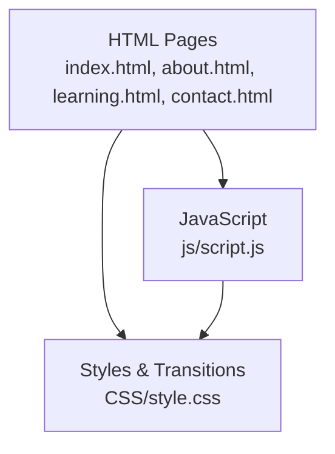
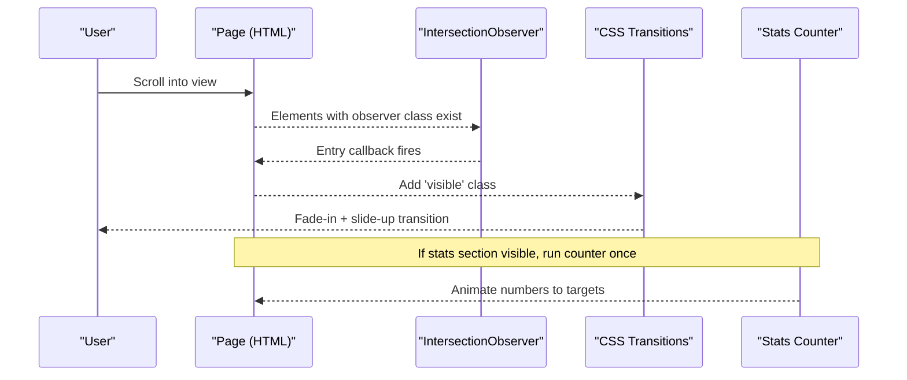
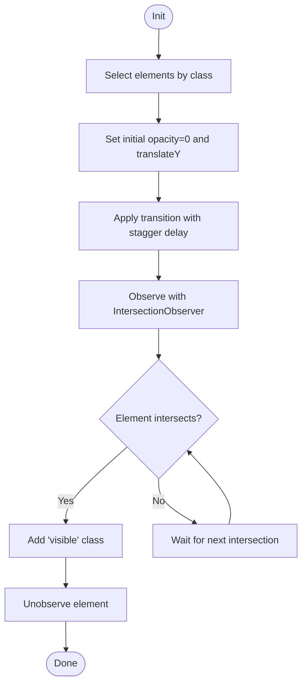
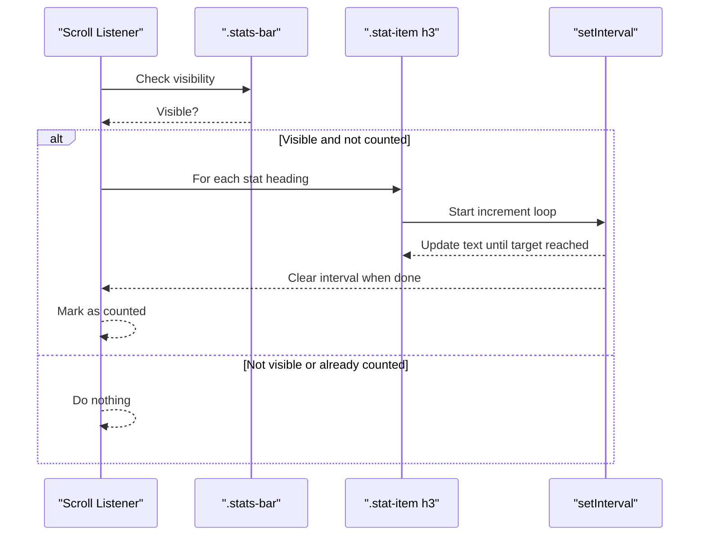
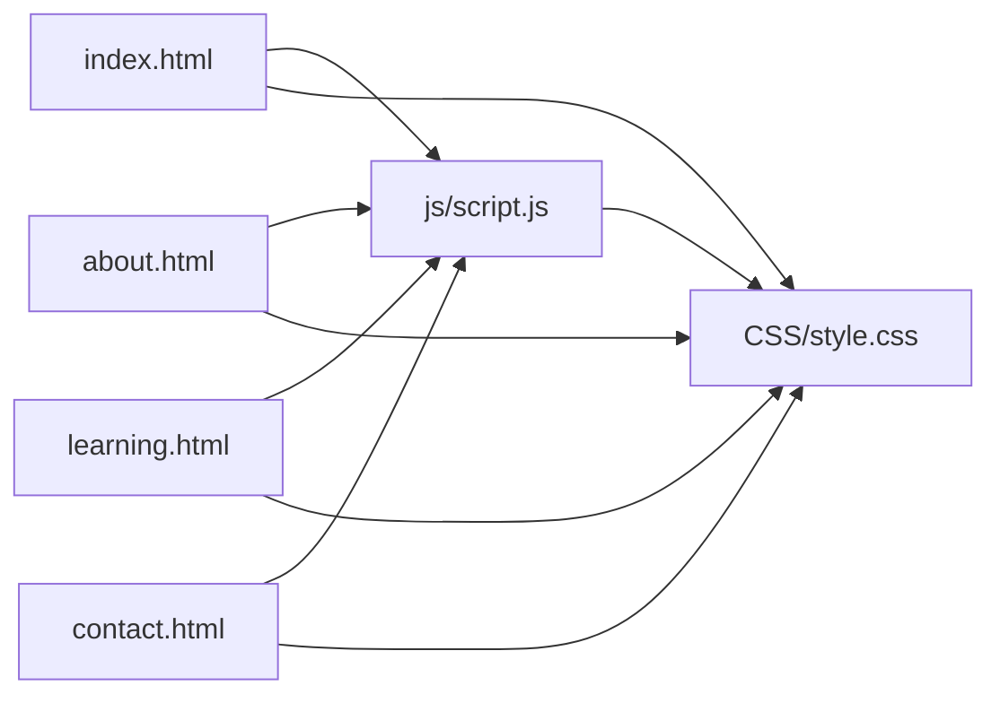

# Scroll Animations & Interactions

<cite>
**Referenced Files in This Document**
- [script.js](file://js/script.js)
- [style.css](file://CSS/style.css)
- [index.html](file://index.html)
- [about.html](file://about.html)
- [learning.html](file://learning.html)
- [contact.html](file://contact.html)
</cite>

## Table of Contents
1. Introduction
2. Project Structure
3. Core Components
4. Architecture Overview
5. Detailed Component Analysis
6. Dependency Analysis
7. Performance Considerations
8. Troubleshooting Guide
9. Conclusion
10. Appendices

## Introduction
This document explains the scroll-triggered animations and interactive behaviors implemented across the site. It focuses on:
- Intersection Observer–based fade-in animations for elements entering the viewport
- A statistics counter that animates numbers when the stats section becomes visible
- Smooth scrolling behavior via CSS
- Staggered transitions for visual appeal
- How to add new animated elements safely and efficiently

The goal is to enhance user experience while maintaining performance by leveraging modern browser APIs and lightweight CSS transitions.

## Project Structure
The animation system spans three primary files:
- JavaScript logic for observers, counters, and interactions lives in js/script.js
- Visual styles and transitions live in CSS/style.css
- HTML pages include elements with specific classes to enable animations

**Diagram sources**
- [script.js:77-86](file://js/script.js#L77-L86)
- [style.css:14-14](file://CSS/style.css#L14-L14)
- [index.html:49-56](file://index.html#L49-L56)

**Section sources**
- [script.js:1-105](file://js/script.js#L1-L105)
- [style.css:1-247](file://CSS/style.css#L1-L247)
- [index.html:1-106](file://index.html#L1-L106)
- [about.html:1-123](file://about.html#L1-L123)
- [learning.html:1-137](file://learning.html#L1-L137)
- [contact.html:1-102](file://contact.html#L1-L102)

## Core Components
- Scroll-triggered fade-in animations using Intersection Observer
- Stats counter animation triggered when the stats bar enters the viewport
- Smooth scrolling via CSS
- Staggered transition delays based on element order for visual rhythm

Key implementation highlights:
- Elements with a specific class are pre-styled to be invisible and slightly offset
- When they enter the viewport, a class is added to trigger a smooth transition into view
- The stats counter runs once per page load, counting up from zero to the target number embedded in each stat heading

**Section sources**
- [script.js:77-105](file://js/script.js#L77-L105)
- [style.css:14-14](file://CSS/style.css#L14-L14)
- [index.html:49-56](file://index.html#L49-L56)

## Architecture Overview
The animation system follows a simple, decoupled pattern:
- HTML provides semantic structure and marks elements for animation
- CSS defines base states and transitions
- JavaScript observes visibility and toggles classes or runs counters

**Diagram sources**
- [script.js:77-86](file://js/script.js#L77-L86)
- [script.js:88-105](file://js/script.js#L88-L105)
- [style.css:14-14](file://CSS/style.css#L14-L14)

## Detailed Component Analysis

### Intersection Observer Fade-In Animation
- Purpose: Reveal elements with a subtle fade and upward movement as they enter the viewport
- Mechanism:
  - Elements are selected by a common class
  - Each element is initialized with opacity 0 and a slight downward translation
  - A transition is applied with a small stagger delay based on element index
  - An IntersectionObserver watches these elements; when intersecting, it adds a class that sets opacity to 1 and resets transform
  - After observing, the element is unobserved to avoid repeated work

**Diagram sources**
- [script.js:77-86](file://js/script.js#L77-L86)

**Section sources**
- [script.js:77-86](file://js/script.js#L77-L86)
- [style.css:14-14](file://CSS/style.css#L14-L14)

### Statistics Counter Animation
- Purpose: Animate numeric values in the stats section to their target numbers when visible
- Mechanism:
  - A scroll listener checks if the stats bar is within the viewport
  - On first entry, each stat heading’s text is parsed to extract the numeric target and any suffix
  - A timer increments a running value toward the target at a fixed interval
  - Once complete, the loop clears and the final value is set
  - A flag ensures the animation runs only once per page load

**Diagram sources**
- [script.js:88-105](file://js/script.js#L88-L105)
- [index.html:49-56](file://index.html#L49-L56)

**Section sources**
- [script.js:88-105](file://js/script.js#L88-L105)
- [index.html:49-56](file://index.html#L49-L56)

### Smooth Scrolling Behavior
- Implemented via CSS to ensure native smooth scrolling for anchor links across the site
- No JavaScript required; improves compatibility and reduces overhead

**Section sources**
- [style.css:14-14](file://CSS/style.css#L14-L14)

### Staggered Transitions for Visual Appeal
- Staggering is achieved by applying incremental transition delays based on the element’s index within the observed set
- This creates a cascading reveal effect without complex layout changes

**Section sources**
- [script.js:81-84](file://js/script.js#L81-L84)

## Dependency Analysis
- HTML pages depend on:
  - CSS for base styles and transitions
  - JavaScript for observer setup and counter logic
- JavaScript depends on:
  - DOM elements with specific classes
  - Browser APIs: IntersectionObserver, getBoundingClientRect, setInterval
- CSS depends on:
  - Variables for consistent timing and colors
  - Native smooth scrolling support

**Diagram sources**
- [script.js:77-105](file://js/script.js#L77-L105)
- [style.css:1-247](file://CSS/style.css#L1-L247)
- [index.html:1-106](file://index.html#L1-L106)
- [about.html:1-123](file://about.html#L1-L123)
- [learning.html:1-137](file://learning.html#L1-L137)
- [contact.html:1-102](file://contact.html#L1-L102)

**Section sources**
- [script.js:77-105](file://js/script.js#L77-L105)
- [style.css:1-247](file://CSS/style.css#L1-L247)
- [index.html:1-106](file://index.html#L1-L106)
- [about.html:1-123](file://about.html#L1-L123)
- [learning.html:1-137](file://learning.html#L1-L137)
- [contact.html:1-102](file://contact.html#L1-L102)

## Performance Considerations
- IntersectionObserver is used instead of scroll-based measurements for most animations, reducing main-thread work
- Elements are unobserved after becoming visible to prevent redundant callbacks
- CSS transitions handle visual changes off the main thread where possible
- Stats counter uses a single flag to ensure one-time execution per page load
- Stagger delays are computed inline to avoid extra layout thrashing
- Smooth scrolling is handled natively by CSS, avoiding JavaScript scroll jank

[No sources needed since this section provides general guidance]

## Troubleshooting Guide
Common issues and resolutions:
- Animations do not trigger:
  - Ensure elements have the correct class used by the observer
  - Verify the script is loaded after the DOM is ready
  - Confirm the page includes the stylesheet that defines the transition and visible state
- Stats counter does not animate:
  - Ensure the stats section exists and contains headings with numeric content
  - Check that the script has access to the stats container and headings
  - Validate that the page loads the script before the scroll listener is attached
- Smooth scrolling not working:
  - Confirm the CSS rule enabling smooth scrolling is present and not overridden
  - Test anchor links to verify behavior across browsers

**Section sources**
- [script.js:77-105](file://js/script.js#L77-L105)
- [style.css:14-14](file://CSS/style.css#L14-L14)
- [index.html:49-56](file://index.html#L49-L56)

## Conclusion
The site implements a lightweight, performant animation system:
- IntersectionObserver triggers fade-in effects as elements enter the viewport
- A stats counter animates numbers once the stats section is visible
- CSS smooth scrolling enhances navigation UX
- Staggered transitions improve perceived motion quality
These techniques deliver engaging interactions while keeping performance high and code maintainable.

[No sources needed since this section summarizes without analyzing specific files]

## Appendices

### How to Add New Animated Elements
Steps to integrate new elements with the existing animation system:
- Add the appropriate class to the element you want to animate
- Place the element anywhere in the DOM; the observer will automatically detect it
- Optionally adjust styling if you need different initial states or durations
- For stats, wrap your number in the expected heading element inside the stats container

Examples of usage across pages:
- Module cards and beneficiary cards use the animation class
- Stats headings contain numeric values that the counter animates

**Section sources**
- [index.html:66-72](file://index.html#L66-L72)
- [index.html:84-91](file://index.html#L84-L91)
- [index.html:49-56](file://index.html#L49-L56)
- [about.html:29-39](file://about.html#L29-L39)
- [about.html:50-56](file://about.html#L50-L56)
- [about.html:67-76](file://about.html#L67-L76)
- [about.html:87-92](file://about.html#L87-L92)
- [about.html:103-108](file://about.html#L103-L108)
- [learning.html:107-114](file://learning.html#L107-L114)
- [contact.html:29-36](file://contact.html#L29-L36)
- [contact.html:54-63](file://contact.html#L54-L63)
- [contact.html:70-75](file://contact.html#L70-L75)