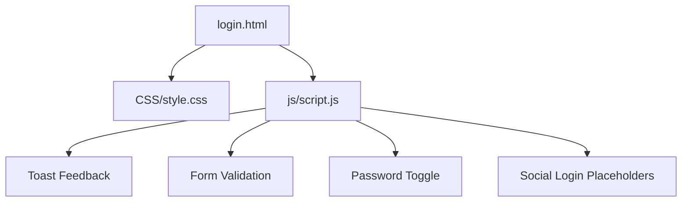
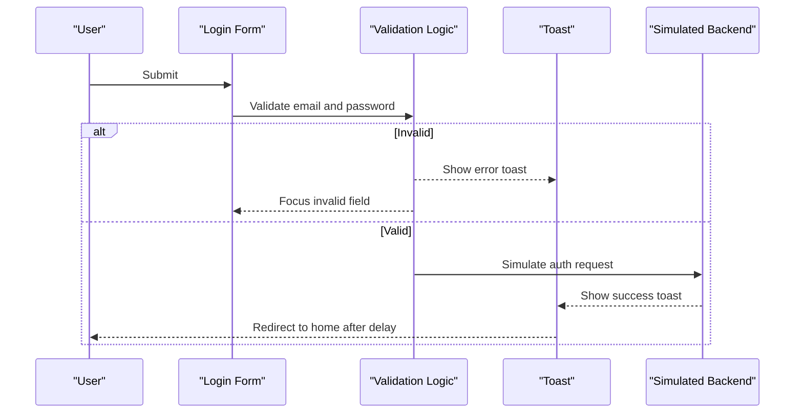
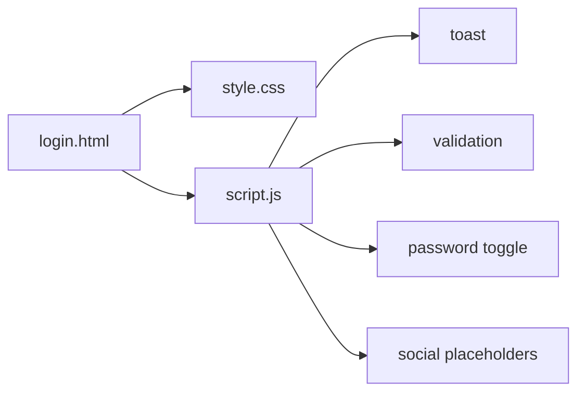

# User Authentication Interface

<cite>
**Referenced Files in This Document**
- [login.html](file://login.html)
- [style.css](file://CSS/style.css)
- [script.js](file://js/script.js)
</cite>

## Table of Contents
1. [Introduction](#introduction)
2. [Project Structure](#project-structure)
3. [Core Components](#core-components)
4. [Architecture Overview](#architecture-overview)
5. [Detailed Component Analysis](#detailed-component-analysis)
6. [Dependency Analysis](#dependency-analysis)
7. [Performance Considerations](#performance-considerations)
8. [Troubleshooting Guide](#troubleshooting-guide)
9. [Conclusion](#conclusion)
10. [Appendices](#appendices)

## Introduction
This document describes the user authentication interface for the login page, focusing on the form design with email and password fields, validation rules, user feedback, password visibility toggle, social login placeholders, styling, JavaScript logic, security considerations, error handling, accessibility, and preparation for backend integration.

## Project Structure
The authentication interface is implemented across three primary files:
- HTML structure for the login form and UI elements
- CSS styles for branding, layout, and responsive behavior
- JavaScript for validation, user feedback, and interaction behaviors

**Diagram sources**
- [login.html:1-60](file://login.html#L1-L60)
- [style.css:153-186](file://CSS/style.css#L153-L186)
- [script.js:21-50](file://js/script.js#L21-L50)

**Section sources**
- [login.html:1-60](file://login.html#L1-L60)
- [style.css:1-247](file://CSS/style.css#L1-L247)
- [script.js:1-105](file://js/script.js#L1-L105)

## Core Components
- Login form with email and password inputs
- Password visibility toggle button
- Social login buttons (Google and GitHub placeholders)
- Toast notifications for user feedback
- Form options: Remember me checkbox and Forgot password link
- Back to Home navigation link

Key responsibilities:
- Validate input before submission
- Provide immediate, accessible feedback via toast messages
- Support keyboard navigation and screen readers
- Prepare for future backend authentication integration

**Section sources**
- [login.html:19-52](file://login.html#L19-L52)
- [style.css:153-186](file://CSS/style.css#L153-L186)
- [script.js:21-50](file://js/script.js#L21-L50)

## Architecture Overview
The login flow is client-side only at this stage:
- The form prevents default submission and validates inputs
- On success, it simulates a network delay and shows a success toast
- On failure, it focuses the relevant field and shows an error toast
- Social buttons show placeholder messages until OAuth is integrated

**Diagram sources**
- [script.js:31-50](file://js/script.js#L31-L50)
- [script.js:21-28](file://js/script.js#L21-L28)

## Detailed Component Analysis

### Login Form Structure and Accessibility
- Semantic form with labeled inputs using for/id associations
- Required attributes to enforce browser-level validation hints
- Accessible labels for screen readers and keyboard users
- Clear visual hierarchy and focus states

Implementation highlights:
- Email input with type="email" and required attribute
- Password input with type="password" and required attribute
- Labels explicitly associated with inputs
- Keyboard-friendly controls and visible focus indicators

**Section sources**
- [login.html:19-40](file://login.html#L19-L40)
- [style.css:143-151](file://CSS/style.css#L143-L151)

### Form Validation Rules
- Email must be present and contain "@"
- Password must be present and at least 6 characters long
- On validation failure, an error toast is shown and focus moves to the offending field
- On success, the submit button enters a loading state and redirects after a simulated delay

Behavioral notes:
- Prevents default form submission to handle validation in JavaScript
- Uses a toast system for consistent user feedback
- Provides clear, actionable error messages

**Section sources**
- [script.js:31-41](file://js/script.js#L31-L41)
- [script.js:21-28](file://js/script.js#L21-L28)

### Password Visibility Toggle
- Button toggles between showing and hiding the password
- Updates the input type between text and password
- Changes icon to reflect current state
- Operates via click events and maintains accessibility through aria-label

Accessibility considerations:
- aria-label provides context for assistive technologies
- Keyboard operable button with clear visual feedback

**Section sources**
- [login.html:27-34](file://login.html#L27-L34)
- [script.js:43-46](file://js/script.js#L43-L46)
- [style.css:177-178](file://CSS/style.css#L177-L178)

### Social Login Placeholders
- Google and GitHub buttons are present as placeholders
- Clicking them displays a toast indicating the feature is coming soon
- Ready for future OAuth integration by wiring these handlers to provider SDKs

Integration readiness:
- Buttons have unique IDs for event binding
- Placeholder behavior demonstrates expected UX before real implementation

**Section sources**
- [login.html:41-51](file://login.html#L41-L51)
- [script.js:47-50](file://js/script.js#L47-L50)

### User Feedback Mechanisms
- Toast notifications provide concise, time-limited feedback
- Success and error states use distinct colors
- Auto-dismiss after a short duration
- Positioned to avoid obstructing content

Design details:
- Slide-in animation for visibility
- Consistent typography and spacing aligned with brand

**Section sources**
- [script.js:21-28](file://js/script.js#L21-L28)
- [style.css:182-186](file://CSS/style.css#L182-L186)

### Styling and Branding
- CSS variables define brand colors, shadows, and transitions
- Login card centered with subtle background gradient
- Input wrappers include icons for improved clarity
- Responsive adjustments ensure usability on smaller screens

Branding elements:
- Primary color used for actions and highlights
- Consistent border radius and shadow tokens
- Hover and focus states enhance interactivity

**Section sources**
- [style.css:1-13](file://CSS/style.css#L1-L13)
- [style.css:153-186](file://CSS/style.css#L153-L186)
- [style.css:226-247](file://CSS/style.css#L226-L247)

### Security Considerations (Frontend)
- Inputs use appropriate types (email, password) to leverage browser protections
- No sensitive data is logged or stored in localStorage/sessionStorage on the frontend
- Client-side validation reduces unnecessary requests but does not replace server-side validation
- Password visibility toggle uses native input type switching without exposing credentials

Preparation for secure backend integration:
- Form is structured to send credentials over HTTPS
- Avoid storing secrets in client code
- Plan CSRF protection and secure token handling on the backend

**Section sources**
- [login.html:19-40](file://login.html#L19-L40)
- [script.js:31-41](file://js/script.js#L31-L41)

### Error Handling Patterns
- Immediate validation feedback via toast messages
- Focus management ensures users can correct errors quickly
- Loading state prevents duplicate submissions during simulated processing

Patterns to extend:
- Network error handling when integrating with backend APIs
- Retry mechanisms and user guidance for transient failures

**Section sources**
- [script.js:31-41](file://js/script.js#L31-L41)
- [script.js:21-28](file://js/script.js#L21-L28)

### Backend Integration Readiness
- Form has a standard structure suitable for JSON payloads
- Event listeners are in place to intercept submission and add headers if needed
- Social buttons are ready to integrate OAuth flows by replacing placeholder handlers

Next steps:
- Replace simulated delay with actual API calls
- Implement CSRF tokens and secure session management
- Add proper error responses from the server and map them to user-friendly messages

**Section sources**
- [login.html:19-40](file://login.html#L19-L40)
- [script.js:31-41](file://js/script.js#L31-L41)

## Dependency Analysis
The login page depends on shared CSS and JS modules:
- Styles define layout, branding, and responsive behavior
- Script handles interactions, validation, and feedback
- HTML wires components together with semantic markup and accessibility attributes

**Diagram sources**
- [login.html:1-60](file://login.html#L1-L60)
- [style.css:153-186](file://CSS/style.css#L153-L186)
- [script.js:21-50](file://js/script.js#L21-L50)

**Section sources**
- [login.html:1-60](file://login.html#L1-L60)
- [style.css:153-186](file://CSS/style.css#L153-L186)
- [script.js:21-50](file://js/script.js#L21-L50)

## Performance Considerations
- Minimal DOM manipulation; event listeners are attached once
- Toast animations use CSS transitions for smooth performance
- No heavy libraries; lightweight vanilla JavaScript improves load time
- Responsive CSS avoids reflows on small screens

[No sources needed since this section provides general guidance]

## Troubleshooting Guide
Common issues and resolutions:
- Email validation fails: Ensure the input contains "@" and is not empty
- Password too short: Enter at least 6 characters
- Toast not appearing: Verify the toast element exists and script is loaded
- Password toggle not working: Confirm the toggle button and password input IDs match
- Social buttons do nothing: They currently show placeholder messages; implement OAuth handlers later

Debugging tips:
- Check console for JavaScript errors
- Inspect element to verify class names and IDs
- Test keyboard navigation and screen reader announcements

**Section sources**
- [script.js:21-50](file://js/script.js#L21-L50)
- [login.html:19-52](file://login.html#L19-L52)

## Conclusion
The login interface provides a clean, accessible, and branded experience with robust client-side validation and user feedback. It is structured to support future backend authentication and OAuth integrations while maintaining strong security practices on the frontend.

[No sources needed since this section summarizes without analyzing specific files]

## Appendices

### Form Structure Reference
- Form ID and inputs:
  - Form: id="loginForm"
  - Email: id="email", name="email", type="email", required
  - Password: id="password", name="password", type="password", required
- Controls:
  - Password toggle: id="togglePassword"
  - Submit button: id="loginBtn"
  - Social buttons: id="googleBtn", id="githubBtn"

**Section sources**
- [login.html:19-52](file://login.html#L19-L52)

### Validation Rules Summary
- Email: required and must include "@"
- Password: required and minimum length 6
- Feedback: error toast on failure, success toast on successful simulated login

**Section sources**
- [script.js:31-41](file://js/script.js#L31-L41)

### Accessibility Checklist
- All inputs have associated labels
- Keyboard navigation supported
- Focus management on errors
- ARIA label on password toggle
- High contrast and visible focus states

**Section sources**
- [login.html:19-40](file://login.html#L19-L40)
- [style.css:143-151](file://CSS/style.css#L143-L151)
- [script.js:43-46](file://js/script.js#L43-L46)