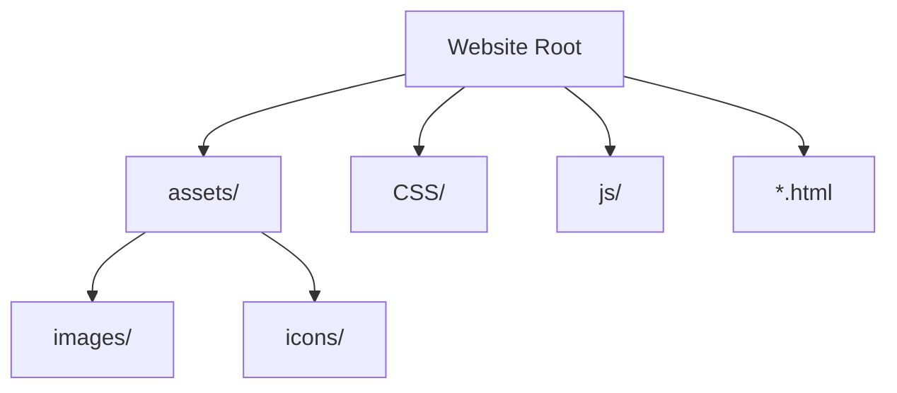
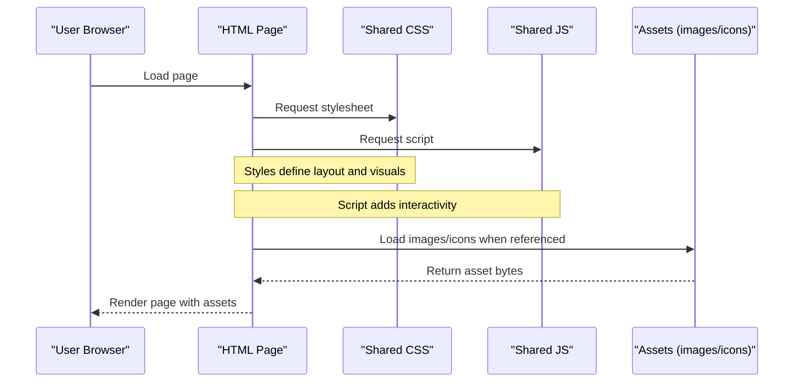
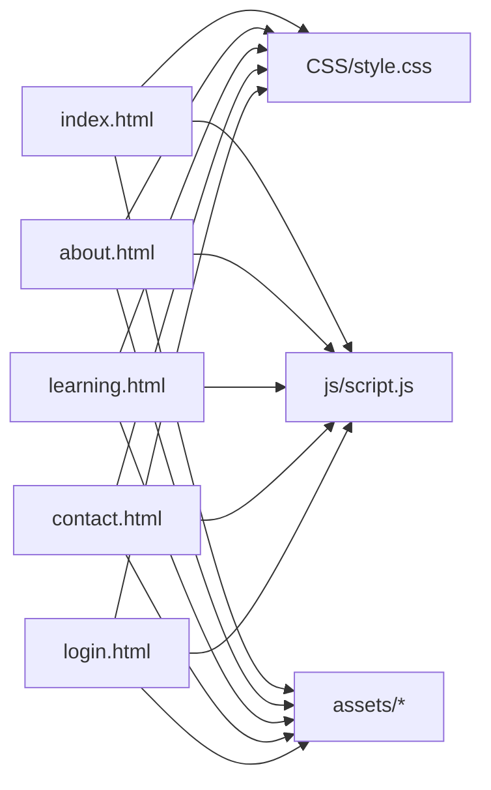

# Asset Management

<cite>
**Referenced Files in This Document**
- [index.html](file://index.html)
- [about.html](file://about.html)
- [learning.html](file://learning.html)
- [contact.html](file://contact.html)
- [login.html](file://login.html)
- [style.css](file://CSS/style.css)
- [script.js](file://js/script.js)
</cite>

## Table of Contents
1. [Introduction](#introduction)
2. [Project Structure](#project-structure)
3. [Core Components](#core-components)
4. [Architecture Overview](#architecture-overview)
5. [Detailed Component Analysis](#detailed-component-analysis)
6. [Dependency Analysis](#dependency-analysis)
7. [Performance Considerations](#performance-considerations)
8. [Troubleshooting Guide](#troubleshooting-guide)
9. [Conclusion](#conclusion)
10. [Appendices](#appendices)

## Introduction
This document provides comprehensive guidance for managing website assets (images, icons, and multimedia) in the project. It explains the current asset folder structure, organization principles, and best practices for image optimization, file naming conventions, responsive images, lazy loading, galleries, and versioning. The goal is to help you add and manage visual content efficiently while maintaining fast load times and a great user experience.

## Project Structure
The project uses a simple, scalable asset layout under a single assets directory:
- assets/images: For photographs, illustrations, banners, and other raster/vector images.
- assets/icons: For reusable icons (SVGs or icon fonts).

Current state:
- Both directories exist but are empty.
- Visual elements on the site currently rely on CSS gradients, Unicode characters, and inline SVGs rather than external files.

[No sources needed since this diagram shows conceptual structure]

**Section sources**
- [index.html:1-106](file://index.html#L1-L106)
- [about.html:1-123](file://about.html#L1-L123)
- [learning.html:1-137](file://learning.html#L1-L137)
- [contact.html:1-102](file://contact.html#L1-L102)
- [login.html:1-60](file://login.html#L1-L60)

## Core Components
- HTML pages reference a shared stylesheet and script.
- Icons are primarily implemented via Unicode characters embedded directly in HTML.
- Some icons are inline SVGs within buttons.
- No external image or icon files are referenced yet; the assets folders are reserved for future use.

Key observations:
- Consistent navigation and footer across pages.
- Responsive design handled by CSS media queries.
- Interactions (navbar scroll, mobile menu, form validation, accordion, animations) are implemented in JavaScript.

**Section sources**
- [index.html:1-106](file://index.html#L1-L106)
- [style.css:1-247](file://CSS/style.css#L1-L247)
- [script.js:1-105](file://js/script.js#L1-L105)

## Architecture Overview
At runtime, each page loads the shared CSS and JS. Assets (images/icons) will be loaded on demand from the assets directory when referenced in HTML. The current architecture favors lightweight assets (Unicode and inline SVG) to minimize network requests and improve initial load performance.

[No sources needed since this diagram shows conceptual flow]

## Detailed Component Analysis

### Icon Strategy: Unicode vs SVG
- Unicode icons are used extensively for small, decorative icons (e.g., in navigation logo, cards, and contact details). They render instantly without network requests and scale with font size.
- Inline SVGs are used where precise control over shape and color is required (e.g., social login buttons).

Best practices:
- Prefer Unicode for simple, universally supported symbols to avoid extra HTTP requests.
- Use inline SVGs for complex or brand-specific icons that need precise styling or animation.
- Reserve external icon files in assets/icons only when an icon must be reused across many pages and cannot be effectively inlined or represented via Unicode.

Guidelines for adding new icons:
- If it’s a simple symbol, add the Unicode character directly in HTML near the relevant element.
- If it requires custom shapes or colors, create an inline SVG in the HTML or include a small reusable SVG sprite in assets/icons and reference it via <use>.
- Keep icon sizes consistent using CSS sizing and ensure adequate contrast.

**Section sources**
- [index.html:10-25](file://index.html#L10-L25)
- [index.html:38-45](file://index.html#L38-L45)
- [contact.html:28-36](file://contact.html#L28-L36)
- [login.html:20-34](file://login.html#L20-L34)
- [login.html:42-50](file://login.html#L42-L50)

### Image Usage and Optimization
Current usage:
- No external images are referenced yet; visuals are created with CSS gradients and Unicode glyphs.

Recommended approach when adding images:
- Store images in assets/images with clear subfolders (e.g., assets/images/banners, assets/images/modules, assets/images/people).
- Optimize images:
  - Use modern formats (WebP, AVIF) with fallbacks (JPEG/PNG) for broader compatibility.
  - Compress images with tools to reduce file size without visible quality loss.
  - Choose appropriate dimensions; serve smaller images for mobile and larger for desktop.
- Implement responsive images:
  - Use srcset and sizes attributes to deliver appropriately sized images based on viewport and device pixel ratio.
  - Provide multiple resolutions for key images (e.g., 1x, 2x).
- Lazy load offscreen images:
  - Add loading="lazy" to  tags below the fold to defer loading until near the viewport.
  - Combine with IntersectionObserver-based lazy loading for advanced scenarios.

Example patterns to adopt:
- Hero banner: Use a high-quality WebP with JPEG fallback, sized for desktop and mobile, with srcset.
- Module thumbnails: Use compressed images with lazy loading and aspect-ratio containers to prevent layout shifts.
- Avatars/profile photos: Use circular cropping via CSS and provide square source images.

**Section sources**
- [style.css:38-54](file://CSS/style.css#L38-L54)
- [style.css:198-202](file://CSS/style.css#L198-L202)

### Multimedia Resources
- Place videos and audio in assets/media (create this folder if needed).
- For video:
  - Use MP4 (H.264/AAC) as primary format; optionally add WebM (VP9) for better compression.
  - Provide poster images to show before playback starts.
  - Use preload="metadata" to avoid unnecessary data usage.
  - Consider lazy loading via IntersectionObserver to start fetching only when near viewport.
- For audio:
  - Use MP3 or AAC; consider streaming large audio files.
  - Provide transcripts for accessibility.

Accessibility considerations:
- Add descriptive alt text for images.
- Include captions and transcripts for multimedia.
- Ensure keyboard navigability and sufficient color contrast.

**Section sources**
- [style.css:226-247](file://CSS/style.css#L226-L247)

### File Naming Conventions
Adopt a consistent, searchable naming scheme:
- Lowercase with hyphens: hero-banner.webp, module-thumb-01.jpg
- Prefix by category: img-hero-*, svg-icon-*, vid-module-*
- Include version or date when necessary: logo-v2.png, campaign-2026Q1.jpg
- Avoid special characters and spaces; keep names concise but descriptive

Examples:
- assets/images/banners/hero-home.webp
- assets/images/modules/module-01-thumbnail.webp
- assets/icons/svg/icon-user.svg
- assets/media/video/onboarding.mp4

**Section sources**
- [index.html:1-106](file://index.html#L1-L106)
- [about.html:1-123](file://about.html#L1-L123)
- [learning.html:1-137](file://learning.html#L1-L137)
- [contact.html:1-102](file://contact.html#L1-L102)
- [login.html:1-60](file://login.html#L1-L60)

### Responsive Images Implementation
When adding images:
- Use srcset to specify multiple widths and let the browser choose the best fit.
- Use sizes to hint at the rendered width in different breakpoints.
- Provide a fallback for older browsers if needed.

Practical tips:
- Generate multiple sizes during build or pre-deployment.
- Use a CDN or caching headers to leverage browser cache for repeated assets.
- Monitor Lighthouse or WebPageTest to validate performance improvements.

[No sources needed since this section provides general guidance]

### Adding New Icons Using Unicode or SVG
- Unicode: Insert the desired Unicode code point directly into HTML where the icon appears. This is ideal for simple, widely supported symbols.
- SVG: For complex or branded icons, embed inline SVGs or store reusable SVGs in assets/icons and reference them via <use>.

Guidelines:
- Keep icon sizes consistent using CSS width/height or em units.
- Ensure proper color inheritance or explicit fill/stroke values.
- Test across devices and zoom levels for clarity.

**Section sources**
- [index.html:10-25](file://index.html#L10-L25)
- [login.html:42-50](file://login.html#L42-L50)

### Lazy Loading and Performance
- Native lazy loading: Add loading="lazy" to images and iframes below the fold.
- Advanced lazy loading: Use IntersectionObserver to trigger loading when elements enter the viewport.
- Preload critical assets: Use <link rel="preload"> for above-the-fold images or fonts.
- Defer non-critical scripts: Place scripts at the end or use defer/async appropriately.

Current behavior:
- The site already uses IntersectionObserver for scroll animations, which can be extended to lazy-load images and media.

**Section sources**
- [script.js:77-86](file://js/script.js#L77-L86)

### Creating Image Galleries
- Use semantic markup (<figure>, <figcaption>) for gallery items.
- Implement lightbox functionality with minimal JavaScript or a lightweight library.
- Apply lazy loading to all gallery images.
- Ensure keyboard navigation and screen reader support.

Implementation outline:
- Create a grid of thumbnails with loading="lazy".
- On click, open a modal overlay showing the full-size image.
- Support swipe gestures on touch devices and arrow keys for navigation.

[No sources needed since this section provides general guidance]

### Managing Asset Versions
- Cache busting: Append query strings or use hashed filenames (e.g., style.v2.css, app.a1b2c3.js) to force browsers to reload updated assets.
- Versioned URLs: Maintain a version prefix in paths (e.g., /v2/assets/images/...) for major updates.
- CDN strategy: Serve assets via a CDN with long cache lifetimes and immutable caching for versioned files.
- Rollback plan: Keep previous versions available temporarily during transitions.

[No sources needed since this section provides general guidance]

## Dependency Analysis
The pages depend on:
- Shared stylesheet (CSS/style.css) for layout and visuals.
- Shared script (js/script.js) for interactions and animations.
- Optional assets (images/icons) referenced from HTML when added.

**Section sources**
- [index.html:1-106](file://index.html#L1-L106)
- [about.html:1-123](file://about.html#L1-L123)
- [learning.html:1-137](file://learning.html#L1-L137)
- [contact.html:1-102](file://contact.html#L1-L102)
- [login.html:1-60](file://login.html#L1-L60)

## Performance Considerations
- Prefer Unicode and inline SVGs for small icons to eliminate network overhead.
- Optimize images (compression, modern formats) and use responsive images to reduce payload.
- Lazy load offscreen images and media to improve initial load time.
- Leverage browser caching and CDN delivery for static assets.
- Monitor performance metrics (FCP, LCP, CLS) and optimize accordingly.

[No sources needed since this section provides general guidance]

## Troubleshooting Guide
Common issues and fixes:
- Missing assets: Verify file paths and ensure assets are uploaded to the correct directories.
- Slow loading: Check image sizes and formats; enable lazy loading; compress assets.
- Broken links: Validate href/src references and ensure case sensitivity matches server configuration.
- Accessibility problems: Add alt text, captions, and ensure keyboard navigation.

Debugging steps:
- Open browser DevTools Network tab to inspect asset loading and sizes.
- Use Lighthouse to identify performance bottlenecks.
- Test on multiple devices and network conditions.

**Section sources**
- [script.js:21-28](file://js/script.js#L21-L28)
- [script.js:31-41](file://js/script.js#L31-L41)
- [script.js:52-66](file://js/script.js#L52-L66)

## Conclusion
The project currently relies on lightweight assets (Unicode and inline SVG) to maintain fast load times and simplicity. As you expand visual content, follow the recommended practices for organization, optimization, and responsive delivery. Adopt lazy loading, modern image formats, and versioning strategies to keep performance high and user experience smooth.

[No sources needed since this section summarizes without analyzing specific files]

## Appendices

### Quick Reference: Adding a New Image
- Place the image in assets/images with a descriptive, lowercase-hyphenated filename.
- In HTML, use  with srcset for responsive variants and loading="lazy" for below-the-fold images.
- Provide alt text for accessibility.
- Test on mobile and desktop to confirm correct sizing and performance.

[No sources needed since this section provides general guidance]

### Quick Reference: Adding a New Icon
- For simple symbols, insert the Unicode character directly in HTML near the relevant element.
- For complex or branded icons, create an inline SVG or store in assets/icons and reference via <use>.
- Ensure consistent sizing and color through CSS.

**Section sources**
- [index.html:10-25](file://index.html#L10-L25)
- [login.html:42-50](file://login.html#L42-L50)