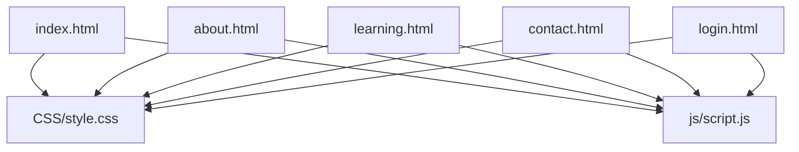
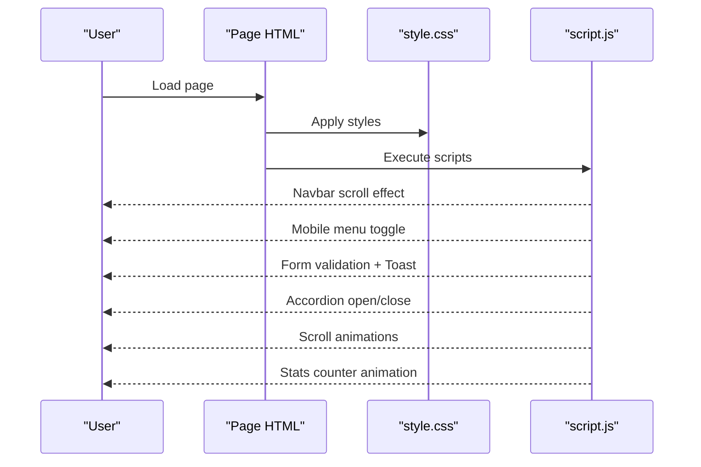
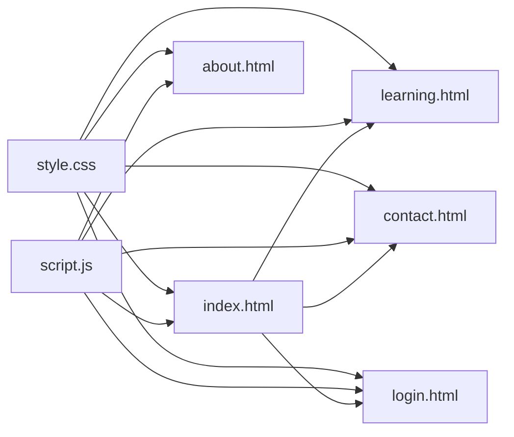

# Content Updates

<cite>
**Referenced Files in This Document**
- [index.html](file://index.html)
- [about.html](file://about.html)
- [contact.html](file://contact.html)
- [learning.html](file://learning.html)
- [login.html](file://login.html)
- [style.css](file://CSS/style.css)
- [script.js](file://js/script.js)
</cite>

## Table of Contents
1. [Introduction](#introduction)
2. [Project Structure](#project-structure)
3. [Core Components](#core-components)
4. [Architecture Overview](#architecture-overview)
5. [Detailed Component Analysis](#detailed-component-analysis)
6. [Dependency Analysis](#dependency-analysis)
7. [Performance Considerations](#performance-considerations)
8. [Troubleshooting Guide](#troubleshooting-guide)
9. [Conclusion](#conclusion)
10. [Appendices](#appendices)

## Introduction
This guide explains how to update website content across all pages, including text changes, training modules, statistics and metrics, contact information, and login page updates. It also covers the HTML structure and semantic markup used throughout the site, best practices for accessibility, image optimization, and ensuring mobile responsiveness after updates.

## Project Structure
The site is a static multi-page website with shared styling and behavior:
- Pages: index.html (home), about.html, learning.html, contact.html, login.html
- Styles: CSS/style.css
- Behavior: js/script.js

**Diagram sources**
- [index.html:1-106](file://index.html#L1-L106)
- [about.html:1-123](file://about.html#L1-L123)
- [learning.html:1-137](file://learning.html#L1-L137)
- [contact.html:1-102](file://contact.html#L1-L102)
- [login.html:1-60](file://login.html#L1-L60)
- [style.css:1-247](file://CSS/style.css#L1-L247)
- [script.js:1-105](file://js/script.js#L1-L105)

**Section sources**
- [index.html:1-106](file://index.html#L1-L106)
- [about.html:1-123](file://about.html#L1-L123)
- [learning.html:1-137](file://learning.html#L1-L137)
- [contact.html:1-102](file://contact.html#L1-L102)
- [login.html:1-60](file://login.html#L1-L60)
- [style.css:1-247](file://CSS/style.css#L1-L247)
- [script.js:1-105](file://js/script.js#L1-L105)

## Core Components
- Navigation bar: present on every page; includes logo, links, and mobile hamburger menu. Update links or labels here to keep navigation consistent.
- Hero section (home): primary messaging and calls to action. Edit titles, descriptions, and buttons to reflect current goals.
- Stats bar (home): displays key metrics. Update numbers directly in the HTML where they appear.
- Training modules:
  - Home preview cards list selected modules.
  - Learning page contains full module details with topics and descriptions.
- About page: mission, objectives, approach, phases, and outcomes.
- Contact page: contact details, form, and collaboration info.
- Login page: authentication UI with validation and social login placeholders.

Key areas to edit:
- Text content: within headings, paragraphs, lists, and card bodies.
- Links: href attributes for internal navigation.
- Statistics: numeric values inside stat items.
- Contact details: location, email, phone, office hours.
- Module content: titles, descriptions, topic chips.

**Section sources**
- [index.html:10-106](file://index.html#L10-L106)
- [about.html:10-123](file://about.html#L10-L123)
- [learning.html:10-137](file://learning.html#L10-L137)
- [contact.html:10-102](file://contact.html#L10-L102)
- [login.html:10-60](file://login.html#L10-L60)

## Architecture Overview
The site uses a simple, flat architecture:
- Each page is an independent HTML file that references a shared stylesheet and script.
- The JavaScript handles common behaviors: navbar scroll effect, mobile menu toggle, form validation, toast notifications, module accordion, scroll animations, and stats counter animation.
- Styling is centralized in one CSS file using CSS variables for colors, spacing, and transitions.

**Diagram sources**
- [style.css:1-247](file://CSS/style.css#L1-L247)
- [script.js:1-105](file://js/script.js#L1-L105)
- [index.html:1-106](file://index.html#L1-L106)
- [contact.html:1-102](file://contact.html#L1-L102)
- [learning.html:1-137](file://learning.html#L1-L137)
- [login.html:1-60](file://login.html#L1-L60)

## Detailed Component Analysis

### Navigation Bar
- Purpose: Global navigation with active state and mobile menu.
- How to update:
  - Change link texts or URLs in the nav-links list.
  - Add/remove links by editing the <ul> list items.
  - Ensure each page sets the correct active class on its own link.
- Accessibility:
  - Use proper anchor tags with descriptive text.
  - Keep keyboard focus visible via CSS focus states.

**Section sources**
- [index.html:10-25](file://index.html#L10-L25)
- [about.html:10-18](file://about.html#L10-L18)
- [learning.html:10-18](file://learning.html#L10-L18)
- [contact.html:10-18](file://contact.html#L10-L18)
- [style.css:19-37](file://CSS/style.css#L19-L37)
- [script.js:1-19](file://js/script.js#L1-L19)

### Home Page (Hero, Stats, Modules Preview)
- Hero:
  - Edit title, subtitle, description, and call-to-action buttons.
  - Update hero mini-cards if needed.
- Stats bar:
  - Update numbers and labels directly in the HTML.
  - The stats counter animates when scrolled into view.
- Modules preview:
  - Edit module titles, descriptions, and topic tags.
  - To add a new module preview, duplicate an existing module card and update content.

Best practices:
- Keep sentences concise and scannable.
- Use meaningful headings and avoid inline styles unless necessary.

**Section sources**
- [index.html:27-75](file://index.html#L27-L75)
- [style.css:38-90](file://CSS/style.css#L38-L90)
- [script.js:88-105](file://js/script.js#L88-L105)

### About Page
- Sections include challenge/gap, mission/objectives, approach, phases, and expected outcomes.
- How to update:
  - Edit paragraph text under each heading.
  - Modify objective items, approach items, phase cards, and outcome cards.
- Accessibility:
  - Use semantic headings (h2/h3) to structure content.
  - Ensure lists are properly nested.

**Section sources**
- [about.html:20-110](file://about.html#L20-L110)
- [style.css:92-130](file://CSS/style.css#L92-L130)

### Learning Page (Training Modules)
- Contains eight detailed modules with titles, subtitles, descriptions, and topic chips.
- How to update:
  - Edit module titles, descriptions, and topic chips.
  - To add a new module:
    - Duplicate an existing module-detail block.
    - Update number, title, subtitle, description, and topic chips.
    - Ensure the numbering sequence remains logical.
- Interactions:
  - Clicking a module header toggles visibility of description and topics.

**Section sources**
- [learning.html:20-98](file://learning.html#L20-L98)
- [style.css:210-225](file://CSS/style.css#L210-L225)
- [script.js:68-75](file://js/script.js#L68-L75)

### Contact Page
- Contact details: location, email, phone, office hours.
- Contact form: fields for name, email, subject, message.
- How to update:
  - Edit contact detail text blocks.
  - Adjust form fields or labels if needed.
  - Validate messages and success feedback are handled by JS.

Accessibility:
- Ensure all inputs have associated labels.
- Provide clear error messages via toast notifications.

**Section sources**
- [contact.html:20-65](file://contact.html#L20-L65)
- [style.css:132-148](file://CSS/style.css#L132-L148)
- [script.js:52-66](file://js/script.js#L52-L66)

### Login Page
- Fields: email and password with validation.
- Social login buttons: Google and GitHub placeholders.
- How to update:
  - Change form labels, placeholders, and help text.
  - Extend validation rules if needed.
  - Integrate real authentication later by replacing the simulated flow.

Accessibility:
- Use aria-labels for password toggle button.
- Ensure focus management and visible focus indicators.

**Section sources**
- [login.html:10-59](file://login.html#L10-L59)
- [style.css:153-186](file://CSS/style.css#L153-L186)
- [script.js:30-50](file://js/script.js#L30-L50)

### Footer
- Present on all pages with brand text, quick links, and resources.
- How to update:
  - Edit footer brand description.
  - Update links to reflect current site structure.
  - Adjust copyright year if needed.

**Section sources**
- [index.html:95-102](file://index.html#L95-L102)
- [about.html:112-119](file://about.html#L112-L119)
- [learning.html:126-133](file://learning.html#L126-L133)
- [contact.html:90-97](file://contact.html#L90-L97)
- [style.css:188-196](file://CSS/style.css#L188-L196)

## Dependency Analysis
- Shared dependencies:
  - All pages depend on style.css for layout, typography, and responsive design.
  - All pages depend on script.js for interactive features.
- Internal dependencies:
  - Navigation links connect pages.
  - Learning page depends on module accordion behavior.
  - Contact and login forms depend on JS validation and toast notifications.

**Diagram sources**
- [style.css:1-247](file://CSS/style.css#L1-L247)
- [script.js:1-105](file://js/script.js#L1-L105)
- [index.html:1-106](file://index.html#L1-L106)
- [about.html:1-123](file://about.html#L1-L123)
- [learning.html:1-137](file://learning.html#L1-L137)
- [contact.html:1-102](file://contact.html#L1-L102)
- [login.html:1-60](file://login.html#L1-L60)

**Section sources**
- [style.css:1-247](file://CSS/style.css#L1-L247)
- [script.js:1-105](file://js/script.js#L1-L105)
- [index.html:1-106](file://index.html#L1-L106)
- [about.html:1-123](file://about.html#L1-L123)
- [learning.html:1-137](file://learning.html#L1-L137)
- [contact.html:1-102](file://contact.html#L1-L102)
- [login.html:1-60](file://login.html#L1-L60)

## Performance Considerations
- Images:
  - Use modern formats (WebP/AVIF) when possible.
  - Set explicit width and height attributes to prevent layout shifts.
  - Compress images and use appropriate sizes for different breakpoints.
- CSS:
  - Leverage CSS variables for consistent theming and minimal duplication.
  - Avoid excessive inline styles; prefer classes defined in style.css.
- JavaScript:
  - Debounce heavy operations if adding more scroll listeners.
  - Keep event handlers minimal and efficient.
- Responsive design:
  - Test on mobile devices after content changes to ensure readability and touch targets remain accessible.

[No sources needed since this section provides general guidance]

## Troubleshooting Guide
Common issues and fixes:
- Mobile menu not opening:
  - Ensure the hamburger element exists and has the correct id.
  - Check that script.js attaches click listeners correctly.
- Forms not validating:
  - Verify input ids match those referenced in script.js.
  - Confirm required attributes are set on inputs.
- Toast messages not appearing:
  - Ensure a toast container exists in the DOM.
  - Check that showToast is called with valid parameters.
- Stats counter not animating:
  - Confirm the stats-bar and stat-item elements exist.
  - Ensure the page scrolls to trigger the IntersectionObserver logic.

**Section sources**
- [script.js:1-105](file://js/script.js#L1-L105)
- [contact.html:37-46](file://contact.html#L37-L46)
- [login.html:19-40](file://login.html#L19-L40)
- [index.html:49-56](file://index.html#L49-L56)

## Conclusion
This documentation outlines how to update text, training modules, statistics, contact information, and login content while maintaining accessibility, performance, and responsiveness. Follow the guidelines for semantic markup, consistent styling, and careful testing across devices to ensure a high-quality user experience.

[No sources needed since this section summarizes without analyzing specific files]

## Appendices

### Best Practices for Accessibility
- Use semantic HTML elements (headings, lists, landmarks).
- Provide alt text for images and aria-labels for icons/buttons without text.
- Ensure sufficient color contrast and visible focus states.
- Make forms accessible with labeled inputs and clear error messages.

[No sources needed since this section provides general guidance]

### Adding a New Training Module
Steps:
1. Open learning.html.
2. Locate an existing module-detail block.
3. Duplicate the block and update:
   - Number, title, subtitle, description, and topic chips.
4. Save and test the accordion behavior.
5. Optionally add a preview card on the home page by duplicating an existing module-card.

**Section sources**
- [learning.html:34-98](file://learning.html#L34-L98)
- [index.html:65-73](file://index.html#L65-L73)

### Updating Statistics and Metrics
- Find the stats-grid in index.html.
- Update the numeric values and labels within stat-item elements.
- The JS will animate counters automatically when scrolled into view.

**Section sources**
- [index.html:49-56](file://index.html#L49-L56)
- [script.js:88-105](file://js/script.js#L88-L105)

### Modifying Contact Information
- Open contact.html.
- Edit location, email, phone, and office hours within contact-info.
- If changing form fields, ensure corresponding ids and labels match script.js validation.

**Section sources**
- [contact.html:28-46](file://contact.html#L28-L46)
- [script.js:52-66](file://js/script.js#L52-L66)

### Ensuring Mobile Responsiveness After Changes
- Test on various screen sizes.
- Verify navigation collapses correctly and content reflows.
- Check that interactive elements remain reachable and readable.

**Section sources**
- [style.css:226-247](file://CSS/style.css#L226-L247)
- [script.js:5-19](file://js/script.js#L5-L19)