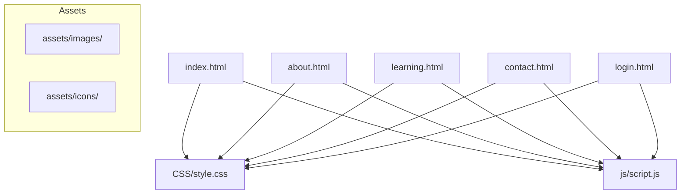
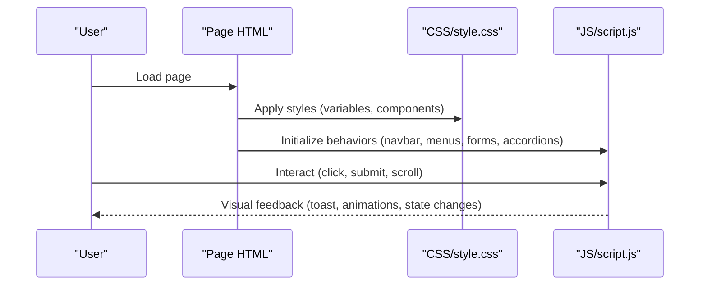
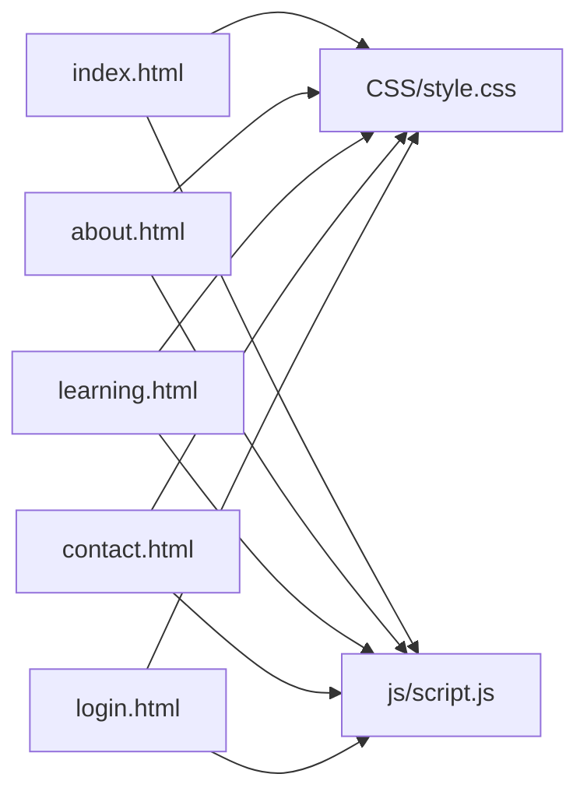

# Customization Guide

<cite>
**Referenced Files in This Document**
- [index.html](file://index.html)
- [about.html](file://about.html)
- [learning.html](file://learning.html)
- [contact.html](file://contact.html)
- [login.html](file://login.html)
- [style.css](file://CSS/style.css)
- [script.js](file://js/script.js)
</cite>

## Table of Contents
1. Introduction
2. Project Structure
3. Core Components
4. Architecture Overview
5. Detailed Component Analysis
6. Dependency Analysis
7. Performance Considerations
8. Troubleshooting Guide
9. Conclusion
10. Appendices

## Introduction
This guide explains how to customize the Digital Bridges Zambia website consistently and safely. You will learn how to:
- Customize colors, fonts, spacing, and visual style using CSS custom properties
- Update page content by editing HTML text and structure
- Add new training modules and extend module grids
- Add images and icons to the assets folders
- Create additional pages following the existing structure
- Implement new interactive features using the established JavaScript patterns
- Maintain consistency across pages and interactions

The site is a static, multi-page website with shared styles and behaviors. All customization should preserve the existing class names, IDs, and script hooks so that animations, navigation, forms, and modals continue to work as intended.

## Project Structure
The project uses a simple, flat structure:
- Pages: index.html, about.html, learning.html, contact.html, login.html
- Styles: CSS/style.css (shared theme and layout)
- Scripts: js/script.js (shared behavior for navbar, mobile menu, forms, accordion, scroll animations, stats counter)
- Assets: assets/images/ and assets/icons/ (for images and icons)

**Diagram sources**
- [index.html:1-106](file://index.html#L1-L106)
- [about.html:1-123](file://about.html#L1-L123)
- [learning.html:1-137](file://learning.html#L1-L137)
- [contact.html:1-102](file://contact.html#L1-L102)
- [login.html:1-60](file://login.html#L1-L60)
- [style.css:1-247](file://CSS/style.css#L1-L247)
- [script.js:1-105](file://js/script.js#L1-L105)

**Section sources**
- [index.html:1-106](file://index.html#L1-L106)
- [style.css:1-247](file://CSS/style.css#L1-L247)
- [script.js:1-105](file://js/script.js#L1-L105)

## Core Components
Key reusable components you will customize most often:
- Navigation bar with mobile hamburger menu
- Hero section with call-to-action buttons
- Module cards grid for training content
- Accordion-based module details on the Learning page
- Contact form with validation and toast notifications
- Login form with password toggle and social buttons
- Page banners, sections, and footer

These components are styled via CSS classes and enhanced by shared JavaScript. When customizing, keep these class names intact to preserve functionality.

**Section sources**
- [style.css:19-246](file://CSS/style.css#L19-L246)
- [script.js:1-105](file://js/script.js#L1-L105)

## Architecture Overview
The site follows a clear separation of concerns:
- HTML defines semantic structure and content per page
- CSS provides a unified design system through variables and component classes
- JavaScript adds interactivity without coupling to specific page content

**Diagram sources**
- [index.html:1-106](file://index.html#L1-L106)
- [style.css:1-247](file://CSS/style.css#L1-L247)
- [script.js:1-105](file://js/script.js#L1-L105)

## Detailed Component Analysis

### Theme Customization with CSS Custom Properties
The design system is driven by CSS custom properties defined at the root level. These control colors, spacing, typography, shadows, and transitions used throughout the site.

What you can customize:
- Colors: primary palette, accents, backgrounds, surfaces, text, borders, success/error states
- Spacing and sizing: border radius, shadow depth, transition timing
- Typography: base font family applied to body
- Layout tokens: consistent radii and shadows for cards and overlays

How to customize:
- Open the stylesheet and locate the root-level variable definitions
- Change values to match your brand or accessibility needs
- Keep naming conventions consistent; avoid creating ad-hoc variables unless necessary
- Test across pages to ensure contrast and readability remain acceptable

Best practices:
- Use the existing variables for all color and spacing needs to maintain consistency
- If adding new tokens, group them logically near existing ones
- Validate contrast ratios for text over backgrounds
- Avoid overriding global defaults inline; prefer updating variables

**Section sources**
- [style.css:3-13](file://CSS/style.css#L3-L13)
- [style.css:15-16](file://CSS/style.css#L15-L16)

### Updating Content Across Pages
Content is embedded directly in HTML. To update messaging, titles, descriptions, and lists:
- Edit text within headings, paragraphs, and list items on each page
- Keep semantic tags (headings, paragraphs, lists) for accessibility and SEO
- Maintain existing class names for styling and animation hooks

Common areas to update:
- Hero headline and description on the home page
- Training module summaries and topics on the home and learning pages
- About page mission, objectives, approach, phases, and outcomes
- Contact page information and partner categories
- Login page labels and help text

Guidelines:
- Preserve sentence length and hierarchy to fit responsive layouts
- Avoid inserting large blocks of text into small containers like badges or chips
- Use lists for scannable content (objectives, phases, partners)

**Section sources**
- [index.html:27-93](file://index.html#L27-L93)
- [about.html:20-110](file://about.html#L20-L110)
- [learning.html:20-116](file://learning.html#L20-L116)
- [contact.html:20-88](file://contact.html#L20-L88)

### Adding New Training Modules
To add a new module:
- On the Home page, add a new module card inside the modules grid container
- On the Learning page, add a new module detail block with header, description, and topic chips
- Ensure each card/detail uses the established classes for consistent styling and animation

Steps:
- Insert a new module-card element in the grid on the home page
- Insert a new module-detail element in the sequence on the learning page
- Assign sequential numbering and update any counts or references if needed
- Keep topic chips concise and descriptive

Notes:
- The grid adapts automatically due to responsive CSS
- Animations are handled by shared classes; no extra JS is required
- If you change the number of modules, consider updating summary stats on the home page

**Section sources**
- [index.html:65-73](file://index.html#L65-L73)
- [learning.html:34-96](file://learning.html#L34-L96)
- [style.css:80-90](file://CSS/style.css#L80-L90)
- [style.css:210-224](file://CSS/style.css#L210-L224)

### Extending the Module Grid
The module grid uses a responsive CSS grid pattern. To extend it:
- Add more module-card elements inside the grid container
- Each card should include a number, title, description, and topic chips
- No additional CSS is required; the grid auto-fits columns based on available space

Tips:
- Keep card content balanced to avoid uneven heights
- Use short, impactful topic chips for quick scanning
- Maintain consistent spacing and alignment by reusing existing classes

**Section sources**
- [index.html:65-73](file://index.html#L65-L73)
- [style.css:80-85](file://CSS/style.css#L80-L85)

### Adding Images and Icons
Use the dedicated asset folders to keep media organized:
- Place images in assets/images/
- Place icons in assets/icons/

How to use them:
- Reference image paths in HTML img tags or CSS background-image rules
- For icons, you can use SVGs inline or reference icon files from assets/icons/
- Ensure alt text for images to support accessibility

Best practices:
- Optimize images for web performance (size, format)
- Use scalable vector graphics (SVG) for icons where possible
- Keep file names descriptive and consistent

**Section sources**
- [style.css:23-26](file://CSS/style.css#L23-L26)
- [contact.html:28-36](file://contact.html#L28-L36)

### Creating Additional Pages
To create a new page:
- Duplicate an existing page template (e.g., about.html or contact.html)
- Update the title, meta tags, and page-specific content
- Include the shared stylesheet and script links
- Reuse existing components (page banner, sections, grids, footer)

Structure checklist:
- Head includes charset, viewport, title, and stylesheet link
- Body includes the standard navbar with active state for the current page
- Main content uses existing section and grid classes
- Footer includes consistent links and branding
- Script link included at the bottom of the page

Navigation:
- Add a link to the new page in the nav-links on all pages
- Mark the active link appropriately

**Section sources**
- [about.html:1-123](file://about.html#L1-L123)
- [contact.html:1-102](file://contact.html#L1-L102)
- [index.html:10-25](file://index.html#L10-L25)

### Implementing New Interactive Features
The JavaScript file centralizes shared behaviors. Extend functionality by following these patterns:

Navbar and mobile menu:
- The navbar toggles a scrolled state on scroll
- The hamburger toggles a mobile menu open/close state
- Clicking a link closes the mobile menu automatically

Toast notifications:
- Use the provided function to show success or error messages
- Ensure a toast element exists on the page when using this feature

Forms:
- Forms validate inputs and display toasts for errors or success
- Button states reflect loading during submission

Accordion:
- Module details expand/collapse with smooth transitions
- Only one module can be open at a time

Scroll animations:
- Elements with a specific class animate in when they enter the viewport
- An observer triggers visibility and removes itself after animating

Stats counter:
- Numbers animate when the stats section becomes visible

To add new interactions:
- Follow the existing event listener pattern (select elements, attach listeners)
- Use existing classes and IDs to integrate with CSS and other scripts
- Keep logic modular and avoid global scope pollution

Example patterns to follow:
- Navbar scroll effect
- Mobile menu toggle
- Form validation and toast feedback
- Accordion open/close behavior
- IntersectionObserver for scroll animations

**Section sources**
- [script.js:1-105](file://js/script.js#L1-L105)
- [style.css:182-186](file://CSS/style.css#L182-L186)

## Dependency Analysis
The site has minimal dependencies:
- Each page depends on the shared stylesheet for consistent styling
- Each page depends on the shared script for common behaviors
- No external libraries are loaded; everything is vanilla HTML/CSS/JS

**Diagram sources**
- [index.html:1-106](file://index.html#L1-L106)
- [about.html:1-123](file://about.html#L1-L123)
- [learning.html:1-137](file://learning.html#L1-L137)
- [contact.html:1-102](file://contact.html#L1-L102)
- [login.html:1-60](file://login.html#L1-L60)
- [style.css:1-247](file://CSS/style.css#L1-L247)
- [script.js:1-105](file://js/script.js#L1-L105)

**Section sources**
- [style.css:1-247](file://CSS/style.css#L1-L247)
- [script.js:1-105](file://js/script.js#L1-L105)

## Performance Considerations
- Prefer lightweight assets: optimize images and use SVGs for icons
- Avoid heavy inline styles; rely on CSS variables and classes
- Keep JavaScript minimal and focused on shared behaviors
- Use responsive grids to reduce layout shifts on different screen sizes
- Limit the number of animated elements to prevent jank on low-end devices

[No sources needed since this section provides general guidance]

## Troubleshooting Guide
Common issues and resolutions:
- Navbar not scrolling or mobile menu not closing:
  - Ensure the navbar and hamburger elements have the expected IDs
  - Verify the script is loaded after the DOM is ready
- Toast messages not appearing:
  - Ensure a toast element exists on the page when using the toast function
  - Check that the toast class names match the stylesheet
- Forms not validating:
  - Confirm form fields have the expected IDs referenced by the script
  - Ensure the form element ID matches what the script expects
- Accordion not opening:
  - Verify module headers have the correct class and structure
  - Ensure only one module is open at a time as designed
- Scroll animations not triggering:
  - Confirm elements have the animation class
  - Check that the intersection observer is initialized

Where to look:
- Stylesheet for class names and toast styles
- Script for event listeners and validation logic
- Page HTML for correct element IDs and structure

**Section sources**
- [style.css:182-186](file://CSS/style.css#L182-L186)
- [script.js:21-75](file://js/script.js#L21-L75)

## Conclusion
You now have a complete guide to customize the Digital Bridges Zambia website while maintaining consistency and functionality. Focus on:
- Using CSS custom properties for theme changes
- Editing HTML content carefully to preserve structure
- Following established patterns for modules, grids, and interactions
- Organizing assets in dedicated folders
- Extending JavaScript behavior using existing patterns

By adhering to these practices, you can evolve the site’s design and features without breaking shared behaviors or user experience.

[No sources needed since this section summarizes without analyzing specific files]

## Appendices

### Quick Reference: Where to Make Changes
- Colors, fonts, spacing: update CSS variables in the stylesheet root
- Page content: edit text in the corresponding HTML file
- New modules: add cards and detail blocks using existing classes
- Images and icons: place in assets/images/ and assets/icons/
- New pages: duplicate an existing page and update content and links
- Interactions: extend script.js following existing event patterns

**Section sources**
- [style.css:3-13](file://CSS/style.css#L3-L13)
- [index.html:65-73](file://index.html#L65-L73)
- [learning.html:34-96](file://learning.html#L34-L96)
- [script.js:1-105](file://js/script.js#L1-L105)