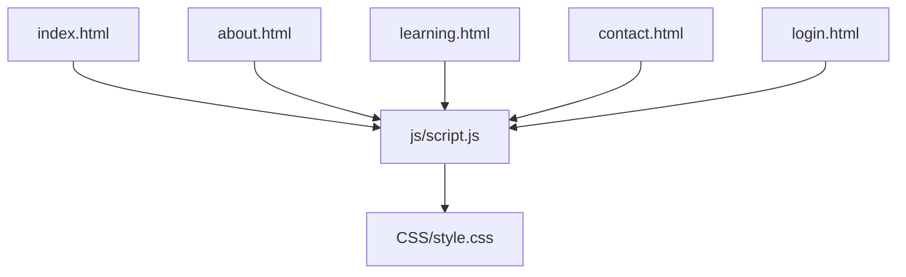
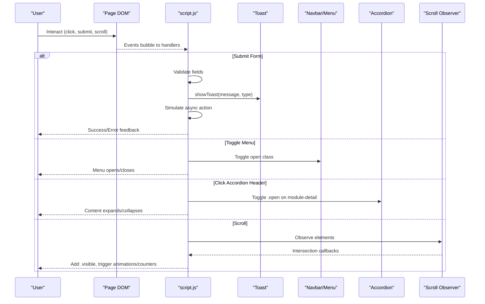
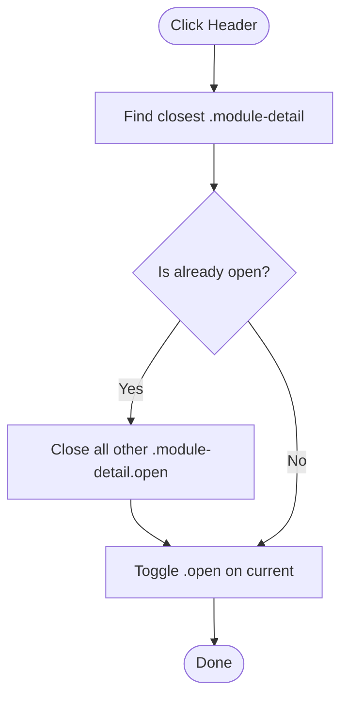
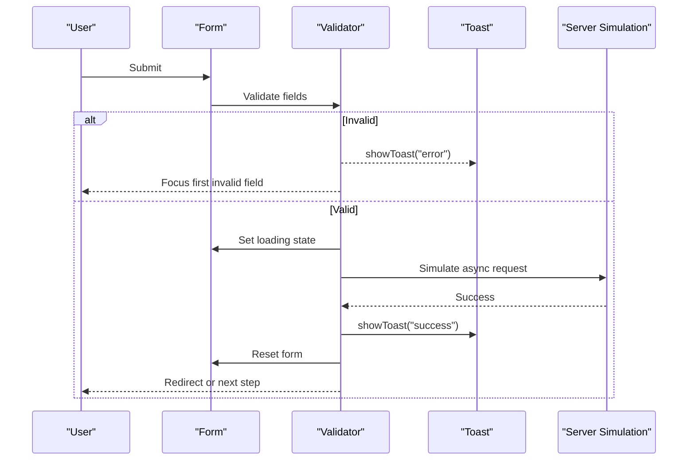
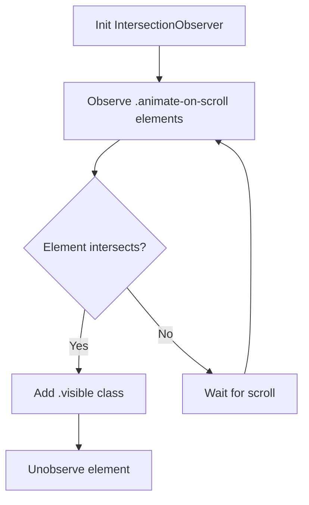
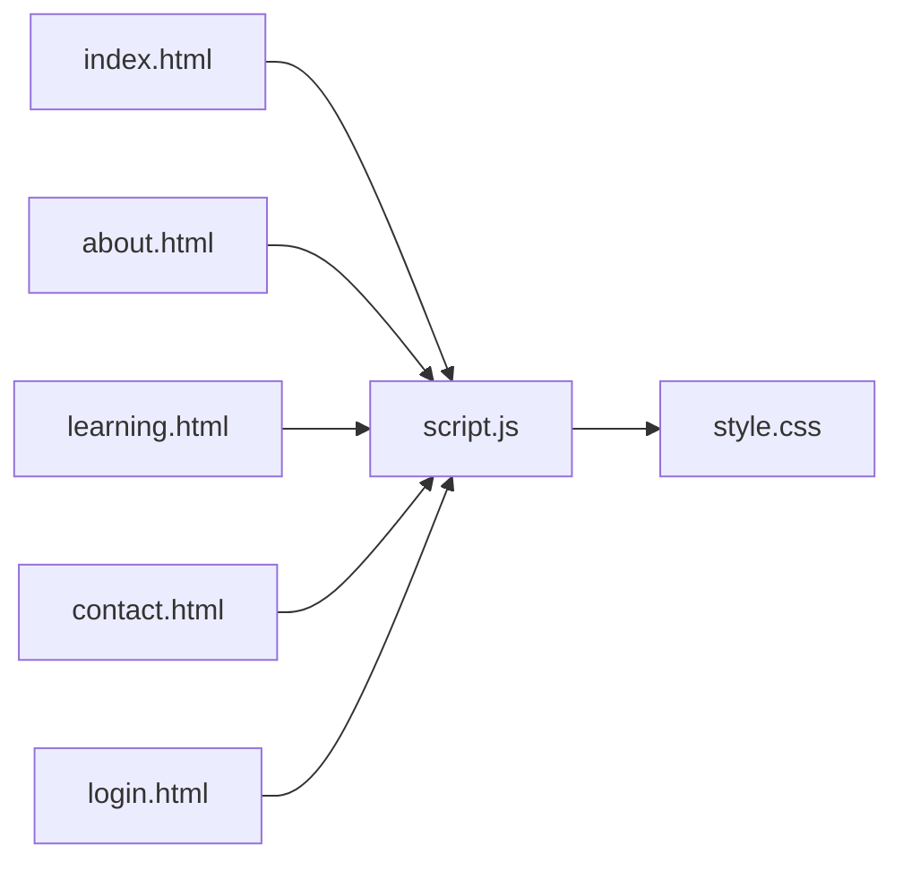

# Feature Extensions

<cite>
**Referenced Files in This Document**
- [script.js](file://js/script.js)
- [style.css](file://CSS/style.css)
- [index.html](file://index.html)
- [about.html](file://about.html)
- [learning.html](file://learning.html)
- [contact.html](file://contact.html)
- [login.html](file://login.html)
</cite>

## Table of Contents
1. Introduction
2. Project Structure
3. Core Components
4. Architecture Overview
5. Detailed Component Analysis
6. Dependency Analysis
7. Performance Considerations
8. Troubleshooting Guide
9. Conclusion
10. Appendices

## Introduction
This document explains how to extend the website’s functionality with new features while preserving consistency and performance. It focuses on:
- The JavaScript architecture and event handling patterns used across pages
- How to add interactive components following the established accordion pattern
- Extending form validation systems for new forms
- Implementing scroll animation effects using IntersectionObserver
- Integrating third-party libraries safely
- Implementing new user authentication methods
- Adding analytics tracking without disrupting UX

The guidance is grounded in the existing codebase and provides step-by-step instructions, diagrams, and references to specific files and line ranges.

## Project Structure
The site is a static multi-page website with shared JavaScript and CSS:
- Shared behavior lives in js/script.js (navigation, mobile menu, toast notifications, login/contact form validation, module accordion, scroll animations, stats counter)
- Styling is centralized in CSS/style.css (layout, components, responsive rules)
- Pages include HTML markup that wires into shared JS via element IDs and classes

**Diagram sources**
- [index.html:103-103](file://index.html#L103-L103)
- [about.html:120-120](file://about.html#L120-L120)
- [learning.html:134-134](file://learning.html#L134-L134)
- [contact.html:99-99](file://contact.html#L99-L99)
- [login.html:57-57](file://login.html#L57-L57)
- [script.js:1-105](file://js/script.js#L1-L105)
- [style.css:1-247](file://CSS/style.css#L1-L247)

**Section sources**
- [script.js:1-105](file://js/script.js#L1-L105)
- [style.css:1-247](file://CSS/style.css#L1-L247)
- [index.html:1-106](file://index.html#L1-L106)
- [about.html:1-123](file://about.html#L1-L123)
- [learning.html:1-137](file://learning.html#L1-L137)
- [contact.html:1-102](file://contact.html#L1-L102)
- [login.html:1-60](file://login.html#L1-L60)

## Core Components
- Navbar and Mobile Menu: Scroll-aware navbar and hamburger toggle with animated spans; links auto-close menu on click
- Toast Notifications: Centralized feedback component for success/error messages
- Login Form: Client-side validation for email and password, loading state, simulated submission flow
- Password Toggle: Show/hide password visibility
- Contact Form: Validation for name, email, subject selection, message length; simulated send flow
- Module Accordion: Expand/collapse module details with single-open behavior
- Scroll Animations: Elements animate in when entering viewport using IntersectionObserver
- Stats Counter: Animated counters triggered when visible

These components are implemented as small, focused functions or event listeners in a single script file, making them easy to extend.

**Section sources**
- [script.js:1-105](file://js/script.js#L1-L105)
- [style.css:18-37](file://CSS/style.css#L18-L37)
- [style.css:182-186](file://CSS/style.css#L182-L186)
- [style.css:210-225](file://CSS/style.css#L210-L225)

## Architecture Overview
The application follows a lightweight, page-shared JavaScript architecture:
- Each page includes the same script.js
- Behavior is bound by element IDs and classes present on each page
- Event-driven interactions use addEventListener
- Visual feedback uses a global toast helper
- Animations rely on IntersectionObserver for performance

**Diagram sources**
- [script.js:1-105](file://js/script.js#L1-L105)
- [style.css:18-37](file://CSS/style.css#L18-L37)
- [style.css:182-186](file://CSS/style.css#L182-L186)
- [style.css:210-225](file://CSS/style.css#L210-L225)

## Detailed Component Analysis

### Accordion Pattern (Module Details)
The accordion uses a consistent structure:
- Container: .module-detail
- Header: .module-detail-header
- Expandable content: .module-description and .module-topics-list
- Open state: .module-detail.open toggled by JS

Behavior:
- Clicking a header toggles its parent container’s .open class
- Only one module can be open at a time (others are closed)
- CSS transitions animate max-height and opacity for smooth reveal

To add a new accordion item:
- Add a new .module-detail block with a .module-detail-header and expandable sections
- Ensure the header has the correct class so the existing handler applies
- Optionally style new chips or sections using existing topic-chip styles

**Diagram sources**
- [script.js:68-75](file://js/script.js#L68-L75)
- [style.css:210-225](file://CSS/style.css#L210-L225)

**Section sources**
- [script.js:68-75](file://js/script.js#L68-L75)
- [style.css:210-225](file://CSS/style.css#L210-L225)
- [learning.html:34-96](file://learning.html#L34-L96)

### Form Validation Systems
Two primary forms demonstrate the validation approach:
- Login form: Validates email presence and format, password length, shows loading state, simulates submission, then navigates
- Contact form: Validates name, email, subject selection, message length; disables submit during processing; resets on success

Patterns to follow:
- Prevent default submission
- Validate inputs before any network call
- Use showToast for immediate feedback
- Provide loading states to indicate processing
- Reset forms on success

Extending to new forms:
- Attach a submit listener to your form ID
- Validate required fields similarly
- Use showToast for errors/success
- Disable button during processing and restore afterward
- Reset form on success

**Diagram sources**
- [script.js:30-41](file://js/script.js#L30-L41)
- [script.js:52-66](file://js/script.js#L52-L66)
- [style.css:182-186](file://CSS/style.css#L182-L186)

**Section sources**
- [script.js:30-41](file://js/script.js#L30-L41)
- [script.js:52-66](file://js/script.js#L52-L66)
- [login.html:19-40](file://login.html#L19-L40)
- [contact.html:39-45](file://contact.html#L39-L45)
- [style.css:182-186](file://CSS/style.css#L182-L186)

### Scroll Animation Effects
The site uses IntersectionObserver to animate elements when they enter the viewport:
- Elements with .animate-on-scroll start invisible and offset
- When intersecting, a .visible class is added to reveal them
- A dynamic <style> tag defines the final visible state
- Threshold and rootMargin are tuned for subtle entrance timing

To add more animated elements:
- Add the .animate-on-scroll class to any element you want to animate
- Optionally set custom transition delays if needed
- No additional JS is required; the observer handles all elements automatically

**Diagram sources**
- [script.js:77-86](file://js/script.js#L77-L86)
- [style.css:210-225](file://CSS/style.css#L210-L225)

**Section sources**
- [script.js:77-86](file://js/script.js#L77-L86)
- [index.html:65-91](file://index.html#L65-L91)
- [about.html:29-76](file://about.html#L29-L76)
- [contact.html:29-63](file://contact.html#L29-L63)
- [style.css:210-225](file://CSS/style.css#L210-L225)

### Toast Notification System
A global toast helper displays contextual messages:
- Accepts message and type (e.g., success, error)
- Uses a fixed-position element with show class for slide-in animation
- Auto-dismisses after a timeout

To reuse:
- Include a toast element with id="toast" on pages where it’s used
- Call showToast(msg, type) from your logic

**Section sources**
- [script.js:21-28](file://js/script.js#L21-L28)
- [style.css:182-186](file://CSS/style.css#L182-L186)
- [contact.html:98-99](file://contact.html#L98-L99)
- [login.html:56-57](file://login.html#L56-L57)

### Navbar and Mobile Menu
- Navbar gains a scrolled class based on window.scrollY for shadow effect
- Hamburger toggles navLinks open class and animates span transforms
- Closing menu on link click improves mobile UX

To extend:
- Keep the hamburger and navLinks IDs consistent
- Add new navigation items as <a> within #navLinks
- If adding sticky behaviors, ensure they do not conflict with existing scroll listeners

**Section sources**
- [script.js:1-19](file://js/script.js#L1-L19)
- [style.css:18-37](file://CSS/style.css#L18-L37)
- [index.html:10-25](file://index.html#L10-L25)

### Stats Counter
Animated counters run once per session when the stats bar enters the viewport:
- Checks visibility via getBoundingClientRect
- Increments numbers smoothly using setInterval
- Ensures only one run per page load

To extend:
- Add new .stat-item h3 elements with target values
- Keep suffixes (like +) intact for proper display

**Section sources**
- [script.js:88-104](file://js/script.js#L88-L104)
- [index.html:49-56](file://index.html#L49-L56)
- [style.css:74-78](file://CSS/style.css#L74-L78)

## Dependency Analysis
- Single shared script drives cross-page behavior
- Styles provide consistent UI primitives and transitions
- Pages depend on specific IDs/classes to activate behaviors
- No external dependencies are currently loaded

Potential coupling points:
- Element IDs must remain stable (e.g., navbar, navLinks, hamburger, loginForm, contactForm, toast)
- Classes drive animations and states (.animate-on-scroll, .module-detail.open, .scrolled, .open)

**Diagram sources**
- [index.html:103-103](file://index.html#L103-L103)
- [about.html:120-120](file://about.html#L120-L120)
- [learning.html:134-134](file://learning.html#L134-L134)
- [contact.html:99-99](file://contact.html#L99-L99)
- [login.html:57-57](file://login.html#L57-L57)
- [script.js:1-105](file://js/script.js#L1-L105)
- [style.css:1-247](file://CSS/style.css#L1-L247)

**Section sources**
- [script.js:1-105](file://js/script.js#L1-L105)
- [style.css:1-247](file://CSS/style.css#L1-L247)

## Performance Considerations
- Use IntersectionObserver for scroll-based animations to avoid heavy scroll listeners
- Debounce or throttle expensive operations if adding new scroll handlers
- Avoid reflow thrashing by batching DOM reads/writes
- Prefer class toggling over inline style changes for animations
- Keep event listeners minimal and scoped to necessary elements
- Reuse shared helpers like showToast to reduce duplication

[No sources needed since this section provides general guidance]

## Troubleshooting Guide
Common issues and resolutions:
- Toast not showing: Ensure a toast element with id="toast" exists on the page
- Accordion not working: Verify headers have .module-detail-header and containers have .module-detail
- Forms not validating: Confirm form IDs match those referenced in script.js and fields exist
- Animations not triggering: Ensure elements have .animate-on-scroll and are within the viewport
- Navbar not scrolling: Check that #navbar exists and window scroll events are not blocked

Validation tips:
- For login: Email must contain @; password must meet minimum length
- For contact: Name non-empty; email valid; subject selected; message meets minimum length

**Section sources**
- [script.js:21-28](file://js/script.js#L21-L28)
- [script.js:30-41](file://js/script.js#L30-L41)
- [script.js:52-66](file://js/script.js#L52-L66)
- [script.js:68-75](file://js/script.js#L68-L75)
- [script.js:77-86](file://js/script.js#L77-L86)

## Conclusion
The site’s architecture is intentionally simple and extensible:
- Shared JS centralizes behavior and ensures consistency
- CSS provides reusable components and transitions
- Patterns like accordion, form validation, and scroll animations are modular and easy to replicate

By following these guidelines, you can add new interactive components, integrate third-party tools, implement authentication flows, and track analytics while maintaining code quality and performance.

[No sources needed since this section summarizes without analyzing specific files]

## Appendices

### How to Extend the Module System
- Follow the accordion pattern: wrap new content in .module-detail with a .module-detail-header
- Use existing topic chips and descriptions for consistency
- No extra JS is required; the shared handler will apply automatically

**Section sources**
- [script.js:68-75](file://js/script.js#L68-L75)
- [style.css:210-225](file://CSS/style.css#L210-L225)
- [learning.html:34-96](file://learning.html#L34-L96)

### Creating New UI Components
- Define semantic HTML structure
- Style using existing CSS variables and utility classes
- Bind minimal JS behavior via addEventListener
- Reuse toast for feedback and IntersectionObserver for entrance animations

**Section sources**
- [style.css:1-247](file://CSS/style.css#L1-L247)
- [script.js:1-105](file://js/script.js#L1-L105)

### Implementing Additional Form Types
- Create a form with a unique ID
- Attach a submit listener in script.js or a dedicated module
- Validate inputs similar to existing forms
- Use showToast for feedback and disable submit during processing

**Section sources**
- [script.js:30-41](file://js/script.js#L30-L41)
- [script.js:52-66](file://js/script.js#L52-L66)
- [style.css:182-186](file://CSS/style.css#L182-L186)

### Integrating Third-Party Libraries
- Load scripts in <head> or before </body> depending on library requirements
- Initialize libraries after DOMContentLoaded or when relevant elements exist
- Wrap initialization in try/catch to prevent breaking core functionality
- Ensure no conflicts with existing IDs/classes

[No sources needed since this section provides general guidance]

### Implementing New User Authentication Methods
- Extend the existing login flow by adding social buttons handlers
- Replace simulated submission with real API calls
- Handle tokens, redirects, and error states consistently
- Maintain accessibility and clear feedback via toast

**Section sources**
- [script.js:47-50](file://js/script.js#L47-L50)
- [script.js:30-41](file://js/script.js#L30-L41)
- [login.html:42-51](file://login.html#L42-L51)

### Adding Analytics Tracking
- Insert analytics snippet early in <head>
- Track key interactions: form submissions, accordion expansions, navigation clicks
- Respect privacy settings and avoid blocking critical paths
- Use non-blocking loads and fallbacks

[No sources needed since this section provides general guidance]