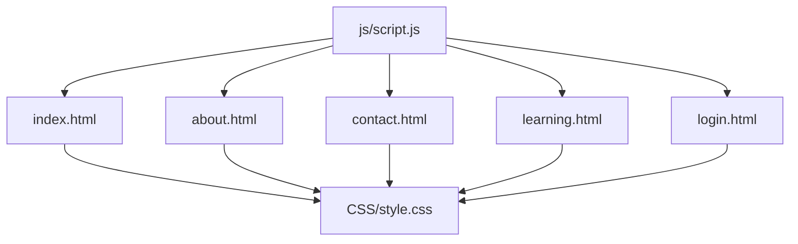
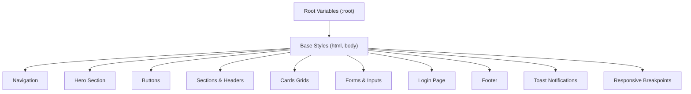
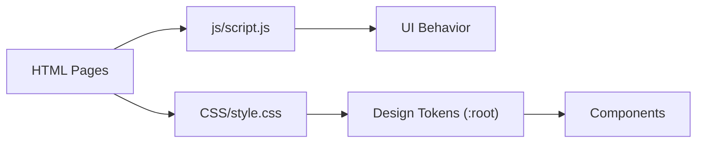

# Theme Customization

<cite>
**Referenced Files in This Document**
- [style.css](file://CSS/style.css)
- [index.html](file://index.html)
- [about.html](file://about.html)
- [contact.html](file://contact.html)
- [learning.html](file://learning.html)
- [login.html](file://login.html)
- [script.js](file://js/script.js)
</cite>

## Table of Contents
1. [Introduction](#introduction)
2. [Project Structure](#project-structure)
3. [Core Components](#core-components)
4. [Architecture Overview](#architecture-overview)
5. [Detailed Component Analysis](#detailed-component-analysis)
6. [Dependency Analysis](#dependency-analysis)
7. [Performance Considerations](#performance-considerations)
8. [Troubleshooting Guide](#troubleshooting-guide)
9. [Conclusion](#conclusion)
10. [Appendices](#appendices)

## Introduction
This document explains how to customize the Digital Bridges Zambia website theme by modifying CSS custom properties (variables), updating colors, typography, spacing, and component styles. It provides a complete guide to the color palette system, step-by-step instructions for common modifications (dark mode, brand updates, responsive breakpoints), and an overview of the CSS architecture and naming conventions used throughout the stylesheet.

## Project Structure
The site is organized into HTML pages that share a single global stylesheet and a small JavaScript file for interactivity:
- Styles are centralized in one stylesheet under the CSS directory.
- Pages reference the same stylesheet and include the shared script for behavior like mobile menu toggling, scroll effects, and form interactions.
- Assets such as icons and images are stored under assets but not required for theme customization.

**Diagram sources**
- [index.html:7](file://index.html#L7)
- [about.html:7](file://about.html#L7)
- [contact.html:7](file://contact.html#L7)
- [learning.html:7](file://learning.html#L7)
- [login.html:7](file://login.html#L7)
- [script.js:1-105](file://js/script.js#L1-L105)

**Section sources**
- [index.html:1-106](file://index.html#L1-L106)
- [about.html:1-123](file://about.html#L1-L123)
- [contact.html:1-102](file://contact.html#L1-L102)
- [learning.html:1-137](file://learning.html#L1-L137)
- [login.html:1-60](file://login.html#L1-L60)
- [style.css:1-247](file://CSS/style.css#L1-L247)
- [script.js:1-105](file://js/script.js#L1-L105)

## Core Components
The theme is built around a cohesive set of design tokens defined as CSS custom properties in the root scope. These variables control colors, typography, spacing, shadows, border radius, and transitions. They are referenced across components to ensure consistency.

Key variable groups:
- Colors: primary, primary-dark, primary-light, accent, accent-dark, background, surface, text, muted text, borders, success, error
- Spacing and layout: radius, shadow, shadow-lg
- Motion: transition timing and duration
- Typography: font family and base line height applied to body

These variables are consumed by navigation, hero, buttons, sections, cards, forms, login, footer, and responsive rules.

**Section sources**
- [style.css:3-15](file://CSS/style.css#L3-L15)
- [style.css:19-37](file://CSS/style.css#L19-L37)
- [style.css:57-63](file://CSS/style.css#L57-L63)
- [style.css:66-72](file://CSS/style.css#L66-L72)
- [style.css:143-151](file://CSS/style.css#L143-L151)
- [style.css:188-196](file://CSS/style.css#L188-L196)

## Architecture Overview
The CSS architecture follows a clear, layered structure:
- Reset and base styles define defaults and apply variables globally.
- Component styles are grouped by feature (navigation, hero, buttons, sections, cards, forms, login, footer).
- Responsive rules adjust layouts at specific breakpoints.

**Diagram sources**
- [style.css:3-15](file://CSS/style.css#L3-L15)
- [style.css:19-37](file://CSS/style.css#L19-L37)
- [style.css:38-55](file://CSS/style.css#L38-L55)
- [style.css:57-63](file://CSS/style.css#L57-L63)
- [style.css:66-72](file://CSS/style.css#L66-L72)
- [style.css:80-91](file://CSS/style.css#L80-L91)
- [style.css:143-151](file://CSS/style.css#L143-L151)
- [style.css:153-180](file://CSS/style.css#L153-L180)
- [style.css:188-196](file://CSS/style.css#L188-L196)
- [style.css:226-247](file://CSS/style.css#L226-L247)

## Detailed Component Analysis

### Color Palette System
The color system is centered on semantic tokens:
- Primary palette: main brand color with lighter and darker variants for depth and contrast.
- Accent palette: secondary emphasis color with a darker variant for hover states.
- Neutrals: background, surface, text, muted text, and borders for structure and readability.
- Feedback: success and error colors for status messages and validation.

Usage patterns:
- Backgrounds and surfaces use neutral tokens to maintain visual hierarchy.
- Interactive elements (buttons, links, focus states) use primary or accent tokens.
- Status indicators and feedback use success and error tokens.

To update the brand colors:
- Change the primary token values to your new brand color and its light/dark variants.
- Adjust accent tokens if you need a different emphasis color.
- Ensure sufficient contrast between text and backgrounds using the neutral tokens.

**Section sources**
- [style.css:3-13](file://CSS/style.css#L3-L13)
- [style.css:20-33](file://CSS/style.css#L20-L33)
- [style.css:57-63](file://CSS/style.css#L57-L63)
- [style.css:183-186](file://CSS/style.css#L183-L186)

### Typography
Typography is controlled via the root font-family and line-height applied to the body. Headings and section headers use consistent sizing and weights. Overline labels and badges use uppercase letter-spacing and small caps-like styling for emphasis.

To modify typography:
- Update the font-family in the base rule to introduce a new typeface stack.
- Adjust line-height for improved readability if needed.
- Override heading sizes within section headers or page banners when necessary.

Best practices:
- Keep headings hierarchical and consistent across pages.
- Use overlines sparingly for contextual labels.
- Maintain adequate contrast for accessibility.

**Section sources**
- [style.css:14-16](file://CSS/style.css#L14-L16)
- [style.css:66-71](file://CSS/style.css#L66-L71)
- [style.css:198-201](file://CSS/style.css#L198-L201)

### Spacing Scale
Spacing is implemented through padding and margins on sections, cards, and components. The design uses consistent vertical rhythm with generous whitespace for clarity.

To adjust spacing:
- Modify section padding to increase or decrease vertical breathing room.
- Adjust card padding and gaps to change density.
- Tweak button padding for more compact or spacious controls.

Guidelines:
- Keep consistent spacing scales across similar components.
- Use relative units where possible to support scaling on different screens.

**Section sources**
- [style.css:38-55](file://CSS/style.css#L38-L55)
- [style.css:66-72](file://CSS/style.css#L66-L72)
- [style.css:80-91](file://CSS/style.css#L80-L91)
- [style.css:143-151](file://CSS/style.css#L143-L151)

### Component Styles
Components follow a consistent pattern:
- Navigation: fixed top bar with backdrop blur and scroll state.
- Hero: split layout with badge, headline, description, and call-to-action buttons.
- Buttons: primary, accent, and outline variants with hover states.
- Cards: grid-based modules with subtle top-border animations and hover elevation.
- Forms: input fields with focus states and icon wrappers.
- Login: centered card with options, social login buttons, and password toggle.
- Footer: multi-column layout with links and branding.

To customize components:
- Update colors via variables rather than hardcoding hex values.
- Adjust border-radius and shadows to match your brand feel.
- Modify transitions for smoother or snappier interactions.

**Section sources**
- [style.css:19-37](file://CSS/style.css#L19-L37)
- [style.css:38-55](file://CSS/style.css#L38-L55)
- [style.css:57-63](file://CSS/style.css#L57-L63)
- [style.css:80-91](file://CSS/style.css#L80-L91)
- [style.css:143-151](file://CSS/style.css#L143-L151)
- [style.css:153-180](file://CSS/style.css#L153-L180)
- [style.css:188-196](file://CSS/style.css#L188-L196)

### Responsive Breakpoints
Responsive rules adapt layouts for smaller screens:
- At a medium breakpoint, grids collapse to fewer columns and content stacks vertically.
- At a small breakpoint, navigation becomes a collapsible menu, and hero text resizes.

To customize breakpoints:
- Adjust media query thresholds to match your target devices.
- Reorder or reflow content within grids to optimize readability.
- Test navigation behavior on various screen sizes.

**Section sources**
- [style.css:226-247](file://CSS/style.css#L226-L247)

### Common Theme Modifications

#### Creating Dark Mode
Implement a dark theme by overriding variables within a media query or a dedicated class:
- Define a dark-mode class on the html element and redefine variables for background, surface, text, borders, and accents.
- Swap light neutrals for dark ones while preserving contrast ratios.
- Optionally add a toggle in the navbar to switch themes dynamically.

Steps:
1. Add a dark-mode class selector and redefine :root variables for dark context.
2. Update component styles to respect the new variables (most already do).
3. Provide a user-facing toggle that adds/removes the class.

**Section sources**
- [style.css:3-13](file://CSS/style.css#L3-L13)
- [style.css:188-196](file://CSS/style.css#L188-L196)

#### Brand Color Updates
To refresh the brand identity:
- Replace primary and accent tokens with your new brand colors.
- Update gradients and highlights that reference these tokens.
- Verify contrast for accessibility across all components.

**Section sources**
- [style.css:3-13](file://CSS/style.css#L3-L13)
- [style.css:20-33](file://CSS/style.css#L20-L33)
- [style.css:57-63](file://CSS/style.css#L57-L63)

#### Responsive Breakpoints Customization
Adjust responsiveness to better fit your audience:
- Change the breakpoint values to align with device usage patterns.
- Refine grid column counts and spacing for tablets and phones.
- Ensure interactive elements remain accessible and easy to tap.

**Section sources**
- [style.css:226-247](file://CSS/style.css#L226-L247)

## Dependency Analysis
The theme’s dependencies are straightforward:
- All pages depend on the central stylesheet for visual presentation.
- Interactions rely on the shared script for behaviors like menu toggling, toast notifications, and form handling.
- No external CSS frameworks are used; everything is custom-built with CSS variables and modern features.

**Diagram sources**
- [index.html:7](file://index.html#L7)
- [about.html:7](file://about.html#L7)
- [contact.html:7](file://contact.html#L7)
- [learning.html:7](file://learning.html#L7)
- [login.html:7](file://login.html#L7)
- [style.css:3-13](file://CSS/style.css#L3-L13)
- [script.js:1-105](file://js/script.js#L1-L105)

**Section sources**
- [index.html:1-106](file://index.html#L1-L106)
- [about.html:1-123](file://about.html#L1-L123)
- [contact.html:1-102](file://contact.html#L1-L102)
- [learning.html:1-137](file://learning.html#L1-L137)
- [login.html:1-60](file://login.html#L1-L60)
- [style.css:1-247](file://CSS/style.css#L1-L247)
- [script.js:1-105](file://js/script.js#L1-L105)

## Performance Considerations
- Centralized variables reduce duplication and improve maintainability.
- Minimal CSS footprint avoids heavy frameworks, keeping load times low.
- Transitions and transforms are used judiciously for smooth interactions without excessive repaints.
- Responsive rules are concise and targeted to avoid unnecessary overrides.

[No sources needed since this section provides general guidance]

## Troubleshooting Guide
Common issues and resolutions:
- Inconsistent colors: Ensure all components reference variables instead of hardcoded values. If a component appears off-brand, check which variable it uses and update the root definition.
- Broken layouts on mobile: Verify responsive rules and test at multiple breakpoints. Adjust grid columns and spacing as needed.
- Form focus states not visible: Confirm that focus styles use the primary token and have sufficient contrast against backgrounds.
- Toast messages not appearing: Check that the toast element exists in the DOM and that the script is loaded correctly.

**Section sources**
- [style.css:143-151](file://CSS/style.css#L143-L151)
- [style.css:183-186](file://CSS/style.css#L183-L186)
- [script.js:21-28](file://js/script.js#L21-L28)

## Conclusion
The Digital Bridges Zambia theme is designed for easy customization through a robust system of CSS variables and a clean, modular stylesheet. By updating the root variables, you can quickly refresh colors, typography, spacing, and component aesthetics. The responsive architecture ensures a consistent experience across devices, and the minimal dependency model keeps maintenance simple. For advanced needs like dark mode or brand updates, override variables strategically and test thoroughly for accessibility and performance.

[No sources needed since this section summarizes without analyzing specific files]

## Appendices

### CSS Architecture and Naming Conventions
- Variables are defined in the root scope for global access.
- Classes use descriptive, component-oriented names (e.g., navbar, hero, btn-primary, module-card).
- States are managed via classes (e.g., scrolled, open, loading, visible).
- Media queries are placed near the end of the stylesheet for clarity.

**Section sources**
- [style.css:3-13](file://CSS/style.css#L3-L13)
- [style.css:19-37](file://CSS/style.css#L19-L37)
- [style.css:57-63](file://CSS/style.css#L57-L63)
- [style.css:226-247](file://CSS/style.css#L226-L247)