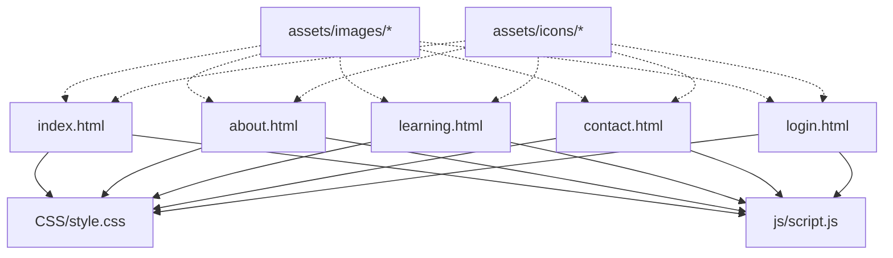
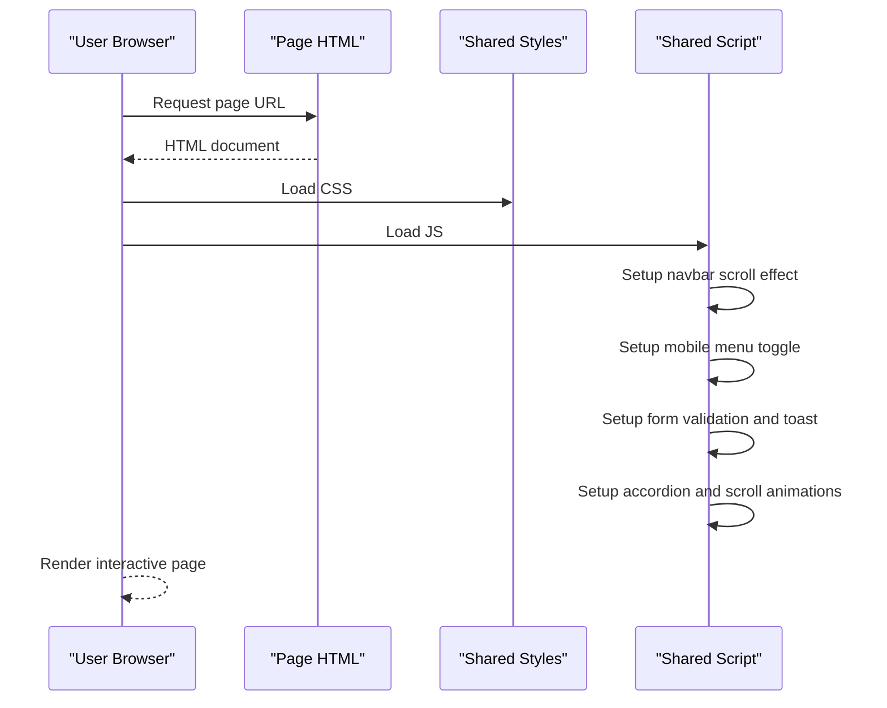
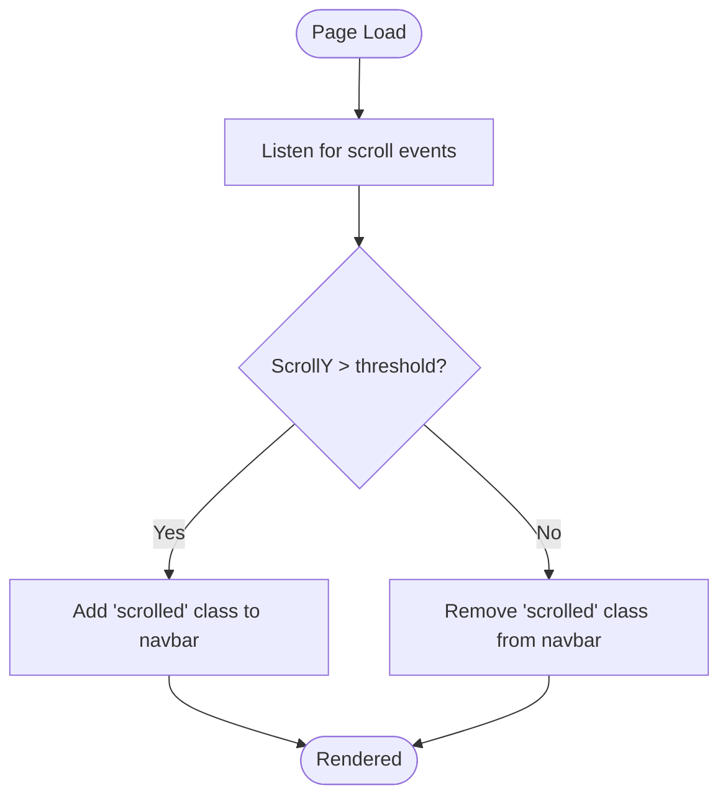
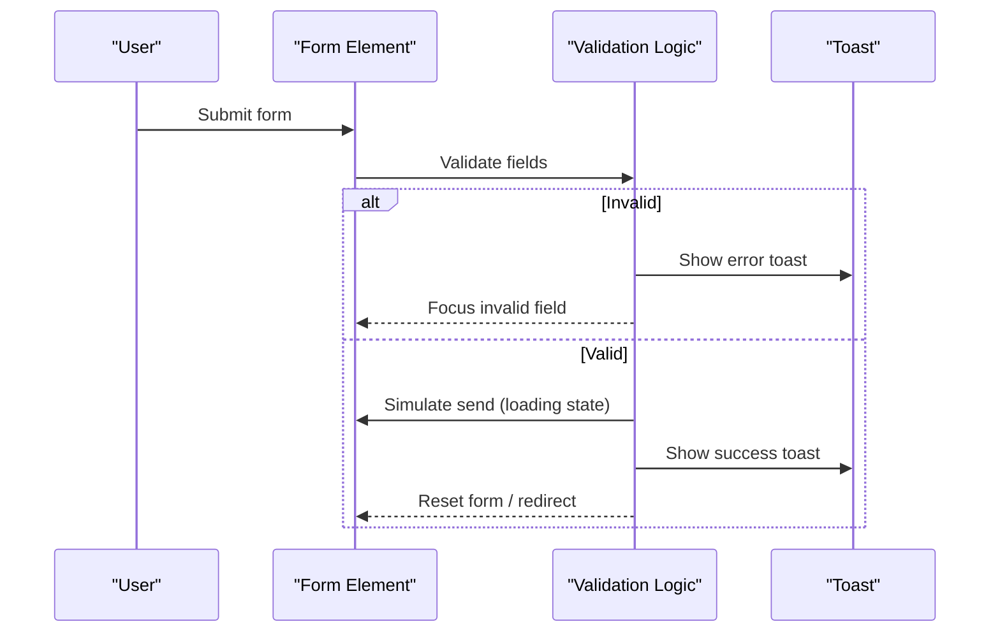
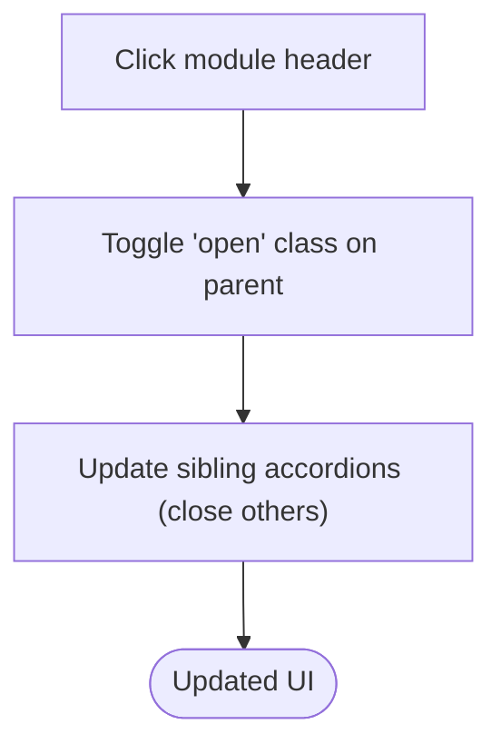
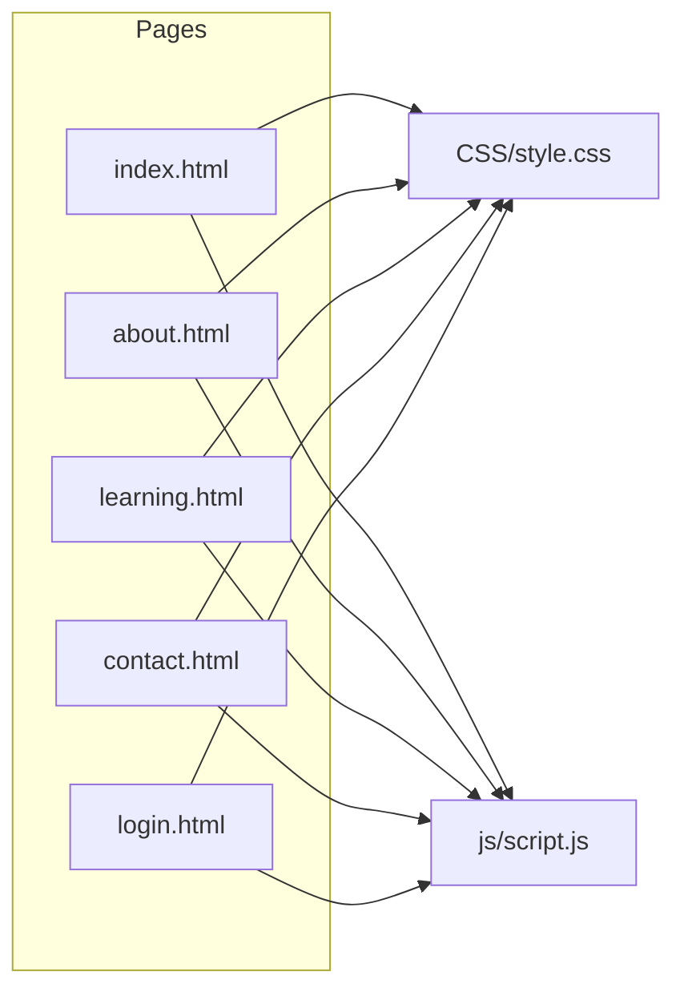

# Deployment & Maintenance

<cite>
**Referenced Files in This Document**
- [index.html](file://index.html)
- [about.html](file://about.html)
- [learning.html](file://learning.html)
- [contact.html](file://contact.html)
- [login.html](file://login.html)
- [style.css](file://CSS/style.css)
- [script.js](file://js/script.js)
</cite>

## Table of Contents
1. Introduction
2. Project Structure
3. Core Components
4. Architecture Overview
5. Detailed Component Analysis
6. Dependency Analysis
7. Performance Considerations
8. Troubleshooting Guide
9. Conclusion
10. Appendices

## Introduction
This document provides deployment and maintenance guidance for the Digital Bridges Zambia static website. The site is a pure static HTML/CSS/JS project with no build steps, making it straightforward to deploy on any static hosting platform. It includes multiple pages (Home, About, Learning, Contact, Login), shared styles and scripts, and lightweight client-side interactions such as navigation toggling, form validation feedback, and scroll animations.

The guide covers:
- Hosting options: GitHub Pages, Netlify, Vercel, and other static hosts
- Domain setup and SSL configuration
- Performance optimization for low-bandwidth environments typical in Zambian communities
- Maintenance procedures: updating content, adding modules, fixing bugs, monitoring performance
- Backup strategies and version control best practices

## Project Structure
The site is organized into clear folders for assets and code:
- Root HTML pages define the user-facing structure and link to shared CSS and JS
- CSS folder contains the global stylesheet used by all pages
- JS folder contains shared client-side behavior
- Assets folder holds images and icons referenced by pages

**Diagram sources**
- [index.html:7-8](file://index.html#L7-L8)
- [index.html:103-104](file://index.html#L103-L104)
- [about.html:7-8](file://about.html#L7-L8)
- [about.html:120-121](file://about.html#L120-L121)
- [learning.html:7-8](file://learning.html#L7-L8)
- [learning.html:134-135](file://learning.html#L134-L135)
- [contact.html:7-8](file://contact.html#L7-L8)
- [contact.html:99-100](file://contact.html#L99-L100)
- [login.html:7-8](file://login.html#L7-L8)
- [login.html:57-58](file://login.html#L57-L58)

**Section sources**
- [index.html:1-106](file://index.html#L1-L106)
- [about.html:1-123](file://about.html#L1-L123)
- [learning.html:1-137](file://learning.html#L1-L137)
- [contact.html:1-102](file://contact.html#L1-L102)
- [login.html:1-60](file://login.html#L1-L60)
- [style.css:1-247](file://CSS/style.css#L1-L247)
- [script.js:1-105](file://js/script.js#L1-L105)

## Core Components
- Pages: index.html (home), about.html, learning.html, contact.html, login.html
- Shared styles: style.css defines layout, colors, responsive rules, and UI components
- Shared behavior: script.js handles navbar scroll effects, mobile menu toggle, toast notifications, simple form validations, accordion toggles, scroll animations, and stats counter animation

Key characteristics:
- No server-side dependencies or build tools
- All pages reference the same CSS and JS files
- Lightweight interactivity implemented via vanilla JavaScript
- Mobile-first responsive design using CSS media queries

**Section sources**
- [style.css:1-247](file://CSS/style.css#L1-L247)
- [script.js:1-105](file://js/script.js#L1-L105)
- [index.html:10-25](file://index.html#L10-L25)
- [index.html:27-47](file://index.html#L27-L47)
- [index.html:58-75](file://index.html#L58-L75)
- [index.html:95-102](file://index.html#L95-L102)

## Architecture Overview
At runtime, each page loads the shared stylesheet and script, then renders content based on its HTML structure. Client-side logic enhances UX without requiring a backend.

**Diagram sources**
- [index.html:7-8](file://index.html#L7-L8)
- [index.html:103-104](file://index.html#L103-L104)
- [script.js:1-19](file://js/script.js#L1-L19)
- [script.js:21-41](file://js/script.js#L21-L41)
- [script.js:52-75](file://js/script.js#L52-L75)
- [script.js:77-105](file://js/script.js#L77-L105)

## Detailed Component Analysis

### Navigation and Mobile Menu
- The navbar becomes translucent and adds a shadow on scroll
- On small screens, a hamburger icon toggles a slide-in menu; clicking links closes the menu automatically

**Diagram sources**
- [script.js:1-3](file://js/script.js#L1-L3)
- [style.css:20-21](file://CSS/style.css#L20-L21)

**Section sources**
- [script.js:1-19](file://js/script.js#L1-L19)
- [style.css:20-37](file://CSS/style.css#L20-L37)

### Forms and Validation Feedback
- Login and contact forms validate inputs and show toast messages
- Buttons provide loading states during simulated submission flows

**Diagram sources**
- [script.js:21-41](file://js/script.js#L21-L41)
- [script.js:52-66](file://js/script.js#L52-L66)
- [contact.html:39-45](file://contact.html#L39-L45)
- [login.html:19-40](file://login.html#L19-L40)

**Section sources**
- [script.js:21-66](file://js/script.js#L21-L66)
- [contact.html:39-45](file://contact.html#L39-L45)
- [login.html:19-40](file://login.html#L19-L40)

### Accordion and Scroll Animations
- Module details expand/collapse via click handlers
- Elements animate into view when scrolled into viewport using IntersectionObserver

**Diagram sources**
- [script.js:68-75](file://js/script.js#L68-L75)
- [style.css:210-224](file://CSS/style.css#L210-L224)

**Section sources**
- [script.js:68-85](file://js/script.js#L68-L85)
- [style.css:210-224](file://CSS/style.css#L210-L224)

## Dependency Analysis
All pages depend on the shared stylesheet and script. There are no external libraries or frameworks.

**Diagram sources**
- [index.html:7-8](file://index.html#L7-L8)
- [index.html:103-104](file://index.html#L103-L104)
- [about.html:7-8](file://about.html#L7-L8)
- [about.html:120-121](file://about.html#L120-L121)
- [learning.html:7-8](file://learning.html#L7-L8)
- [learning.html:134-135](file://learning.html#L134-L135)
- [contact.html:7-8](file://contact.html#L7-L8)
- [contact.html:99-100](file://contact.html#L99-L100)
- [login.html:7-8](file://login.html#L7-L8)
- [login.html:57-58](file://login.html#L57-L58)

**Section sources**
- [index.html:1-106](file://index.html#L1-L106)
- [about.html:1-123](file://about.html#L1-L123)
- [learning.html:1-137](file://learning.html#L1-L137)
- [contact.html:1-102](file://contact.html#L1-L102)
- [login.html:1-60](file://login.html#L1-L60)

## Performance Considerations
Optimize for low-bandwidth environments common in Zambian communities:
- Keep assets minimal: prefer lightweight SVGs or optimized PNGs; avoid heavy video autoplay
- Use relative paths for CSS/JS to ensure efficient caching across pages
- Avoid large inline styles; keep styling centralized in style.css
- Defer non-critical JS if needed; currently script.js is loaded at the end of body for faster initial render
- Prefer system fonts already defined in CSS to reduce font downloads
- Minify CSS and JS before deployment to reduce payload size
- Enable compression (gzip/brotli) on your host
- Use browser caching headers for static assets where supported by your host

[No sources needed since this section provides general guidance]

## Troubleshooting Guide
Common issues and resolutions:
- Mobile menu not opening: verify that the hamburger element and navLinks IDs exist and that script.js is loaded
  - Section sources
    - [script.js:5-19](file://js/script.js#L5-L19)
    - [index.html:10-25](file://index.html#L10-L25)
- Toast messages not appearing: ensure a toast container exists and script runs after DOM load
  - Section sources
    - [script.js:21-28](file://js/script.js#L21-L28)
    - [contact.html:98-99](file://contact.html#L98-L99)
    - [login.html:56-57](file://login.html#L56-L57)
- Form validation errors: check input IDs match those referenced in script.js
  - Section sources
    - [script.js:31-41](file://js/script.js#L31-L41)
    - [script.js:52-66](file://js/script.js#L52-L66)
    - [contact.html:39-45](file://contact.html#L39-L45)
    - [login.html:19-40](file://login.html#L19-L40)
- Accordion not expanding: confirm module-detail-header elements exist and script is attached
  - Section sources
    - [script.js:68-75](file://js/script.js#L68-L75)
    - [learning.html:34-96](file://learning.html#L34-L96)
- Scroll animations not triggering: ensure elements have the correct classes and IntersectionObserver is initialized
  - Section sources
    - [script.js:77-86](file://js/script.js#L77-L86)
    - [style.css:210-224](file://CSS/style.css#L210-L224)

## Conclusion
Digital Bridges Zambia is a lightweight, accessible static website ideal for deployment on modern static hosting platforms. With careful asset management and performance tuning, it can deliver a fast experience even on low-bandwidth connections. Follow the deployment steps below to publish updates quickly and reliably, and use the maintenance checklist to keep the site secure, performant, and up-to-date.

[No sources needed since this section summarizes without analyzing specific files]

## Appendices

### Hosting Options and Deployment Steps

#### GitHub Pages
- Create a repository and push the project root (containing index.html and supporting files)
- In repository settings, enable GitHub Pages and select the branch and root folder
- Access the site at https://username.github.io/repository-name
- For custom domains: add a CNAME file with your domain and configure DNS accordingly
- SSL is automatically provided by GitHub Pages for both default and custom domains

**Section sources**
- [index.html:1-106](file://index.html#L1-L106)

#### Netlify
- Connect your Git repository or drag-and-drop the project folder
- Build command is not required; deploy directory should be the project root
- Configure redirects and headers if needed in netlify.toml or via UI
- Custom domains: add a domain in Site settings and follow DNS instructions
- SSL: automatic HTTPS enabled for all sites

**Section sources**
- [index.html:1-106](file://index.html#L1-L106)

#### Vercel
- Import the repository or upload the project folder
- Framework preset: Other (no framework)
- Build command: none; Output directory: . (project root)
- Custom domains: add in Domains settings and update DNS records
- SSL: automatic HTTPS for all deployments

**Section sources**
- [index.html:1-106](file://index.html#L1-L106)

#### Other Static Hosts
- Cloudflare Pages, Surge.sh, Firebase Hosting, AWS Amplify, Azure Static Web Apps also support static-only deployments
- General steps: push source, set root as deploy directory, configure custom domain and SSL

[No sources needed since this section provides general guidance]

### Domain Setup and SSL Configuration
- Purchase a domain and point it to your host via DNS (A record or CNAME)
- For GitHub Pages: add a CNAME file with your domain and configure DNS per provider
- For Netlify/Vercel: add domain in platform settings and follow DNS verification steps
- SSL/TLS:
  - GitHub Pages: automatic for default and custom domains
  - Netlify: automatic HTTPS; optional advanced TLS settings available
  - Vercel: automatic HTTPS; custom certificates supported
- Ensure all internal links use HTTPS and avoid mixed content warnings

[No sources needed since this section provides general guidance]

### Performance Optimization Checklist
- Compress assets (images, SVGs); remove unused assets
- Minify CSS and JS before deployment
- Use efficient selectors and avoid heavy animations on low-end devices
- Leverage browser caching and CDN features offered by your host
- Monitor performance using Lighthouse or WebPageTest; aim for fast First Contentful Paint and low Total Blocking Time

[No sources needed since this section provides general guidance]

### Maintenance Procedures

#### Updating Content
- Edit HTML text directly in the relevant page files
- Update shared styles in style.css for consistent look and feel
- Test changes locally by opening index.html in a browser
- Commit changes and push to your hosting platform for live updates

**Section sources**
- [index.html:27-75](file://index.html#L27-L75)
- [about.html:26-94](file://about.html#L26-L94)
- [learning.html:26-98](file://learning.html#L26-L98)
- [contact.html:26-65](file://contact.html#L26-L65)
- [style.css:1-247](file://CSS/style.css#L1-L247)

#### Adding New Modules
- Create a new HTML page or extend an existing one (e.g., learning.html)
- Reuse existing CSS classes and patterns for consistency
- If adding interactive behavior, extend script.js with new event listeners
- Ensure accessibility attributes and mobile responsiveness are maintained

**Section sources**
- [learning.html:34-96](file://learning.html#L34-L96)
- [style.css:210-224](file://CSS/style.css#L210-L224)
- [script.js:68-85](file://js/script.js#L68-L85)

#### Fixing Bugs
- Identify affected page(s) and shared files
- Reproduce the issue locally; inspect console for errors
- Apply targeted fixes in HTML/CSS/JS; test across devices and browsers
- Deploy incremental updates and verify resolution

**Section sources**
- [script.js:1-105](file://js/script.js#L1-L105)
- [style.css:1-247](file://CSS/style.css#L1-L247)

#### Monitoring Site Performance
- Use Lighthouse to audit performance, accessibility, and SEO
- Track Core Web Vitals (LCP, FID, CLS) over time
- Set up uptime monitoring and error logging if integrating third-party services
- Review analytics (if added later) to understand usage patterns

[No sources needed since this section provides general guidance]

### Backup Strategies and Version Control Best Practices
- Version control:
  - Use Git to track changes; commit frequently with descriptive messages
  - Maintain branches for features and bug fixes; merge via pull requests
  - Tag releases for major updates and rollbacks
- Backups:
  - Keep a remote copy of the repository (GitHub/GitLab/Bitbucket)
  - Export snapshots of deployed content periodically
  - Store backups securely with access controls
- Change management:
  - Document changes in a changelog
  - Review and test changes before merging to main branch
  - Automate deployments via CI/CD pipelines where possible

[No sources needed since this section provides general guidance]