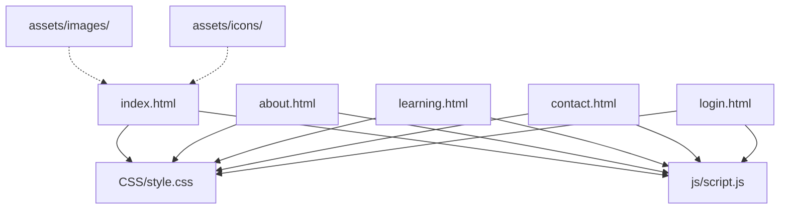
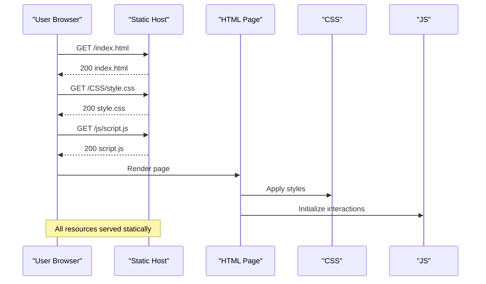
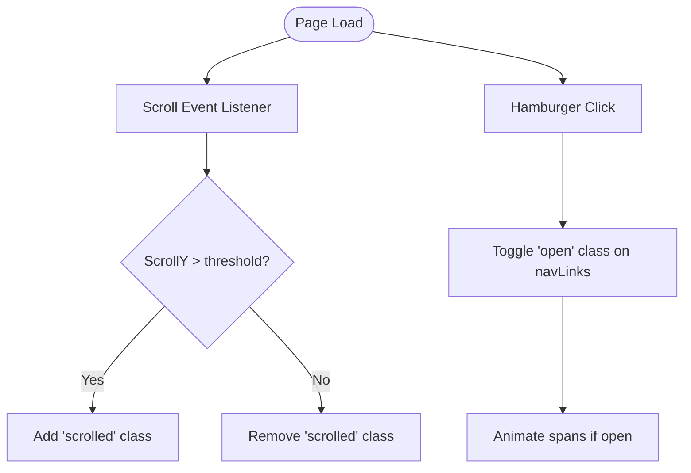
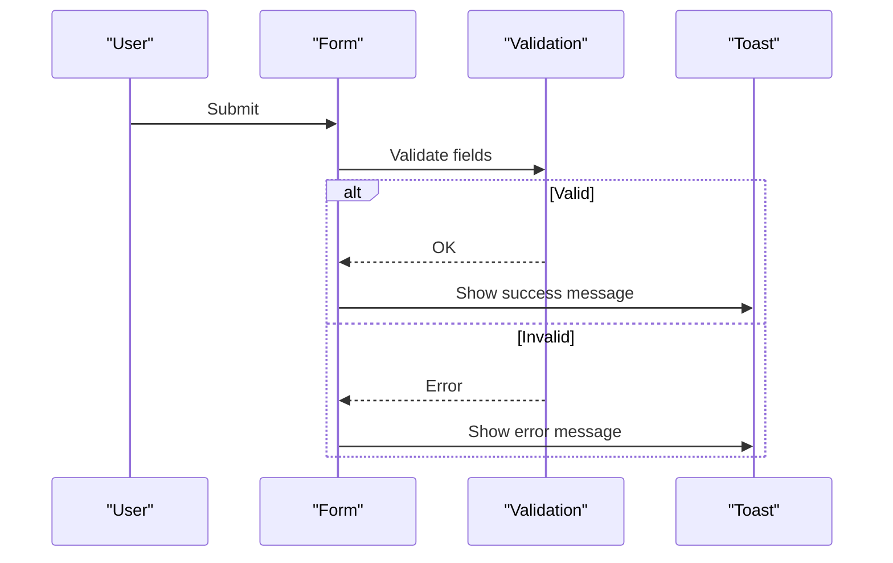
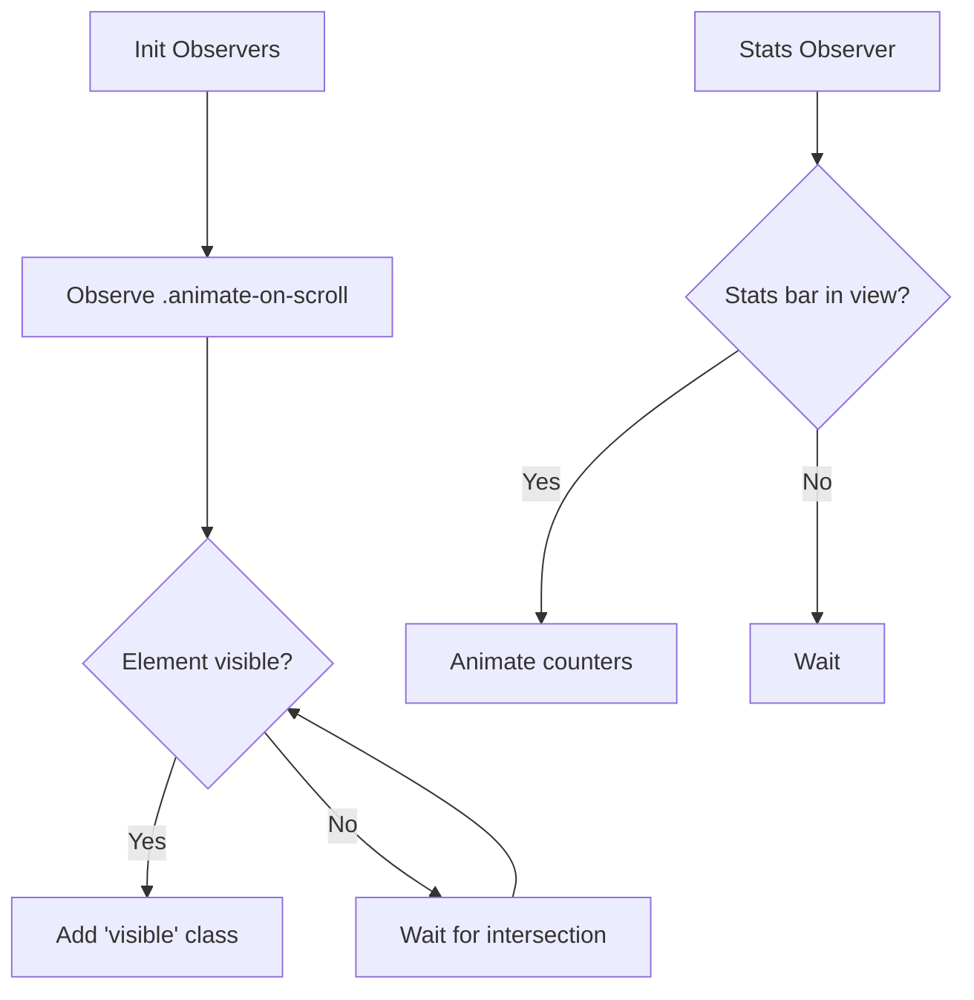
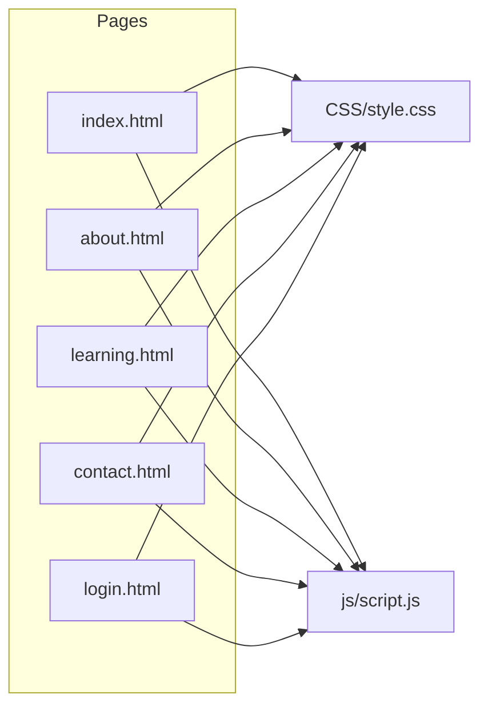

# Hosting & Setup

<cite>
**Referenced Files in This Document**
- [index.html](file://index.html)
- [about.html](file://about.html)
- [learning.html](file://learning.html)
- [contact.html](file://contact.html)
- [login.html](file://login.html)
- [style.css](file://CSS/style.css)
- [script.js](file://js/script.js)
</cite>

## Table of Contents
1. [Introduction](#introduction)
2. [Project Structure](#project-structure)
3. [Core Components](#core-components)
4. [Architecture Overview](#architecture-overview)
5. [Detailed Component Analysis](#detailed-component-analysis)
6. [Dependency Analysis](#dependency-analysis)
7. [Performance Considerations](#performance-considerations)
8. [Troubleshooting Guide](#troubleshooting-guide)
9. [Conclusion](#conclusion)
10. [Appendices](#appendices)

## Introduction
This document provides step-by-step hosting and setup instructions for the Digital Bridges Zambia static website. It covers deployment to GitHub Pages, Netlify, Vercel, and other popular static site hosts; configuring custom domains and SSL; managing environment variables; optimizing performance for low-bandwidth environments typical in Zambian communities; browser compatibility and testing procedures; and troubleshooting common deployment issues.

The project is a pure static site composed of HTML pages, a shared stylesheet, and a single JavaScript file. There are no build steps or server-side dependencies, which simplifies deployment across all major static hosting platforms.

## Project Structure
The site consists of:
- Multiple HTML pages (home, about, learning, contact, login)
- A shared CSS stylesheet
- A shared JavaScript file
- Asset directories for images and icons

**Diagram sources**
- [index.html:1-106](file://index.html#L1-L106)
- [about.html:1-123](file://about.html#L1-L123)
- [learning.html:1-137](file://learning.html#L1-L137)
- [contact.html:1-102](file://contact.html#L1-L102)
- [login.html:1-60](file://login.html#L1-L60)
- [style.css:1-247](file://CSS/style.css#L1-L247)
- [script.js:1-105](file://js/script.js#L1-L105)

**Section sources**
- [index.html:1-106](file://index.html#L1-L106)
- [style.css:1-247](file://CSS/style.css#L1-L247)
- [script.js:1-105](file://js/script.js#L1-L105)

## Core Components
- Static HTML pages define the user interface and navigation structure. Each page includes the shared stylesheet and script.
- The stylesheet defines responsive layouts, typography, colors, and component styles used across all pages.
- The JavaScript file handles interactive behaviors such as mobile menu toggling, form validation feedback via toast notifications, scroll-based animations, and simple client-side interactions.

Key implementation notes relevant to hosting:
- All assets are referenced with relative paths, making them compatible with any static host that serves files from the repository root.
- No build tooling or bundlers are required; deploy the repository as-is.

**Section sources**
- [index.html:1-106](file://index.html#L1-L106)
- [style.css:1-247](file://CSS/style.css#L1-L247)
- [script.js:1-105](file://js/script.js#L1-L105)

## Architecture Overview
At runtime, browsers request an HTML page, then load the shared CSS and JS. The JS manipulates DOM elements to provide interactivity. There are no server calls in this version; forms simulate submission locally.

**Diagram sources**
- [index.html:1-106](file://index.html#L1-L106)
- [style.css:1-247](file://CSS/style.css#L1-L247)
- [script.js:1-105](file://js/script.js#L1-L105)

## Detailed Component Analysis

### Navigation and Mobile Menu
- The navbar toggles a scrolled state on scroll and opens/closes a mobile menu using class toggles.
- The hamburger button triggers menu open/close and animates its spans when open.

**Diagram sources**
- [script.js:1-19](file://js/script.js#L1-L19)
- [style.css:19-36](file://CSS/style.css#L19-L36)

**Section sources**
- [script.js:1-19](file://js/script.js#L1-L19)
- [style.css:19-36](file://CSS/style.css#L19-L36)

### Forms and Toast Notifications
- Contact and login forms validate inputs and show success/error messages via a toast element.
- The toast is appended to the DOM and animated with CSS transitions.

**Diagram sources**
- [contact.html:37-45](file://contact.html#L37-L45)
- [login.html:19-40](file://login.html#L19-L40)
- [script.js:21-66](file://js/script.js#L21-L66)
- [style.css:182-186](file://CSS/style.css#L182-L186)

**Section sources**
- [contact.html:37-45](file://contact.html#L37-L45)
- [login.html:19-40](file://login.html#L19-L40)
- [script.js:21-66](file://js/script.js#L21-L66)
- [style.css:182-186](file://CSS/style.css#L182-L186)

### Scroll Animations and Stats Counter
- IntersectionObserver triggers fade-in animations for elements with a specific class.
- A stats counter animates numbers when the stats bar enters the viewport.

**Diagram sources**
- [script.js:77-104](file://js/script.js#L77-L104)
- [style.css:210-224](file://CSS/style.css#L210-L224)

**Section sources**
- [script.js:77-104](file://js/script.js#L77-L104)
- [style.css:210-224](file://CSS/style.css#L210-L224)

## Dependency Analysis
- All pages depend on the shared stylesheet and script.
- Paths are relative, so the site can be deployed to any directory structure supported by static hosts.

**Diagram sources**
- [index.html:1-106](file://index.html#L1-L106)
- [about.html:1-123](file://about.html#L1-L123)
- [learning.html:1-137](file://learning.html#L1-L137)
- [contact.html:1-102](file://contact.html#L1-L102)
- [login.html:1-60](file://login.html#L1-L60)
- [style.css:1-247](file://CSS/style.css#L1-L247)
- [script.js:1-105](file://js/script.js#L1-L105)

**Section sources**
- [index.html:1-106](file://index.html#L1-L106)
- [style.css:1-247](file://CSS/style.css#L1-L247)
- [script.js:1-105](file://js/script.js#L1-L105)

## Performance Considerations
Optimizations tailored for low-bandwidth environments common in Zambian communities:

- Image optimization
  - Use modern formats (WebP/AVIF) where supported and provide fallbacks.
  - Resize images to display dimensions; avoid oversized files.
  - Implement lazy loading for off-screen images to reduce initial payload.
  - Prefer SVG for icons and simple graphics to keep assets small and crisp.

- Caching strategies
  - Enable long-term caching for immutable assets (e.g., hashed filenames) and short cache for HTML.
  - Configure CDN cache headers (Cache-Control, ETag) to maximize reuse across visits.
  - Leverage browser caching for CSS/JS by setting appropriate max-age values.

- CDN configuration
  - Serve assets through a global CDN to reduce latency for users across Zambia.
  - Enable HTTP/2 and Brotli/Gzip compression at the CDN level.
  - Use edge caching rules to prioritize critical resources (HTML, CSS, JS).

- Network resilience
  - Minimize third-party scripts; defer non-critical JS.
  - Preload critical fonts and above-the-fold resources.
  - Avoid heavy animations on low-end devices; consider reducing motion for accessibility and performance.

- Accessibility and usability
  - Ensure sufficient color contrast and readable font sizes.
  - Provide keyboard navigation and screen reader-friendly labels.
  - Test on low-resolution screens and older browsers commonly used in community settings.

[No sources needed since this section provides general guidance]

## Troubleshooting Guide
Common deployment issues and resolutions:

- Custom domain not resolving
  - Verify DNS records (A/CNAME) point to the correct provider endpoints.
  - Allow propagation time; use dig/nslookup to check current resolution.
  - Ensure the domain is added and verified in the hosting dashboard.

- SSL certificate errors
  - Confirm the platform’s automatic HTTPS is enabled for your custom domain.
  - If using a custom certificate, ensure it is correctly uploaded and matches the domain.
  - Clear browser cache or try incognito mode to rule out stale certificates.

- 404 Not Found on routes
  - For pure static sites, ensure each page exists at the expected path.
  - On some platforms, configure SPA-style routing only if you have a build step; otherwise, rely on real file paths.

- Assets not loading
  - Check that asset paths match the deployed directory structure.
  - Validate CORS policies if using external resources.
  - Inspect network tab for blocked requests or incorrect MIME types.

- Forms not submitting
  - In this project, forms simulate submission; integrate a backend or service if actual submissions are required.
  - Ensure form IDs and event listeners exist and are not overridden by errors.

- Mobile menu not working
  - Verify the hamburger and nav links IDs match those referenced in the script.
  - Check console for JavaScript errors that might prevent initialization.

**Section sources**
- [contact.html:37-45](file://contact.html#L37-L45)
- [login.html:19-40](file://login.html#L19-L40)
- [script.js:1-105](file://js/script.js#L1-L105)

## Conclusion
Digital Bridges Zambia is a lightweight, accessible static website that can be deployed quickly to any major static hosting platform. By following the steps below, you can publish the site, attach a custom domain with SSL, optimize for low-bandwidth contexts, and test across devices and networks to ensure reliable access for Zambian communities.

## Appendices

### Deployment Guides

#### GitHub Pages
- Create a new repository and push the project files.
- Go to Settings > Pages and select the branch (e.g., main) and root folder.
- Access the site at https://yourusername.github.io/repository-name.
- To add a custom domain:
  - In Pages settings, add your domain and follow DNS instructions.
  - Upload a CNAME file if required by GitHub.
  - Enable Enforce HTTPS after DNS propagates.

**Section sources**
- [index.html:1-106](file://index.html#L1-L106)
- [style.css:1-247](file://CSS/style.css#L1-L247)
- [script.js:1-105](file://js/script.js#L1-L105)

#### Netlify
- Connect your Git repository to Netlify.
- Build settings: No build command needed; publish directory set to root.
- Deploy automatically on push.
- Custom domain:
  - Add domain in Site settings > Domain management.
  - Configure DNS per Netlify instructions.
  - Enable Automatic HTTPS.

**Section sources**
- [index.html:1-106](file://index.html#L1-L106)
- [style.css:1-247](file://CSS/style.css#L1-L247)
- [script.js:1-105](file://js/script.js#L1-L105)

#### Vercel
- Import the repository from Git.
- Framework preset: Other; Build output directory: root.
- Deploy instantly.
- Custom domain:
  - Add domain in Domains settings.
  - Update DNS as instructed by Vercel.
  - Enable HTTPS automatically.

**Section sources**
- [index.html:1-106](file://index.html#L1-L106)
- [style.css:1-247](file://CSS/style.css#L1-L247)
- [script.js:1-105](file://js/script.js#L1-L105)

#### Cloudflare Pages
- Connect repository and select root as publish directory.
- No build step required.
- Custom domain:
  - Add domain in Cloudflare and verify ownership.
  - Point DNS to Cloudflare and enable Always Use HTTPS.

**Section sources**
- [index.html:1-106](file://index.html#L1-L106)
- [style.css:1-247](file://CSS/style.css#L1-L247)
- [script.js:1-105](file://js/script.js#L1-L105)

### Environment Variables
- This project does not currently read environment variables. If you later add client-side features requiring keys or endpoints:
  - Store secrets in the hosting platform’s environment variables.
  - Expose only public values to the browser; never store secrets in client code.
  - Use a secure backend or serverless function to handle sensitive operations.

[No sources needed since this section provides general guidance]

### Browser Compatibility and Testing
- Target modern evergreen browsers (Chrome, Firefox, Safari, Edge) and ensure graceful degradation for older versions.
- Test on mobile devices with limited bandwidth and storage.
- Use device emulators and network throttling to simulate low-speed connections.
- Validate accessibility with screen readers and keyboard-only navigation.

[No sources needed since this section provides general guidance]