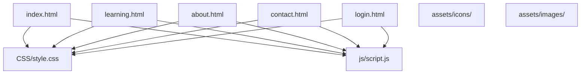
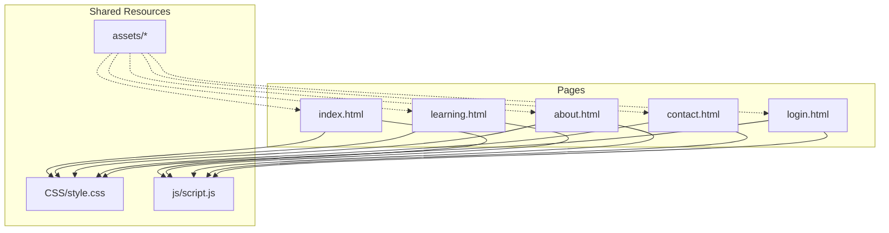
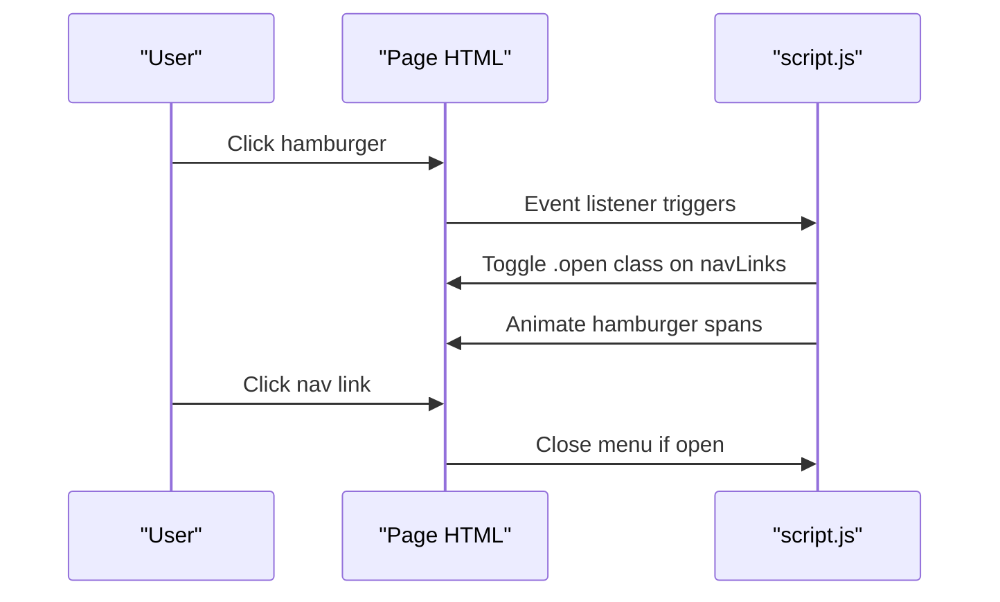
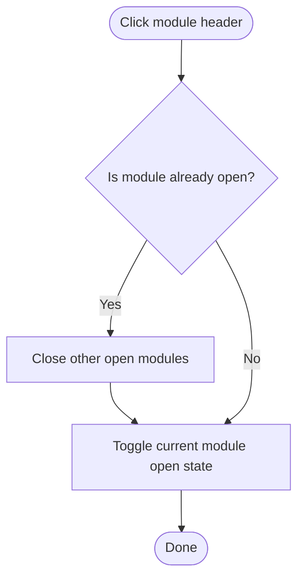
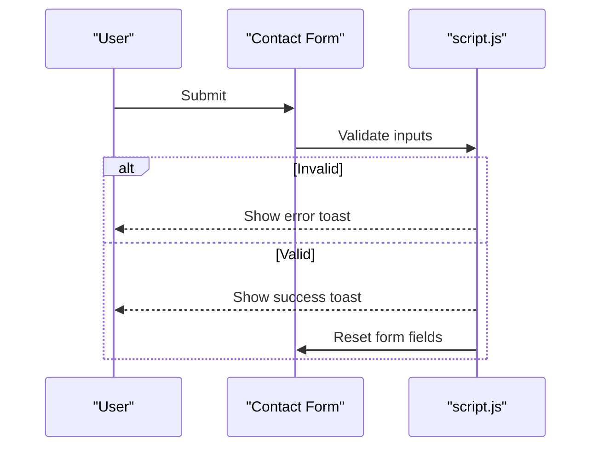
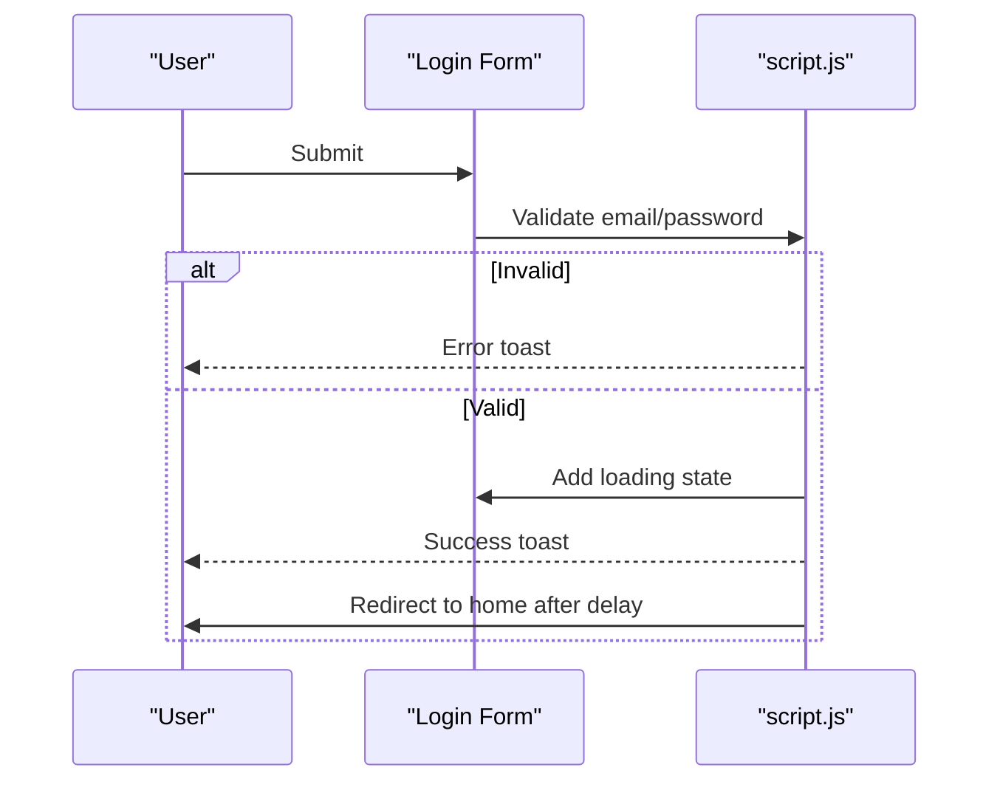
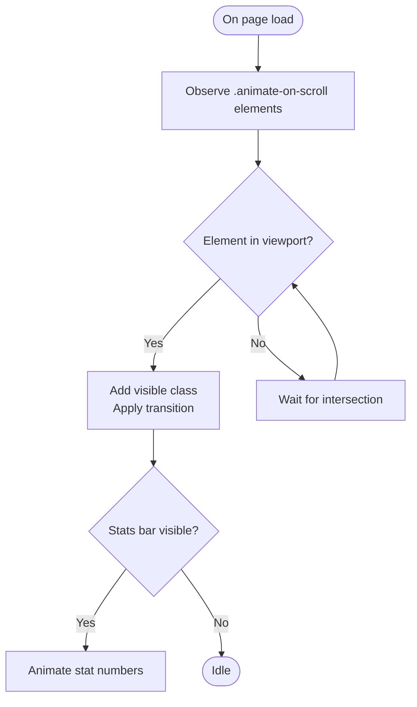
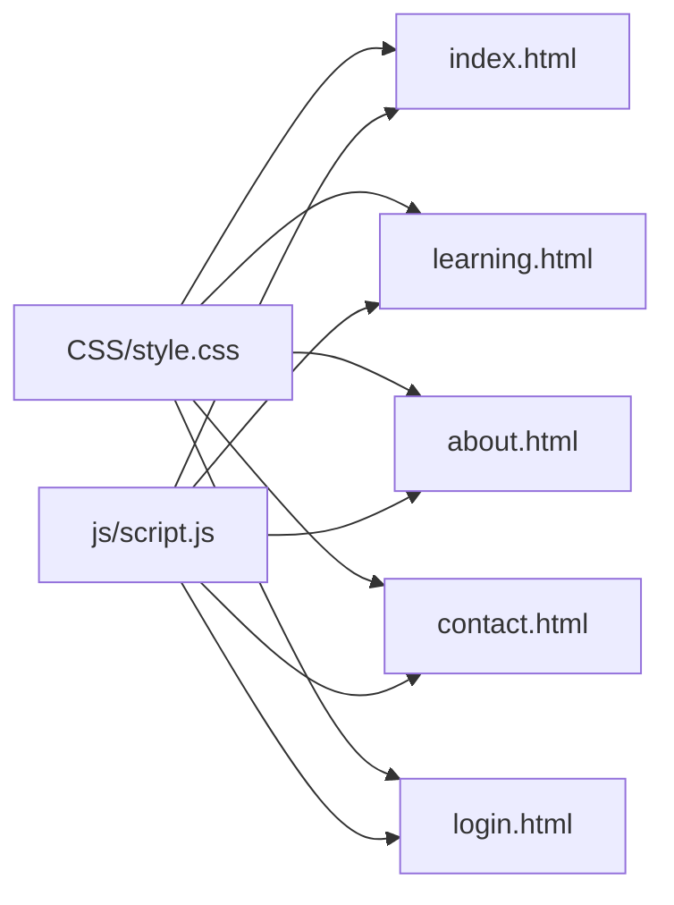

# Maintenance & Updates

<cite>
**Referenced Files in This Document**
- [index.html](file://index.html)
- [learning.html](file://learning.html)
- [about.html](file://about.html)
- [contact.html](file://contact.html)
- [login.html](file://login.html)
- [style.css](file://CSS/style.css)
- [script.js](file://js/script.js)
</cite>

## Table of Contents
1. [Introduction](#introduction)
2. [Project Structure](#project-structure)
3. [Core Components](#core-components)
4. [Architecture Overview](#architecture-overview)
5. [Detailed Component Analysis](#detailed-component-analysis)
6. [Dependency Analysis](#dependency-analysis)
7. [Performance Considerations](#performance-considerations)
8. [Troubleshooting Guide](#troubleshooting-guide)
9. [Conclusion](#conclusion)
10. [Appendices](#appendices)

## Introduction
This document provides maintenance and update procedures for the Digital Bridges Zambia website. It covers content updates (adding training modules, editing existing content, modifying contact information), version control best practices with Git, accessibility standards, cross-browser/device testing, performance monitoring, bug identification and resolution, security updates, backup strategies, adding new features, extending functionality, managing dependencies, and ongoing site health optimization.

## Project Structure
The site is a static, client-side website composed of HTML pages, a shared stylesheet, and a single JavaScript file that powers interactive behaviors. Assets are organized under an assets folder for future media.

Key files:
- Pages: index.html, learning.html, about.html, contact.html, login.html
- Styles: CSS/style.css
- Behavior: js/script.js
- Media placeholders: assets/icons/, assets/images/

**Diagram sources**
- [index.html:1-106](file://index.html#L1-L106)
- [learning.html:1-137](file://learning.html#L1-L137)
- [about.html:1-123](file://about.html#L1-L123)
- [contact.html:1-102](file://contact.html#L1-L102)
- [login.html:1-60](file://login.html#L1-L60)
- [style.css:1-247](file://CSS/style.css#L1-L247)
- [script.js:1-105](file://js/script.js#L1-L105)

**Section sources**
- [index.html:1-106](file://index.html#L1-L106)
- [learning.html:1-137](file://learning.html#L1-L137)
- [about.html:1-123](file://about.html#L1-L123)
- [contact.html:1-102](file://contact.html#L1-L102)
- [login.html:1-60](file://login.html#L1-L60)
- [style.css:1-247](file://CSS/style.css#L1-L247)
- [script.js:1-105](file://js/script.js#L1-L105)

## Core Components
- Navigation and global UI: Shared across all pages via consistent markup and styles; mobile menu toggling handled by script.js.
- Content sections: Hero, stats, modules grid, page banners, contact form, login form.
- Interactivity: Scroll effects, accordion behavior for module details, toast notifications, form validation, animated counters.

Maintenance implications:
- Centralized styling ensures consistent updates across pages.
- Single JS file centralizes behavior; changes should be scoped to avoid unintended side effects.
- Static content means updates are straightforward edits to HTML or CSS.

**Section sources**
- [style.css:19-36](file://CSS/style.css#L19-L36)
- [script.js:1-19](file://js/script.js#L1-L19)
- [script.js:68-85](file://js/script.js#L68-L85)
- [script.js:88-105](file://js/script.js#L88-L105)

## Architecture Overview
The site follows a simple static architecture:
- HTML pages define structure and content.
- CSS defines visual design and responsive behavior.
- JavaScript adds interactivity without server-side logic.

**Diagram sources**
- [index.html:1-106](file://index.html#L1-L106)
- [learning.html:1-137](file://learning.html#L1-L137)
- [about.html:1-123](file://about.html#L1-L123)
- [contact.html:1-102](file://contact.html#L1-L102)
- [login.html:1-60](file://login.html#L1-L60)
- [style.css:1-247](file://CSS/style.css#L1-L247)
- [script.js:1-105](file://js/script.js#L1-L105)

## Detailed Component Analysis

### Navigation and Mobile Menu
- The navbar appears fixed at the top and gains a shadow on scroll.
- Mobile menu toggles via a hamburger button; links close the menu when clicked.
- Maintain consistency by editing the nav markup in each page and ensuring IDs match script expectations.

**Diagram sources**
- [style.css:19-36](file://CSS/style.css#L19-L36)
- [script.js:1-19](file://js/script.js#L1-L19)

**Section sources**
- [style.css:19-36](file://CSS/style.css#L19-L36)
- [script.js:1-19](file://js/script.js#L1-L19)

### Module Accordion (Learning Page)
- Each module header toggles visibility of description and topics list.
- Only one module can be expanded at a time.

**Diagram sources**
- [learning.html:34-96](file://learning.html#L34-L96)
- [script.js:68-75](file://js/script.js#L68-L75)

**Section sources**
- [learning.html:34-96](file://learning.html#L34-L96)
- [script.js:68-75](file://js/script.js#L68-L75)

### Contact Form Validation and Feedback
- Validates name, email format, subject selection, and message length.
- Shows toast messages for success or errors; resets form on success.

**Diagram sources**
- [contact.html:37-46](file://contact.html#L37-L46)
- [script.js:52-66](file://js/script.js#L52-L66)

**Section sources**
- [contact.html:37-46](file://contact.html#L37-L46)
- [script.js:52-66](file://js/script.js#L52-L66)

### Login Flow (Frontend Simulation)
- Validates email presence and format, password length.
- Simulates sign-in with loading state and redirects after success.

**Diagram sources**
- [login.html:19-40](file://login.html#L19-L40)
- [script.js:30-41](file://js/script.js#L30-L41)

**Section sources**
- [login.html:19-40](file://login.html#L19-L40)
- [script.js:30-41](file://js/script.js#L30-L41)

### Scroll Animations and Stats Counter
- Elements with a specific class animate into view using IntersectionObserver.
- Stats numbers animate when visible.

**Diagram sources**
- [script.js:77-85](file://js/script.js#L77-L85)
- [script.js:88-105](file://js/script.js#L88-L105)

**Section sources**
- [script.js:77-85](file://js/script.js#L77-L85)
- [script.js:88-105](file://js/script.js#L88-L105)

## Dependency Analysis
- All pages depend on style.css for layout and theme.
- All pages depend on script.js for interactivity.
- No external libraries are used; dependencies are minimal and local.

**Diagram sources**
- [style.css:1-247](file://CSS/style.css#L1-L247)
- [script.js:1-105](file://js/script.js#L1-L105)
- [index.html:1-106](file://index.html#L1-L106)
- [learning.html:1-137](file://learning.html#L1-L137)
- [about.html:1-123](file://about.html#L1-L123)
- [contact.html:1-102](file://contact.html#L1-L102)
- [login.html:1-60](file://login.html#L1-L60)

**Section sources**
- [style.css:1-247](file://CSS/style.css#L1-L247)
- [script.js:1-105](file://js/script.js#L1-L105)

## Performance Considerations
- Keep CSS variables centralized for consistent theming and easy updates.
- Avoid heavy images; use optimized assets in assets/images/.
- Use semantic HTML to improve rendering and accessibility.
- Minimize DOM manipulations in script.js; leverage event delegation where appropriate.
- Test performance on low-end devices and slow networks typical of target communities.

[No sources needed since this section provides general guidance]

## Troubleshooting Guide
Common issues and resolutions:
- Mobile menu not closing: Ensure IDs match script expectations and classes toggle correctly.
- Accordion not expanding: Verify headers have correct class and script is loaded.
- Toast not showing: Confirm toast element exists and script runs without errors.
- Form validation errors: Check input IDs and required attributes; ensure script references exist.
- Scroll animations not triggering: Ensure elements have the correct class and are within viewport.

Debugging steps:
- Open browser DevTools Console to inspect errors.
- Use Network tab to verify resources load (CSS, JS).
- Inspect DOM to confirm classes and IDs are present.
- Temporarily disable script to isolate CSS-only issues.

**Section sources**
- [script.js:1-19](file://js/script.js#L1-L19)
- [script.js:21-28](file://js/script.js#L21-L28)
- [script.js:68-85](file://js/script.js#L68-L85)

## Conclusion
The Digital Bridges Zambia website is a well-structured static site with clear separation of concerns between HTML, CSS, and JavaScript. Maintenance tasks are straightforward due to the simplicity of the codebase. Following the procedures outlined here will help teams update content reliably, maintain accessibility, test thoroughly, monitor performance, and manage changes safely with version control.

[No sources needed since this section summarizes without analyzing specific files]

## Appendices

### Content Update Workflows
- Adding a new training module:
  - Create or edit a module card in the modules grid on index.html and add a corresponding detailed section in learning.html following existing patterns.
  - Ensure consistent numbering and topic chips.
  - Test accordion behavior and responsive layout.
- Updating existing content:
  - Edit text directly in the relevant HTML sections.
  - If changing colors or spacing, adjust CSS variables or component styles in style.css.
- Modifying contact information:
  - Update location, email, phone, and office hours in contact.html.
  - Verify form labels and placeholders remain accurate.

**Section sources**
- [index.html:65-73](file://index.html#L65-L73)
- [learning.html:34-96](file://learning.html#L34-L96)
- [contact.html:28-46](file://contact.html#L28-L46)

### Version Control Best Practices (Git)
- Branching strategy:
  - Use feature branches for new modules or features.
  - Use hotfix branches for urgent bug fixes.
  - Merge to main only after review and testing.
- Commit conventions:
  - Write clear, descriptive commit messages.
  - Group related changes in single commits.
- Collaboration:
  - Pull before pushing to avoid conflicts.
  - Use pull requests for peer review.
- Tagging releases:
  - Tag stable versions for rollback capability.

[No sources needed since this section provides general guidance]

### Accessibility Standards
- Semantic HTML:
  - Use proper headings hierarchy and landmarks.
  - Ensure forms have associated labels and accessible names.
- Keyboard navigation:
  - Verify focus order and visible focus states.
- Color contrast:
  - Check contrast ratios against background colors.
- Screen readers:
  - Provide meaningful alt text for images and icons.
- Testing:
  - Use built-in accessibility tools in browsers.
  - Test with keyboard-only navigation.

**Section sources**
- [style.css:143-178](file://CSS/style.css#L143-L178)
- [contact.html:37-46](file://contact.html#L37-L46)
- [login.html:19-40](file://login.html#L19-L40)

### Cross-Browser and Device Testing
- Test on major browsers (Chrome, Firefox, Safari, Edge).
- Validate responsive layouts on common screen sizes.
- Check mobile menu behavior and touch interactions.
- Verify form inputs and validation feedback across platforms.

[No sources needed since this section provides general guidance]

### Monitoring Site Performance Metrics
- Use browser DevTools Performance and Lighthouse to measure:
  - Load times, first contentful paint, and total blocking time.
- Track user engagement:
  - Monitor bounce rate and interaction with modules and forms.
- Optimize assets:
  - Compress images and defer non-critical scripts if needed.

[No sources needed since this section provides general guidance]

### Bug Identification and Resolution
- Reproduce the issue consistently.
- Isolate the cause (HTML structure, CSS styling, or JS behavior).
- Apply targeted fixes and validate with tests.
- Log bugs with steps to reproduce and environment details.

**Section sources**
- [script.js:21-28](file://js/script.js#L21-L28)
- [script.js:30-41](file://js/script.js#L30-L41)
- [script.js:52-66](file://js/script.js#L52-L66)

### Security Updates
- Input validation:
  - Ensure client-side validation is robust; implement server-side validation if backend is added.
- Password handling:
  - Do not log or store sensitive data in plain text.
- External integrations:
  - When adding social login or third-party services, follow secure configuration practices.

**Section sources**
- [login.html:19-40](file://login.html#L19-L40)
- [script.js:30-41](file://js/script.js#L30-L41)

### Backup Strategies
- Regularly back up repository history and any local assets.
- Use remote hosting (e.g., GitHub) for versioned backups.
- Archive snapshots before major updates.

[No sources needed since this section provides general guidance]

### Adding New Features and Extending Functionality
- Plan changes:
  - Define scope and impact on existing components.
- Implement incrementally:
  - Add small, testable changes; verify in isolation.
- Extend CSS and JS carefully:
  - Avoid global overrides; prefer modular styles and functions.
- Document changes:
  - Update this maintenance guide with new procedures.

[No sources needed since this section provides general guidance]

### Managing Dependencies
- Current setup has no external dependencies beyond standard web APIs.
- If adding libraries:
  - Prefer CDN with integrity checks or package managers.
  - Keep versions pinned and regularly updated.
  - Audit for security vulnerabilities.

[No sources needed since this section provides general guidance]

### Ongoing Site Health Optimization
- Periodically audit content accuracy and links.
- Refresh imagery and optimize file sizes.
- Review analytics for usability insights.
- Refactor code to improve maintainability and performance.

[No sources needed since this section provides general guidance]