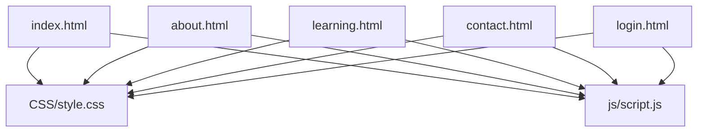
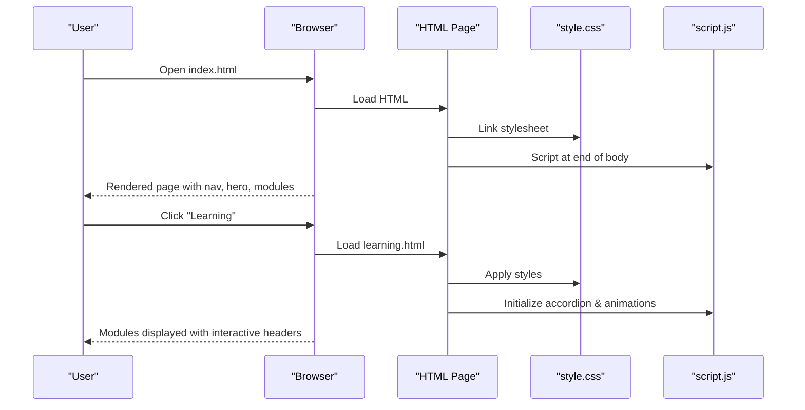
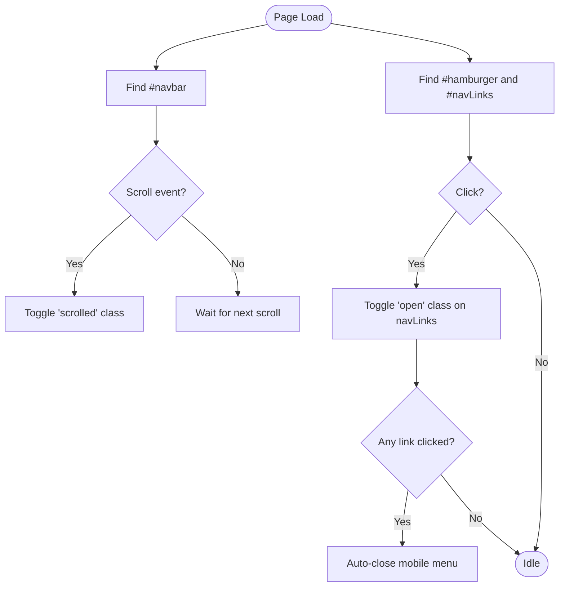
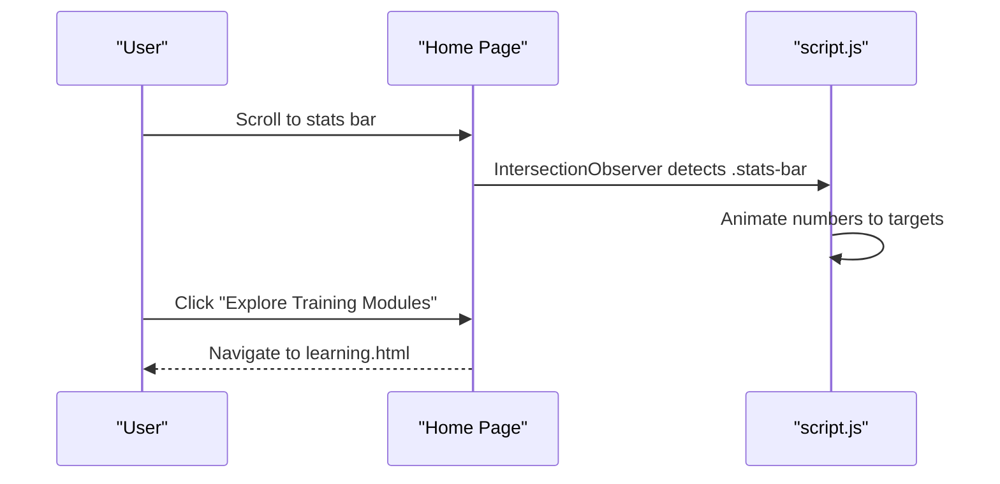
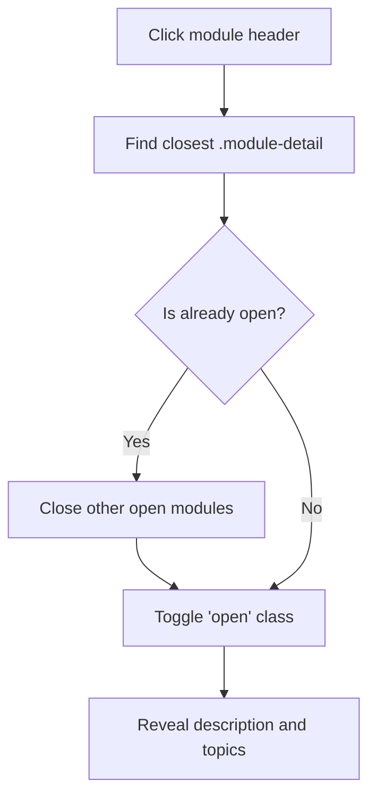
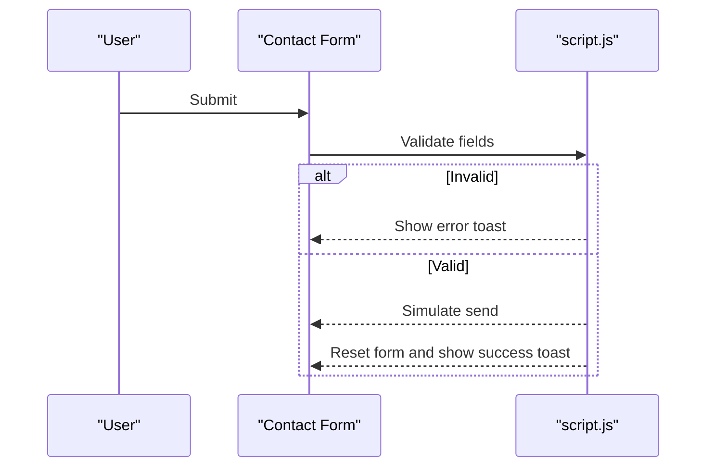
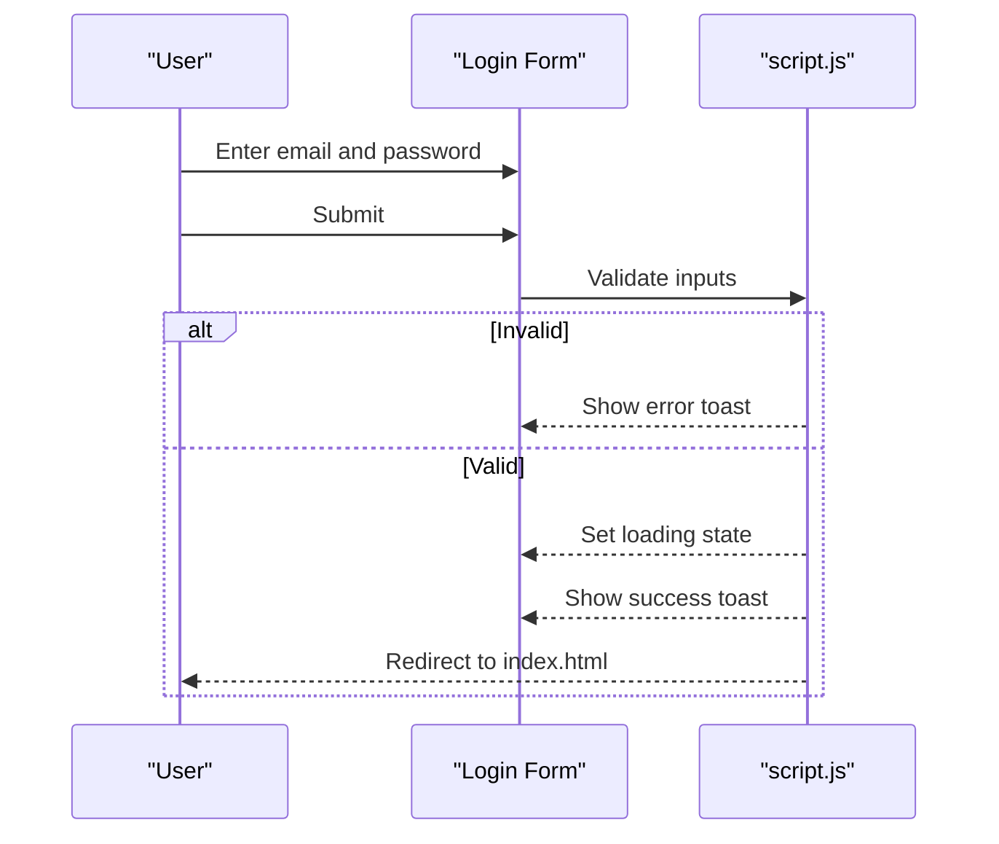
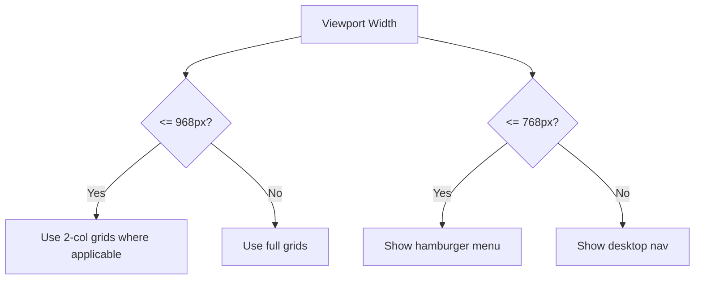
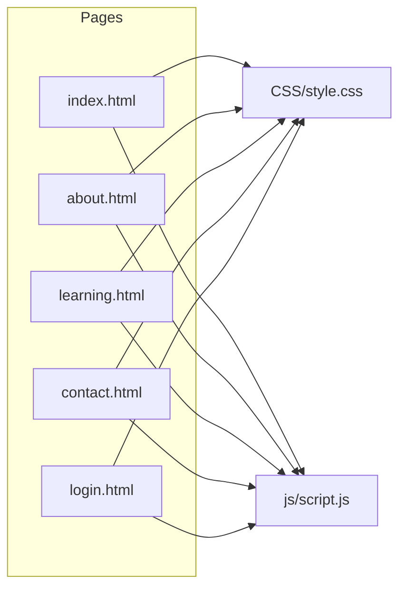

# Getting Started

<cite>
**Referenced Files in This Document**
- [index.html](file://index.html)
- [about.html](file://about.html)
- [learning.html](file://learning.html)
- [contact.html](file://contact.html)
- [login.html](file://login.html)
- [style.css](file://CSS/style.css)
- [script.js](file://js/script.js)
</cite>

## Table of Contents
1. Introduction
2. Project Structure
3. Core Components
4. Architecture Overview
5. Detailed Component Analysis
6. Dependency Analysis
7. Performance Considerations
8. Troubleshooting Guide
9. Conclusion
10. Appendices

## Introduction
Welcome to the Digital Bridges Zambia static website. This is a pure static site with no build process or dependencies. You can run it locally by simply opening the HTML files in any modern web browser. The site provides an introduction to the project, details about its mission and approach, a full catalog of training modules, contact information, and a login page for future learner access.

This guide will help you:
- Open and navigate the site locally
- Understand the file structure
- Explore training modules and navigation
- Customize basic styling and content as a beginner

## Project Structure
The site is organized into clear folders and pages:
- Pages: index.html (home), about.html, learning.html, contact.html, login.html
- Styling: CSS/style.css
- Interactivity: js/script.js
- Assets: assets/images and assets/icons (for images and icons used across pages)

**Diagram sources**
- [index.html:1-106](file://index.html#L1-L106)
- [about.html:1-123](file://about.html#L1-L123)
- [learning.html:1-137](file://learning.html#L1-L137)
- [contact.html:1-102](file://contact.html#L1-L102)
- [login.html:1-60](file://login.html#L1-L60)
- [style.css:1-247](file://CSS/style.css#L1-L247)
- [script.js:1-105](file://js/script.js#L1-L105)

**Section sources**
- [index.html:1-106](file://index.html#L1-L106)
- [about.html:1-123](file://about.html#L1-L123)
- [learning.html:1-137](file://learning.html#L1-L137)
- [contact.html:1-102](file://contact.html#L1-L102)
- [login.html:1-60](file://login.html#L1-L60)
- [style.css:1-247](file://CSS/style.css#L1-L247)
- [script.js:1-105](file://js/script.js#L1-L105)

## Core Components
- Navigation bar: Present on all pages; includes logo, links, and a mobile hamburger menu.
- Home page: Hero section, stats, module highlights, target beneficiaries, and footer.
- About page: Challenge, gap, mission, objectives, approach, phases, and expected outcomes.
- Learning page: Accordion-style list of eight training modules with topics per module.
- Contact page: Contact details, form, collaboration partners, sustainability notes, and ways to get involved.
- Login page: Email/password form, password visibility toggle, social login buttons, and sign-up link.
- Shared styles: Centralized CSS variables, responsive layout, animations, and component styles.
- Shared scripts: Navbar scroll effect, mobile menu, toast notifications, form validation, accordion behavior, scroll animations, and animated counters.

**Section sources**
- [index.html:10-25](file://index.html#L10-L25)
- [about.html:10-18](file://about.html#L10-L18)
- [learning.html:10-18](file://learning.html#L10-L18)
- [contact.html:10-18](file://contact.html#L10-L18)
- [login.html:10-18](file://login.html#L10-L18)
- [style.css:19-37](file://CSS/style.css#L19-L37)
- [script.js:1-19](file://js/script.js#L1-L19)

## Architecture Overview
This is a client-only static site. Each HTML page references the shared stylesheet and script. JavaScript enhances user experience without requiring a server.

**Diagram sources**
- [index.html:7-8](file://index.html#L7-L8)
- [index.html:103-103](file://index.html#L103-L103)
- [learning.html:7-8](file://learning.html#L7-L8)
- [learning.html:134-134](file://learning.html#L134-L134)
- [style.css:1-247](file://CSS/style.css#L1-L247)
- [script.js:68-86](file://js/script.js#L68-L86)

## Detailed Component Analysis

### Navigation and Mobile Menu
- Fixed top navbar with smooth scroll and shadow on scroll.
- Hamburger menu toggles a slide-in menu on small screens.
- Active link highlighting via class management.

**Diagram sources**
- [script.js:1-19](file://js/script.js#L1-L19)
- [style.css:19-37](file://CSS/style.css#L19-L37)

**Section sources**
- [script.js:1-19](file://js/script.js#L1-L19)
- [style.css:19-37](file://CSS/style.css#L19-L37)

### Home Page Highlights
- Hero section with call-to-action buttons linking to learning and about pages.
- Stats bar with animated counters that count up when scrolled into view.
- Module cards previewing key topics and linking to the full learning page.

**Diagram sources**
- [index.html:49-75](file://index.html#L49-L75)
- [script.js:88-104](file://js/script.js#L88-L104)

**Section sources**
- [index.html:27-75](file://index.html#L27-L75)
- [script.js:88-104](file://js/script.js#L88-L104)

### Learning Modules (Accordion)
- Each module header is clickable to expand/collapse details and topic chips.
- Only one module open at a time for clarity.

**Diagram sources**
- [learning.html:34-97](file://learning.html#L34-L97)
- [script.js:68-75](file://js/script.js#L68-L75)
- [style.css:210-224](file://CSS/style.css#L210-L224)

**Section sources**
- [learning.html:26-98](file://learning.html#L26-L98)
- [script.js:68-75](file://js/script.js#L68-L75)
- [style.css:210-224](file://CSS/style.css#L210-L224)

### Contact Form Validation and Feedback
- Validates name, email format, subject selection, and message length.
- Shows success or error toasts and resets the form on successful submission.

**Diagram sources**
- [contact.html:37-46](file://contact.html#L37-L46)
- [script.js:52-66](file://js/script.js#L52-L66)
- [style.css:182-186](file://CSS/style.css#L182-L186)

**Section sources**
- [contact.html:26-49](file://contact.html#L26-L49)
- [script.js:52-66](file://js/script.js#L52-L66)
- [style.css:182-186](file://CSS/style.css#L182-L186)

### Login Flow (Frontend Demo)
- Validates email presence and format, and password length.
- Provides visual feedback via button state and toast messages.
- Redirects to home after simulated login.

**Diagram sources**
- [login.html:19-40](file://login.html#L19-L40)
- [script.js:30-41](file://js/script.js#L30-L41)
- [style.css:153-180](file://CSS/style.css#L153-L180)

**Section sources**
- [login.html:10-55](file://login.html#L10-L55)
- [script.js:30-41](file://js/script.js#L30-L41)
- [style.css:153-180](file://CSS/style.css#L153-L180)

### Responsive Design Behavior
- Grid layouts adapt from multi-column to single-column on smaller screens.
- Navigation collapses into a hamburger menu below a threshold width.
- Typography and spacing adjust for readability on mobile devices.

**Diagram sources**
- [style.css:226-246](file://CSS/style.css#L226-L246)

**Section sources**
- [style.css:226-246](file://CSS/style.css#L226-L246)

## Dependency Analysis
- All pages depend on CSS/style.css for consistent look and feel.
- All pages depend on js/script.js for interactivity.
- No external libraries or frameworks are required.

**Diagram sources**
- [index.html:7-8](file://index.html#L7-L8)
- [index.html:103-103](file://index.html#L103-L103)
- [about.html:7-8](file://about.html#L7-L8)
- [about.html:120-120](file://about.html#L120-L120)
- [learning.html:7-8](file://learning.html#L7-L8)
- [learning.html:134-134](file://learning.html#L134-L134)
- [contact.html:7-8](file://contact.html#L7-L8)
- [contact.html:99-99](file://contact.html#L99-L99)
- [login.html:7-8](file://login.html#L7-L8)
- [login.html:57-57](file://login.html#L57-L57)

**Section sources**
- [index.html:7-8](file://index.html#L7-L8)
- [index.html:103-103](file://index.html#L103-L103)
- [about.html:7-8](file://about.html#L7-L8)
- [about.html:120-120](file://about.html#L120-L120)
- [learning.html:7-8](file://learning.html#L7-L8)
- [learning.html:134-134](file://learning.html#L134-L134)
- [contact.html:7-8](file://contact.html#L7-L8)
- [contact.html:99-99](file://contact.html#L99-L99)
- [login.html:7-8](file://login.html#L7-L8)
- [login.html:57-57](file://login.html#L57-L57)

## Performance Considerations
- Lightweight: No external dependencies; fast load times.
- Animations: Scroll-triggered animations and counters run only when elements enter the viewport.
- Images: Keep asset sizes reasonable for low-bandwidth environments.
- Accessibility: Use semantic HTML and ensure sufficient color contrast when customizing.

[No sources needed since this section provides general guidance]

## Troubleshooting Guide
- Menu not closing on mobile: Ensure the hamburger element and nav container IDs exist and are not overridden by custom CSS.
- Toast messages not appearing: Confirm the toast container exists on the page and the script runs after DOM load.
- Accordion not working: Verify module headers have the correct classes and that the script is loaded.
- Forms not validating: Check that input IDs match those referenced in the script and that required attributes are present.
- Styles not applied: Confirm paths to CSS/style.css are correct relative to each HTML file.

**Section sources**
- [script.js:1-19](file://js/script.js#L1-L19)
- [script.js:21-28](file://js/script.js#L21-L28)
- [script.js:68-75](file://js/script.js#L68-L75)
- [script.js:30-41](file://js/script.js#L30-L41)
- [script.js:52-66](file://js/script.js#L52-L66)
- [style.css:182-186](file://CSS/style.css#L182-L186)

## Conclusion
You now have everything you need to run, explore, and customize the Digital Bridges Zambia static site. Open index.html in your browser to begin. Use the navigation to move between pages, click module headers to learn more, and try the forms to see validation and feedback. Adjust colors, fonts, and content through the shared CSS and HTML files to tailor the site to your needs.

[No sources needed since this section summarizes without analyzing specific files]

## Appendices

### Quick Start Steps
- Download or clone the repository to your computer.
- Open index.html in your preferred browser.
- Use the top navigation to visit About, Learning, Contact, and Login pages.
- On the Learning page, click any module header to expand details.
- On the Contact page, fill out the form to see validation and toast messages.
- On the Login page, enter a valid email and password to simulate sign-in.

**Section sources**
- [index.html:10-25](file://index.html#L10-L25)
- [learning.html:34-97](file://learning.html#L34-L97)
- [contact.html:37-46](file://contact.html#L37-L46)
- [login.html:19-40](file://login.html#L19-L40)

### Browser Compatibility
- Works in all modern browsers that support HTML5, CSS3, and ES6 features.
- For best results, use recent versions of Chrome, Firefox, Edge, or Safari.
- Mobile browsers will display the responsive layout and mobile menu.

[No sources needed since this section provides general guidance]

### Customization Tips for Beginners
- Change brand colors: Edit CSS variables in style.css to update primary, accent, and background colors.
- Update text: Modify headings, paragraphs, and lists directly in the relevant HTML files.
- Add modules: Duplicate a module block in learning.html and update titles, descriptions, and topics.
- Replace assets: Place new images or icons in assets/images and assets/icons, then reference them in HTML.
- Enhance interactions: Extend script.js to add new behaviors like additional form validations or animations.

**Section sources**
- [style.css:3-13](file://CSS/style.css#L3-L13)
- [learning.html:34-97](file://learning.html#L34-L97)
- [script.js:68-86](file://js/script.js#L68-L86)