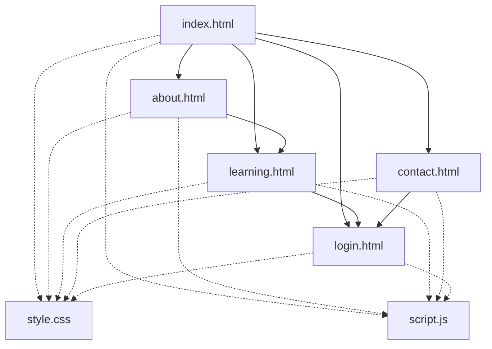
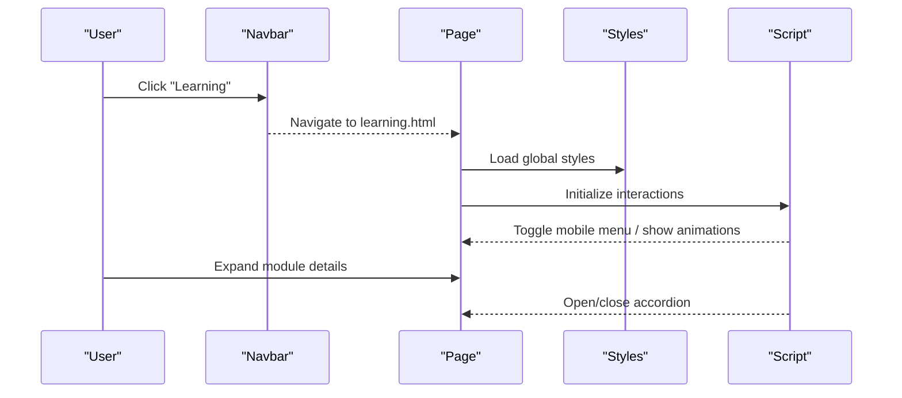
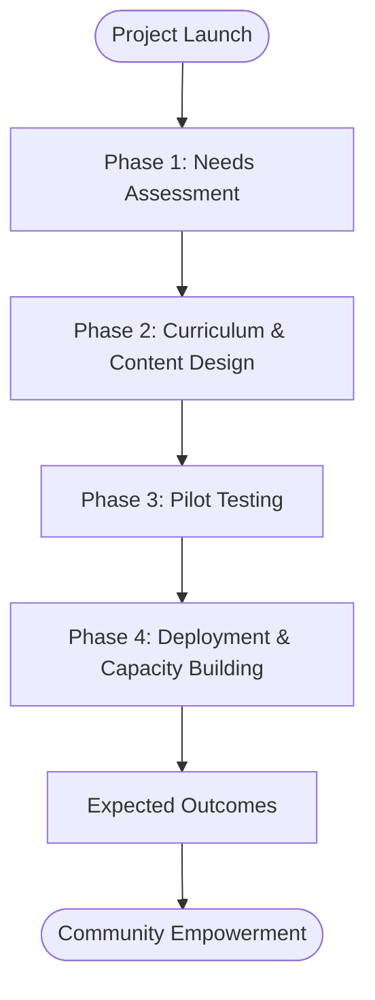
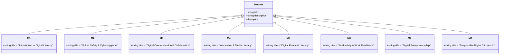
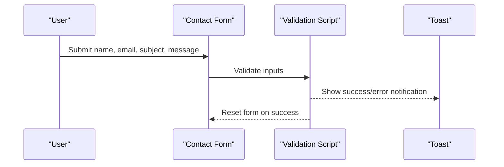
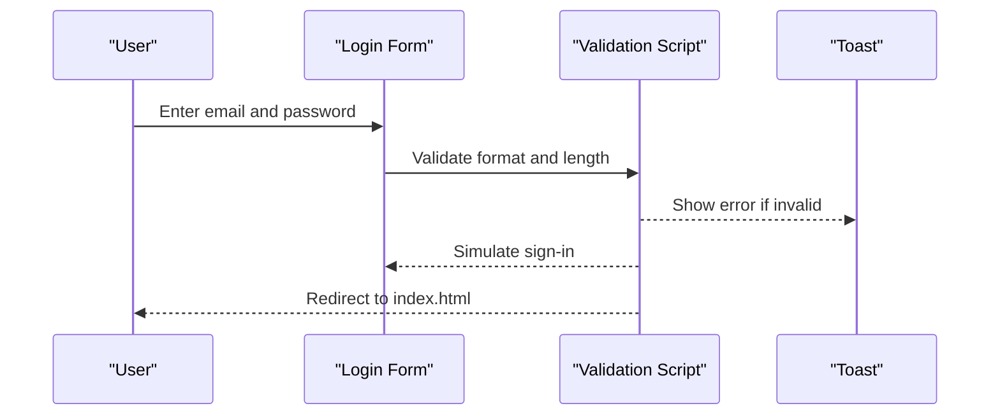
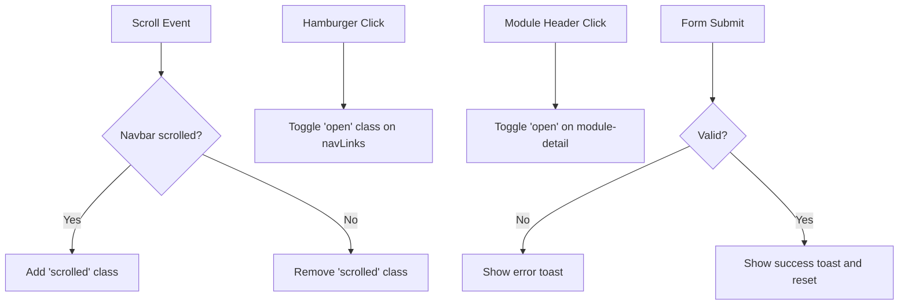
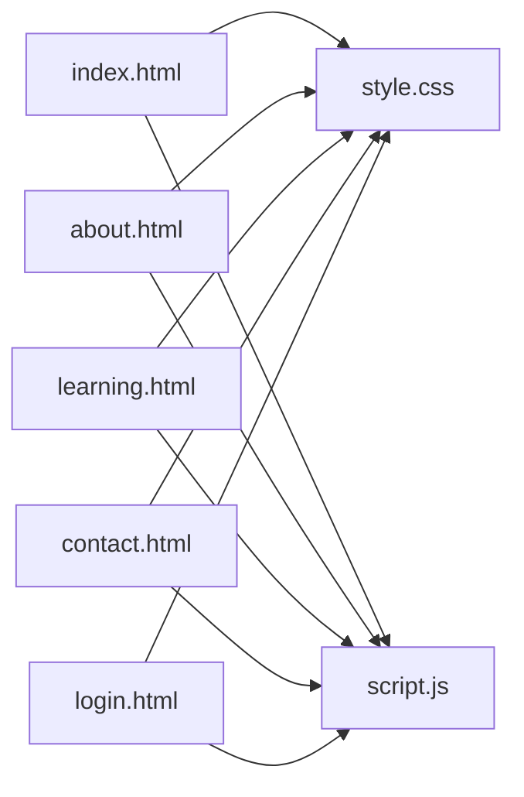

# Project Overview

<cite>
**Referenced Files in This Document**
- [index.html](file://index.html)
- [about.html](file://about.html)
- [learning.html](file://learning.html)
- [contact.html](file://contact.html)
- [login.html](file://login.html)
- [style.css](file://CSS/style.css)
- [script.js](file://js/script.js)
</cite>

## Table of Contents
1. Introduction
2. Project Structure
3. Core Components
4. Architecture Overview
5. Detailed Component Analysis
6. Dependency Analysis
7. Performance Considerations
8. Troubleshooting Guide
9. Conclusion

## Introduction
Digital Bridges Zambia is a community-centered initiative that develops accessible, practical, and locally relevant digital literacy training for underserved communities across Zambia. The project’s mission is to bridge the digital divide by equipping youth, women, informal sector workers, rural communities, teachers, facilitators, and community organizations with the skills needed to participate meaningfully in the digital world. It emphasizes online safety, responsible use, digital financial literacy, productivity, and entrepreneurship—ensuring learning materials are easy to understand, culturally grounded, and optimized for mobile access and low bandwidth environments.

This static website serves as a public-facing platform to introduce the project, showcase its eight comprehensive training modules, explain the four-phase implementation approach, and connect users with contact and login resources. It acts as an entry point for learners and partners to explore content, learn about the methodology, and engage with the program.

## Project Structure
The site is organized into five HTML pages plus shared CSS and JavaScript:
- index.html: Home page introducing the mission, target beneficiaries, and key statistics; links to learning modules and about information.
- about.html: Explains the challenge, gap, mission, objectives, community-centered approach, four implementation phases, and expected outcomes.
- learning.html: Presents all eight training modules with descriptions and topic chips; highlights produced resources (curriculum, manuals, interactive modules, visuals, videos, assessments).
- contact.html: Provides contact details, a message form, partnership categories, sustainability notes, and ways to get involved.
- login.html: A user login interface with email/password validation and social login placeholders.
- style.css: Global styles, layout, responsive design, animations, and component styling.
- script.js: Interactive behaviors including navbar scroll effects, mobile menu toggle, toast notifications, form validations, module accordion, scroll animations, and animated stats counters.

**Diagram sources**
- [index.html:10-24](file://index.html#L10-L24)
- [about.html:10-18](file://about.html#L10-L18)
- [learning.html:10-18](file://learning.html#L10-L18)
- [contact.html:10-18](file://contact.html#L10-L18)
- [login.html:10-18](file://login.html#L10-L18)
- [style.css:1-15](file://CSS/style.css#L1-L15)
- [script.js:1-19](file://js/script.js#L1-L19)

**Section sources**
- [index.html:1-106](file://index.html#L1-L106)
- [about.html:1-123](file://about.html#L1-L123)
- [learning.html:1-137](file://learning.html#L1-L137)
- [contact.html:1-102](file://contact.html#L1-L102)
- [login.html:1-60](file://login.html#L1-L60)
- [style.css:1-247](file://CSS/style.css#L1-L247)
- [script.js:1-105](file://js/script.js#L1-L105)

## Core Components
- Mission and Beneficiaries: The home page introduces the mission to provide inclusive digital literacy training for underserved communities, highlighting target groups such as youth, women, informal sector workers, rural communities, teachers/facilitators, and community organizations.
- Training Modules: Eight modules cover device basics, online safety, communication, information/media literacy, digital financial literacy, productivity/work readiness, digital entrepreneurship, and responsible digital citizenship. Each module includes descriptive text and topic chips.
- Implementation Phases: Four phases guide development from needs assessment through curriculum design, pilot testing, and deployment with capacity building.
- Community-Centered Methodology: Participatory approach using consultations, focus groups, simple language, visual storytelling, audio-visual materials, pilot testing, mobile-friendly design, and interactive exercises.
- Platform Role: The static site functions as a clear, accessible portal to learn about the project, explore modules, and connect via contact or login.

**Section sources**
- [index.html:27-93](file://index.html#L27-L93)
- [about.html:26-94](file://about.html#L26-L94)
- [learning.html:20-98](file://learning.html#L20-L98)

## Architecture Overview
The website follows a simple static architecture:
- Navigation: A fixed top navigation bar appears on every page, providing consistent access to Home, About, Learning, Contact, and Login.
- Content Pages: Each page focuses on a specific purpose (introduction, project details, modules, contact, login).
- Shared Styling and Behavior: All pages link to a single stylesheet and JavaScript file for consistent look-and-feel and interactions.
- Interactions: Mobile menu toggles, scroll-based navbar effects, animated counters, accordion-style module expansion, and form validations enhance usability.

**Diagram sources**
- [index.html:10-24](file://index.html#L10-L24)
- [learning.html:10-18](file://learning.html#L10-L18)
- [style.css:20-36](file://CSS/style.css#L20-L36)
- [script.js:1-19](file://js/script.js#L1-L19)
- [script.js:68-75](file://js/script.js#L68-L75)

## Detailed Component Analysis

### Mission, Objectives, and Approach
- Challenge and Gap: The project addresses uneven digital literacy and localized barriers faced by underserved populations in Zambia.
- Mission and Objectives: Develop accessible, practical, and locally relevant training content; integrate digital safety; create interactive tools; support facilitators; produce multilingual materials.
- Approach: Community consultations, focus groups, simple language, visual storytelling, audio-visual materials, pilot testing, mobile-friendly design, and interactive exercises.

**Diagram sources**
- [about.html:80-94](file://about.html#L80-L94)

**Section sources**
- [about.html:26-94](file://about.html#L26-L94)

### Training Modules (Eight Comprehensive Topics)
The learning page presents eight modules with concise descriptions and topic chips:
1. Introduction to Digital Literacy
2. Online Safety & Cyber Hygiene
3. Digital Communication & Collaboration
4. Information & Media Literacy
5. Digital Financial Literacy
6. Productivity & Work Readiness
7. Digital Entrepreneurship
8. Responsible Digital Citizenship

Each module is designed for practical application, community-friendly language, and accessibility.

**Diagram sources**
- [learning.html:34-96](file://learning.html#L34-L96)

**Section sources**
- [learning.html:20-98](file://learning.html#L20-L98)

### Target Beneficiaries
The home page outlines seven beneficiary groups:
- Youth (Ages 15–35)
- Women & Girls
- Informal Sector Workers
- Rural Communities
- Teachers & Facilitators
- Community Organizations

These groups benefit from practical, accessible, and locally relevant training that supports education, employment, entrepreneurship, and civic participation.

**Section sources**
- [index.html:77-93](file://index.html#L77-L93)

### Contact and Partnership Engagement
The contact page provides:
- Location, email, phone, and office hours
- A structured message form with validation
- Categories of potential partners (schools, radio stations, youth orgs, CSOs, ICT hubs, government, telecoms, international partners)
- Sustainability and involvement opportunities

**Diagram sources**
- [contact.html:26-49](file://contact.html#L26-L49)
- [script.js:52-66](file://js/script.js#L52-L66)

**Section sources**
- [contact.html:26-88](file://contact.html#L26-L88)
- [script.js:52-66](file://js/script.js#L52-L66)

### Login Interface and User Flow
The login page offers:
- Email and password fields with validation
- Password visibility toggle
- Social login buttons (Google, GitHub) with placeholder behavior
- Redirect to home after successful sign-in simulation

**Diagram sources**
- [login.html:19-52](file://login.html#L19-L52)
- [script.js:30-50](file://js/script.js#L30-L50)

**Section sources**
- [login.html:1-60](file://login.html#L1-L60)
- [script.js:30-50](file://js/script.js#L30-L50)

### Interactive Features and UX Enhancements
- Navbar scroll effect and mobile menu toggle
- Animated stats counter on the home page
- Scroll-triggered fade-in animations for content blocks
- Accordion-style module expansion on the learning page
- Toast notifications for feedback on forms and actions

**Diagram sources**
- [style.css:20-36](file://CSS/style.css#L20-L36)
- [script.js:1-19](file://js/script.js#L1-L19)
- [script.js:68-75](file://js/script.js#L68-L75)
- [script.js:21-28](file://js/script.js#L21-L28)
- [script.js:88-104](file://js/script.js#L88-L104)

**Section sources**
- [style.css:20-36](file://CSS/style.css#L20-L36)
- [script.js:1-19](file://js/script.js#L1-L19)
- [script.js:21-28](file://js/script.js#L21-L28)
- [script.js:68-75](file://js/script.js#L68-L75)
- [script.js:88-104](file://js/script.js#L88-L104)

## Dependency Analysis
- Pages depend on shared CSS for consistent styling and responsiveness.
- Pages depend on shared JavaScript for interactivity and user feedback.
- Navigation anchors link between pages, creating a cohesive user journey.
- The learning page uses accordion behavior controlled by script.js to expand/collapse module details.
- Forms rely on client-side validation and toast notifications for immediate feedback.

**Diagram sources**
- [index.html:7-8](file://index.html#L7-L8)
- [about.html:7-8](file://about.html#L7-L8)
- [learning.html:7-8](file://learning.html#L7-L8)
- [contact.html:7-8](file://contact.html#L7-L8)
- [login.html:7-8](file://login.html#L7-L8)
- [script.js:1-19](file://js/script.js#L1-L19)

**Section sources**
- [index.html:1-106](file://index.html#L1-L106)
- [about.html:1-123](file://about.html#L1-L123)
- [learning.html:1-137](file://learning.html#L1-L137)
- [contact.html:1-102](file://contact.html#L1-L102)
- [login.html:1-60](file://login.html#L1-L60)
- [style.css:1-247](file://CSS/style.css#L1-L247)
- [script.js:1-105](file://js/script.js#L1-L105)

## Performance Considerations
- Static site structure ensures fast load times and minimal server overhead.
- Responsive design adapts to various screen sizes, improving accessibility on mobile devices.
- Lightweight JavaScript enhances interactivity without heavy dependencies.
- Animations are triggered on scroll and limited to visible elements to reduce unnecessary processing.
- Consider optimizing images and assets in the assets folder for faster rendering on low-bandwidth connections.

[No sources needed since this section provides general guidance]

## Troubleshooting Guide
- Mobile Menu Not Opening: Ensure the hamburger element and navLinks exist; check that script.js initializes the click handler and toggles classes correctly.
- Accordion Not Expanding: Verify that module headers have the correct class and that script.js attaches click listeners to toggle the open state.
- Form Validation Errors: Confirm required fields are filled and formats are valid; check toast messages for feedback and ensure form resets on success.
- Stats Counter Not Animating: Ensure the stats bar is present and the IntersectionObserver triggers counting when scrolled into view.

**Section sources**
- [script.js:1-19](file://js/script.js#L1-L19)
- [script.js:68-75](file://js/script.js#L68-L75)
- [script.js:52-66](file://js/script.js#L52-L66)
- [script.js:88-104](file://js/script.js#L88-L104)

## Conclusion
Digital Bridges Zambia delivers a clear, accessible, and community-centered platform for digital literacy training. Through eight comprehensive modules, a structured four-phase implementation approach, and a focus on inclusivity and local relevance, the project empowers underserved communities to navigate digital technologies safely and effectively. The static website serves as a central hub to introduce the mission, showcase learning content, facilitate engagement, and support ongoing capacity building across Zambia.

[No sources needed since this section summarizes without analyzing specific files]