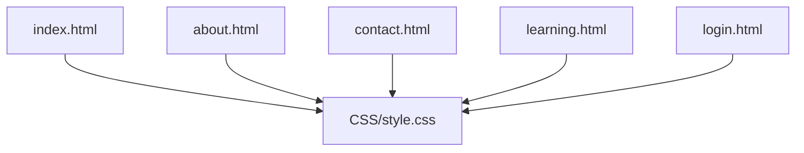
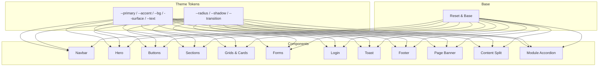
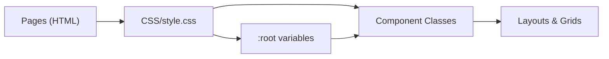
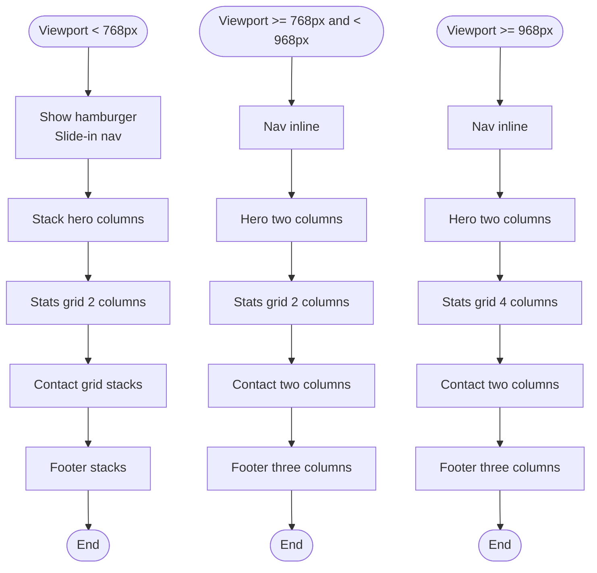

# CSS Architecture

<cite>
**Referenced Files in This Document**
- [style.css](file://CSS/style.css)
- [index.html](file://index.html)
- [about.html](file://about.html)
- [contact.html](file://contact.html)
- [learning.html](file://learning.html)
- [login.html](file://login.html)
</cite>

## Table of Contents
1. [Introduction](#introduction)
2. [Project Structure](#project-structure)
3. [Core Components](#core-components)
4. [Architecture Overview](#architecture-overview)
5. [Detailed Component Analysis](#detailed-component-analysis)
6. [Dependency Analysis](#dependency-analysis)
7. [Performance Considerations](#performance-considerations)
8. [Troubleshooting Guide](#troubleshooting-guide)
9. [Conclusion](#conclusion)
10. [Appendices](#appendices)

## Introduction
This document explains the CSS architecture for the Digital Bridges project. It focuses on a component-based approach using reusable classes and a robust theming system built with CSS custom properties (variables). The design is mobile-first, with responsive behavior controlled by media queries and breakpoints. You will learn how colors, spacing, typography, and UI components are consistently applied across pages, and how to extend the theme and add new components while following established patterns.

## Project Structure
The project uses a single global stylesheet that centralizes resets, variables, and shared component styles. Pages reference this stylesheet and compose layouts using semantic HTML elements paired with utility-like class names.

**Diagram sources**
- [index.html:7](file://index.html#L7)
- [about.html:7](file://about.html#L7)
- [contact.html:7](file://contact.html#L7)
- [learning.html:7](file://learning.html#L7)
- [login.html:7](file://login.html#L7)
- [style.css:1-15](file://style.css#L1-L15)

**Section sources**
- [style.css:1-15](file://style.css#L1-L15)
- [index.html:7](file://index.html#L7)
- [about.html:7](file://about.html#L7)
- [contact.html:7](file://contact.html#L7)
- [learning.html:7](file://learning.html#L7)
- [login.html:7](file://login.html#L7)

## Core Components
The stylesheet defines a cohesive set of reusable components and layout primitives:

- Theme and tokens via CSS custom properties
- Global reset and base styles
- Navigation bar with mobile menu
- Hero section and mini cards
- Buttons (primary, accent, outline)
- Section containers and headers
- Stats bar
- Cards grids (modules, beneficiaries, partners)
- Objectives list
- Approach grid
- Phases timeline
- Contact grid and form styles
- Login page card and social login
- Toast notifications
- Footer
- Page banner and content split
- Module accordion

These components are composed across all pages to maintain visual consistency and reduce duplication.

**Section sources**
- [style.css:3-13](file://style.css#L3-L13)
- [style.css:19-37](file://style.css#L19-L37)
- [style.css:38-55](file://style.css#L38-L55)
- [style.css:56-64](file://style.css#L56-L64)
- [style.css:65-73](file://style.css#L65-L73)
- [style.css:74-79](file://style.css#L74-L79)
- [style.css:80-91](file://style.css#L80-L91)
- [style.css:92-99](file://style.css#L92-L99)
- [style.css:100-107](file://style.css#L100-L107)
- [style.css:108-115](file://style.css#L108-L115)
- [style.css:116-124](file://style.css#L116-L124)
- [style.css:125-131](file://style.css#L125-L131)
- [style.css:132-152](file://style.css#L132-L152)
- [style.css:153-181](file://style.css#L153-L181)
- [style.css:182-187](file://style.css#L182-L187)
- [style.css:188-197](file://style.css#L188-L197)
- [style.css:198-202](file://style.css#L198-L202)
- [style.css:203-209](file://style.css#L203-L209)
- [style.css:210-225](file://style.css#L210-L225)

## Architecture Overview
The CSS architecture follows a component-driven model with a strong emphasis on:

- Centralized theming through CSS custom properties for colors, spacing, radius, shadows, and transitions
- Reusable component classes that can be combined across pages
- Mobile-first responsive design with progressive enhancements at larger breakpoints
- Consistent naming conventions for clarity and scalability

**Diagram sources**
- [style.css:3-13](file://style.css#L3-L13)
- [style.css:19-37](file://style.css#L19-L37)
- [style.css:38-55](file://style.css#L38-L55)
- [style.css:56-64](file://style.css#L56-L64)
- [style.css:65-73](file://style.css#L65-L73)
- [style.css:74-79](file://style.css#L74-L79)
- [style.css:80-91](file://style.css#L80-L91)
- [style.css:92-99](file://style.css#L92-L99)
- [style.css:100-107](file://style.css#L100-L107)
- [style.css:108-115](file://style.css#L108-L115)
- [style.css:116-124](file://style.css#L116-L124)
- [style.css:125-131](file://style.css#L125-L131)
- [style.css:132-152](file://style.css#L132-L152)
- [style.css:153-181](file://style.css#L153-L181)
- [style.css:182-187](file://style.css#L182-L187)
- [style.css:188-197](file://style.css#L188-L197)
- [style.css:198-202](file://style.css#L198-L202)
- [style.css:203-209](file://style.css#L203-L209)
- [style.css:210-225](file://style.css#L210-L225)

## Detailed Component Analysis

### Theme System and Custom Properties
- Colors: primary palette, accents, backgrounds, surfaces, text, borders, success, error
- Spacing and shape: radius, shadow, shadow-lg
- Motion: transition timing
- Typography: font stack defined in base; sizes and weights are applied via component classes

Use these variables throughout components to ensure consistent theming. To extend the theme, add new variables under :root and apply them where needed.

**Section sources**
- [style.css:3-13](file://style.css#L3-L13)
- [style.css:15](file://style.css#L15)

### Navigation
- Fixed top navigation with backdrop blur and border
- Logo area with icon and text
- Links with hover underline animation
- Call-to-action link styled as a button
- Hamburger menu for mobile

Responsive behavior:
- At smaller screens, links move into a slide-down panel toggled by the hamburger

**Section sources**
- [style.css:19-37](file://style.css#L19-L37)
- [style.css:227-246](file://style.css#L227-L246)
- [index.html:10-25](file://index.html#L10-L25)
- [about.html:10-18](file://about.html#L10-L18)
- [contact.html:10-18](file://contact.html#L10-L18)
- [learning.html:10-18](file://learning.html#L10-L18)

### Hero Section
- Full-height hero with gradient background and decorative pseudo-elements
- Two-column grid on desktop, stacked on mobile
- Badge, heading with highlight, description, and buttons
- Visual area with mini cards grid

**Section sources**
- [style.css:38-55](file://style.css#L38-L55)
- [index.html:27-47](file://index.html#L27-L47)

### Buttons
- Primary, accent, and outline variants
- Hover effects with elevation and color changes
- Shared sizing and alignment utilities

**Section sources**
- [style.css:56-64](file://style.css#L56-L64)

### Sections and Headers
- Standardized padding and container width
- Centered headers with overline labels
- Alternate section backgrounds for visual rhythm

**Section sources**
- [style.css:65-73](file://style.css#L65-L73)

### Stats Bar
- Full-width colored band with a four-column grid
- White text and subtle opacity for descriptions

**Section sources**
- [style.css:74-79](file://style.css#L74-L79)
- [index.html:49-56](file://index.html#L49-L56)

### Cards Grids (Modules, Beneficiaries, Partners)
- Auto-fit grids with minimum column widths
- Card styling with borders, radius, hover lift, and shadow
- Topic chips and icons for quick scanning

**Section sources**
- [style.css:80-91](file://style.css#L80-L91)
- [style.css:108-115](file://style.css#L108-L115)
- [style.css:125-131](file://style.css#L125-L131)
- [index.html:65-72](file://index.html#L65-L72)
- [index.html:84-91](file://index.html#L84-L91)
- [contact.html:54-63](file://contact.html#L54-L63)
- [learning.html:107-114](file://learning.html#L107-L114)

### Objectives List
- Numbered items with gradient badges
- Hover states and clear hierarchy

**Section sources**
- [style.css:92-99](file://style.css#L92-L99)
- [about.html:50-56](file://about.html#L50-L56)

### Approach Grid
- Icon + title + description tiles
- Hover interactions

**Section sources**
- [style.css:100-107](file://style.css#L100-L107)
- [about.html:67-76](file://about.html#L67-L76)

### Phases Timeline
- Phase label badges and lists
- Hover elevation

**Section sources**
- [style.css:116-124](file://style.css#L116-L124)
- [about.html:87-92](file://about.html#L87-L92)

### Contact Grid and Forms
- Two-column layout on desktop, stacked on mobile
- Form groups, inputs, focus states, and input wrappers with icons
- Contact detail blocks with icons

**Section sources**
- [style.css:132-152](file://style.css#L132-L152)
- [contact.html:28-46](file://contact.html#L28-L46)

### Login Page
- Centered card with header, form options, social login buttons
- Password visibility toggle
- Back link and divider

**Section sources**
- [style.css:153-181](file://style.css#L153-L181)
- [login.html:10-55](file://login.html#L10-L55)

### Toast Notifications
- Fixed-position toast with show/hide transitions
- Success and error variants

**Section sources**
- [style.css:182-187](file://style.css#L182-L187)
- [contact.html:98](file://contact.html#L98)
- [login.html:56](file://login.html#L56)

### Footer
- Three-column brand and links layout
- Bottom bar with copyright

**Section sources**
- [style.css:188-197](file://style.css#L188-L197)
- [index.html:95-102](file://index.html#L95-L102)
- [about.html:112-119](file://about.html#L112-L119)
- [contact.html:90-97](file://contact.html#L90-L97)
- [learning.html:126-133](file://learning.html#L126-L133)

### Page Banner and Content Split
- Gradient banner with centered heading and subtitle
- Two-column content block with headings, paragraphs, and lists

**Section sources**
- [style.css:198-209](file://style.css#L198-L209)
- [about.html:20-24](file://about.html#L20-L24)
- [about.html:28-40](file://about.html#L28-L40)
- [contact.html:20-24](file://contact.html#L20-L24)

### Module Accordion
- Expandable module details with animated content reveal
- Topic chips with icons

**Section sources**
- [style.css:210-225](file://style.css#L210-L225)
- [learning.html:34-96](file://learning.html#L34-L96)

## Dependency Analysis
- All pages depend on the single stylesheet for consistent styling
- Components rely on theme variables for colors, spacing, and motion
- Responsive behavior depends on media queries that adjust layout and navigation behavior

**Diagram sources**
- [index.html:7](file://index.html#L7)
- [about.html:7](file://about.html#L7)
- [contact.html:7](file://contact.html#L7)
- [learning.html:7](file://learning.html#L7)
- [login.html:7](file://login.html#L7)
- [style.css:3-13](file://style.css#L3-L13)
- [style.css:19-37](file://style.css#L19-L37)
- [style.css:38-55](file://style.css#L38-L55)
- [style.css:56-64](file://style.css#L56-L64)
- [style.css:65-73](file://style.css#L65-L73)
- [style.css:74-79](file://style.css#L74-L79)
- [style.css:80-91](file://style.css#L80-L91)
- [style.css:92-99](file://style.css#L92-L99)
- [style.css:100-107](file://style.css#L100-L107)
- [style.css:108-115](file://style.css#L108-L115)
- [style.css:116-124](file://style.css#L116-L124)
- [style.css:125-131](file://style.css#L125-L131)
- [style.css:132-152](file://style.css#L132-L152)
- [style.css:153-181](file://style.css#L153-L181)
- [style.css:182-187](file://style.css#L182-L187)
- [style.css:188-197](file://style.css#L188-L197)
- [style.css:198-202](file://style.css#L198-L202)
- [style.css:203-209](file://style.css#L203-L209)
- [style.css:210-225](file://style.css#L210-L225)

**Section sources**
- [style.css:3-13](file://style.css#L3-L13)
- [style.css:227-246](file://style.css#L227-L246)

## Performance Considerations
- Single stylesheet reduces HTTP requests and improves caching
- CSS custom properties enable efficient theme updates without duplicating styles
- Media queries are minimal and targeted, reducing reflow costs
- Use of transform and opacity for animations leverages GPU acceleration
- Avoid excessive nested selectors to keep specificity manageable

[No sources needed since this section provides general guidance]

## Troubleshooting Guide
Common issues and resolutions:

- Navigation not collapsing on mobile
  - Ensure the hamburger element exists and has the correct class
  - Verify the nav-links container has the expected class and that JavaScript toggles the open state
  - Check that the media query breakpoint matches your viewport size

- Inconsistent theme colors
  - Confirm that variables are defined in :root and referenced correctly
  - If overriding, ensure you do not accidentally scope overrides incorrectly

- Form focus states not visible
  - Verify focus styles target the correct inputs and that no other rules override them
  - Ensure input wrappers and icons do not interfere with focus outlines

- Toast not appearing or not hiding
  - Ensure the toast element exists and has the correct class
  - Verify JavaScript adds/removes the show class appropriately

**Section sources**
- [style.css:19-37](file://style.css#L19-L37)
- [style.css:132-152](file://style.css#L132-L152)
- [style.css:182-187](file://style.css#L182-L187)
- [style.css:227-246](file://style.css#L227-L246)

## Conclusion
The Digital Bridges CSS architecture centers on a small set of well-defined theme tokens and reusable component classes. This approach ensures consistency, simplifies maintenance, and scales gracefully across devices. By extending the theme variables and composing existing components, teams can rapidly build new features while preserving visual coherence and accessibility.

[No sources needed since this section summarizes without analyzing specific files]

## Appendices

### Naming Conventions and Organization
- Semantic class names reflect purpose (e.g., navbar, hero, btn, modules-grid)
- Component classes are self-contained and composable
- Utilities like section, section-inner, and section-header standardize layout
- Grid classes provide flexible, responsive layouts with auto-fit and minmax

**Section sources**
- [style.css:19-37](file://style.css#L19-L37)
- [style.css:38-55](file://style.css#L38-L55)
- [style.css:56-64](file://style.css#L56-L64)
- [style.css:65-73](file://style.css#L65-L73)
- [style.css:80-91](file://style.css#L80-L91)

### Mobile-First Responsive Design
- Base styles target small screens
- Breakpoints progressively enhance layout for larger viewports
- Key breakpoints:
  - 968px: adjusts hero, stats, contact, content split, footer
  - 768px: activates mobile navigation and adjusts typography and spacing

**Diagram sources**
- [style.css:227-246](file://style.css#L227-L246)

**Section sources**
- [style.css:227-246](file://style.css#L227-L246)

### Extending the Theme System
To add a new brand color or token:
- Add a new variable under :root
- Apply it to components or create a new variant class
- Update any related hover/active states consistently

Examples of where to apply:
- Button variants
- Badges and overlines
- Focus rings and active states
- Card accents and gradients

**Section sources**
- [style.css:3-13](file://style.css#L3-L13)
- [style.css:56-64](file://style.css#L56-L64)
- [style.css:65-73](file://style.css#L65-L73)

### Adding New Components Following Established Patterns
Guidelines:
- Define semantic class names
- Use theme variables for colors, spacing, and motion
- Prefer grid/flex layouts for structure
- Keep component styles scoped to their class
- Add responsive adjustments in media queries if needed
- Compose with existing sections and headers

Example pattern references:
- Card grid composition
- Section header usage
- Button variants
- Form group and input wrapper

**Section sources**
- [style.css:80-91](file://style.css#L80-L91)
- [style.css:65-73](file://style.css#L65-L73)
- [style.css:56-64](file://style.css#L56-L64)
- [style.css:132-152](file://style.css#L132-L152)