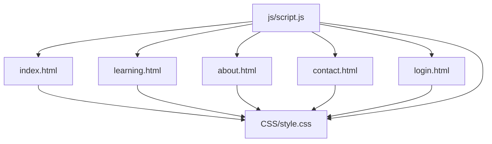
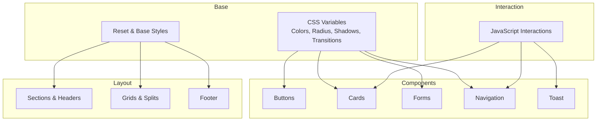
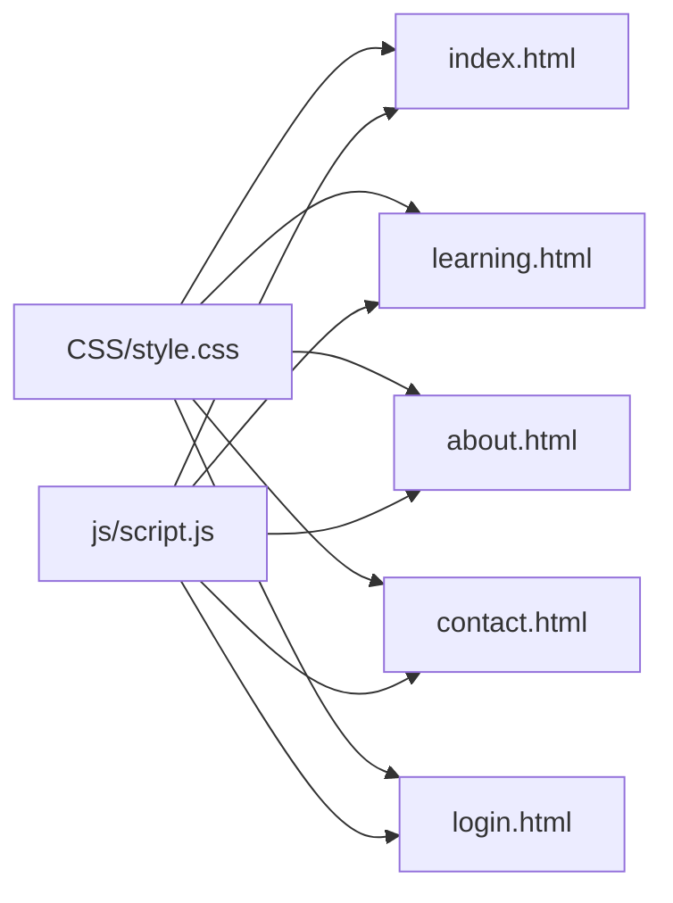

# Component Styling Patterns

<cite>
**Referenced Files in This Document**
- [style.css](file://CSS/style.css)
- [index.html](file://index.html)
- [learning.html](file://learning.html)
- [about.html](file://about.html)
- [contact.html](file://contact.html)
- [login.html](file://login.html)
- [script.js](file://js/script.js)
</cite>

## Table of Contents
1. Introduction
2. Project Structure
3. Core Components
4. Architecture Overview
5. Detailed Component Analysis
6. Dependency Analysis
7. Performance Considerations
8. Troubleshooting Guide
9. Conclusion
10. Appendices

## Introduction
This document explains the component styling patterns used across the Digital Bridges project. It focuses on a BEM-like class naming approach, consistent component structure, and modular CSS organization. You will find guidelines for buttons, cards, forms, navigation, utilities, animations, transitions, and accessibility considerations to help you create new components that integrate seamlessly with the existing design system.

## Project Structure
The project uses a single global stylesheet and shared HTML templates:
- Styles are centralized in one CSS file with clear sections for reset/base, layout, components, and responsive rules.
- Pages share common structural classes (sections, grids, headers) and reusable components (buttons, cards, forms).
- JavaScript adds interactivity (navbar scroll state, mobile menu toggling, accordion behavior, toast notifications, and scroll-based animations).

**Diagram sources**
- [style.css:1-247](file://CSS/style.css#L1-L247)
- [index.html:1-106](file://index.html#L1-L106)
- [learning.html:1-137](file://learning.html#L1-L137)
- [about.html:1-123](file://about.html#L1-L123)
- [contact.html:1-102](file://contact.html#L1-L102)
- [login.html:1-60](file://login.html#L1-L60)
- [script.js:1-105](file://js/script.js#L1-L105)

**Section sources**
- [style.css:1-247](file://CSS/style.css#L1-L247)
- [index.html:1-106](file://index.html#L1-L106)
- [learning.html:1-137](file://learning.html#L1-L137)
- [about.html:1-123](file://about.html#L1-L123)
- [contact.html:1-102](file://contact.html#L1-L102)
- [login.html:1-60](file://login.html#L1-L60)
- [script.js:1-105](file://js/script.js#L1-L105)

## Core Components
The design system is built around reusable building blocks with consistent naming and behavior:
- Buttons: primary, accent, outline variants with hover states and consistent spacing/typography.
- Cards: module cards, beneficiary cards, phase cards, partner items, and login card with uniform borders, shadows, and hover effects.
- Forms: form groups, inputs, textareas, selects, input wrappers with icons, password toggle, and validation feedback via toast messages.
- Navigation: fixed navbar with logo, links, CTA button, and mobile hamburger menu with animated transitions.
- Layout utilities: sections, section headers, grids, content splits, page banners, stats bar, and footer.
- Feedback: toast notifications for success/error states.

Key implementation references:
- Buttons and variants: [style.css:57-63](file://CSS/style.css#L57-L63)
- Module cards and grids: [style.css:80-90](file://CSS/style.css#L80-L90)
- Form fields and focus states: [style.css:143-151](file://CSS/style.css#L143-L151)
- Navbar and mobile menu: [style.css:19-37](file://CSS/style.css#L19-L37), [style.css:227-246](file://CSS/style.css#L227-L246)
- Toast notifications: [style.css:182-186](file://CSS/style.css#L182-L186)

**Section sources**
- [style.css:19-37](file://CSS/style.css#L19-L37)
- [style.css:57-63](file://CSS/style.css#L57-L63)
- [style.css:80-90](file://CSS/style.css#L80-L90)
- [style.css:143-151](file://CSS/style.css#L143-L151)
- [style.css:182-186](file://CSS/style.css#L182-L186)
- [style.css:227-246](file://CSS/style.css#L227-L246)

## Architecture Overview
The styling architecture follows a layered approach:
- Base layer: CSS variables define colors, typography scale, radius, shadows, and transitions. Reset and base styles ensure consistency.
- Component layer: Reusable UI elements (buttons, cards, forms, nav) encapsulate their own visual rules and states.
- Layout layer: Sections, grids, and containers orchestrate page composition.
- Responsive layer: Media queries adapt layouts and navigation for smaller screens.
- Interaction layer: JavaScript toggles classes for states like scrolled navbar, open mobile menu, accordion open/close, and toast visibility.

**Diagram sources**
- [style.css:1-17](file://CSS/style.css#L1-L17)
- [style.css:19-37](file://CSS/style.css#L19-L37)
- [style.css:57-63](file://CSS/style.css#L57-L63)
- [style.css:80-90](file://CSS/style.css#L80-L90)
- [style.css:143-151](file://CSS/style.css#L143-L151)
- [style.css:182-186](file://CSS/style.css#L182-L186)
- [script.js:1-19](file://js/script.js#L1-L19)
- [script.js:21-28](file://js/script.js#L21-L28)
- [script.js:68-75](file://js/script.js#L68-L75)

## Detailed Component Analysis

### Buttons
- Variants: primary, accent, outline. Each variant shares base sizing, typography, and transition behaviors.
- States: hover transforms and shadow enhancements; no explicit disabled state defined in CSS, but disabled can be implemented by adding pointer-events and opacity modifiers as needed.
- Usage: applied across hero actions and CTAs.

References:
- Base and variants: [style.css:57-63](file://CSS/style.css#L57-L63)
- Hero usage: [index.html:33-35](file://index.html#L33-L35)

Accessibility notes:
- Ensure sufficient color contrast for all variants.
- Provide visible focus indicators for keyboard users.

**Section sources**
- [style.css:57-63](file://CSS/style.css#L57-L63)
- [index.html:33-35](file://index.html#L33-L35)

### Cards (Training Modules and Content)
- Module cards: numbered badges, titles, descriptions, topic chips, hover lift and top border reveal.
- Beneficiary cards: icon + text layout with hover emphasis.
- Phase cards: labeled phases with lists.
- Partner items: compact row with icon and label.
- Login card: centered card with header, form, divider, social buttons.

References:
- Module grid and card: [style.css:80-90](file://CSS/style.css#L80-L90)
- Beneficiary grid/card: [style.css:108-114](file://CSS/style.css#L108-L114)
- Phase timeline/cards: [style.css:116-123](file://CSS/style.css#L116-L123)
- Partner items: [style.css:125-130](file://CSS/style.css#L125-L130)
- Login card: [style.css:153-179](file://CSS/style.css#L153-L179)

Usage examples:
- Training modules grid: [index.html:65-73](file://index.html#L65-L73)
- Learning modules detail: [learning.html:34-96](file://learning.html#L34-L96)
- Beneficiaries: [index.html:84-91](file://index.html#L84-L91)
- Phases: [about.html:87-92](file://about.html#L87-L92)
- Partners: [contact.html:54-63](file://contact.html#L54-L63)
- Login card: [login.html:12-53](file://login.html#L12-L53)

**Section sources**
- [style.css:80-90](file://CSS/style.css#L80-L90)
- [style.css:108-114](file://CSS/style.css#L108-L114)
- [style.css:116-123](file://CSS/style.css#L116-L123)
- [style.css:125-130](file://CSS/style.css#L125-L130)
- [style.css:153-179](file://CSS/style.css#L153-L179)
- [index.html:65-91](file://index.html#L65-L91)
- [learning.html:34-96](file://learning.html#L34-L96)
- [about.html:87-92](file://about.html#L87-L92)
- [contact.html:54-63](file://contact.html#L54-L63)
- [login.html:12-53](file://login.html#L12-L53)

### Forms and Inputs
- Form groups: labels, inputs, textareas, selects with consistent padding, borders, and focus states.
- Input wrappers: left-aligned icons and optional password toggle button.
- Validation: client-side checks via JavaScript show toast messages for errors and success.
- Accessibility: labels associated with inputs, aria-label on toggle button.

References:
- Form group and inputs: [style.css:143-151](file://CSS/style.css#L143-L151)
- Password toggle: [style.css:177-178](file://CSS/style.css#L177-L178)
- Toast styles: [style.css:182-186](file://CSS/style.css#L182-L186)
- Validation logic: [script.js:31-41](file://js/script.js#L31-L41), [script.js:52-66](file://js/script.js#L52-L66)

Usage examples:
- Contact form: [contact.html:37-46](file://contact.html#L37-L46)
- Login form: [login.html:19-40](file://login.html#L19-L40)

**Section sources**
- [style.css:143-151](file://CSS/style.css#L143-L151)
- [style.css:177-178](file://CSS/style.css#L177-L178)
- [style.css:182-186](file://CSS/style.css#L182-L186)
- [script.js:31-41](file://js/script.js#L31-L41)
- [script.js:52-66](file://js/script.js#L52-L66)
- [contact.html:37-46](file://contact.html#L37-L46)
- [login.html:19-40](file://login.html#L19-L40)

### Navigation
- Fixed navbar with backdrop blur and border, logo area, link list, and CTA button.
- Scroll state: adds shadow when scrolled.
- Mobile menu: hamburger toggles an overlay menu with animated icon transformation.
- Active link underline animation.

References:
- Navbar structure and styles: [style.css:19-37](file://CSS/style.css#L19-L37)
- Mobile responsiveness: [style.css:227-246](file://CSS/style.css#L227-L246)
- Scroll behavior: [script.js:1-3](file://js/script.js#L1-L3)
- Hamburger toggle: [script.js:5-19](file://js/script.js#L5-L19)

Usage examples:
- Navbar markup: [index.html:10-25](file://index.html#L10-L25)

**Section sources**
- [style.css:19-37](file://CSS/style.css#L19-L37)
- [style.css:227-246](file://CSS/style.css#L227-L246)
- [script.js:1-19](file://js/script.js#L1-L19)
- [index.html:10-25](file://index.html#L10-L25)

### Utilities (Spacing, Layout, Typography)
- Sections and headers: consistent padding, max-width container, overline badges, and headings.
- Grids: auto-fit responsive grids for modules, beneficiaries, partners, and phases.
- Content split: two-column layout for paired content blocks.
- Page banner: full-width hero-like header with centered text.
- Stats bar: colored band with four-column grid.
- Footer: multi-column layout with brand, links, and bottom bar.

References:
- Section and header: [style.css:65-72](file://CSS/style.css#L65-L72)
- Grids: [style.css:80-90](file://CSS/style.css#L80-L90), [style.css:108-114](file://CSS/style.css#L108-L114), [style.css:125-130](file://CSS/style.css#L125-L130)
- Content split: [style.css:203-208](file://CSS/style.css#L203-L208)
- Page banner: [style.css:198-201](file://CSS/style.css#L198-L201)
- Stats bar: [style.css:74-78](file://CSS/style.css#L74-L78)
- Footer: [style.css:188-196](file://CSS/style.css#L188-L196)

**Section sources**
- [style.css:65-72](file://CSS/style.css#L65-L72)
- [style.css:74-78](file://CSS/style.css#L74-L78)
- [style.css:80-90](file://CSS/style.css#L80-L90)
- [style.css:108-114](file://CSS/style.css#L108-L114)
- [style.css:125-130](file://CSS/style.css#L125-L130)
- [style.css:188-196](file://CSS/style.css#L188-L196)
- [style.css:198-201](file://CSS/style.css#L198-L201)
- [style.css:203-208](file://CSS/style.css#L203-L208)

### Accordion (Module Details)
- Clicking a header toggles the open state, animating description and topics into view.
- Only one module detail can be open at a time.

References:
- Accordion styles: [style.css:210-224](file://CSS/style.css#L210-L224)
- Toggle logic: [script.js:68-75](file://js/script.js#L68-L75)

Usage example:
- Module details: [learning.html:34-96](file://learning.html#L34-L96)

**Section sources**
- [style.css:210-224](file://CSS/style.css#L210-L224)
- [script.js:68-75](file://js/script.js#L68-L75)
- [learning.html:34-96](file://learning.html#L34-L96)

### Toast Notifications
- Positioned fixed at top-right, slides in/out with transitions.
- Success and error variants use distinct background colors.

References:
- Toast styles: [style.css:182-186](file://CSS/style.css#L182-L186)
- Show/hide logic: [script.js:21-28](file://js/script.js#L21-L28)

Usage examples:
- Contact page toast: [contact.html:98-99](file://contact.html#L98-L99)
- Login page toast: [login.html:56-57](file://login.html#L56-L57)

**Section sources**
- [style.css:182-186](file://CSS/style.css#L182-L186)
- [script.js:21-28](file://js/script.js#L21-L28)
- [contact.html:98-99](file://contact.html#L98-L99)
- [login.html:56-57](file://login.html#L56-L57)

## Dependency Analysis
Component relationships and dependencies:
- All pages depend on the central stylesheet for consistent visuals.
- JavaScript enhances components by toggling classes (.scrolled, .open, .visible) and showing toasts.
- Shared structural classes enable reuse across pages without duplicating markup or styles.

**Diagram sources**
- [style.css:1-247](file://CSS/style.css#L1-L247)
- [script.js:1-105](file://js/script.js#L1-L105)
- [index.html:1-106](file://index.html#L1-L106)
- [learning.html:1-137](file://learning.html#L1-L137)
- [about.html:1-123](file://about.html#L1-L123)
- [contact.html:1-102](file://contact.html#L1-L102)
- [login.html:1-60](file://login.html#L1-L60)

**Section sources**
- [style.css:1-247](file://CSS/style.css#L1-L247)
- [script.js:1-105](file://js/script.js#L1-L105)

## Performance Considerations
- Prefer CSS transitions and transforms for animations to leverage GPU acceleration.
- Use IntersectionObserver for scroll-triggered animations to avoid heavy scroll listeners.
- Keep media queries minimal and targeted to reduce recalculations.
- Avoid excessive box-shadows and gradients on large areas to maintain smooth rendering on low-end devices.

[No sources needed since this section provides general guidance]

## Troubleshooting Guide
Common issues and resolutions:
- Navbar not scrolling effect: ensure the script runs after DOM load and the element exists; check for missing IDs.
- Mobile menu not opening: verify hamburger and navLinks IDs exist and event listeners are attached.
- Accordion not toggling: confirm headers have correct class and click handlers are bound.
- Toast not appearing: ensure toast element exists and has correct ID; verify script shows/hides classes properly.
- Form validation errors: check required attributes and email format checks in script.

References:
- Navbar scroll: [script.js:1-3](file://js/script.js#L1-L3)
- Mobile menu: [script.js:5-19](file://js/script.js#L5-L19)
- Accordion: [script.js:68-75](file://js/script.js#L68-L75)
- Toast: [script.js:21-28](file://js/script.js#L21-L28)
- Login validation: [script.js:31-41](file://js/script.js#L31-L41)
- Contact validation: [script.js:52-66](file://js/script.js#L52-L66)

**Section sources**
- [script.js:1-19](file://js/script.js#L1-L19)
- [script.js:21-28](file://js/script.js#L21-L28)
- [script.js:31-41](file://js/script.js#L31-L41)
- [script.js:52-66](file://js/script.js#L52-L66)
- [script.js:68-75](file://js/script.js#L68-L75)

## Conclusion
The Digital Bridges project employs a cohesive, BEM-inspired styling system with a single stylesheet and shared components. Consistent naming, modular CSS sections, and lightweight JavaScript interactions provide a scalable foundation. By following these patterns—using established classes, leveraging CSS variables, and adhering to accessibility best practices—you can extend the design system with new components that remain visually consistent and performant.

[No sources needed since this section summarizes without analyzing specific files]

## Appendices

### Class Naming Conventions (BEM-like)
- Block: component-level names such as navbar, btn, module-card, form-group.
- Element: parts of a block using nested naming like nav-links, module-number, input-wrapper.
- Modifier: state or variant suffixes like btn-primary, btn-accent, btn-outline, module-detail.open.

Examples:
- Button variants: [style.css:57-63](file://CSS/style.css#L57-L63)
- Accordion open state: [style.css:222-224](file://CSS/style.css#L222-L224)
- Navbar scrolled state: [style.css:20-21](file://CSS/style.css#L20-L21)

**Section sources**
- [style.css:20-21](file://CSS/style.css#L20-L21)
- [style.css:57-63](file://CSS/style.css#L57-L63)
- [style.css:222-224](file://CSS/style.css#L222-L224)

### Creating New Components: Guidelines
- Start with a semantic HTML structure and assign a block class.
- Define elements for internal parts and modifiers for states/variants.
- Use CSS variables for colors, spacing, radius, and transitions to maintain consistency.
- Add focus states and keyboard accessibility for interactive elements.
- Integrate with existing grids and sections to align with layout conventions.
- If interactivity is needed, toggle classes via JavaScript rather than inline styles.

[No sources needed since this section provides general guidance]

### Animations and Transitions
- Global transition variable ensures consistent timing and easing across components.
- Hover effects use transform and box-shadow for smooth lifts.
- Scroll animations fade and translate elements into view using IntersectionObserver.

References:
- Transition variable: [style.css:12-13](file://CSS/style.css#L12-L13)
- Hover effects: [style.css:57-63](file://CSS/style.css#L57-L63), [style.css:80-90](file://CSS/style.css#L80-L90)
- Scroll animations: [script.js:77-86](file://js/script.js#L77-L86)

**Section sources**
- [style.css:12-13](file://CSS/style.css#L12-L13)
- [style.css:57-63](file://CSS/style.css#L57-L63)
- [style.css:80-90](file://CSS/style.css#L80-L90)
- [script.js:77-86](file://js/script.js#L77-L86)

### Accessibility Considerations
- Use semantic HTML elements (nav, section, form, label) for better screen reader support.
- Associate labels with inputs and provide descriptive aria attributes where necessary.
- Ensure sufficient color contrast for text and interactive elements.
- Provide visible focus indicators for keyboard navigation.
- Offer alternative text or meaningful labels for icons and buttons.

[No sources needed since this section provides general guidance]