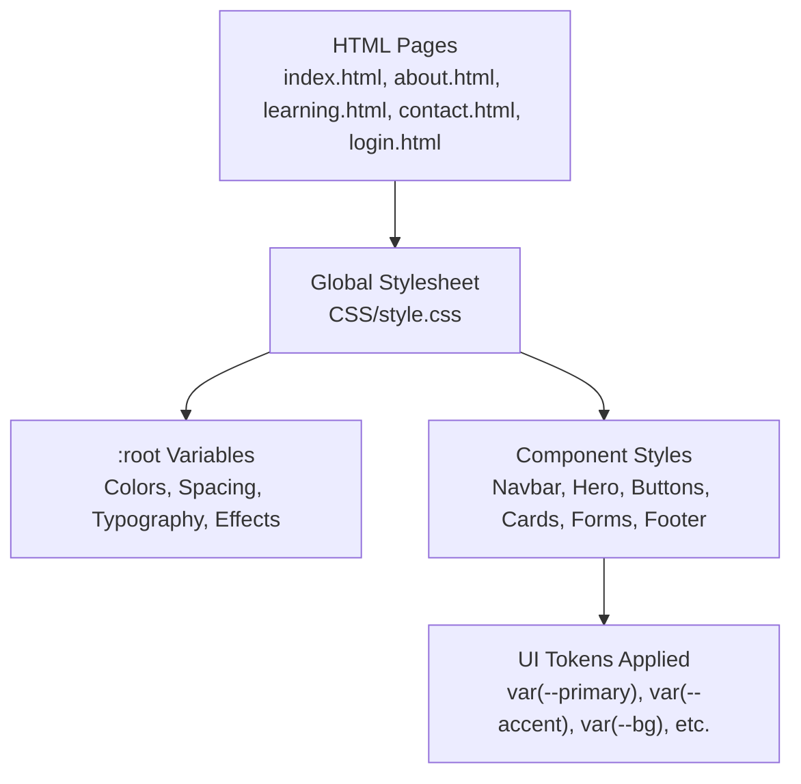
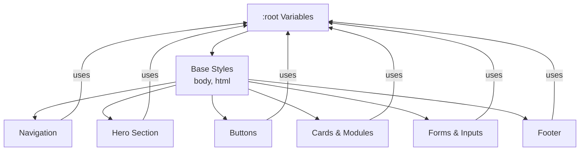
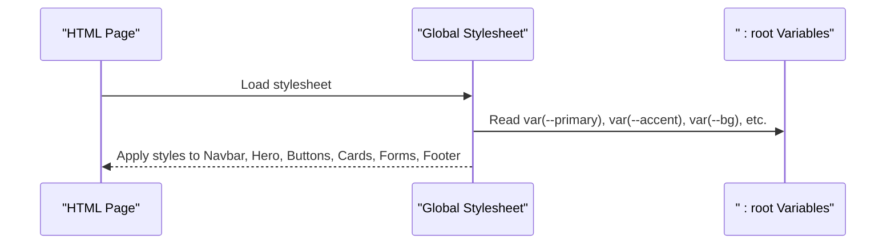
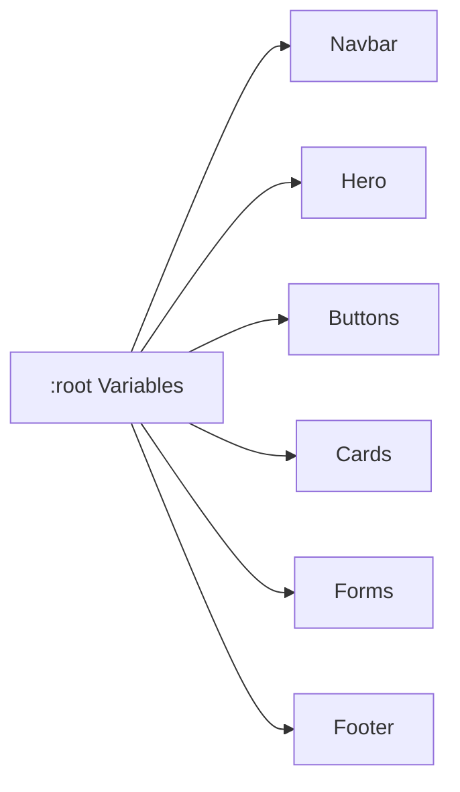

# Custom Properties & Theming

<cite>
**Referenced Files in This Document**
- [style.css](file://CSS/style.css)
- [index.html](file://index.html)
- [about.html](file://about.html)
- [contact.html](file://contact.html)
- [learning.html](file://learning.html)
- [login.html](file://login.html)
</cite>

## Table of Contents
1. Introduction
2. Project Structure
3. Core Components
4. Architecture Overview
5. Detailed Component Analysis
6. Dependency Analysis
7. Performance Considerations
8. Troubleshooting Guide
9. Conclusion
10. Appendices

## Introduction
This document explains the CSS custom properties system used for theming in the Digital Bridges project. It focuses on how variables are defined in :root, organized by category (colors, spacing, typography), and consumed across the stylesheet to create a consistent, maintainable design system. You will learn how to customize colors, extend tokens, and keep components consistent when adding or modifying styles.

## Project Structure
The theming system is centralized in a single stylesheet and applied globally via :root. All HTML pages link to this stylesheet, ensuring consistent application of design tokens across the site.

**Diagram sources**
- [style.css:3-13](file://CSS/style.css#L3-L13)
- [index.html:7](file://index.html#L7)
- [about.html:7](file://about.html#L7)
- [contact.html:7](file://contact.html#L7)
- [learning.html:7](file://learning.html#L7)
- [login.html:7](file://login.html#L7)

**Section sources**
- [style.css:3-13](file://CSS/style.css#L3-L13)
- [index.html:7](file://index.html#L7)
- [about.html:7](file://about.html#L7)
- [contact.html:7](file://contact.html#L7)
- [learning.html:7](file://learning.html#L7)
- [login.html:7](file://login.html#L7)

## Core Components
The theme is built around a small set of well-scoped tokens defined in :root. These include:

- Colors
  - Primary palette: primary, primary-dark, primary-light
  - Accent palette: accent, accent-dark
  - Surface and background: bg, surface
  - Text: text, text-muted
  - Borders: border
  - Feedback: success, error

- Spacing and Layout
  - Border radius: radius
  - Shadows: shadow, shadow-lg
  - Transitions: transition

- Typography
  - Font stack configured on body using system fonts for performance and native feel

These tokens are consumed throughout the stylesheet to style navigation, hero, buttons, cards, forms, footer, and responsive behavior.

**Section sources**
- [style.css:3-13](file://CSS/style.css#L3-L13)
- [style.css:15](file://CSS/style.css#L15)
- [style.css:20-36](file://CSS/style.css#L20-L36)
- [style.css:57-63](file://CSS/style.css#L57-L63)
- [style.css:81-90](file://CSS/style.css#L81-L90)
- [style.css:143-151](file://CSS/style.css#L143-L151)
- [style.css:188-196](file://CSS/style.css#L188-L196)

## Architecture Overview
The theming architecture follows a token-driven approach:

- Centralized definitions in :root ensure a single source of truth for visual tokens.
- Components reference tokens via var() instead of hard-coded values.
- Global base styles apply the font stack and default color context.
- Responsive rules reuse tokens to maintain consistency at all breakpoints.

**Diagram sources**
- [style.css:3-13](file://CSS/style.css#L3-L13)
- [style.css:15](file://CSS/style.css#L15)
- [style.css:20-36](file://CSS/style.css#L20-L36)
- [style.css:38-54](file://CSS/style.css#L38-L54)
- [style.css:57-63](file://CSS/style.css#L57-L63)
- [style.css:81-90](file://CSS/style.css#L81-L90)
- [style.css:143-151](file://CSS/style.css#L143-L151)
- [style.css:188-196](file://CSS/style.css#L188-L196)

## Detailed Component Analysis

### Color Palette System
- Primary colors define brand emphasis and interactive states. They are used for highlights, active links, and primary actions.
- Accent colors provide contrast for secondary actions and visual interest.
- Surface and background tokens separate content layers from the page background.
- Text tokens ensure readable foregrounds against backgrounds.
- Border tokens unify outlines and dividers.
- Success and error tokens standardize feedback messages.

Usage examples across the stylesheet:
- Navigation links and hover states use primary and text-muted.
- Buttons use primary and accent with hover variants.
- Cards and sections use surface, bg, and border for structure.
- Toast messages use success and error for status feedback.

Customization guidance:
- To change the brand tone, update primary, primary-dark, and primary-light in :root.
- To adjust contrast or accessibility, modify text and border tokens.
- For feedback themes, update success and error tokens consistently.

**Section sources**
- [style.css:3-13](file://CSS/style.css#L3-L13)
- [style.css:20-36](file://CSS/style.css#L20-L36)
- [style.css:57-63](file://CSS/style.css#L57-L63)
- [style.css:182-186](file://CSS/style.css#L182-L186)

### Typography and Font Stack
- The font stack uses system fonts for fast rendering and native appearance across devices.
- Body sets line-height and color using tokens to ensure readability.
- Headings and labels inherit the stack while relying on component-specific sizing and weights.

Performance note:
- Using system fonts avoids external font requests, improving load time and reducing layout shifts.

Customization guidance:
- If you need to introduce a new font family, add it to the font stack in the base rule and test legibility with current tokens.

**Section sources**
- [style.css:15](file://CSS/style.css#L15)

### Spacing Scale and Visual Rhythm
- Radius defines consistent corner rounding for cards, buttons, and inputs.
- Shadow and shadow-lg provide depth hierarchy for elevation and focus states.
- Transition standardizes motion timing and easing for interactions.

Usage examples:
- Cards and modules apply radius and shadow for consistent elevation.
- Buttons and nav elements use transition for smooth state changes.
- Sections and containers leverage spacing through padding and margins.

Customization guidance:
- Adjust radius to match brand guidelines for softer or sharper corners.
- Modify shadows to increase or decrease perceived depth.
- Tune transition timing for faster or more deliberate interactions.

**Section sources**
- [style.css:3-13](file://CSS/style.css#L3-L13)
- [style.css:81-90](file://CSS/style.css#L81-L90)
- [style.css:57-63](file://CSS/style.css#L57-L63)

### Token Usage Across Components
- Navigation: Uses primary for active states and accents; borders and shadows for structure.
- Hero: Uses gradients and tokens to create layered backgrounds and highlights.
- Buttons: Leverage primary and accent with hover variants and transitions.
- Cards and Modules: Apply surface, border, radius, and shadow for consistent elevation and focus.
- Forms: Use border, bg, surface, and primary for focus rings and input styling.
- Footer: Uses text and border tokens for contrast and separation.

**Diagram sources**
- [style.css:3-13](file://CSS/style.css#L3-L13)
- [style.css:20-36](file://CSS/style.css#L20-L36)
- [style.css:38-54](file://CSS/style.css#L38-L54)
- [style.css:57-63](file://CSS/style.css#L57-L63)
- [style.css:81-90](file://CSS/style.css#L81-L90)
- [style.css:143-151](file://CSS/style.css#L143-L151)
- [style.css:188-196](file://CSS/style.css#L188-L196)

**Section sources**
- [style.css:20-36](file://CSS/style.css#L20-L36)
- [style.css:38-54](file://CSS/style.css#L38-L54)
- [style.css:57-63](file://CSS/style.css#L57-L63)
- [style.css:81-90](file://CSS/style.css#L81-L90)
- [style.css:143-151](file://CSS/style.css#L143-L151)
- [style.css:188-196](file://CSS/style.css#L188-L196)

## Dependency Analysis
- Single source of truth: All visual tokens are defined once in :root.
- Low coupling: Components depend only on token names, not specific values.
- High cohesion: Related tokens are grouped together for clarity.
- No circular dependencies: Tokens are read-only values consumed by selectors.

**Diagram sources**
- [style.css:3-13](file://CSS/style.css#L3-L13)
- [style.css:20-36](file://CSS/style.css#L20-L36)
- [style.css:38-54](file://CSS/style.css#L38-L54)
- [style.css:57-63](file://CSS/style.css#L57-L63)
- [style.css:81-90](file://CSS/style.css#L81-L90)
- [style.css:143-151](file://CSS/style.css#L143-L151)
- [style.css:188-196](file://CSS/style.css#L188-L196)

**Section sources**
- [style.css:3-13](file://CSS/style.css#L3-L13)

## Performance Considerations
- System font stack reduces network overhead and improves first paint speed.
- Minimal token count keeps CSS size small and parsing fast.
- Reusing tokens avoids redundant declarations and ensures consistent rendering across components.
- Avoid introducing heavy external fonts unless necessary; if required, preload and subset fonts.

[No sources needed since this section provides general guidance]

## Troubleshooting Guide
Common issues and resolutions:
- Inconsistent colors across components: Ensure all instances use var(--token) rather than hard-coded hex values.
- Poor contrast: Verify text and background tokens meet accessibility standards; adjust text and bg tokens in :root if needed.
- Unexpected hover states: Check that hover rules reference the correct token variants (e.g., primary vs primary-dark).
- Broken form focus rings: Confirm focus styles use primary and appropriate box-shadow tokens.

Where to look:
- Token definitions in :root
- Component styles referencing tokens
- Responsive rules that may override defaults

**Section sources**
- [style.css:3-13](file://CSS/style.css#L3-L13)
- [style.css:20-36](file://CSS/style.css#L20-L36)
- [style.css:57-63](file://CSS/style.css#L57-L63)
- [style.css:143-151](file://CSS/style.css#L143-L151)

## Conclusion
The Digital Bridges theming system relies on a concise set of CSS custom properties defined in :root. By centralizing colors, spacing, typography, and effects, the project achieves consistency, maintainability, and performance. Extending the theme involves updating tokens in one place and leveraging existing patterns for new components. Following the naming conventions and organization outlined here will help keep the design system coherent as the project grows.

[No sources needed since this section summarizes without analyzing specific files]

## Appendices

### How to Customize the Theme
- Change brand colors: Update primary, primary-dark, and primary-light in :root.
- Adjust accent tones: Modify accent and accent-dark for secondary actions.
- Refine surfaces and text: Tweak bg, surface, text, and text-muted for better contrast.
- Update feedback colors: Change success and error to align with branding or accessibility needs.

Examples of where tokens are used:
- Buttons and interactive elements: primary and accent
- Content surfaces and backgrounds: bg and surface
- Borders and dividers: border
- Status messages: success and error

**Section sources**
- [style.css:3-13](file://CSS/style.css#L3-L13)
- [style.css:57-63](file://CSS/style.css#L57-L63)
- [style.css:182-186](file://CSS/style.css#L182-L186)

### Best Practices for Adding New Components
- Use existing tokens exclusively; avoid hard-coded values.
- Follow established naming conventions for classes and tokens.
- Keep component styles scoped and minimal; rely on tokens for visual identity.
- Test contrast and accessibility with updated tokens.
- Maintain consistent spacing and elevation using radius, shadow, and transition.

**Section sources**
- [style.css:3-13](file://CSS/style.css#L3-L13)
- [style.css:81-90](file://CSS/style.css#L81-L90)
- [style.css:57-63](file://CSS/style.css#L57-L63)