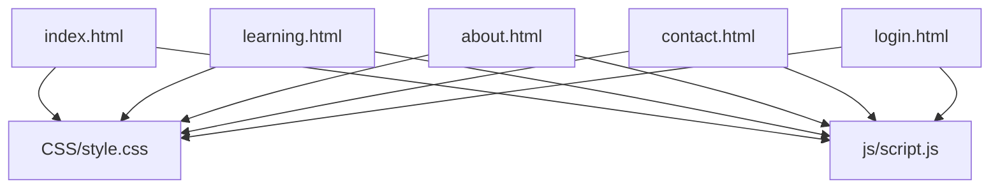
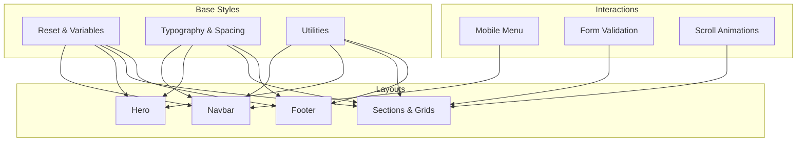
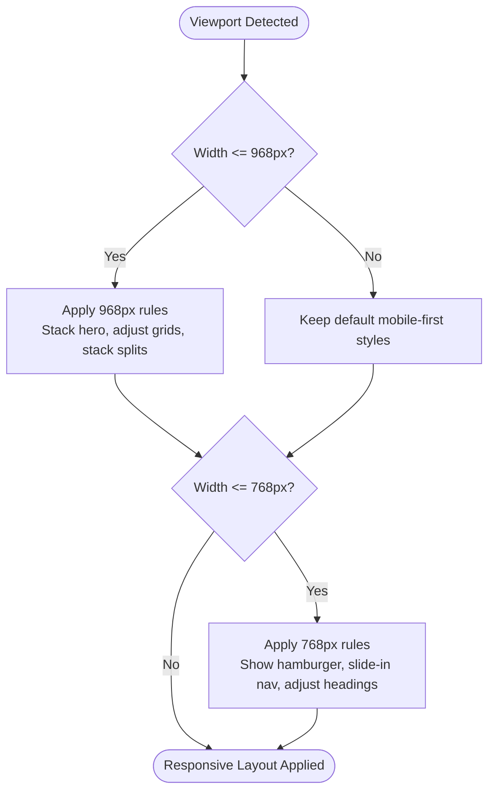
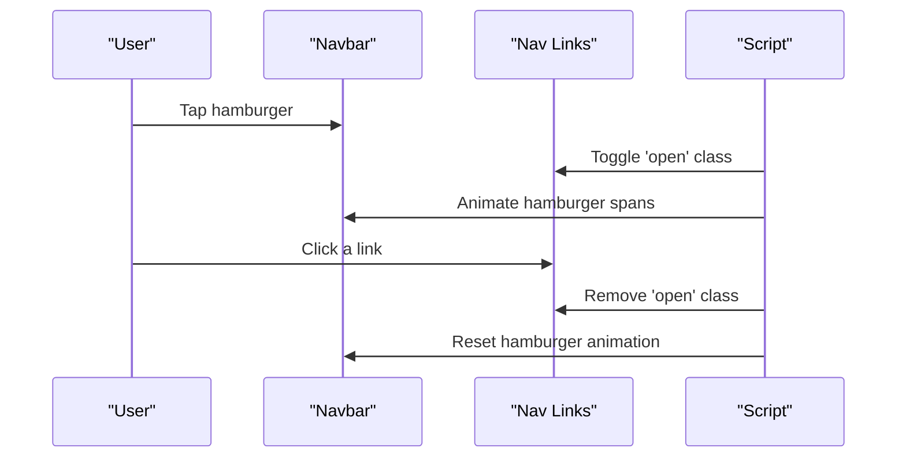
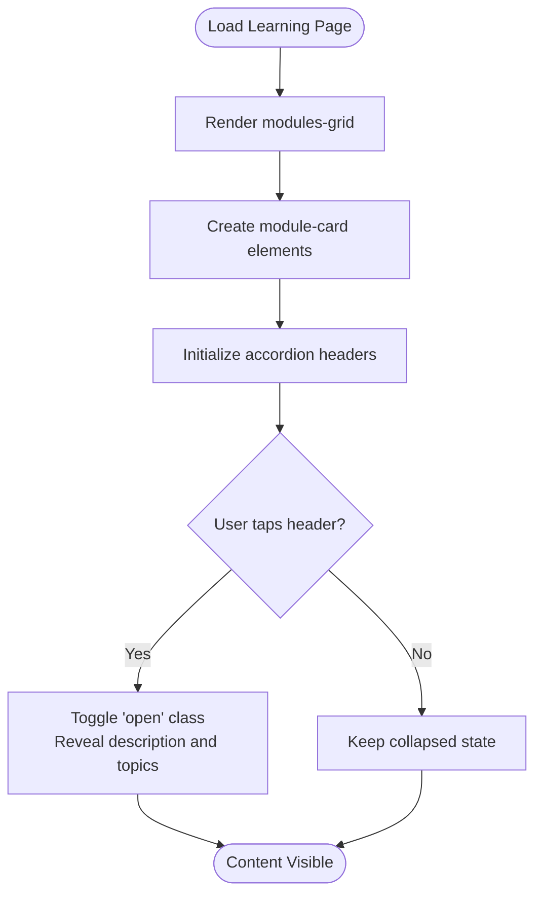
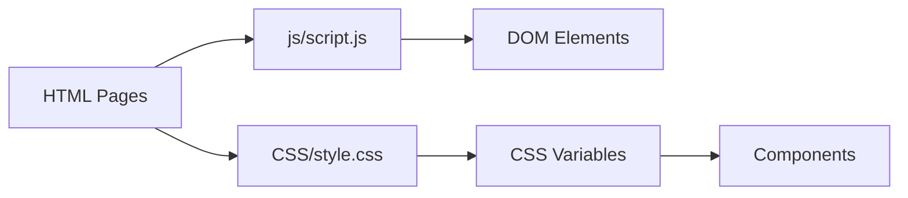

# Responsive Design System

<cite>
**Referenced Files in This Document**
- [style.css](file://CSS/style.css)
- [script.js](file://js/script.js)
- [index.html](file://index.html)
- [learning.html](file://learning.html)
- [about.html](file://about.html)
- [contact.html](file://contact.html)
- [login.html](file://login.html)
</cite>

## Table of Contents
1. Introduction
2. Project Structure
3. Core Components
4. Architecture Overview
5. Detailed Component Analysis
6. Dependency Analysis
7. Performance Considerations
8. Troubleshooting Guide
9. Conclusion
10. Appendices

## Introduction
This document explains the responsive design system implemented in the Digital Bridges project. It focuses on a mobile-first approach with progressive enhancement for larger screens, detailing breakpoint strategy using media queries, grid-based layouts, fluid typography scaling, flexible images and spacing, touch-friendly interactions, navigation adaptation from hamburger to full menu, learning module reorganization on smaller screens, and guidelines for creating new responsive components that maintain accessibility across devices.

## Project Structure
The project uses a simple, clean structure:
- CSS styles are centralized in a single stylesheet.
- JavaScript handles interactive behaviors like the mobile menu, scroll effects, form validation, and animations.
- HTML pages share common layout patterns (navbar, sections, grids, footers) and include the shared CSS and JS.

**Diagram sources**
- [index.html:1-106](file://index.html#L1-L106)
- [learning.html:1-137](file://learning.html#L1-L137)
- [about.html:1-123](file://about.html#L1-L123)
- [contact.html:1-102](file://contact.html#L1-L102)
- [login.html:1-60](file://login.html#L1-L60)
- [style.css:1-247](file://CSS/style.css#L1-L247)
- [script.js:1-105](file://js/script.js#L1-L105)

**Section sources**
- [style.css:1-247](file://CSS/style.css#L1-L247)
- [script.js:1-105](file://js/script.js#L1-L105)
- [index.html:1-106](file://index.html#L1-L106)
- [learning.html:1-137](file://learning.html#L1-L137)
- [about.html:1-123](file://about.html#L1-L123)
- [contact.html:1-102](file://contact.html#L1-L102)
- [login.html:1-60](file://login.html#L1-L60)

## Core Components
- Mobile-first base styles define typography, spacing, colors, and foundational layout utilities.
- Navigation includes a fixed top bar with a hamburger toggle for small screens.
- Grid systems use CSS Grid with auto-fit and minmax for flexible card layouts.
- Sections and banners provide consistent content containers.
- Interactive behaviors are handled by JavaScript for menus, forms, and animations.

Key implementation highlights:
- Base reset and CSS custom properties for consistent theming.
- Fixed navbar with backdrop blur and shadow on scroll.
- Hero section with two-column grid that stacks on smaller screens.
- Stats bar and modules grid adapt via CSS Grid.
- Contact page uses a two-column split that collapses on smaller screens.
- Login page centers a card with accessible inputs and toggles.

**Section sources**
- [style.css:1-247](file://CSS/style.css#L1-L247)
- [script.js:1-105](file://js/script.js#L1-L105)
- [index.html:10-25](file://index.html#L10-L25)
- [index.html:27-75](file://index.html#L27-L75)
- [contact.html:26-49](file://contact.html#L26-L49)
- [login.html:10-55](file://login.html#L10-L55)

## Architecture Overview
The responsive architecture is built around:
- Mobile-first CSS with progressive enhancements at defined breakpoints.
- CSS Grid for adaptive layouts without rigid column counts.
- JavaScript-driven interactions that enhance usability without breaking core functionality.

**Diagram sources**
- [style.css:1-247](file://CSS/style.css#L1-L247)
- [script.js:1-105](file://js/script.js#L1-L105)

## Detailed Component Analysis

### Breakpoint Strategy and Media Queries
The project defines two primary breakpoints:
- 968px: Adjusts hero stacking, stats grid columns, contact split, content split, and footer columns.
- 768px: Activates the mobile menu, adjusts hero heading size, banner headings, and login card padding.

Breakpoints are applied progressively:
- Default styles target mobile viewports first.
- Larger screens receive enhanced layouts via media queries.

**Diagram sources**
- [style.css:227-246](file://CSS/style.css#L227-L246)

**Section sources**
- [style.css:227-246](file://CSS/style.css#L227-L246)

### Grid Systems and Layout Adaptations
- Modules grid uses auto-fit and minmax to create responsive card columns without explicit breakpoints.
- Stats grid switches from four columns to two at 968px.
- Contact and content splits collapse to single column at 968px.
- Footer inner grid collapses to one column at 968px.

These patterns ensure content remains readable and navigable across devices.

**Section sources**
- [style.css:74-131](file://CSS/style.css#L74-L131)
- [style.css:132-196](file://CSS/style.css#L132-L196)
- [style.css:227-236](file://CSS/style.css#L227-L236)

### Fluid Typography Scaling
- Headings scale down at smaller breakpoints to fit narrower screens while maintaining hierarchy.
- Body text uses relative units and line-height for readability.
- Section headers and banners reduce font sizes at 768px to preserve visual balance.

Guidelines:
- Use relative units (rem, em) for scalable typography.
- Define headline sizes in base styles and override at breakpoints as needed.
- Maintain contrast and line length for accessibility.

**Section sources**
- [style.css:44-71](file://CSS/style.css#L44-L71)
- [style.css:198-206](file://CSS/style.css#L198-L206)
- [style.css:237-246](file://CSS/style.css#L237-L246)

### Flexible Images and Aspect Ratios
While no explicit image classes are present in the current stylesheets, the grid-based layout naturally accommodates images within cards and hero visuals. To maintain aspect ratios:
- Wrap images in containers with aspect-ratio or padding-top techniques.
- Use object-fit to prevent distortion when resizing.
- Ensure images do not exceed container widths.

Recommendation:
- Add utility classes for image containers if images are introduced later.

[No sources needed since this section provides general guidance]

### Touch-Friendly Interactions
- Hamburger menu is designed for touch targets with adequate spacing and clear visual feedback.
- Buttons have hover states and transitions; ensure tap targets are large enough on mobile.
- Form inputs and toggles are sized appropriately for touch interaction.

JavaScript enhances interactivity:
- Toggle mobile menu with click events.
- Animate hamburger icon into an X shape.
- Close menu when links are clicked.

**Section sources**
- [style.css:19-37](file://CSS/style.css#L19-L37)
- [style.css:56-63](file://CSS/style.css#L56-L63)
- [style.css:143-151](file://CSS/style.css#L143-L151)
- [script.js:5-19](file://js/script.js#L5-L19)

### Navigation Adaptation: Hamburger to Full Menu
- On desktop, the navigation displays horizontally with links and a call-to-action button.
- On mobile (≤768px), the menu becomes a slide-in panel triggered by the hamburger icon.
- The menu closes automatically when a link is selected.

**Diagram sources**
- [style.css:19-37](file://CSS/style.css#L19-L37)
- [style.css:237-240](file://CSS/style.css#L237-L240)
- [script.js:5-19](file://js/script.js#L5-L19)

**Section sources**
- [style.css:19-37](file://CSS/style.css#L19-L37)
- [style.css:237-240](file://CSS/style.css#L237-L240)
- [script.js:5-19](file://js/script.js#L5-L19)

### Learning Modules Reorganization on Smaller Screens
- Module cards use a responsive grid that adapts to screen width without explicit breakpoints.
- Accordion-style module details expand/collapse to manage content density on smaller screens.
- Topic chips wrap gracefully to avoid overflow.

**Diagram sources**
- [style.css:80-91](file://CSS/style.css#L80-L91)
- [style.css:210-224](file://CSS/style.css#L210-L224)
- [script.js:68-75](file://js/script.js#L68-L75)

**Section sources**
- [style.css:80-91](file://CSS/style.css#L80-L91)
- [style.css:210-224](file://CSS/style.css#L210-L224)
- [script.js:68-75](file://js/script.js#L68-L75)
- [learning.html:34-96](file://learning.html#L34-L96)

### Guidelines for Creating New Responsive Components
Follow these patterns to maintain consistency and accessibility:
- Start with mobile-first styles; add enhancements at breakpoints.
- Use CSS Grid with auto-fit and minmax for flexible layouts.
- Keep touch targets at least 44x44 pixels for better usability.
- Use relative units for typography and spacing to support scaling.
- Ensure color contrast meets accessibility standards.
- Test interactions on both touch and pointer devices.
- Provide keyboard navigation and focus states for all interactive elements.
- Avoid horizontal scrolling; prefer wrapping and stacking.

[No sources needed since this section provides general guidance]

## Dependency Analysis
- All HTML pages depend on the central stylesheet and script file.
- The script file adds behavior to shared UI components (navbar, forms, accordions).
- CSS variables centralize theme values used across components.

**Diagram sources**
- [index.html:1-106](file://index.html#L1-L106)
- [learning.html:1-137](file://learning.html#L1-L137)
- [about.html:1-123](file://about.html#L1-L123)
- [contact.html:1-102](file://contact.html#L1-L102)
- [login.html:1-60](file://login.html#L1-L60)
- [style.css:1-13](file://CSS/style.css#L1-L13)
- [script.js:1-105](file://js/script.js#L1-L105)

**Section sources**
- [style.css:1-13](file://CSS/style.css#L1-L13)
- [script.js:1-105](file://js/script.js#L1-L105)

## Performance Considerations
- Prefer CSS Grid over complex float-based layouts for performance and simplicity.
- Minimize heavy animations; use transforms and opacity for smooth interactions.
- Defer non-critical scripts where possible to improve initial load time.
- Use efficient selectors and avoid excessive recalculations in JavaScript.
- Optimize images and consider lazy loading for media-heavy pages.

[No sources needed since this section provides general guidance]

## Troubleshooting Guide
Common issues and resolutions:
- Mobile menu not opening: Ensure the hamburger element and nav links IDs match those referenced in the script. Verify the open class toggling logic.
- Forms not validating: Confirm input IDs exist and event listeners are attached. Check for required attributes and message handling.
- Scroll animations not triggering: Verify IntersectionObserver setup and that elements have the correct classes.
- Broken layout at certain widths: Review media queries and ensure grid columns are set correctly for each breakpoint.

**Section sources**
- [script.js:5-19](file://js/script.js#L5-L19)
- [script.js:21-66](file://js/script.js#L21-L66)
- [script.js:77-86](file://js/script.js#L77-L86)
- [style.css:227-246](file://CSS/style.css#L227-L246)

## Conclusion
The Digital Bridges project implements a robust, mobile-first responsive design system with clear breakpoints, flexible grids, and accessible interactions. By following established patterns and guidelines, new components can seamlessly integrate into the existing system while maintaining usability and accessibility across devices.

[No sources needed since this section summarizes without analyzing specific files]

## Appendices

### Accessibility Checklist for Responsive Components
- Ensure sufficient color contrast for text and interactive elements.
- Provide visible focus indicators for keyboard navigation.
- Use semantic HTML elements and ARIA attributes where appropriate.
- Test with screen readers and keyboard-only navigation.
- Validate form labels and error messages for clarity.

[No sources needed since this section provides general guidance]