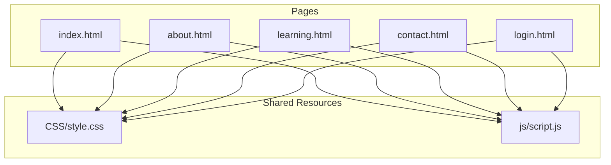
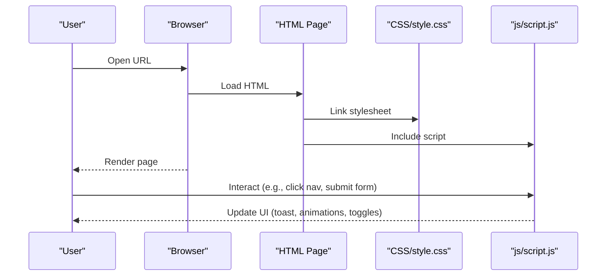
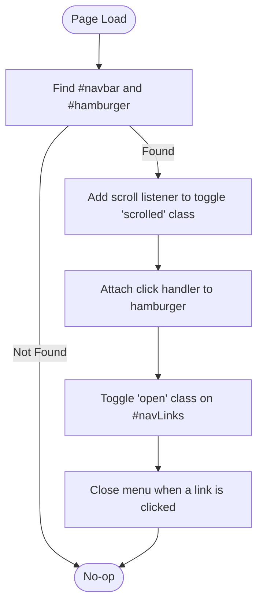
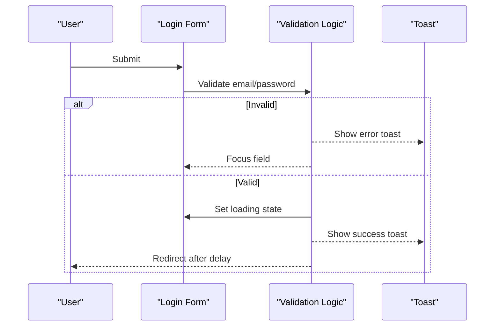
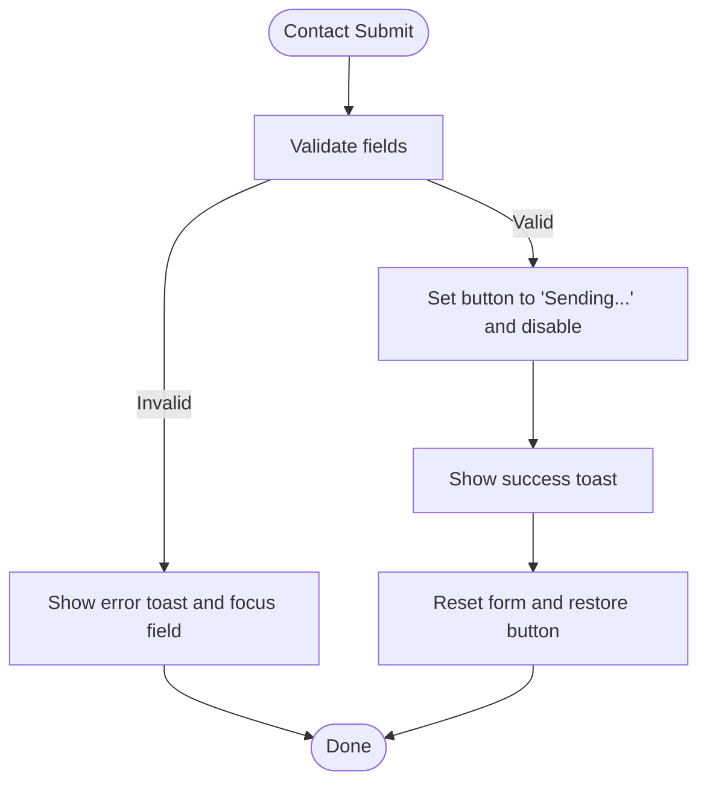
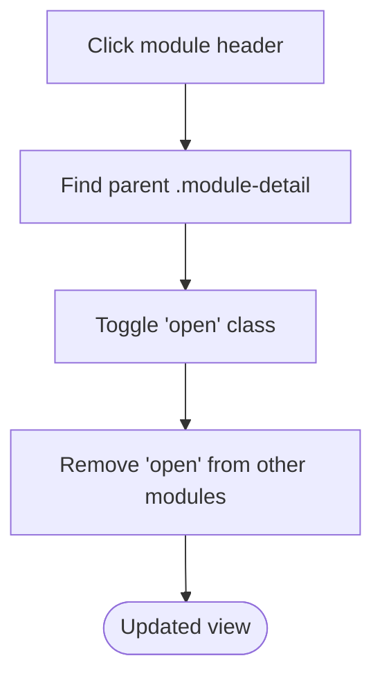
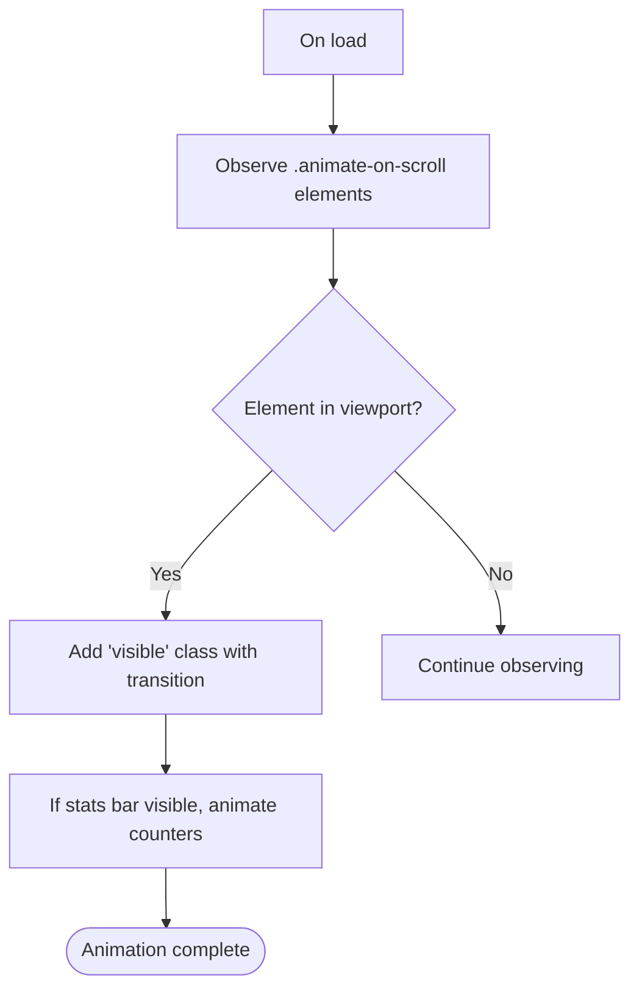
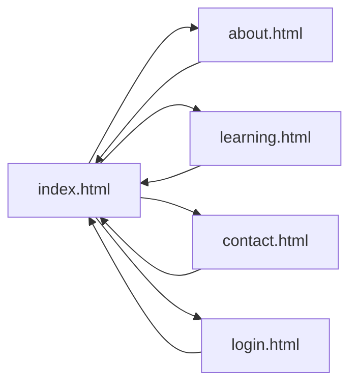
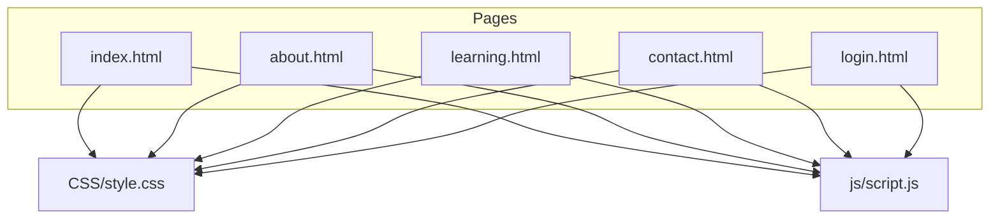

# Frontend Architecture

<cite>
**Referenced Files in This Document**
- [index.html](file://index.html)
- [about.html](file://about.html)
- [contact.html](file://contact.html)
- [learning.html](file://learning.html)
- [login.html](file://login.html)
- [style.css](file://CSS/style.css)
- [script.js](file://js/script.js)
</cite>

## Table of Contents
1. Introduction
2. Project Structure
3. Core Components
4. Architecture Overview
5. Detailed Component Analysis
6. Dependency Analysis
7. Performance Considerations
8. Troubleshooting Guide
9. Conclusion

## Introduction
This document explains the frontend architecture of the Digital Bridges Zambia static website. The site is built with vanilla HTML5, CSS, and JavaScript, following a page-based architecture where each HTML file represents a distinct page or feature. The design emphasizes separation of concerns: structure (HTML), presentation (CSS), and behavior (JavaScript). As a static site, it eliminates backend dependencies while delivering interactive functionality through client-side processing such as form validation, navigation behaviors, and scroll animations.

## Project Structure
The project uses a flat, page-based layout with clear separation of assets:
- Pages: index.html, about.html, contact.html, learning.html, login.html
- Styles: CSS/style.css
- Behavior: js/script.js
- Assets: assets/images and assets/icons (reserved for future media)

Each page includes a shared stylesheet and script, enabling consistent UI and behavior across pages without server-side logic.

**Diagram sources**
- [index.html:1-106](file://index.html#L1-L106)
- [about.html:1-123](file://about.html#L1-L123)
- [contact.html:1-102](file://contact.html#L1-L102)
- [learning.html:1-137](file://learning.html#L1-L137)
- [login.html:1-60](file://login.html#L1-L60)
- [style.css:1-247](file://CSS/style.css#L1-L247)
- [script.js:1-105](file://js/script.js#L1-L105)

**Section sources**
- [index.html:1-106](file://index.html#L1-L106)
- [about.html:1-123](file://about.html#L1-L123)
- [contact.html:1-102](file://contact.html#L1-L102)
- [learning.html:1-137](file://learning.html#L1-L137)
- [login.html:1-60](file://login.html#L1-L60)
- [style.css:1-247](file://CSS/style.css#L1-L247)
- [script.js:1-105](file://js/script.js#L1-L105)

## Core Components
- Shared Navigation: A fixed navbar with logo, links, and a mobile hamburger menu. Active states are set per page to indicate current location.
- Page Sections: Hero, banners, modules grids, objectives, phases, partners, and contact sections provide structured content areas.
- Forms: Contact and login forms include client-side validation and user feedback via toast notifications.
- Interactive Modules: Learning modules use an accordion pattern to expand/collapse details.
- Animations: Scroll-triggered fade-in effects and animated counters enhance engagement.

Key responsibilities:
- HTML defines semantic structure and page content.
- CSS centralizes styling, responsive rules, and visual themes.
- JavaScript handles interactivity, validation, and dynamic effects.

**Section sources**
- [index.html:10-25](file://index.html#L10-L25)
- [style.css:19-37](file://CSS/style.css#L19-L37)
- [script.js:1-19](file://js/script.js#L1-L19)
- [learning.html:34-96](file://learning.html#L34-L96)
- [style.css:210-224](file://CSS/style.css#L210-L224)
- [script.js:68-75](file://js/script.js#L68-L75)
- [script.js:77-86](file://js/script.js#L77-L86)
- [script.js:88-104](file://js/script.js#L88-L104)

## Architecture Overview
The site follows a static, page-based architecture:
- Each HTML file is self-contained and references shared CSS and JS.
- Navigation between pages uses anchor links to .html files.
- Client-side JavaScript enhances UX without requiring a backend.

**Diagram sources**
- [index.html:7-8](file://index.html#L7-L8)
- [index.html:103-103](file://index.html#L103-L103)
- [style.css:1-247](file://CSS/style.css#L1-L247)
- [script.js:1-105](file://js/script.js#L1-L105)

## Detailed Component Analysis

### Navigation and Mobile Menu
- Fixed navbar with logo and links; active link styling indicates current page.
- Hamburger menu toggles on small screens; clicking a link closes the menu.
- Scroll effect adds a shadow when the user scrolls down.

**Diagram sources**
- [script.js:1-19](file://js/script.js#L1-L19)
- [style.css:19-37](file://CSS/style.css#L19-L37)

**Section sources**
- [index.html:10-25](file://index.html#L10-L25)
- [about.html:10-18](file://about.html#L10-L18)
- [contact.html:10-18](file://contact.html#L10-L18)
- [learning.html:10-18](file://learning.html#L10-L18)
- [style.css:19-37](file://CSS/style.css#L19-L37)
- [script.js:1-19](file://js/script.js#L1-L19)

### Login Form and Validation
- Validates email format and password length.
- Provides loading state and success feedback via toast.
- Includes password visibility toggle and placeholder social login buttons.

**Diagram sources**
- [login.html:19-52](file://login.html#L19-L52)
- [script.js:30-50](file://js/script.js#L30-L50)
- [style.css:153-180](file://CSS/style.css#L153-L180)

**Section sources**
- [login.html:19-52](file://login.html#L19-L52)
- [script.js:30-50](file://js/script.js#L30-L50)
- [style.css:153-180](file://CSS/style.css#L153-L180)

### Contact Form and Feedback
- Validates name, email, subject selection, and message length.
- Simulates submission with loading state and success toast.
- Resets form after successful submission.

**Diagram sources**
- [contact.html:37-46](file://contact.html#L37-L46)
- [script.js:52-66](file://js/script.js#L52-L66)
- [style.css:143-148](file://CSS/style.css#L143-L148)

**Section sources**
- [contact.html:37-46](file://contact.html#L37-L46)
- [script.js:52-66](file://js/script.js#L52-L66)
- [style.css:143-148](file://CSS/style.css#L143-L148)

### Learning Modules Accordion
- Clicking a module header toggles its details and topic chips.
- Only one module can be open at a time; others collapse automatically.

**Diagram sources**
- [learning.html:34-96](file://learning.html#L34-L96)
- [script.js:68-75](file://js/script.js#L68-L75)
- [style.css:210-224](file://CSS/style.css#L210-L224)

**Section sources**
- [learning.html:34-96](file://learning.html#L34-L96)
- [script.js:68-75](file://js/script.js#L68-L75)
- [style.css:210-224](file://CSS/style.css#L210-L224)

### Scroll Animations and Stats Counter
- Elements with a specific class animate into view using IntersectionObserver.
- Stats numbers count up when visible, enhancing engagement.

**Diagram sources**
- [script.js:77-86](file://js/script.js#L77-L86)
- [script.js:88-104](file://js/script.js#L88-L104)
- [index.html:49-56](file://index.html#L49-L56)

**Section sources**
- [script.js:77-86](file://js/script.js#L77-L86)
- [script.js:88-104](file://js/script.js#L88-L104)
- [index.html:49-56](file://index.html#L49-L56)

### Page-Based Routing via Anchor Links
- All navigation uses direct links to .html files, enabling simple routing without a router.
- Active states are applied per page to reflect current location.

**Diagram sources**
- [index.html:16-22](file://index.html#L16-L22)
- [about.html:13-15](file://about.html#L13-L15)
- [contact.html:13-15](file://contact.html#L13-L15)
- [learning.html:13-15](file://learning.html#L13-L15)
- [login.html:11-11](file://login.html#L11-L11)

**Section sources**
- [index.html:16-22](file://index.html#L16-L22)
- [about.html:13-15](file://about.html#L13-L15)
- [contact.html:13-15](file://contact.html#L13-L15)
- [learning.html:13-15](file://learning.html#L13-L15)
- [login.html:11-11](file://login.html#L11-L11)

## Dependency Analysis
- Pages depend on shared CSS and JS for consistent styling and behavior.
- JavaScript selectively initializes features only when corresponding DOM elements exist, preventing errors on pages without those components.
- No external libraries are used; all interactions are implemented with native APIs.

**Diagram sources**
- [index.html:7-8](file://index.html#L7-L8)
- [index.html:103-103](file://index.html#L103-L103)
- [about.html:7-8](file://about.html#L7-L8)
- [about.html:120-120](file://about.html#L120-L120)
- [contact.html:7-8](file://contact.html#L7-L8)
- [contact.html:99-99](file://contact.html#L99-L99)
- [learning.html:7-8](file://learning.html#L7-L8)
- [learning.html:134-134](file://learning.html#L134-L134)
- [login.html:7-8](file://login.html#L7-L8)
- [login.html:57-57](file://login.html#L57-L57)

**Section sources**
- [index.html:7-8](file://index.html#L7-L8)
- [index.html:103-103](file://index.html#L103-L103)
- [about.html:7-8](file://about.html#L7-L8)
- [about.html:120-120](file://about.html#L120-L120)
- [contact.html:7-8](file://contact.html#L7-L8)
- [contact.html:99-99](file://contact.html#L99-L99)
- [learning.html:7-8](file://learning.html#L7-L8)
- [learning.html:134-134](file://learning.html#L134-L134)
- [login.html:7-8](file://login.html#L7-L8)
- [login.html:57-57](file://login.html#L57-L57)

## Performance Considerations
- Static delivery: No server-side rendering reduces latency and simplifies hosting.
- Minimal dependencies: Vanilla HTML/CSS/JS avoids heavy frameworks, improving load times.
- Efficient animations: IntersectionObserver triggers animations only when needed, reducing unnecessary work.
- Responsive design: CSS media queries ensure optimal layouts across devices without extra scripts.
- Asset readiness: Reserved asset folders allow adding images/icons later without restructuring.

[No sources needed since this section provides general guidance]

## Troubleshooting Guide
- Toast not appearing: Ensure the page includes a toast element and that the script runs after DOM loads.
- Form validation issues: Verify required fields and input types match expectations; check console for errors.
- Accordion not working: Confirm module headers have correct classes and that the script finds them.
- Mobile menu not closing: Ensure links inside the menu trigger the close behavior by checking event listeners.

**Section sources**
- [script.js:21-28](file://js/script.js#L21-L28)
- [script.js:30-50](file://js/script.js#L30-L50)
- [script.js:52-66](file://js/script.js#L52-L66)
- [script.js:68-75](file://js/script.js#L68-L75)
- [script.js:1-19](file://js/script.js#L1-L19)

## Conclusion
The Digital Bridges Zambia static website demonstrates a clean, maintainable frontend architecture using vanilla HTML5, CSS, and JavaScript. The page-based model, combined with shared resources and client-side interactivity, delivers a responsive and accessible experience without backend dependencies. This approach simplifies deployment, improves performance, and makes it straightforward to extend with additional pages and features.

[No sources needed since this section summarizes without analyzing specific files]