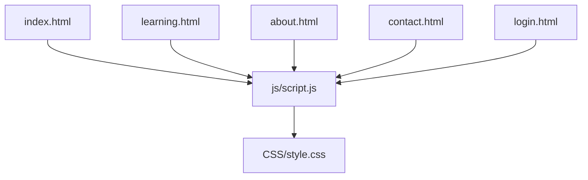
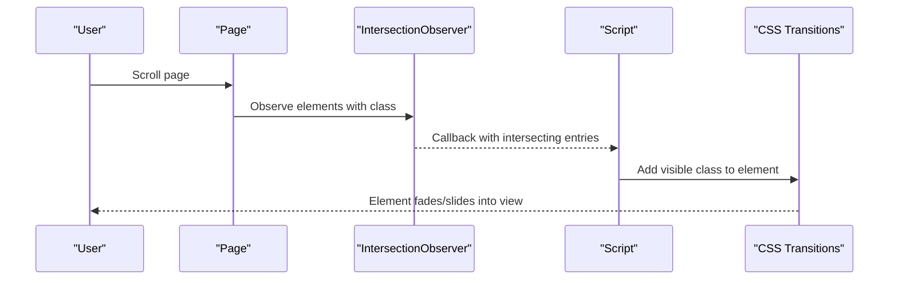
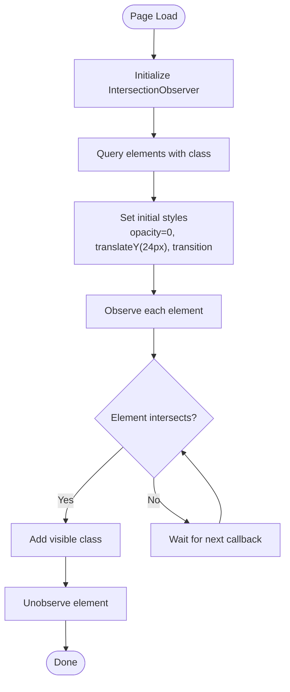
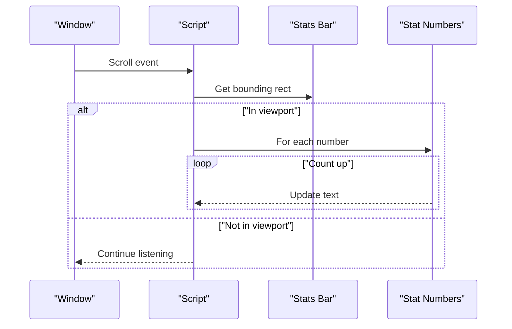
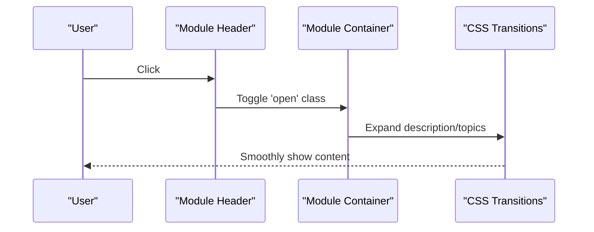
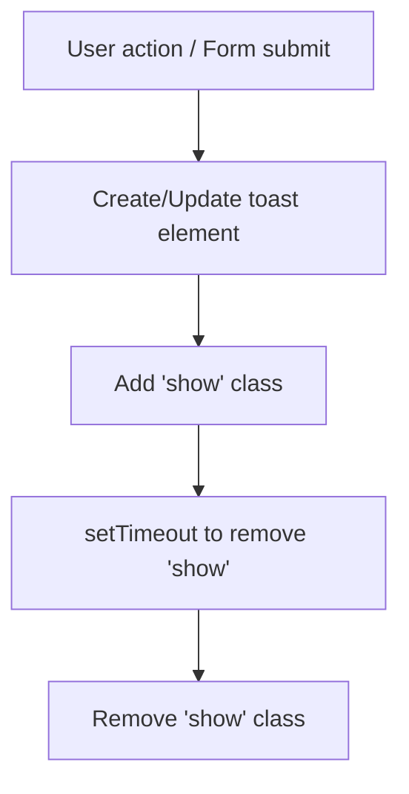
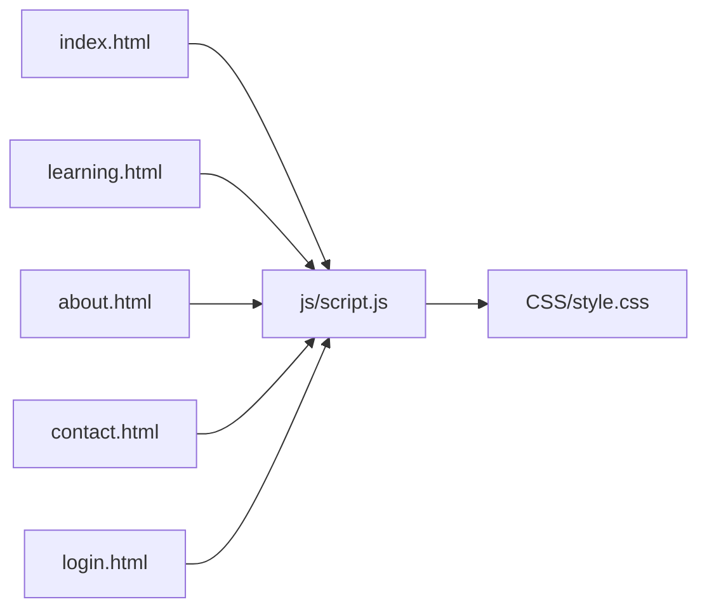

# Animations & Scroll Effects

<cite>
**Referenced Files in This Document**
- [script.js](file://js/script.js)
- [style.css](file://CSS/style.css)
- [index.html](file://index.html)
- [learning.html](file://learning.html)
- [about.html](file://about.html)
- [contact.html](file://contact.html)
- [login.html](file://login.html)
</cite>

## Table of Contents
1. [Introduction](#introduction)
2. [Project Structure](#project-structure)
3. [Core Components](#core-components)
4. [Architecture Overview](#architecture-overview)
5. [Detailed Component Analysis](#detailed-component-analysis)
6. [Dependency Analysis](#dependency-analysis)
7. [Performance Considerations](#performance-considerations)
8. [Troubleshooting Guide](#troubleshooting-guide)
9. [Accessibility Guidelines](#accessibility-guidelines)
10. [How to Add New Animations](#how-to-add-new-animations)
11. [Conclusion](#conclusion)

## Introduction
This document explains the animation system and scroll-based interactions in the Digital Bridges project. It covers:
- Intersection Observer API usage for scroll-triggered reveal animations
- Smooth transition effects powered by CSS transitions
- Accordion functionality for learning modules
- Counter animations for statistics
- Best practices for performance optimization and accessibility, including reduced motion support

The goal is to help you understand how animations are implemented and how to extend them safely and efficiently across pages.

## Project Structure
Animations and interactions are implemented using a small set of files:
- JavaScript logic resides in a single script file that handles scroll observers, counters, accordions, and UI feedback
- CSS defines transitions, states, and responsive behavior
- HTML pages include elements with specific classes that trigger animations or behaviors

**Diagram sources**
- [script.js:1-105](file://js/script.js#L1-L105)
- [style.css:1-247](file://CSS/style.css#L1-L247)
- [index.html:1-106](file://index.html#L1-L106)
- [learning.html:1-137](file://learning.html#L1-L137)
- [about.html:1-123](file://about.html#L1-L123)
- [contact.html:1-102](file://contact.html#L1-L102)
- [login.html:1-60](file://login.html#L1-L60)

**Section sources**
- [script.js:1-105](file://js/script.js#L1-L105)
- [style.css:1-247](file://CSS/style.css#L1-L247)
- [index.html:1-106](file://index.html#L1-L106)
- [learning.html:1-137](file://learning.html#L1-L137)
- [about.html:1-123](file://about.html#L1-L123)
- [contact.html:1-102](file://contact.html#L1-L102)
- [login.html:1-60](file://login.html#L1-L60)

## Core Components
- Scroll-triggered reveal animations: Elements marked with a specific class animate into view when they enter the viewport using Intersection Observer
- Stats counter: Numbers count up when the stats section becomes visible
- Accordion: Learning module details expand/collapse on click
- Toast notifications: Feedback messages slide in/out for user actions
- Navbar state: Adds a shadow when scrolled

These components work together to provide smooth, performant interactions without heavy libraries.

**Section sources**
- [script.js:68-105](file://js/script.js#L68-L105)
- [style.css:182-186](file://CSS/style.css#L182-L186)
- [style.css:20-21](file://CSS/style.css#L20-L21)

## Architecture Overview
At a high level:
- HTML provides semantic structure and marks elements for animation (e.g., cards, content blocks)
- CSS defines initial hidden states and transition properties for smooth reveals
- JavaScript initializes observers and event handlers to manage interactive behaviors

**Diagram sources**
- [script.js:77-86](file://js/script.js#L77-L86)
- [style.css:12-13](file://CSS/style.css#L12-L13)

## Detailed Component Analysis

### Scroll-triggered Reveal Animations
- Elements with a specific class start invisible and offset downward
- An Intersection Observer watches these elements; when they intersect the viewport, a visible class is added
- CSS transitions handle opacity and transform changes for smooth entry
- Each element receives a slight staggered delay based on its index for a cascading effect

**Diagram sources**
- [script.js:77-86](file://js/script.js#L77-L86)
- [style.css:12-13](file://CSS/style.css#L12-L13)

**Section sources**
- [script.js:77-86](file://js/script.js#L77-L86)
- [style.css:12-13](file://CSS/style.css#L12-L13)
- [index.html:65-72](file://index.html#L65-L72)
- [about.html:28-39](file://about.html#L28-L39)
- [about.html:67-76](file://about.html#L67-L76)
- [contact.html:28-46](file://contact.html#L28-L46)

### Stats Counter Animation
- The counter runs once per page load
- It checks if the stats bar is within the viewport using bounding rectangle calculations
- For each stat number, it increments from zero to the target value at a fixed interval
- A flag prevents re-running the animation on subsequent scrolls

**Diagram sources**
- [script.js:88-105](file://js/script.js#L88-L105)
- [index.html:49-56](file://index.html#L49-L56)

**Section sources**
- [script.js:88-105](file://js/script.js#L88-L105)
- [index.html:49-56](file://index.html#L49-L56)

### Accordion for Learning Modules
- Each module header toggles an open state on its parent container
- Only one module can be open at a time; opening one closes others
- CSS controls the animated expansion of descriptions and topic lists via max-height and opacity transitions

**Diagram sources**
- [script.js:68-75](file://js/script.js#L68-L75)
- [style.css:210-224](file://CSS/style.css#L210-L224)
- [learning.html:34-96](file://learning.html#L34-L96)

**Section sources**
- [script.js:68-75](file://js/script.js#L68-L75)
- [style.css:210-224](file://CSS/style.css#L210-L224)
- [learning.html:34-96](file://learning.html#L34-L96)

### Toast Notifications
- Toasts display temporary success or error messages
- They slide in from the right and auto-dismiss after a timeout
- Used for form validation feedback and login simulation

**Diagram sources**
- [script.js:21-28](file://js/script.js#L21-L28)
- [style.css:182-186](file://CSS/style.css#L182-L186)
- [contact.html:98-99](file://contact.html#L98-L99)
- [login.html:56-57](file://login.html#L56-L57)

**Section sources**
- [script.js:21-28](file://js/script.js#L21-L28)
- [style.css:182-186](file://CSS/style.css#L182-L186)
- [contact.html:98-99](file://contact.html#L98-L99)
- [login.html:56-57](file://login.html#L56-L57)

### Navbar Scroll State
- When the user scrolls past a threshold, a class is toggled to add a shadow to the navbar
- Provides visual feedback about scroll position

**Section sources**
- [script.js:1-3](file://js/script.js#L1-L3)
- [style.css:20-21](file://CSS/style.css#L20-L21)

## Dependency Analysis
- script.js depends on DOM elements present in HTML pages and CSS classes defined in style.css
- CSS transitions rely on variables and consistent naming conventions
- Pages include the shared script and stylesheet, enabling reusable behavior across views

**Diagram sources**
- [script.js:1-105](file://js/script.js#L1-L105)
- [style.css:1-247](file://CSS/style.css#L1-L247)
- [index.html:1-106](file://index.html#L1-L106)
- [learning.html:1-137](file://learning.html#L1-L137)
- [about.html:1-123](file://about.html#L1-L123)
- [contact.html:1-102](file://contact.html#L1-L102)
- [login.html:1-60](file://login.html#L1-L60)

**Section sources**
- [script.js:1-105](file://js/script.js#L1-L105)
- [style.css:1-247](file://CSS/style.css#L1-L247)
- [index.html:1-106](file://index.html#L1-L106)
- [learning.html:1-137](file://learning.html#L1-L137)
- [about.html:1-123](file://about.html#L1-L123)
- [contact.html:1-102](file://contact.html#L1-L102)
- [login.html:1-60](file://login.html#L1-L60)

## Performance Considerations
- Use Intersection Observer instead of scroll listeners for reveal animations to avoid layout thrashing
- Keep thresholds low and root margins minimal to reduce unnecessary callbacks
- Apply CSS transitions for GPU-accelerated properties like opacity and transform
- Avoid animating expensive properties such as width, height, or top/left positions
- Debounce or throttle heavy operations if adding more scroll-driven features
- Ensure counters run only once per session to prevent redundant intervals
- Prefer requestAnimationFrame for UI updates where appropriate

[No sources needed since this section provides general guidance]

## Troubleshooting Guide
- Animations not triggering:
  - Verify elements have the correct class used by the observer
  - Ensure the script runs after DOM is ready and elements exist
  - Check that CSS includes the visible state class and transitions
- Counters not counting:
  - Confirm the stats section exists and contains numbers
  - Ensure the script has access to the stats container and numbers
- Accordion not expanding:
  - Check that headers have the correct class and are inside module containers
  - Ensure CSS transitions for max-height and opacity are present
- Toast not showing:
  - Verify the toast element exists in the page
  - Ensure the script adds and removes the show class correctly

**Section sources**
- [script.js:68-86](file://js/script.js#L68-L86)
- [script.js:88-105](file://js/script.js#L88-L105)
- [style.css:210-224](file://CSS/style.css#L210-L224)
- [style.css:182-186](file://CSS/style.css#L182-L186)

## Accessibility Guidelines
- Respect user preferences for reduced motion:
  - Detect prefers-reduced-motion and disable or simplify animations accordingly
  - Provide non-animated fallbacks so users still receive information
- Ensure keyboard operability:
  - Accordion headers should be focusable and activatable via keyboard
  - Provide visible focus indicators for interactive elements
- Maintain readable contrast:
  - Ensure text remains legible during transitions and overlays
- Announce dynamic changes:
  - Use ARIA attributes to indicate expanded/collapsed states for accordions
  - Provide meaningful labels for buttons and toggles

[No sources needed since this section provides general guidance]

## How to Add New Animations
Follow these steps to add new scroll-triggered animations:
- Add the animation class to the element you want to animate
- Optionally set initial inline styles for opacity and transform if not already handled
- If you need a custom transition, define it in CSS with appropriate timing functions
- Ensure your element is part of the DOM before the script initializes observers
- Test on multiple devices and screen sizes to confirm smooth behavior

Guidelines:
- Keep animations short and subtle to maintain performance
- Use transforms and opacity for smooth, hardware-accelerated effects
- Stagger animations slightly for visual appeal without impacting responsiveness
- Validate that animations do not interfere with content readability or accessibility

**Section sources**
- [script.js:77-86](file://js/script.js#L77-L86)
- [style.css:12-13](file://CSS/style.css#L12-L13)

## Conclusion
The Digital Bridges project uses a lightweight, efficient animation system built on Intersection Observer and CSS transitions. It provides scroll-triggered reveals, accessible accordions, and engaging counters while maintaining strong performance. By following the guidelines above, you can extend the system with new animations that are smooth, accessible, and optimized for all users.

[No sources needed since this section summarizes without analyzing specific files]