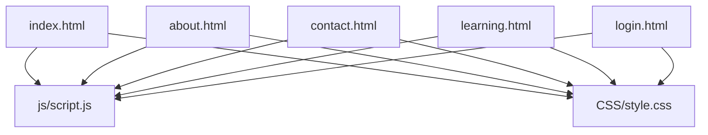
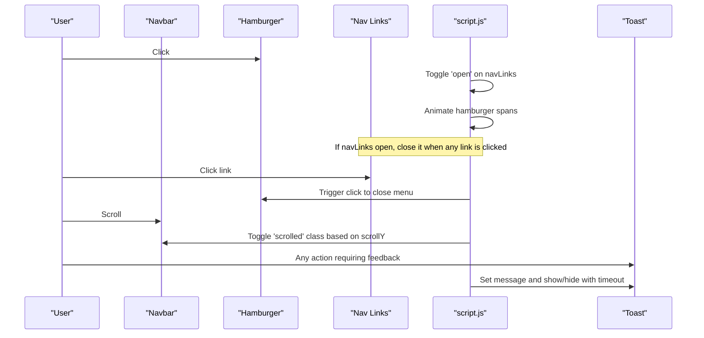
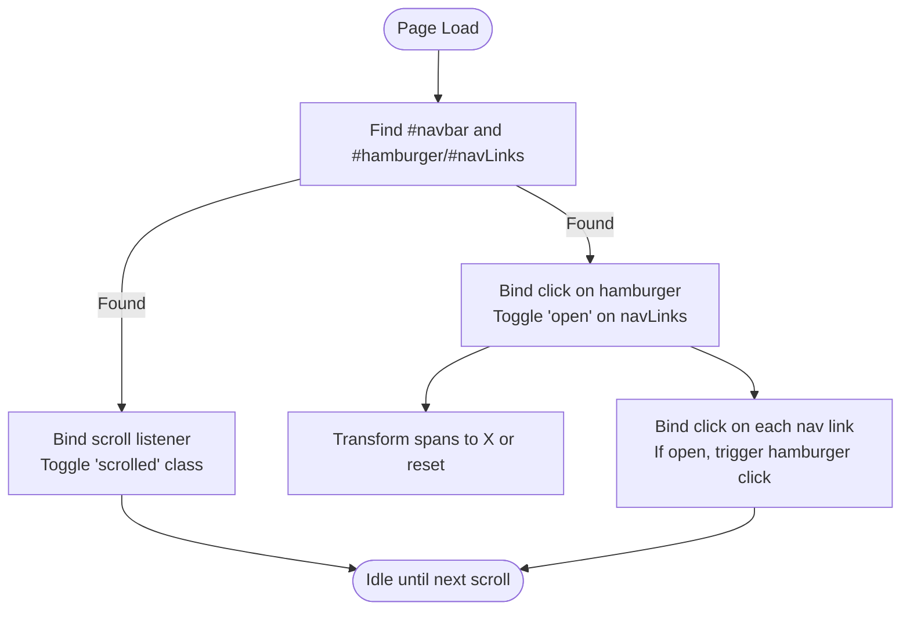
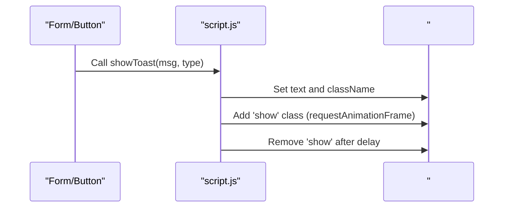
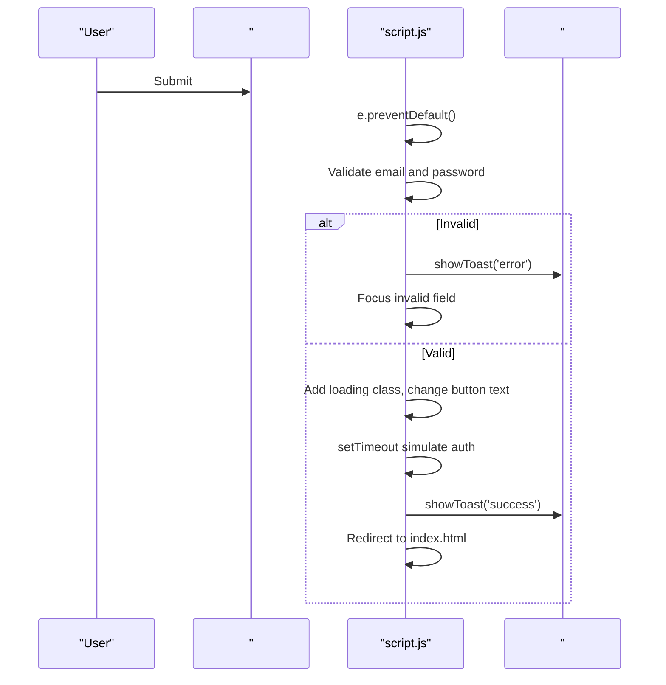
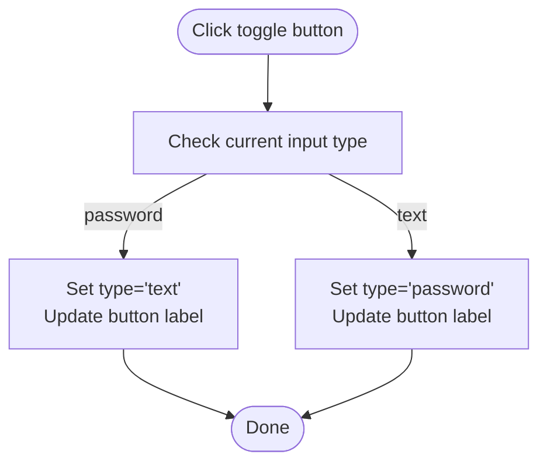
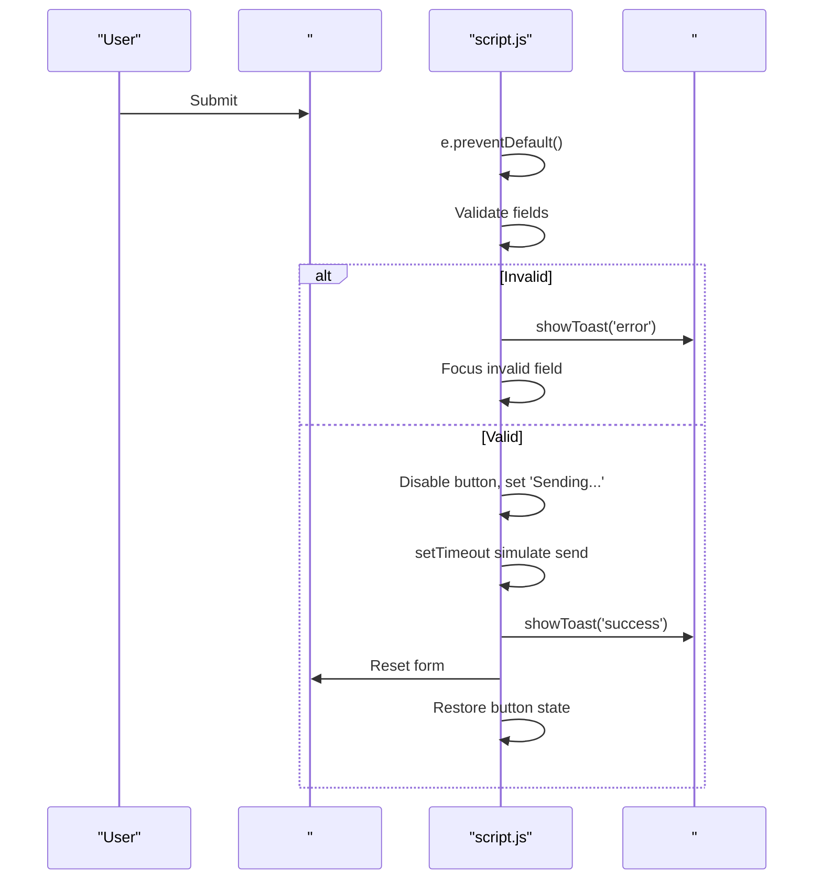
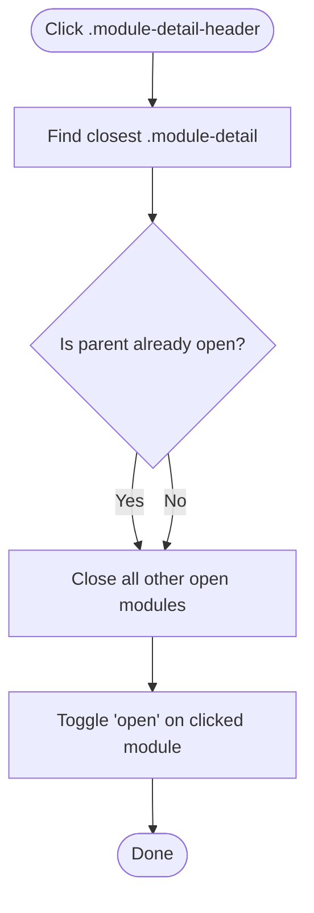
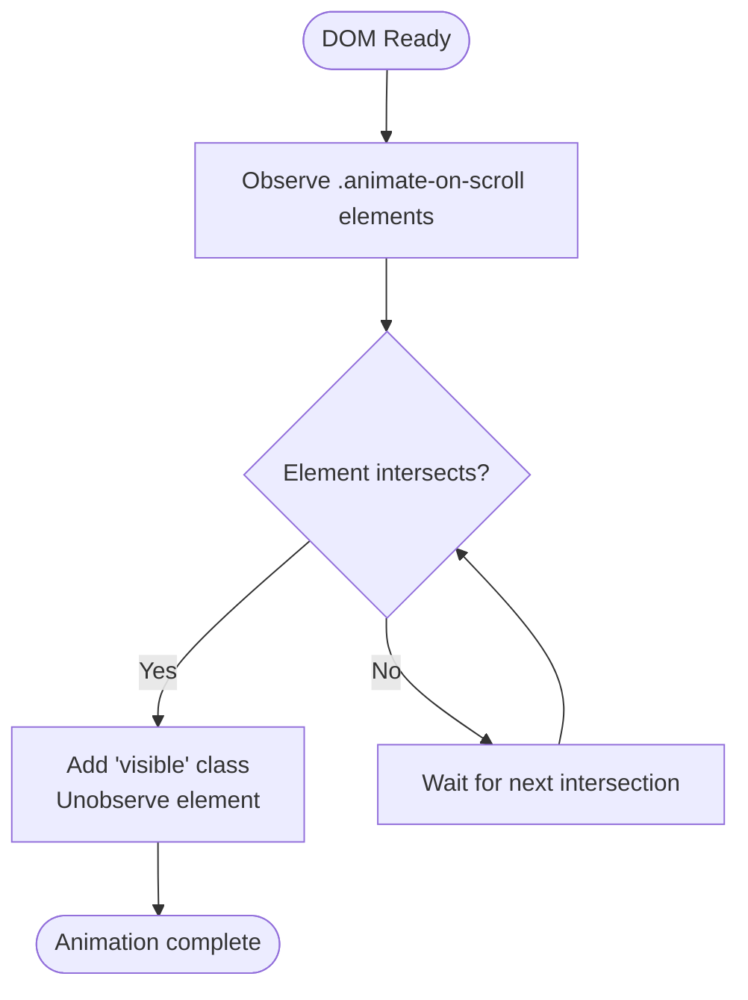
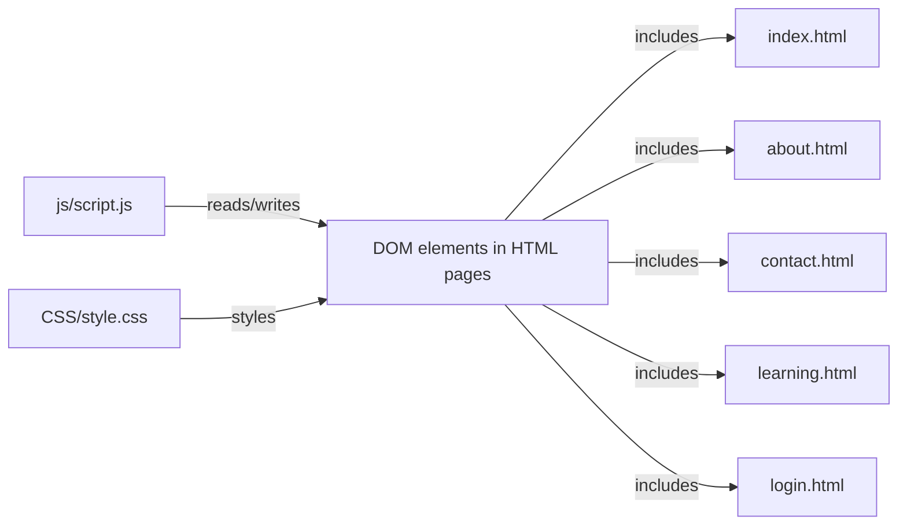

# Event Handling & User Interactions

<cite>
**Referenced Files in This Document**
- [script.js](file://js/script.js)
- [style.css](file://CSS/style.css)
- [index.html](file://index.html)
- [about.html](file://about.html)
- [contact.html](file://contact.html)
- [learning.html](file://learning.html)
- [login.html](file://login.html)
</cite>

## Table of Contents
1. [Introduction](#introduction)
2. [Project Structure](#project-structure)
3. [Core Components](#core-components)
4. [Architecture Overview](#architecture-overview)
5. [Detailed Component Analysis](#detailed-component-analysis)
6. [Dependency Analysis](#dependency-analysis)
7. [Performance Considerations](#performance-considerations)
8. [Troubleshooting Guide](#troubleshooting-guide)
9. [Conclusion](#conclusion)
10. [Appendices](#appendices)

## Introduction
This document explains how the Digital Bridges website manages DOM events and user interactions, focusing on:
- Navigation behavior (mobile menu toggle, active state management)
- Form handling with validation and feedback
- Accordion interaction for learning modules
- Scroll-driven animations and counters
- Toast notifications for user feedback
- Patterns to extend the system with new interactive features while maintaining accessibility

The implementation is centralized in a single JavaScript file that attaches event listeners to elements present across multiple HTML pages. Styling and transitions are defined in a shared stylesheet.

## Project Structure
The project uses a simple multi-page layout:
- Shared JavaScript logic in one script file
- Shared CSS styles in one stylesheet
- Multiple HTML pages that include the same script and styles

**Diagram sources**
- [index.html:103-103](file://index.html#L103-L103)
- [about.html:120-120](file://about.html#L120-L120)
- [contact.html:99-99](file://contact.html#L99-L99)
- [learning.html:134-134](file://learning.html#L134-L134)
- [login.html:57-57](file://login.html#L57-L57)

**Section sources**
- [index.html:10-25](file://index.html#L10-L25)
- [about.html:10-18](file://about.html#L10-L18)
- [contact.html:10-18](file://contact.html#L10-L18)
- [learning.html:10-18](file://learning.html#L10-L18)
- [login.html:10-57](file://login.html#L10-L57)

## Core Components
- Navbar scroll effect: Adds/removes a class based on scroll position to apply visual changes.
- Mobile menu toggle: Opens/closes navigation links and animates the hamburger icon; closes when a link is clicked.
- Toast notifications: Displays contextual messages with success or error styling.
- Login form handling: Validates inputs, shows loading state, and redirects after simulated submission.
- Password visibility toggle: Switches input type and updates button label/icon.
- Social login buttons: Show informational toast messages.
- Contact form handling: Validates fields, simulates sending, resets form, and provides feedback.
- Module accordion: Expands/collapses module details with mutual exclusivity.
- Scroll animations: Uses IntersectionObserver to reveal elements as they enter the viewport.
- Stats counter animation: Animates numbers when the stats section becomes visible.

**Section sources**
- [script.js:1-105](file://js/script.js#L1-L105)
- [style.css:14-21](file://CSS/style.css#L14-L21)
- [style.css:182-186](file://CSS/style.css#L182-L186)

## Architecture Overview
The application follows a lightweight, event-driven architecture:
- Each page includes the shared script and stylesheet.
- The script queries the DOM for specific IDs/classes and attaches listeners.
- UI state changes are driven by toggling classes and updating text content.
- Feedback is provided via a global toast element.

**Diagram sources**
- [script.js:1-19](file://js/script.js#L1-L19)
- [script.js:21-28](file://js/script.js#L21-L28)
- [style.css:20-21](file://CSS/style.css#L20-L21)
- [style.css:182-186](file://CSS/style.css#L182-L186)

## Detailed Component Analysis

### Navigation System
- Scroll-aware navbar: A scroll listener toggles a class to add shadow/visual emphasis when scrolled beyond a threshold.
- Mobile menu toggle: Clicking the hamburger toggles an open class on the navigation container and transforms the three span elements to form an “X”.
- Link-click-to-close: All navigation links inside the mobile menu trigger a click on the hamburger to close the menu when opened.
- Active state: Pages mark the current page’s link with an active class in HTML; CSS highlights it and draws an underline indicator.

**Diagram sources**
- [script.js:1-19](file://js/script.js#L1-L19)
- [style.css:20-36](file://CSS/style.css#L20-L36)

**Section sources**
- [script.js:1-19](file://js/script.js#L1-L19)
- [style.css:20-36](file://CSS/style.css#L20-L36)
- [index.html:10-25](file://index.html#L10-L25)
- [about.html:10-18](file://about.html#L10-L18)
- [contact.html:10-18](file://contact.html#L10-L18)
- [learning.html:10-18](file://learning.html#L10-L18)

### Toast Notifications
- Centralized function sets message text and applies type-based class, then adds a show class to animate entry.
- Automatically hides after a fixed duration using a timeout.
- Used across login and contact flows to provide immediate feedback.

**Diagram sources**
- [script.js:21-28](file://js/script.js#L21-L28)
- [style.css:182-186](file://CSS/style.css#L182-L186)

**Section sources**
- [script.js:21-28](file://js/script.js#L21-L28)
- [style.css:182-186](file://CSS/style.css#L182-L186)

### Login Flow
- Prevents default form submission.
- Validates email presence and format, and password length.
- Shows validation errors via toast and focuses the offending field.
- Simulates asynchronous sign-in with a loading state and redirects after success.
- Provides social login buttons that display informational toasts.

**Diagram sources**
- [script.js:30-50](file://js/script.js#L30-L50)
- [login.html:19-57](file://login.html#L19-L57)

**Section sources**
- [script.js:30-50](file://js/script.js#L30-L50)
- [login.html:19-57](file://login.html#L19-L57)

### Password Visibility Toggle
- Toggles input type between password and text on button click.
- Updates button label/icon to reflect current state.

**Diagram sources**
- [script.js:43-45](file://js/script.js#L43-L45)
- [login.html:27-33](file://login.html#L27-L33)

**Section sources**
- [script.js:43-45](file://js/script.js#L43-L45)
- [login.html:27-33](file://login.html#L27-L33)

### Contact Form Handling
- Prevents default submission.
- Validates name, email format, subject selection, and message length.
- On valid submission, disables submit button, shows loading text, simulates send, resets form, and restores button state.

**Diagram sources**
- [script.js:52-66](file://js/script.js#L52-L66)
- [contact.html:37-46](file://contact.html#L37-L46)

**Section sources**
- [script.js:52-66](file://js/script.js#L52-L66)
- [contact.html:37-46](file://contact.html#L37-L46)

### Module Accordion
- Listens for clicks on module headers.
- Collapses other open modules before toggling the clicked one.
- Uses a parent container class to manage open state.

**Diagram sources**
- [script.js:68-75](file://js/script.js#L68-L75)
- [learning.html:34-96](file://learning.html#L34-L96)

**Section sources**
- [script.js:68-75](file://js/script.js#L68-L75)
- [learning.html:34-96](file://learning.html#L34-L96)

### Scroll Animations and Stats Counter
- Scroll animations: Elements with a specific class are initially hidden and animated into view using IntersectionObserver when they enter the viewport.
- Stats counter: When the stats bar enters the viewport, numeric values animate from zero to their target values.

**Diagram sources**
- [script.js:77-86](file://js/script.js#L77-L86)
- [script.js:88-104](file://js/script.js#L88-L104)
- [index.html:49-56](file://index.html#L49-L56)

**Section sources**
- [script.js:77-104](file://js/script.js#L77-L104)
- [index.html:49-56](file://index.html#L49-L56)

## Dependency Analysis
- Single source of interactivity: All pages depend on js/script.js for behavior.
- Shared styling: All pages depend on CSS/style.css for appearance and transitions.
- Page-specific markup: Each HTML page defines the structure required by the script (IDs/classes).

**Diagram sources**
- [index.html:103-103](file://index.html#L103-L103)
- [about.html:120-120](file://about.html#L120-L120)
- [contact.html:99-99](file://contact.html#L99-L99)
- [learning.html:134-134](file://learning.html#L134-L134)
- [login.html:57-57](file://login.html#L57-L57)

**Section sources**
- [script.js:1-105](file://js/script.js#L1-L105)
- [style.css:1-247](file://CSS/style.css#L1-L247)

## Performance Considerations
- Minimal DOM queries: Event listeners are attached once per feature during page load.
- Efficient scrolling: Scroll handlers toggle classes rather than performing heavy computations.
- IntersectionObserver usage: Animations run only when elements become visible and unobserve after revealing to avoid unnecessary checks.
- Lightweight animations: CSS transitions handle most motion; JS only toggles classes or short-lived timers.

[No sources needed since this section provides general guidance]

## Troubleshooting Guide
- Mobile menu not closing on link click: Ensure nav links are inside the element referenced by the script and that the open class is being toggled correctly.
- Toast not appearing: Verify the toast element exists on the page and has the correct ID; check that the show class is added and removed properly.
- Accordion not working: Confirm module headers have the expected class and are wrapped in containers with the appropriate class used by the script.
- Animations not triggering: Ensure elements have the required class and are within the viewport; check that IntersectionObserver is initialized and observing elements.
- Form validation issues: Check that input IDs match those referenced by the script and that required attributes are set.

**Section sources**
- [script.js:1-105](file://js/script.js#L1-L105)
- [style.css:182-186](file://CSS/style.css#L182-L186)

## Conclusion
The Digital Bridges site implements a cohesive, accessible event handling system centered around a single script. It manages navigation, forms, accordions, and scroll-driven interactions consistently across pages. By following the established patterns—using stable IDs/classes, toggling classes for state, providing clear feedback via toasts, and leveraging IntersectionObserver—you can safely extend the system with new interactive features while keeping performance and accessibility in mind.

[No sources needed since this section summarizes without analyzing specific files]

## Appendices

### Adding a New Interactive Feature: Best Practices
- Use stable selectors: Attach listeners to elements with unique IDs or well-scoped classes.
- Guard against missing elements: Wrap initialization in existence checks to avoid runtime errors on pages where the element is absent.
- Prefer class toggling for state: Let CSS handle transitions and visual states; keep JS minimal.
- Provide accessible feedback: Use toasts or inline messages; ensure focus management and keyboard support where applicable.
- Debounce or throttle expensive operations: For scroll or resize handlers, consider limiting frequency if needed.
- Keep scripts modular: Group related behaviors and clearly separate concerns (navigation, forms, animations).

[No sources needed since this section provides general guidance]