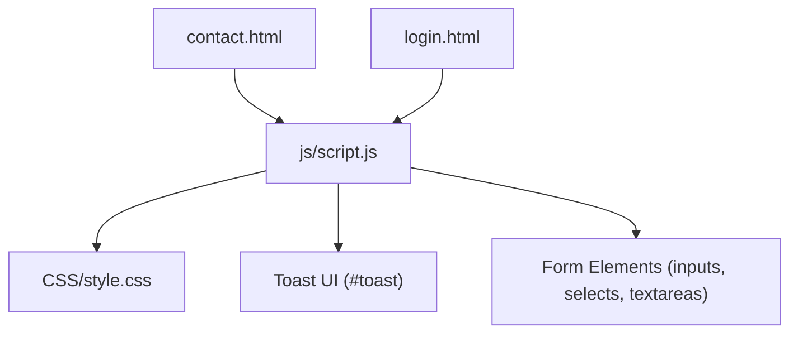
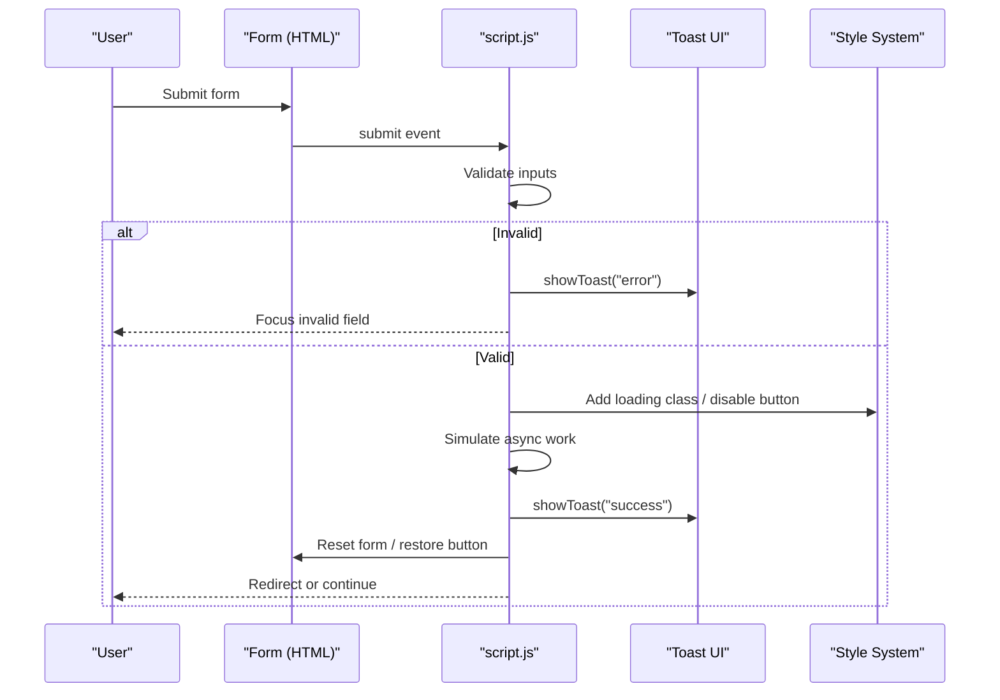
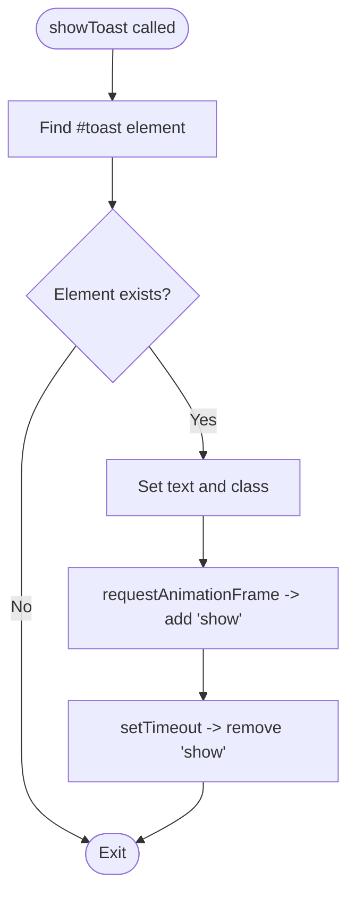
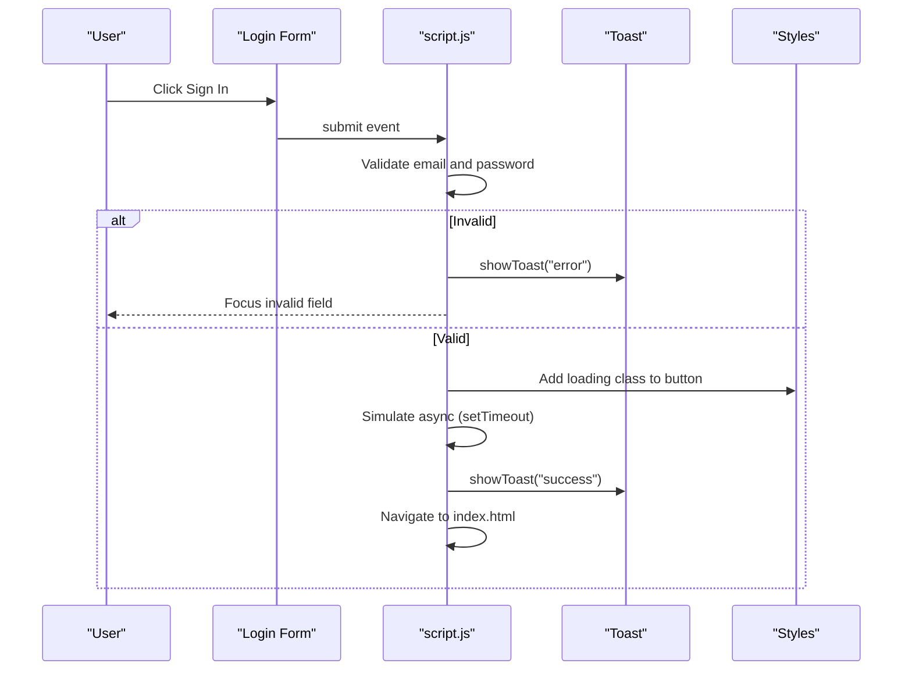
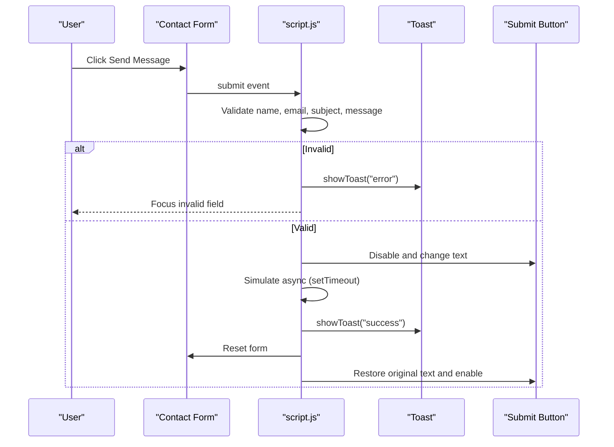
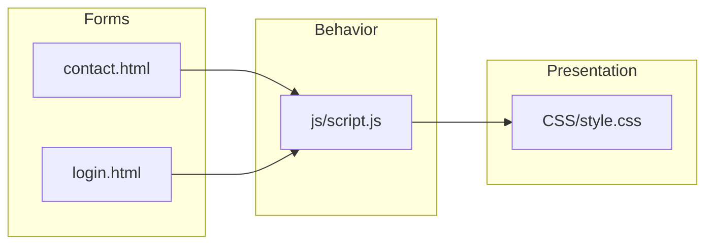

# Form Processing & Validation

<cite>
**Referenced Files in This Document**
- [script.js](file://js/script.js)
- [contact.html](file://contact.html)
- [login.html](file://login.html)
- [style.css](file://CSS/style.css)
</cite>

## Table of Contents
1. [Introduction](#introduction)
2. [Project Structure](#project-structure)
3. [Core Components](#core-components)
4. [Architecture Overview](#architecture-overview)
5. [Detailed Component Analysis](#detailed-component-analysis)
6. [Dependency Analysis](#dependency-analysis)
7. [Performance Considerations](#performance-considerations)
8. [Troubleshooting Guide](#troubleshooting-guide)
9. [Conclusion](#conclusion)
10. [Appendices](#appendices)

## Introduction
This document explains the form processing and validation system implemented in the Digital Bridges project. It covers real-time user feedback via toast notifications, loading states during submissions, and input handling practices. It also provides guidance on how to add new form fields, implement custom validation rules, and extend form processing while maintaining security and usability standards.

## Project Structure
The form-related logic is implemented across a small set of files:
- HTML forms are defined in contact.html and login.html.
- Client-side behavior (validation, submission flow, UI updates) is centralized in js/script.js.
- Visual styling for forms, buttons, and toast notifications is provided by CSS/style.css.

**Diagram sources**
- [contact.html:39-45](file://contact.html#L39-L45)
- [login.html:19-40](file://login.html#L19-L40)
- [script.js:21-66](file://js/script.js#L21-L66)
- [style.css:182-186](file://CSS/style.css#L182-L186)

**Section sources**
- [contact.html:39-45](file://contact.html#L39-L45)
- [login.html:19-40](file://login.html#L19-L40)
- [script.js:21-66](file://js/script.js#L21-L66)
- [style.css:182-186](file://CSS/style.css#L182-L186)

## Core Components
- Toast notification system: A shared utility displays success or error messages with automatic dismissal.
- Login form handler: Validates email and password, shows loading state, simulates submission, then redirects on success.
- Contact form handler: Validates name, email, subject selection, and message length; disables submit button during submission and resets the form afterward.
- Password visibility toggle: Improves usability by allowing users to show/hide their password.

Key behaviors:
- Prevent default form submission to handle it client-side.
- Validate inputs before any network call.
- Provide immediate, clear feedback using toasts and button states.
- Reset UI after simulated submission.

**Section sources**
- [script.js:21-66](file://js/script.js#L21-L66)
- [style.css:182-186](file://CSS/style.css#L182-L186)

## Architecture Overview
The form processing follows a simple, event-driven pattern:
- Each form attaches a submit listener that prevents default submission.
- Inputs are validated synchronously.
- On valid input, the submit button enters a loading state.
- A simulated asynchronous operation runs (for demonstration).
- A toast notifies the user of success or failure.
- The UI returns to its initial state.

**Diagram sources**
- [script.js:31-41](file://js/script.js#L31-L41)
- [script.js:52-66](file://js/script.js#L52-L66)
- [style.css:168-168](file://CSS/style.css#L168-L168)
- [style.css:182-186](file://CSS/style.css#L182-L186)

## Detailed Component Analysis

### Toast Notification System
- Purpose: Provide non-intrusive, time-limited feedback for success and error states.
- Implementation highlights:
  - Finds the #toast element and sets its text and type class.
  - Uses requestAnimationFrame to ensure the DOM update triggers the slide-in transition.
  - Auto-dismisses after a fixed duration.
- Styling:
  - Positioned fixed at top-right with z-index above other content.
  - Success and error variants use distinct background colors.
  - Transition animates entry and exit.

**Diagram sources**
- [script.js:21-28](file://js/script.js#L21-L28)
- [style.css:182-186](file://CSS/style.css#L182-L186)

**Section sources**
- [script.js:21-28](file://js/script.js#L21-L28)
- [style.css:182-186](file://CSS/style.css#L182-L186)

### Login Form Handler
- Fields: Email and Password.
- Validation rules:
  - Email must be present and contain an “@” character.
  - Password must be present and have a minimum length.
- User experience:
  - On invalid input, a toast error is shown and focus moves to the offending field.
  - On valid input, the button enters a loading state and text changes to indicate progress.
  - After a simulated delay, a success toast is shown and the page navigates to the home page.
- Security note:
  - Currently uses client-side checks only; no server-side validation or sanitization is performed in this code.

**Diagram sources**
- [script.js:31-41](file://js/script.js#L31-L41)
- [style.css:168-168](file://CSS/style.css#L168-L168)

**Section sources**
- [script.js:31-41](file://js/script.js#L31-L41)
- [style.css:168-168](file://CSS/style.css#L168-L168)

### Contact Form Handler
- Fields: Name, Email, Subject (select), Message (textarea).
- Validation rules:
  - Name must not be empty after trimming whitespace.
  - Email must be present and contain an “@” character.
  - Subject must be selected.
  - Message must be present and meet a minimum length after trimming.
- User experience:
  - On invalid input, a toast error is shown and focus moves to the offending field.
  - On valid input, the submit button is disabled and text changes to indicate sending.
  - After a simulated delay, a success toast is shown, the form is reset, and the button is restored.

**Diagram sources**
- [script.js:52-66](file://js/script.js#L52-L66)

**Section sources**
- [script.js:52-66](file://js/script.js#L52-L66)

### Password Visibility Toggle
- Purpose: Improve usability by allowing users to reveal or hide their password.
- Behavior:
  - Toggles the input type between password and text.
  - Updates the toggle button’s icon accordingly.

**Section sources**
- [script.js:43-46](file://js/script.js#L43-L46)
- [login.html:27-33](file://login.html#L27-L33)

## Dependency Analysis
- script.js depends on:
  - DOM elements from contact.html and login.html (form IDs, input IDs, toast container).
  - CSS classes for visual states (e.g., loading, toast types).
- contact.html and login.html depend on:
  - script.js for interactive behavior.
  - style.css for layout and component styles.

**Diagram sources**
- [contact.html:39-45](file://contact.html#L39-L45)
- [login.html:19-40](file://login.html#L19-L40)
- [script.js:21-66](file://js/script.js#L21-L66)
- [style.css:182-186](file://CSS/style.css#L182-L186)

**Section sources**
- [contact.html:39-45](file://contact.html#L39-L45)
- [login.html:19-40](file://login.html#L19-L40)
- [script.js:21-66](file://js/script.js#L21-L66)
- [style.css:182-186](file://CSS/style.css#L182-L186)

## Performance Considerations
- Event listeners are attached once per form; avoid re-binding on each interaction.
- Use minimal DOM queries inside handlers; cache references where appropriate.
- Keep validation synchronous and lightweight to maintain responsiveness.
- Avoid heavy operations in submit handlers; offload to background tasks if needed.
- Ensure toast animations are GPU-accelerated (transform-based) to prevent layout thrashing.

[No sources needed since this section provides general guidance]

## Troubleshooting Guide
Common issues and resolutions:
- Toast does not appear:
  - Verify that the page includes a 
 element.
  - Confirm that the script is loaded after the DOM is ready.
- Validation always fails:
  - Check that input IDs match those referenced in script.js.
  - Ensure required attributes and expected formats align with validation rules.
- Loading state not resetting:
  - Confirm that the submit handler restores button state after the simulated async step.
  - Inspect console for unhandled errors that might interrupt the flow.
- Password toggle not working:
  - Ensure the toggle button ID matches the one referenced in script.js.
  - Verify that the password input ID matches expectations.

**Section sources**
- [script.js:21-28](file://js/script.js#L21-L28)
- [script.js:31-41](file://js/script.js#L31-L41)
- [script.js:43-46](file://js/script.js#L43-L46)
- [script.js:52-66](file://js/script.js#L52-L66)

## Conclusion
The Digital Bridges project implements a straightforward, user-friendly form processing system centered around client-side validation, immediate feedback via toast notifications, and clear loading states during submissions. While effective for demonstration and basic use cases, production deployments should augment these patterns with robust server-side validation, secure data handling, and comprehensive sanitization to ensure security and reliability.

[No sources needed since this section summarizes without analyzing specific files]

## Appendices

### How to Add a New Form Field
Steps to safely extend a form:
- Add the field markup in the relevant HTML file with a unique ID and label.
- Update the corresponding submit handler in script.js to:
  - Read the new field value.
  - Apply necessary validation rules.
  - Show a focused error via toast if invalid.
  - Include the field in any payload you send to the server.
- If the field affects layout or appearance, add or adjust styles in style.css.

Example references:
- Contact form structure and fields: [contact.html:39-45](file://contact.html#L39-L45)
- Contact form validation and submission: [script.js:52-66](file://js/script.js#L52-L66)
- Form styling: [style.css:143-151](file://CSS/style.css#L143-L151)

**Section sources**
- [contact.html:39-45](file://contact.html#L39-L45)
- [script.js:52-66](file://js/script.js#L52-L66)
- [style.css:143-151](file://CSS/style.css#L143-L151)

### Implementing Custom Validation Rules
Guidelines:
- Define clear, user-facing rules (e.g., minimum length, format constraints).
- Validate immediately on submit and provide precise error messages via toast.
- Focus the first invalid field to guide the user.
- For complex rules, consider adding inline hints or helper text beneath the field.

References:
- Email presence and format check: [script.js:35-37](file://js/script.js#L35-L37)
- Minimum length checks: [script.js:37-37](file://js/script.js#L37-L37), [script.js:61-61](file://js/script.js#L61-L61)
- Select validation: [script.js:60-60](file://js/script.js#L60-L60)

**Section sources**
- [script.js:35-37](file://js/script.js#L35-L37)
- [script.js:60-61](file://js/script.js#L60-L61)

### Extending Form Processing Functionality
Recommendations:
- Centralize validation logic into reusable functions to reduce duplication.
- Normalize input values (trim whitespace) before validation.
- Integrate with a backend API by replacing the simulated delay with fetch calls.
- Handle network errors gracefully with user-friendly toasts and retry options.
- Maintain accessibility by associating labels with inputs and providing aria attributes for dynamic feedback.

References:
- Prevent default submission and simulate async: [script.js:33-40](file://js/script.js#L33-L40), [script.js:55-65](file://js/script.js#L55-L65)
- Toast usage for feedback: [script.js:21-28](file://js/script.js#L21-L28)

**Section sources**
- [script.js:33-40](file://js/script.js#L33-L40)
- [script.js:55-65](file://js/script.js#L55-L65)
- [script.js:21-28](file://js/script.js#L21-L28)

### Data Sanitization Practices
Current state:
- Input trimming is applied to text fields before validation.
- No explicit sanitization against XSS or injection is implemented in the client code.

Best practices for production:
- Always sanitize and validate on the server side.
- Escape output when rendering user-generated content.
- Use allowlists for acceptable characters where possible.
- Enforce input length limits and format constraints both client and server side.

[No sources needed since this section provides general guidance]