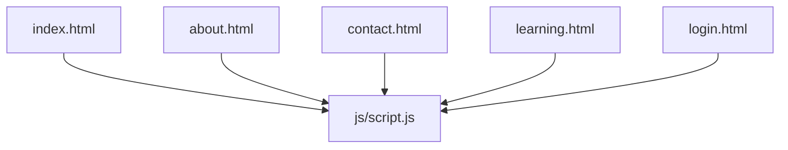
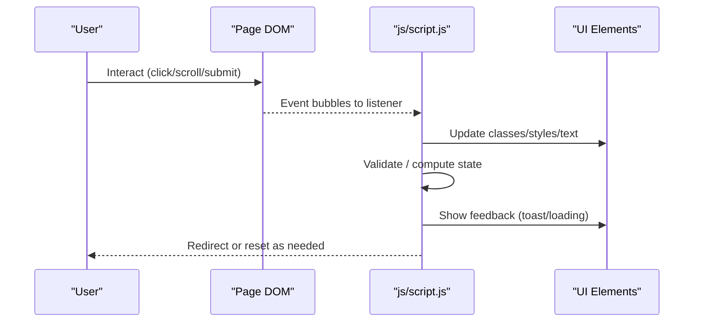
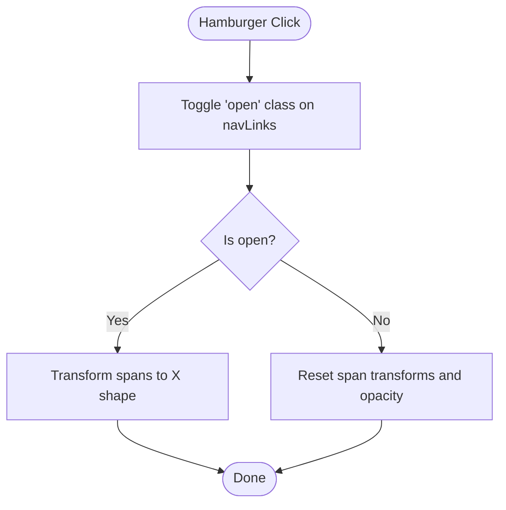
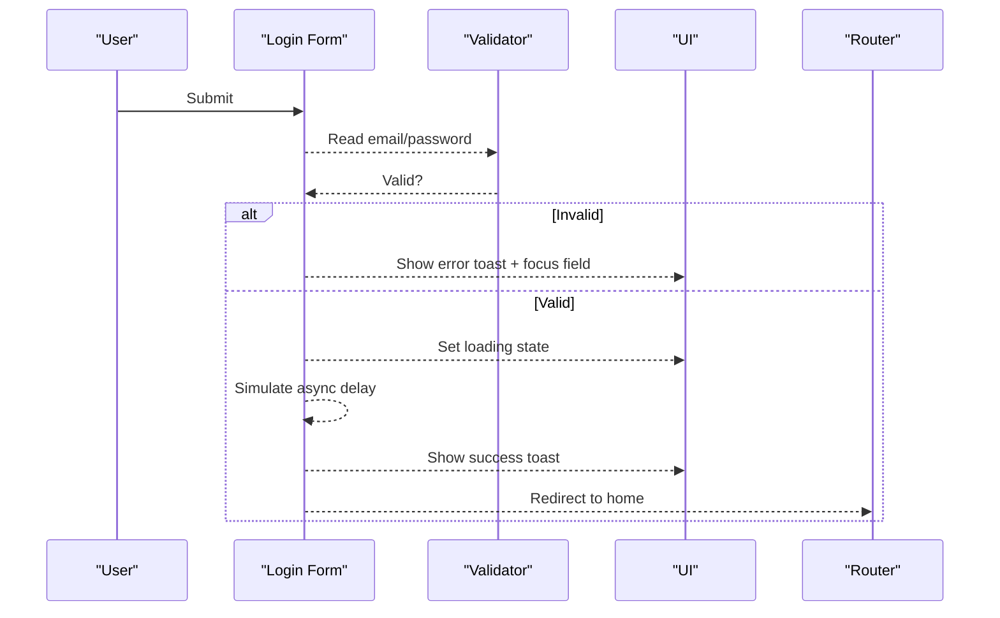
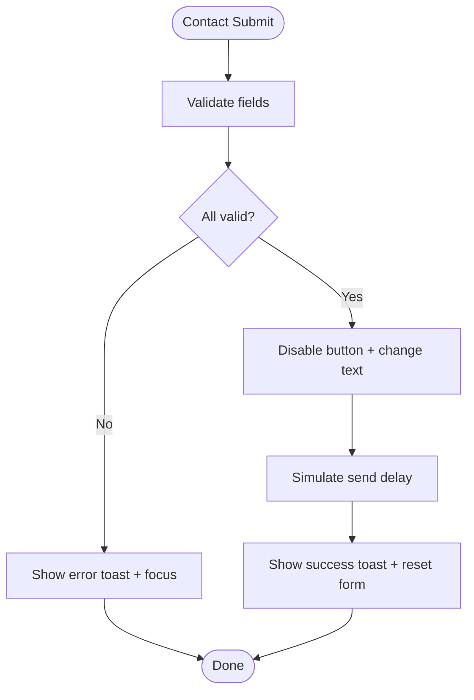
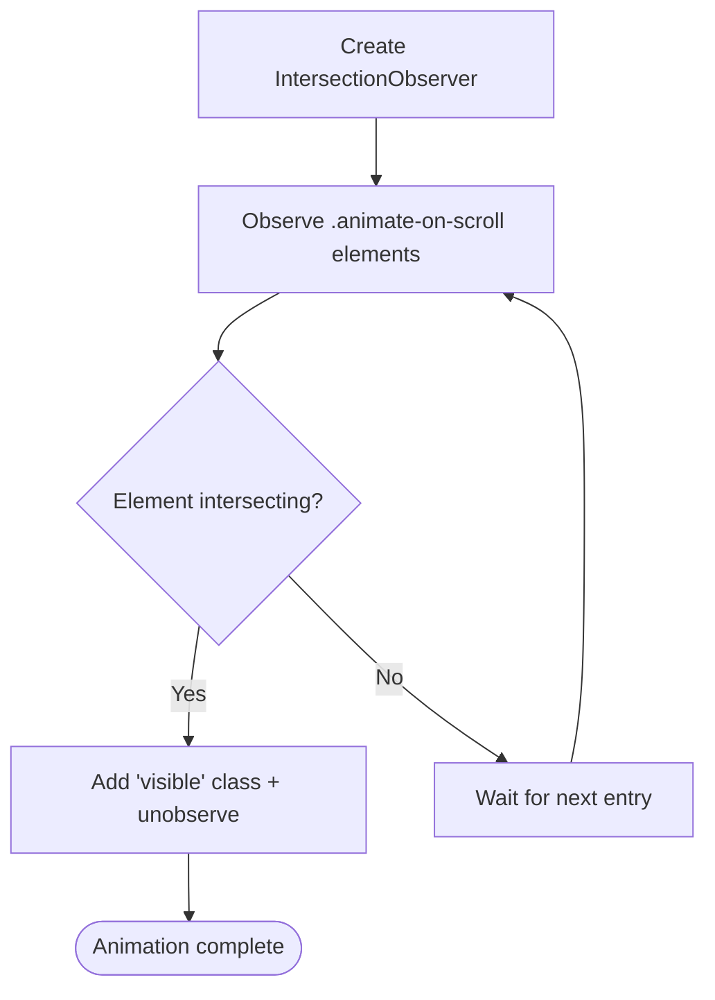
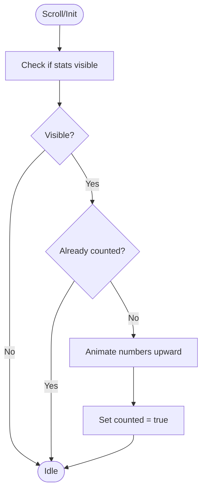
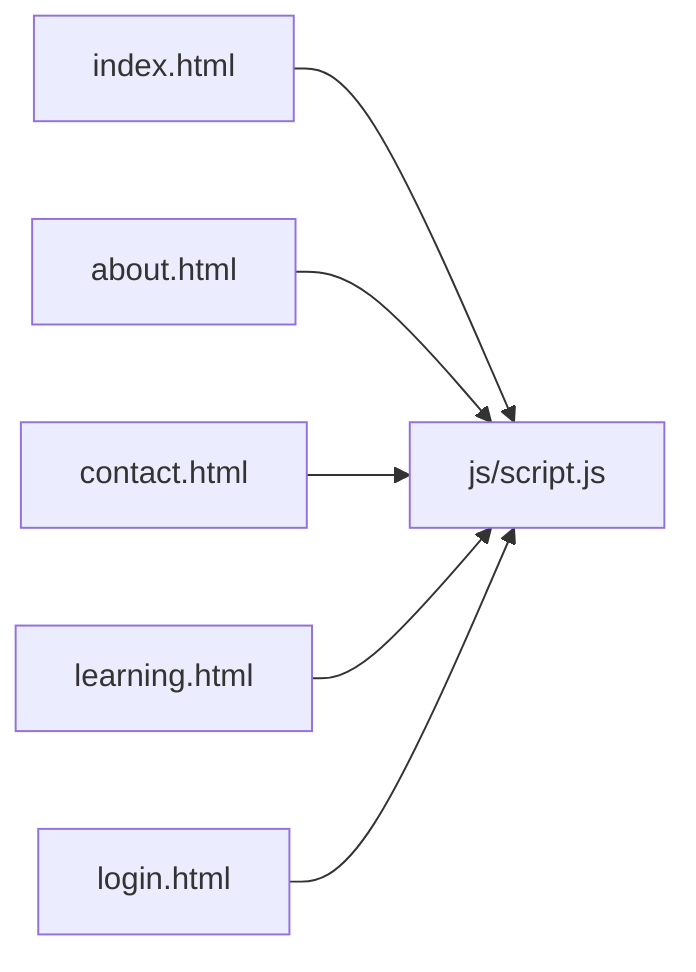

# JavaScript Architecture

<cite>
**Referenced Files in This Document**
- [script.js](file://js/script.js)
- [index.html](file://index.html)
- [about.html](file://about.html)
- [contact.html](file://contact.html)
- [learning.html](file://learning.html)
- [login.html](file://login.html)
</cite>

## Table of Contents
1. [Introduction](#introduction)
2. [Project Structure](#project-structure)
3. [Core Components](#core-components)
4. [Architecture Overview](#architecture-overview)
5. [Detailed Component Analysis](#detailed-component-analysis)
6. [Dependency Analysis](#dependency-analysis)
7. [Performance Considerations](#performance-considerations)
8. [Troubleshooting Guide](#troubleshooting-guide)
9. [Conclusion](#conclusion)
10. [Appendices](#appendices)

## Introduction
This document explains the JavaScript architecture for the Digital Bridges project. The codebase uses a single, shared script to power cross-page features such as navigation, form handling, animations, and user interactions. It emphasizes event-driven programming patterns and functional-style utilities (e.g., small, reusable functions like toast notifications). The design prioritizes separation of concerns by feature area: navbar behavior, mobile menu toggling, form validation and submission feedback, accordion modules, scroll-triggered animations, and animated statistics counters.

## Project Structure
The project is organized with one primary JavaScript file that is included on all pages via script tags. Each HTML page defines the DOM elements required by the script, while the script binds behaviors based on element presence.

**Diagram sources**
- [index.html:103-104](file://index.html#L103-L104)
- [about.html:120-121](file://about.html#L120-L121)
- [contact.html:99-100](file://contact.html#L99-L100)
- [learning.html:134-135](file://learning.html#L134-L135)
- [login.html:57-58](file://login.html#L57-L58)

**Section sources**
- [index.html:103-104](file://index.html#L103-L104)
- [about.html:120-121](file://about.html#L120-L121)
- [contact.html:99-100](file://contact.html#L99-L100)
- [learning.html:134-135](file://learning.html#L134-L135)
- [login.html:57-58](file://login.html#L57-L58)

## Core Components
The script implements several cohesive components, each responsible for a distinct feature area:

- Navbar scroll effect: Toggles a class when the user scrolls beyond a threshold.
- Mobile menu toggle: Opens/closes the navigation and animates the hamburger icon; auto-closes when links are clicked.
- Toast notification utility: Displays contextual messages with success or error styling and auto-dismissal.
- Login flow: Validates email and password, shows loading state, simulates async submission, and redirects on success.
- Password visibility toggle: Switches input type and updates the toggle control.
- Social login buttons: Placeholder handlers that show informational toasts.
- Contact form: Validates fields, prevents default submission, simulates sending, resets the form, and provides feedback.
- Module accordion: Expands/collapses module details with mutual exclusivity.
- Scroll animations: Uses IntersectionObserver to reveal elements with staggered transitions.
- Stats counter: Animates numeric values when the stats section enters the viewport.

These components are implemented as event listeners and small functions, keeping responsibilities isolated and testable.

**Section sources**
- [script.js:1-105](file://js/script.js#L1-L105)

## Architecture Overview
The application follows an event-driven architecture where the script attaches listeners to DOM elements present on each page. Features activate only when their target elements exist, enabling safe reuse across pages without duplication. Functional helpers encapsulate side effects (e.g., showing toasts), while imperative event handlers orchestrate flows (e.g., form submission).

[No sources needed since this diagram shows conceptual workflow, not actual code structure]

## Detailed Component Analysis

### Navbar Scroll Effect
- Behavior: Adds/removes a class on the navbar when scrolling past a threshold.
- Pattern: Global scroll listener with minimal DOM access.
- Performance: Lightweight class toggle; no layout thrashing.

**Section sources**
- [script.js:1-4](file://js/script.js#L1-L4)

### Mobile Menu Toggle
- Behavior: Toggles open state on the nav links container and transforms hamburger spans into an “X”.
- Pattern: Click listener on the hamburger; also closes menu when any link is clicked.
- Accessibility: Uses semantic anchors and toggles visual state via classes and inline styles.

**Diagram sources**
- [script.js:5-19](file://js/script.js#L5-L19)

**Section sources**
- [script.js:5-19](file://js/script.js#L5-L19)

### Toast Notification Utility
- Behavior: Shows a message with a type-based class and auto-hides after a timeout.
- Pattern: Small function that manipulates a dedicated toast element.
- Extensibility: Can be reused across forms and actions for consistent feedback.

**Section sources**
- [script.js:21-28](file://js/script.js#L21-L28)

### Login Flow
- Validation: Checks for valid email format and minimum password length.
- UX: Sets loading state on submit button, simulates network delay, then shows success toast and redirects.
- Error Handling: Focuses invalid inputs and displays descriptive toasts.

**Diagram sources**
- [script.js:30-41](file://js/script.js#L30-L41)

**Section sources**
- [script.js:30-41](file://js/script.js#L30-L41)
- [login.html:19-40](file://login.html#L19-L40)

### Password Visibility Toggle
- Behavior: Switches between password and text input types and updates the toggle icon.
- Pattern: Click handler bound to a dedicated toggle button.

**Section sources**
- [script.js:43-46](file://js/script.js#L43-L46)
- [login.html:27-33](file://login.html#L27-L33)

### Social Login Buttons
- Behavior: Placeholder handlers that display informational toasts.
- Purpose: Demonstrates extensibility points for future integrations.

**Section sources**
- [script.js:47-50](file://js/script.js#L47-L50)
- [login.html:42-50](file://login.html#L42-L50)

### Contact Form
- Validation: Ensures name, email, subject, and message meet requirements.
- UX: Disables submit button during simulated send, shows success toast, resets form.
- Error Handling: Focuses first invalid field and shows specific toasts.

**Diagram sources**
- [script.js:52-66](file://js/script.js#L52-L66)

**Section sources**
- [script.js:52-66](file://js/script.js#L52-L66)
- [contact.html:37-45](file://contact.html#L37-L45)

### Module Accordion
- Behavior: Toggles expanded state for module details; ensures only one module is open at a time.
- Pattern: Delegates click events to headers and manages sibling states.

**Section sources**
- [script.js:68-75](file://js/script.js#L68-L75)
- [learning.html:34-96](file://learning.html#L34-L96)

### Scroll Animations
- Behavior: Observes elements with a specific class and adds a visible class when they enter the viewport.
- Pattern: Uses IntersectionObserver for performance-friendly visibility detection; applies staggered CSS transitions.
- Implementation detail: Injects a style rule to ensure final state overrides.

**Diagram sources**
- [script.js:77-86](file://js/script.js#L77-L86)

**Section sources**
- [script.js:77-86](file://js/script.js#L77-L86)

### Stats Counter Animation
- Behavior: Counts up numbers inside stat items when the stats bar becomes visible.
- Pattern: Single-run animation guarded by a flag; uses setInterval to increment values smoothly.
- Trigger: Listens to scroll events and checks bounding rectangle against viewport.

**Diagram sources**
- [script.js:88-104](file://js/script.js#L88-L104)

**Section sources**
- [script.js:88-104](file://js/script.js#L88-L104)
- [index.html:49-56](file://index.html#L49-L56)

## Dependency Analysis
- Shared script dependency: All pages include js/script.js, which depends on specific IDs/classes present in each page’s markup.
- Feature activation: Each feature checks for the existence of its target elements before attaching listeners, preventing errors on pages where those elements are absent.
- Coupling: The script couples tightly to DOM IDs and classes defined in the HTML files; changes to markup require corresponding updates in the script.

**Diagram sources**
- [index.html:103-104](file://index.html#L103-L104)
- [about.html:120-121](file://about.html#L120-L121)
- [contact.html:99-100](file://contact.html#L99-L100)
- [learning.html:134-135](file://learning.html#L134-L135)
- [login.html:57-58](file://login.html#L57-L58)

**Section sources**
- [script.js:1-105](file://js/script.js#L1-L105)

## Performance Considerations
- Efficient DOM queries: Elements are queried once per feature block and reused within that scope.
- Event delegation: Where applicable, listeners are attached to containers or individual elements with minimal overhead.
- IntersectionObserver: Used for scroll-triggered animations instead of expensive scroll calculations.
- requestAnimationFrame: Used to ensure smooth toast appearance.
- Staggered transitions: Applied via inline transition delays to avoid heavy reflows.
- One-time animations: Stats counter runs once per session using a guard flag to prevent repeated intervals.

[No sources needed since this section provides general guidance]

## Troubleshooting Guide
- Missing elements: If a feature does not work, verify that the expected element IDs/classes exist on the current page.
- Form validation issues: Ensure required fields match the IDs referenced by the script and that the form has a submit handler.
- Toast not showing: Confirm the toast container exists and has the correct ID.
- Animations not triggering: Check that elements have the correct class and that the viewport intersection logic can detect them.
- Mobile menu not closing: Verify that navigation links are present and that the open class is being toggled correctly.

**Section sources**
- [script.js:1-105](file://js/script.js#L1-L105)

## Conclusion
The Digital Bridges JavaScript architecture centers around a single, modular script that leverages event-driven patterns and small functional utilities to implement cross-page features. By guarding feature activation on element presence and isolating responsibilities per feature, the code remains maintainable and easy to extend. For future growth, consider splitting the script into feature modules, centralizing configuration, and adding robust error handling and accessibility enhancements.

[No sources needed since this section summarizes without analyzing specific files]

## Appendices

### Browser Compatibility Notes
- Modern APIs used:
  - IntersectionObserver for scroll animations.
  - requestAnimationFrame for smooth UI updates.
  - addEventListener for event binding.
- Recommendations:
  - Provide fallbacks for older browsers if necessary.
  - Test on mobile devices due to touch interactions and viewport considerations.

[No sources needed since this section provides general guidance]

### Naming Conventions and Code Organization
- IDs and classes:
  - Descriptive IDs for interactive elements (e.g., navbar, hamburger, navLinks, loginForm, contactForm, toast).
  - Semantic classes for styling and behavior hooks (e.g., animate-on-scroll, module-detail-header).
- Script organization:
  - Feature blocks grouped by comments for clarity.
  - Small, focused functions for reusable side effects (e.g., showToast).
  - Conditional initialization based on element existence to support multi-page reuse.

**Section sources**
- [script.js:1-105](file://js/script.js#L1-L105)
- [index.html:10-24](file://index.html#L10-L24)
- [contact.html:37-45](file://contact.html#L37-L45)
- [learning.html:34-96](file://learning.html#L34-L96)
- [login.html:19-40](file://login.html#L19-L40)

### Best Practices for Extending Functionality
- Keep features self-contained: Add new feature blocks with clear boundaries and guards for element presence.
- Prefer functional helpers: Extract reusable logic (e.g., validation, formatting) into small functions.
- Avoid global state: Use local variables and closures to minimize side effects.
- Maintain accessibility: Ensure keyboard navigation and ARIA attributes where appropriate.
- Optimize interactions: Debounce frequent events (e.g., scroll) if needed; use observers for visibility checks.

[No sources needed since this section provides general guidance]