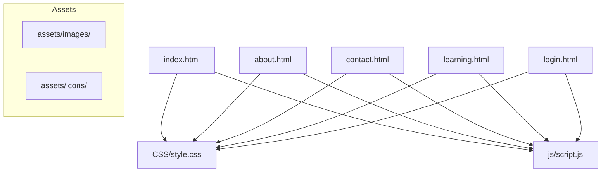
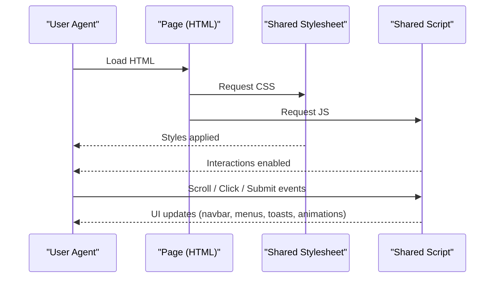
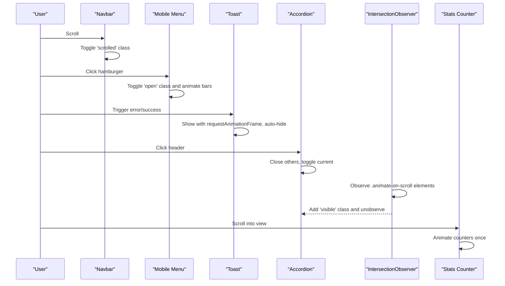
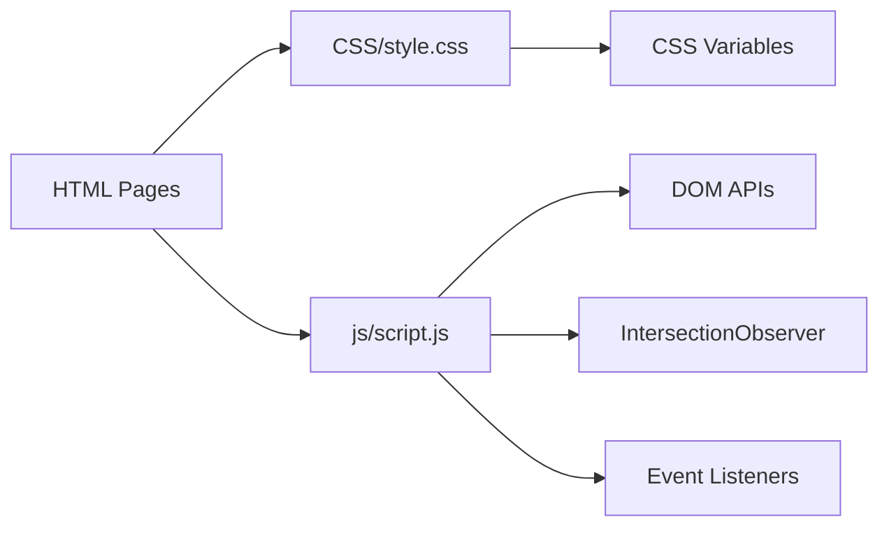

# Performance Optimization

<cite>
**Referenced Files in This Document**
- [index.html](file://index.html)
- [about.html](file://about.html)
- [contact.html](file://contact.html)
- [learning.html](file://learning.html)
- [login.html](file://login.html)
- [style.css](file://CSS/style.css)
- [script.js](file://js/script.js)
</cite>

## Table of Contents
1. [Introduction](#introduction)
2. [Project Structure](#project-structure)
3. [Core Components](#core-components)
4. [Architecture Overview](#architecture-overview)
5. [Detailed Component Analysis](#detailed-component-analysis)
6. [Dependency Analysis](#dependency-analysis)
7. [Performance Considerations](#performance-considerations)
8. [Troubleshooting Guide](#troubleshooting-guide)
9. [Conclusion](#conclusion)
10. [Appendices](#appendices)

## Introduction
This document explains the performance optimization strategies implemented in the Digital Bridges static site. It focuses on:
- Minimal dependency approach with zero external libraries
- Optimized CSS architecture using efficient selectors and custom properties
- JavaScript performance considerations including event delegation patterns, IntersectionObserver usage, and scroll-driven animations
- Loading optimization techniques, asset management strategies, and browser caching considerations
- Guidance for monitoring performance, identifying bottlenecks, and implementing additional optimizations while preserving the lightweight nature of the site

## Project Structure
The project is a small static site composed of HTML pages, a single shared stylesheet, and a single shared script. Assets are organized under an assets directory for future scalability.

**Diagram sources**
- [index.html:7-8](file://index.html#L7-L8)
- [index.html:103-104](file://index.html#L103-L104)
- [about.html:7-8](file://about.html#L7-L8)
- [about.html:120-121](file://about.html#L120-L121)
- [contact.html:7-8](file://contact.html#L7-L8)
- [contact.html:99-100](file://contact.html#L99-L100)
- [learning.html:7-8](file://learning.html#L7-L8)
- [learning.html:134-135](file://learning.html#L134-L135)
- [login.html:7-8](file://login.html#L7-L8)
- [login.html:57-58](file://login.html#L57-L58)

**Section sources**
- [index.html:1-106](file://index.html#L1-L106)
- [about.html:1-123](file://about.html#L1-L123)
- [contact.html:1-102](file://contact.html#L1-L102)
- [learning.html:1-137](file://learning.html#L1-L137)
- [login.html:1-60](file://login.html#L1-L60)

## Core Components
- Shared stylesheet (CSS): Centralized design tokens via CSS custom properties, responsive layout, and minimal selector complexity to reduce parsing and rendering overhead.
- Shared script (JS): Lightweight interactions such as navbar behavior, mobile menu toggling, form validation, toast notifications, accordion controls, scroll-triggered animations, and stats counter animation.
- HTML pages: Semantic markup with consistent structure, enabling reuse of styles and scripts across pages.

Key performance characteristics observed:
- Zero external dependencies (no frameworks or third-party libraries)
- Single CSS file and single JS file shared across all pages
- Efficient use of CSS variables for theming and transitions
- Use of IntersectionObserver for lazy animations
- Event handling optimized by limiting listeners and avoiding heavy computations on scroll

**Section sources**
- [style.css:1-13](file://CSS/style.css#L1-L13)
- [style.css:20-37](file://CSS/style.css#L20-L37)
- [style.css:57-63](file://CSS/style.css#L57-L63)
- [style.css:226-246](file://CSS/style.css#L226-L246)
- [script.js:1-19](file://js/script.js#L1-L19)
- [script.js:21-28](file://js/script.js#L21-L28)
- [script.js:68-85](file://js/script.js#L68-L85)
- [script.js:88-105](file://js/script.js#L88-L105)

## Architecture Overview
The site follows a simple static architecture:
- Each page includes the same stylesheet and script
- The script handles cross-page behaviors and per-page features
- Animations and interactive elements are driven by lightweight DOM manipulation and native APIs

**Diagram sources**
- [index.html:7-8](file://index.html#L7-L8)
- [index.html:103-104](file://index.html#L103-L104)
- [about.html:7-8](file://about.html#L7-L8)
- [about.html:120-121](file://about.html#L120-L121)
- [contact.html:7-8](file://contact.html#L7-L8)
- [contact.html:99-100](file://contact.html#L99-L100)
- [learning.html:7-8](file://learning.html#L7-L8)
- [learning.html:134-135](file://learning.html#L134-L135)
- [login.html:7-8](file://login.html#L7-L8)
- [login.html:57-58](file://login.html#L57-L58)

## Detailed Component Analysis

### CSS Architecture and Selectors
- Custom properties define theme tokens and transition values, reducing duplication and improving maintainability.
- Simple class-based selectors minimize selector complexity and improve rendering performance.
- Responsive rules are consolidated at the bottom to avoid reflow during initial paint.
- Transitions and transforms are used for smooth UI feedback without layout thrashing.

Optimization highlights:
- CSS variables centralize colors, spacing, shadows, and easing curves
- Minimal nesting and flat class names reduce specificity wars
- Media queries grouped for predictable responsive behavior
- Avoidance of expensive visual effects where possible

**Section sources**
- [style.css:3-13](file://CSS/style.css#L3-L13)
- [style.css:20-37](file://CSS/style.css#L20-L37)
- [style.css:57-63](file://CSS/style.css#L57-L63)
- [style.css:226-246](file://CSS/style.css#L226-L246)

### JavaScript Interactions and Performance
- Navbar scroll effect uses a single scroll listener that toggles a class based on scroll position.
- Mobile menu toggling attaches a click handler to the hamburger and closes the menu when links are clicked.
- Toast notifications are shown via requestAnimationFrame to ensure smooth UI updates and auto-dismiss after a delay.
- Form validations prevent default submission, show user-friendly errors, and simulate async operations with timeouts.
- Accordion behavior collapses other open modules before opening the selected one.
- Scroll animations leverage IntersectionObserver to add visibility classes only when elements enter the viewport, then unobserve to stop observing.
- Stats counter animates numbers once when the stats section becomes visible, using setInterval with a bounded increment strategy.

**Diagram sources**
- [script.js:1-19](file://js/script.js#L1-L19)
- [script.js:21-28](file://js/script.js#L21-L28)
- [script.js:68-85](file://js/script.js#L68-L85)
- [script.js:88-105](file://js/script.js#L88-L105)

**Section sources**
- [script.js:1-19](file://js/script.js#L1-L19)
- [script.js:21-28](file://js/script.js#L21-L28)
- [script.js:30-66](file://js/script.js#L30-L66)
- [script.js:68-85](file://js/script.js#L68-L85)
- [script.js:88-105](file://js/script.js#L88-L105)

### Loading Optimization Techniques
- External resources are limited to a single CSS file and a single JS file per page, minimizing network requests.
- Scripts are placed at the end of the body to allow content to render first, improving perceived performance.
- No inline critical CSS; however, the CSS is concise and uses efficient selectors to reduce parse time.
- Animations are deferred until elements are visible using IntersectionObserver, preventing unnecessary work during initial load.

Recommendations to further optimize loading:
- Inline critical above-the-fold CSS to reduce render-blocking time
- Defer non-critical JS using defer attribute to avoid blocking parsing
- Preload key resources if needed (e.g., fonts or hero images)
- Implement HTTP caching headers for static assets

**Section sources**
- [index.html:7-8](file://index.html#L7-L8)
- [index.html:103-104](file://index.html#L103-L104)
- [about.html:7-8](file://about.html#L7-L8)
- [about.html:120-121](file://about.html#L120-L121)
- [contact.html:7-8](file://contact.html#L7-L8)
- [contact.html:99-100](file://contact.html#L99-L100)
- [learning.html:7-8](file://learning.html#L7-L8)
- [learning.html:134-135](file://learning.html#L134-L135)
- [login.html:7-8](file://login.html#L7-L8)
- [login.html:57-58](file://login.html#L57-L58)
- [script.js:77-85](file://js/script.js#L77-L85)

### Asset Management Strategies
- Images and icons are organized under assets directories for clarity and future scalability.
- Using CSS gradients and SVGs where applicable reduces image payload.
- Keep asset filenames descriptive and versioned when updating to bust caches effectively.

Best practices:
- Optimize images (compress, choose appropriate formats like WebP)
- Use responsive images with srcset for different screen sizes
- Lazy-load offscreen images to reduce initial payload
- Cache-bust assets via query strings or hashed filenames

[No sources needed since this section provides general guidance]

### Browser Caching Considerations
- Static assets should be served with long-lived cache headers (e.g., Cache-Control: max-age=31536000) for immutable files.
- For mutable files, use short cache times or no-cache policies.
- Leverage ETags and Last-Modified headers to enable conditional requests.
- Consider using a CDN to distribute static assets closer to users.

[No sources needed since this section provides general guidance]

## Dependency Analysis
The site has no external dependencies beyond standard web technologies. All functionality is implemented with vanilla HTML, CSS, and JavaScript.

**Diagram sources**
- [index.html:7-8](file://index.html#L7-L8)
- [index.html:103-104](file://index.html#L103-L104)
- [about.html:7-8](file://about.html#L7-L8)
- [about.html:120-121](file://about.html#L120-L121)
- [contact.html:7-8](file://contact.html#L7-L8)
- [contact.html:99-100](file://contact.html#L99-L100)
- [learning.html:7-8](file://learning.html#L7-L8)
- [learning.html:134-135](file://learning.html#L134-L135)
- [login.html:7-8](file://login.html#L7-L8)
- [login.html:57-58](file://login.html#L57-L58)
- [script.js:77-85](file://js/script.js#L77-L85)

**Section sources**
- [style.css:3-13](file://CSS/style.css#L3-L13)
- [script.js:77-85](file://js/script.js#L77-L85)

## Performance Considerations
- Minimal dependencies: No frameworks or libraries reduce bundle size and initialization overhead.
- Efficient CSS: Flat class selectors, CSS variables, and consolidated media queries minimize style recalculation.
- Deferred animations: IntersectionObserver ensures animations run only when needed and stop after completion.
- Lightweight interactions: Event handlers are minimal and avoid heavy computations on frequent events like scroll.
- Single script and stylesheet: Reduces HTTP requests and improves caching efficiency.

Potential improvements:
- Inline critical CSS for faster first paint
- Defer non-critical JS to avoid blocking parsing
- Implement resource hints (preload, prefetch) for critical assets
- Optimize images and consider modern formats (WebP, AVIF)
- Use HTTP caching headers to leverage browser cache

[No sources needed since this section provides general guidance]

## Troubleshooting Guide
Common issues and resolutions:
- Navbar not scrolling: Ensure the navbar element exists and the scroll listener is attached. Check for missing IDs or early script execution.
- Mobile menu not closing: Verify link click handlers close the menu and reset hamburger state.
- Toast not showing: Confirm the toast element exists and the function is called with valid messages.
- Accordion not collapsing others: Ensure only one module can be open at a time and classes are toggled correctly.
- Animations not triggering: Verify elements have the correct class and are within the viewport; check IntersectionObserver thresholds.
- Stats counter not animating: Ensure the stats section is present and the scroll listener triggers the animation once.

Debugging tips:
- Use browser DevTools Network tab to inspect resource loading and caching
- Use Performance tab to identify long tasks and layout thrashing
- Use Lighthouse to audit performance, accessibility, and best practices
- Monitor memory usage to detect leaks from event listeners or observers

**Section sources**
- [script.js:1-19](file://js/script.js#L1-L19)
- [script.js:21-28](file://js/script.js#L21-L28)
- [script.js:68-85](file://js/script.js#L68-L85)
- [script.js:88-105](file://js/script.js#L88-L105)

## Conclusion
The Digital Bridges site achieves strong performance through a minimalist architecture: zero external dependencies, a single shared stylesheet and script, efficient CSS with custom properties, and JavaScript that leverages native APIs like IntersectionObserver and event delegation patterns. These choices keep the site lightweight, fast, and maintainable. Further gains can be realized by inlining critical CSS, deferring non-critical JS, optimizing assets, and configuring robust browser caching.

[No sources needed since this section summarizes without analyzing specific files]

## Appendices

### Monitoring Performance
- Use Lighthouse for automated audits and recommendations
- Analyze Performance tab for long tasks, main thread activity, and rendering bottlenecks
- Track Core Web Vitals (LCP, FID, CLS) to measure user-perceived performance
- Set up continuous monitoring with tools like WebPageTest or real-user monitoring solutions

[No sources needed since this section provides general guidance]

### Additional Optimizations While Maintaining Lightweight Architecture
- Inline critical CSS to reduce render-blocking time
- Defer non-critical JS to avoid blocking parsing
- Optimize images and use modern formats
- Configure HTTP caching headers for static assets
- Use resource hints (preload, prefetch) judiciously
- Minify and compress assets (gzip/brotli)

[No sources needed since this section provides general guidance]