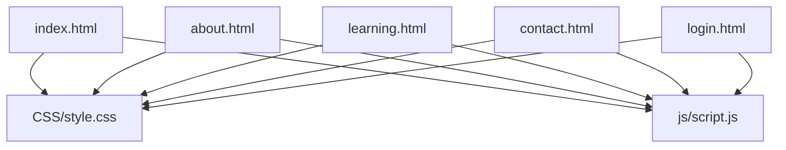
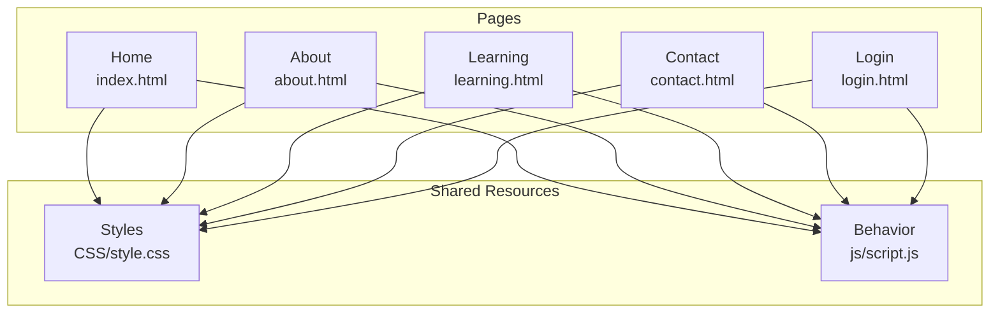
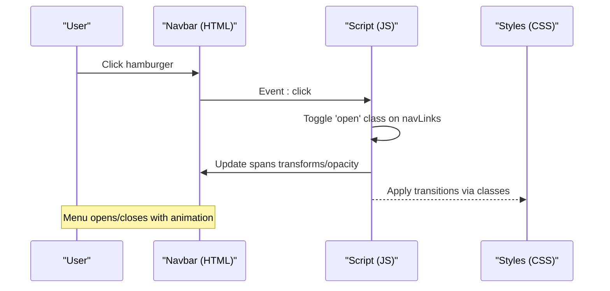
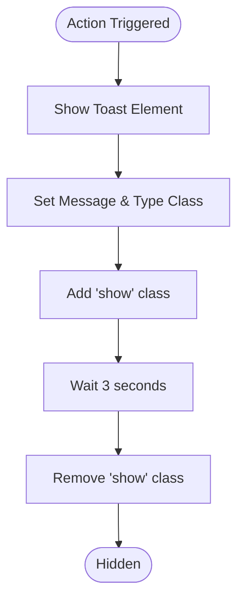
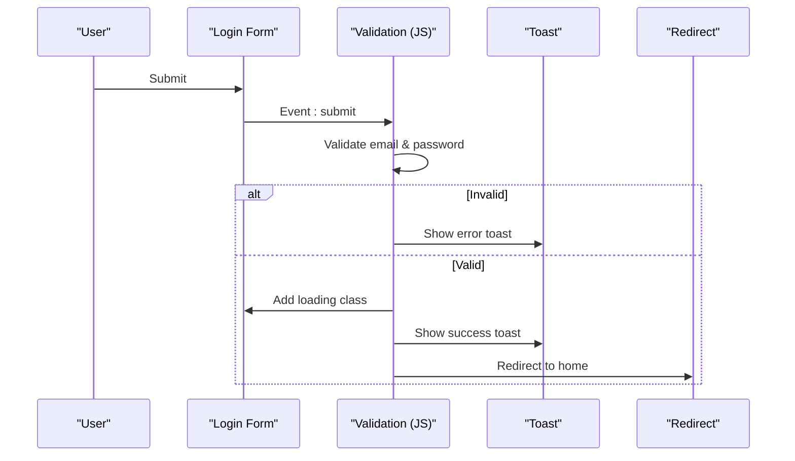
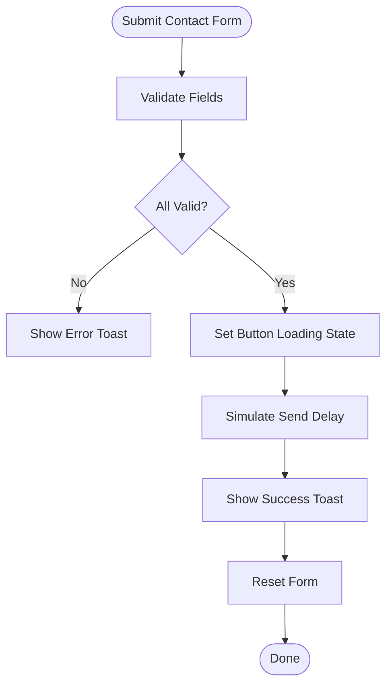
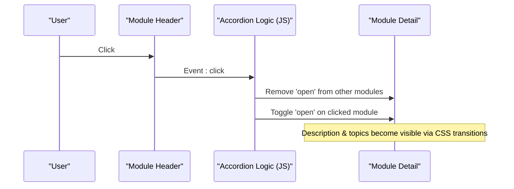
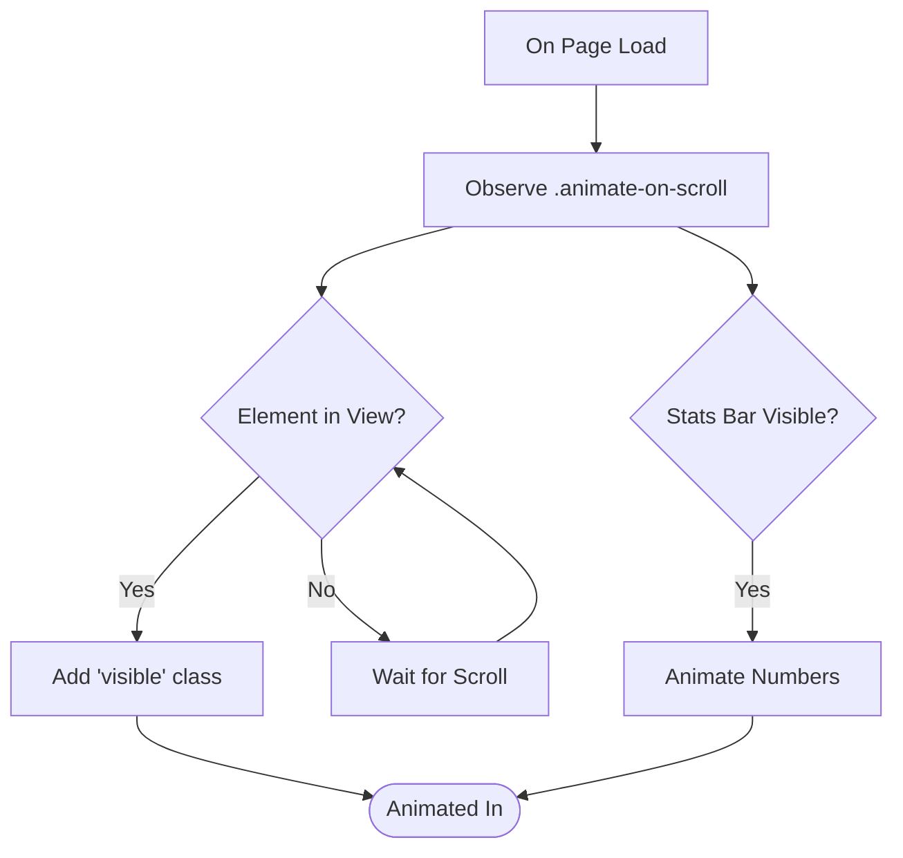
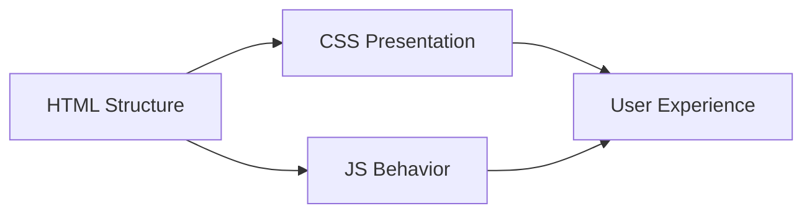

# Technical Architecture

<cite>
**Referenced Files in This Document**
- [index.html](file://index.html)
- [about.html](file://about.html)
- [learning.html](file://learning.html)
- [contact.html](file://contact.html)
- [login.html](file://login.html)
- [style.css](file://CSS/style.css)
- [script.js](file://js/script.js)
</cite>

## Table of Contents
1. Introduction
2. Project Structure
3. Core Components
4. Architecture Overview
5. Detailed Component Analysis
6. Dependency Analysis
7. Performance Considerations
8. Troubleshooting Guide
9. Conclusion

## Introduction
This document describes the technical architecture of the Digital Bridges Zambia static website. The site is a frontend-only application built with vanilla HTML5, CSS3, and JavaScript. There are no frameworks or build tools; each page is a standalone HTML file that shares a common stylesheet and a single JavaScript module for behavior. The design emphasizes separation of concerns: structure (HTML), presentation (CSS), and behavior (JavaScript). It also follows a mobile-first responsive approach, uses semantic markup for accessibility, and keeps external dependencies minimal to optimize loading performance.

## Project Structure
The project is organized by feature pages and shared assets:
- Pages: index.html, about.html, learning.html, contact.html, login.html
- Styles: CSS/style.css
- Behavior: js/script.js
- Assets: assets/images, assets/icons (for future use)

Each page includes the shared stylesheet and script, and contains consistent navigation and footer components. The layout uses semantic elements such as nav, section, header-like banners, and footer to improve accessibility and SEO.

**Diagram sources**
- [index.html:1-106](file://index.html#L1-L106)
- [about.html:1-123](file://about.html#L1-L123)
- [learning.html:1-137](file://learning.html#L1-L137)
- [contact.html:1-102](file://contact.html#L1-L102)
- [login.html:1-60](file://login.html#L1-L60)
- [style.css:1-247](file://CSS/style.css#L1-L247)
- [script.js:1-105](file://js/script.js#L1-L105)

**Section sources**
- [index.html:1-106](file://index.html#L1-L106)
- [style.css:1-247](file://CSS/style.css#L1-L247)
- [script.js:1-105](file://js/script.js#L1-L105)

## Core Components
- Shared Navigation: Fixed top navbar with logo, links, and a hamburger menu for mobile.
- Hero Section: Primary landing area on the home page with call-to-action buttons.
- Modules Grid: Card-based grid showcasing training modules across pages.
- Forms: Contact form and login form with client-side validation and feedback via toast notifications.
- Accordion: Expandable module details on the learning page.
- Footer: Consistent footer with quick links and resources.

These components are implemented using reusable CSS classes and shared JavaScript behaviors, ensuring consistency and maintainability across pages.

**Section sources**
- [index.html:10-25](file://index.html#L10-L25)
- [index.html:27-47](file://index.html#L27-L47)
- [index.html:58-93](file://index.html#L58-L93)
- [index.html:95-103](file://index.html#L95-L103)
- [learning.html:20-98](file://learning.html#L20-L98)
- [contact.html:26-49](file://contact.html#L26-L49)
- [login.html:10-55](file://login.html#L10-L55)
- [style.css:19-37](file://CSS/style.css#L19-L37)
- [style.css:38-64](file://CSS/style.css#L38-L64)
- [style.css:80-131](file://CSS/style.css#L80-L131)
- [style.css:132-187](file://CSS/style.css#L132-L187)
- [style.css:188-247](file://CSS/style.css#L188-L247)
- [script.js:1-19](file://js/script.js#L1-L19)
- [script.js:21-50](file://js/script.js#L21-L50)
- [script.js:52-75](file://js/script.js#L52-L75)
- [script.js:77-105](file://js/script.js#L77-L105)

## Architecture Overview
The site follows a simple, robust architecture:
- Presentation layer: CSS defines theming via custom properties, component styles, and responsive breakpoints.
- Structure layer: HTML provides semantic markup and content organization.
- Behavior layer: JavaScript handles user interactions, form validation, animations, and UI state changes.

There is no server-side logic or build pipeline; all files are served statically.

**Diagram sources**
- [index.html:1-106](file://index.html#L1-L106)
- [about.html:1-123](file://about.html#L1-L123)
- [learning.html:1-137](file://learning.html#L1-L137)
- [contact.html:1-102](file://contact.html#L1-L102)
- [login.html:1-60](file://login.html#L1-L60)
- [style.css:1-247](file://CSS/style.css#L1-L247)
- [script.js:1-105](file://js/script.js#L1-L105)

## Detailed Component Analysis

### Component: Navbar and Mobile Menu
- Purpose: Provide persistent navigation and a collapsible mobile menu.
- Implementation:
  - HTML: nav element with logo, list of links, and a hamburger button.
  - CSS: Fixed positioning, backdrop blur, hover states, and media queries for mobile layout.
  - JavaScript: Scroll listener adds a shadow class; click handler toggles open state and animates hamburger spans.

**Diagram sources**
- [index.html:10-25](file://index.html#L10-L25)
- [style.css:19-37](file://CSS/style.css#L19-L37)
- [style.css:227-247](file://CSS/style.css#L227-L247)
- [script.js:1-19](file://js/script.js#L1-L19)

**Section sources**
- [index.html:10-25](file://index.html#L10-L25)
- [style.css:19-37](file://CSS/style.css#L19-L37)
- [style.css:227-247](file://CSS/style.css#L227-L247)
- [script.js:1-19](file://js/script.js#L1-L19)

### Component: Toast Notifications
- Purpose: Provide brief success/error feedback for user actions.
- Implementation:
  - HTML: A container element with id "toast".
  - CSS: Positioned fixed at top-right with slide-in/out transitions and color variants.
  - JavaScript: Function sets message, applies type class, triggers show transition, and auto-hides after delay.

**Diagram sources**
- [contact.html:98-99](file://contact.html#L98-L99)
- [login.html:56-57](file://login.html#L56-L57)
- [style.css:182-186](file://CSS/style.css#L182-L186)
- [script.js:21-28](file://js/script.js#L21-L28)

**Section sources**
- [contact.html:98-99](file://contact.html#L98-L99)
- [login.html:56-57](file://login.html#L56-L57)
- [style.css:182-186](file://CSS/style.css#L182-L186)
- [script.js:21-28](file://js/script.js#L21-L28)

### Component: Login Form Validation and Feedback
- Purpose: Validate email and password, simulate sign-in, and provide feedback.
- Implementation:
  - HTML: Form with inputs for email and password, submit button, and optional social login buttons.
  - CSS: Styled form fields, focus states, and button hover effects.
  - JavaScript: Prevents default submission, validates inputs, shows loading state, displays toast messages, and redirects after simulated success.

**Diagram sources**
- [login.html:19-52](file://login.html#L19-L52)
- [style.css:143-178](file://CSS/style.css#L143-L178)
- [script.js:30-50](file://js/script.js#L30-L50)

**Section sources**
- [login.html:19-52](file://login.html#L19-L52)
- [style.css:143-178](file://CSS/style.css#L143-L178)
- [script.js:30-50](file://js/script.js#L30-L50)

### Component: Contact Form Validation and Feedback
- Purpose: Validate name, email, subject, and message; simulate sending; reset form.
- Implementation:
  - HTML: Form with labeled inputs and a submit button.
  - CSS: Form groups, input focus states, and card styling.
  - JavaScript: Validates fields, updates button state, shows toast, resets form.

**Diagram sources**
- [contact.html:37-46](file://contact.html#L37-L46)
- [style.css:132-152](file://CSS/style.css#L132-L152)
- [script.js:52-66](file://js/script.js#L52-L66)

**Section sources**
- [contact.html:37-46](file://contact.html#L37-L46)
- [style.css:132-152](file://CSS/style.css#L132-L152)
- [script.js:52-66](file://js/script.js#L52-L66)

### Component: Module Accordion
- Purpose: Allow users to expand module details and topics while collapsing others.
- Implementation:
  - HTML: Repeated module blocks with headers and hidden descriptions/topics.
  - CSS: Transitions for max-height and opacity when opened.
  - JavaScript: Listens to header clicks, toggles open state, ensures only one module is open at a time.

**Diagram sources**
- [learning.html:34-96](file://learning.html#L34-L96)
- [style.css:210-225](file://CSS/style.css#L210-L225)
- [script.js:68-75](file://js/script.js#L68-L75)

**Section sources**
- [learning.html:34-96](file://learning.html#L34-L96)
- [style.css:210-225](file://CSS/style.css#L210-L225)
- [script.js:68-75](file://js/script.js#L68-L75)

### Component: Scroll Animations and Stats Counter
- Purpose: Animate elements into view and animate numeric counters when stats bar enters viewport.
- Implementation:
  - HTML: Elements with class "animate-on-scroll" and stat numbers inside ".stats-bar".
  - CSS: Initial hidden state and a dynamically injected style rule to reveal elements.
  - JavaScript: IntersectionObserver observes elements; scroll listener triggers counter animation once.

**Diagram sources**
- [index.html:49-56](file://index.html#L49-L56)
- [style.css:74-78](file://CSS/style.css#L74-L78)
- [script.js:77-105](file://js/script.js#L77-L105)

**Section sources**
- [index.html:49-56](file://index.html#L49-L56)
- [style.css:74-78](file://CSS/style.css#L74-L78)
- [script.js:77-105](file://js/script.js#L77-L105)

### Conceptual Overview
The site’s architecture separates concerns cleanly:
- Structure: Semantic HTML organizes content and improves accessibility.
- Presentation: CSS uses custom properties for theming and modular classes for components.
- Behavior: JavaScript attaches event listeners and manipulates DOM classes to drive interactivity.

[No sources needed since this diagram shows conceptual workflow, not actual code structure]

## Dependency Analysis
- Pages depend on shared CSS and JS files.
- JavaScript depends on specific IDs/classes present in the HTML to function correctly.
- CSS relies on custom properties defined in :root for consistent theming.

**Diagram sources**
- [index.html:1-106](file://index.html#L1-L106)
- [about.html:1-123](file://about.html#L1-L123)
- [learning.html:1-137](file://learning.html#L1-L137)
- [contact.html:1-102](file://contact.html#L1-L102)
- [login.html:1-60](file://login.html#L1-L60)
- [style.css:1-247](file://CSS/style.css#L1-L247)
- [script.js:1-105](file://js/script.js#L1-L105)

**Section sources**
- [style.css:3-13](file://CSS/style.css#L3-L13)
- [script.js:1-105](file://js/script.js#L1-L105)

## Performance Considerations
- Minimal external dependencies: No frameworks or libraries; only native browser APIs are used.
- Optimized loading: Single shared stylesheet and script reduce HTTP requests; scripts are placed before closing body tags to avoid render-blocking.
- Efficient animations: Uses CSS transitions and IntersectionObserver for scroll-triggered animations; counters run once per session.
- Accessibility: Semantic HTML elements, proper labels, and aria attributes enhance usability for assistive technologies.
- Responsive design: Mobile-first media queries ensure efficient rendering on smaller screens.

[No sources needed since this section provides general guidance]

## Troubleshooting Guide
- Navbar not scrolling: Ensure the navbar has id "navbar" and the script runs after DOM load; check for missing script tag.
- Mobile menu not opening: Verify ids "hamburger" and "navLinks" exist; confirm CSS includes the "open" class rules.
- Toast not showing: Ensure a toast element with id "toast" exists on the page; verify CSS classes "toast", "success", "error" are applied.
- Form validation errors: Check that form inputs have correct ids referenced in the script; ensure required attributes are set.
- Accordion not working: Confirm module headers have class "module-detail-header" and parent containers have class "module-detail"; verify CSS transitions for open state.

**Section sources**
- [script.js:1-19](file://js/script.js#L1-L19)
- [script.js:21-28](file://js/script.js#L21-L28)
- [script.js:30-50](file://js/script.js#L30-L50)
- [script.js:52-75](file://js/script.js#L52-L75)
- [style.css:182-186](file://CSS/style.css#L182-L186)
- [style.css:210-225](file://CSS/style.css#L210-L225)

## Conclusion
Digital Bridges Zambia’s static website demonstrates a clean, maintainable architecture built entirely with vanilla web technologies. The clear separation of structure, presentation, and behavior enables easy updates and scalability. The component-based CSS architecture with custom properties supports consistent theming, while the modular JavaScript provides event-driven interactivity. The mobile-first responsive design and semantic markup ensure accessibility and performance across devices. With minimal external dependencies and optimized loading practices, the site delivers a fast, accessible experience for its target communities.