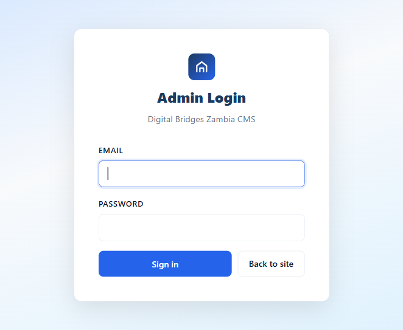

# Digital Bridges Zambia

An inclusive digital-literacy training platform for underserved communities in Zambia.

> **Live demo:** _Not deployed yet._ The site currently runs locally (see [Run locally](#run-locally)). Production deployment is planned — see [Deployment](#build--deployment).

Digital Bridges Zambia delivers structured, locally-relevant digital-skills training modules to youth, women, and underserved communities, and ships with a lightweight server-rendered CMS so site content can be edited without touching code.

## Screenshot

| Home page | Admin CMS login |
|---|---|
|  |  |

## Features

- **Training modules** — 8 structured digital-literacy modules (device skills, online safety, digital finance, entrepreneurship, and more) with per-module progress tracking.
- **User accounts** — registration, login/logout, and profile & password management. Passwords are bcrypt-hashed; sessions are handled server-side.
- **Learner dashboard** — shows a logged-in learner's module progress and profile.
- **Raw-HTML CMS** (`/admin`) — edit page content blocks and modules without code changes. Includes login rate-limiting, CSRF protection, and automatic database backups before each content change.
- **Server-side content injection** — editable regions are stored as `<!--BLOCK:key-->` tokens and filled at request time, so CMS edits appear on every page immediately.
- **Contact form** — server-side validation, stored in the database, and (when configured) a Gmail email notification.
- **Documentation download** — the full project documentation is downloadable at `/download/documentation`.
- **Responsive, accessible UI** — blue/navy theme, SVG icons, mobile navigation.

## Tech stack

| Layer | Technology |
|---|---|
| Frontend | Vanilla HTML, CSS (single stylesheet with design tokens), vanilla JavaScript — **no build step** |
| Backend | Node.js + Express; `express-session` (auth), `bcryptjs` (password hashing), `nodemailer` (email) |
| Database | JSON file (`data/db.json`) — no external database server required |
| Hosting | Not yet deployed. Designed for any Node.js host with a **persistent disk** (e.g. Render, Railway, or a VPS) because the JSON database must survive restarts |

## Prerequisites

- **Node.js 18+** (developed and tested on Node 24)
- **npm** (bundled with Node)
- **Optional:** a Gmail account with an [App Password](https://myaccount.google.com/apppasswords) if you want contact-form email notifications. Without it, messages are still stored in the database.
- No external database or third-party API keys are required.

## Installation

```bash
# 1. Clone the repository
git clone https://github.com/natashakawisha/DigitalBridges-.git
cd DigitalBridges-

# 2. Install dependencies
npm install

# 3. Create the local database from the committed seed (safe placeholder data)
node scripts/seed.js
```

## Environment variables

Copy the example file and fill in real values. **Never commit `.env`.**

```bash
cp .env.example .env
```

| Variable | Purpose |
|---|---|
| `PORT` | Port the server listens on (default `3000`) |
| `SESSION_SECRET` | Secret used to sign session cookies — use a long random string |
| `ADMIN_EMAIL` | Login email for the CMS at `/admin` |
| `ADMIN_PASSWORD_HASH` | bcrypt hash of the CMS password. Generate one with `node scripts/hash-password.js "your-password"` |
| `EMAIL_USER` | Gmail address that sends/receives contact-form notifications |
| `EMAIL_PASS` | Gmail **App Password** (not your normal Google password) |

> **Note:** `.env` support is being wired up in an upcoming change. Until then these values are read from defaults in `server.js`; `.env.example` documents the intended keys with safe placeholder values.

## Run locally

```bash
npm start        # or: npm run dev
```

Then open:

- **Site:** http://localhost:3000
- **Admin CMS:** http://localhost:3000/admin

## Folder structure

```
server.js            app entry point — builds the app and starts it
src/
  config.js          configuration placeholder (env wiring in progress)
  db.js              JSON database: data-file location + load/save helpers
  admin.js           server-rendered CMS router (mounted at /admin)
  middleware/
    auth.js          requireAuth session guard
  routes/
    user.js          register, login, logout, profile, progress
    contact.js       contact form intake + email notification
    content.js       dynamic /js/modules-data.js from the CMS store
  services/
    mailer.js        nodemailer transporter setup
    content.js       raw-HTML CMS content store
views/               HTML pages (index, about, learning, module, faq,
                     contact, login, register, dashboard)
public/
  css/               stylesheets
  js/                client scripts + generated modules-data.js
  assets/            static assets
data/
  db.seed.json       committed starting data (empty/placeholder records)
  content-defaults.js  default CMS content ("reset to default" source)
  db.json            generated at runtime — git-ignored (real records)
scripts/
  seed.js            create data/db.json from the seed
  hash-password.js   print a bcrypt hash for ADMIN_PASSWORD_HASH
docs/
  DOCUMENTATION.md   full project documentation
  images/            README screenshots
```

## Build & deployment

There is **no build step** — static assets in `public/` are served as-is and pages are rendered by Express at request time.

To deploy to production:

1. Push the code to your Git host.
2. Provision a **Node.js host with persistent disk** (the JSON database must persist across restarts). Static-only hosts such as GitHub Pages will **not** work because the app needs a running Node process.
3. Set the environment variables listed above (at minimum `SESSION_SECRET`, `ADMIN_EMAIL`, `ADMIN_PASSWORD_HASH`).
4. Set the start command to `npm start` (i.e. `node server.js`).
5. Run `node scripts/seed.js` once on the host to create `data/db.json` if it does not exist.

## Testing

There is currently **no automated test suite** (`npm test` is not defined). Verify changes manually:

1. `npm start`, then open http://localhost:3000.
2. Click through every page: home, about, learning, module, faq, contact, login, register, dashboard.
3. Exercise the flows: register → login → dashboard → logout; submit the contact form; sign in at `/admin` and edit a content block.
4. Confirm no page returns a 404 and no raw `<!--BLOCK:…-->` / `<!--AUTH_NAV-->` tokens appear in the rendered HTML.

## Known issues / limitations

- The JSON-file database is single-process and not suited to high concurrency or horizontal scaling; there is no external DB.
- Login rate-limit counters are in-memory and reset when the server restarts.
- Contact-form email requires a Gmail App Password; without it messages are stored but not emailed.
- Credentials are still hardcoded in `server.js` pending the `.env` migration (see [Environment variables](#environment-variables)).
- No automated tests yet.
- Because sections fade in on scroll, naive full-page screenshots show blank areas below the fold (cosmetic only).

## Roadmap

- Wire configuration and secrets through `.env` / `src/config.js`.
- Deploy to a persistent-disk production host and publish a live demo URL.
- Add an automated test suite (API + rendering smoke tests).
- Offer an optional external database adapter for higher-concurrency deployments.

## Contributing

Contributions are welcome.

1. Fork the repository and create a feature branch from `main`.
2. Make small, focused commits; keep the server runnable at every step.
3. Use lowercase folder/file names (the deployment target is case-sensitive).
4. Before opening a PR, run the app and click through every page (see [Testing](#testing)).
5. Open a pull request describing what changed and why.

## License

This project does **not** include a LICENSE file yet; all rights are currently reserved by the author. If you would like to use or adapt the code, please open an issue to discuss licensing.

## Credits

- [Express](https://expressjs.com/) — web framework
- [bcryptjs](https://github.com/dcodeIO/bcrypt.js) — password hashing
- [Nodemailer](https://nodemailer.com/) — email delivery
- [express-session](https://github.com/expressjs/session) — session management
- Design and content are original to the Digital Bridges Zambia project.

## Contact

- **Maintainer:** Natasha Kawisha — [@natashakawisha](https://github.com/natashakawisha)
- **Questions / issues:** open a [GitHub issue](https://github.com/natashakawisha/DigitalBridges-/issues) or use the on-site contact form at `/contact.html`.
- **Project email:** natashakawisha@gmail.com
